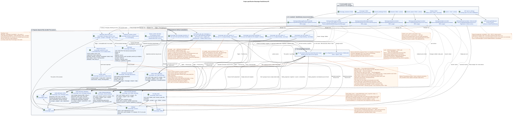

# Proposed RestAlchemy Specification for the Messenger API

Status: **implementation design specification; documentation precedes implementation**.

This document shows how the active Workspace/Messenger v1 API can be
implemented with ordinary RestAlchemy models, simple SQL views, and narrow
controller overrides. It does not change public routes, HTTP methods, JSON
fields, actions, events, or WebSocket payloads. The message UUID is
intentionally moved to placement identity, while pagination and the moment at
which a change becomes visible to the client are made explicit. Those accepted
compatibility changes require release notes and a separate migration/cutover
mapping.

The canonical current contract is in [`workspace_api.md`](workspace_api.md).
Domain invariants and background paths are described in
[`messenger_domain_model.md`](messenger_domain_model.md) and
[`messenger_api_domain_model.md`](messenger_api_domain_model.md).

The current `StoreResourceController`, `sql_canonical_store`, heavy SQL views,
internal model inheritance, and controller-class split are used here only as
evidence of the observed public contract and are treated as replaceable.

## The boundary of the project solution and the current contract

Confirmed Invariants of Target Design:

1. `MESSAGE` stores the canonical content, the author, `source`/`provider`/`delivery` and
   public `created_at`/`updated_at` exactly once.
2. Physical `MESSAGE_PLACEMENT` specifies the global context of the flow and the topics for
   `MESSAGE_PLACEMENT` represents placement, and
   `USER_MESSAGE_BINDING` — binding , which gives the user access to
   The only one `(project,user,placement)`
   `USER_MESSAGE_STATE` Keeps personal information `read`, `mentioned`, `starred`,
   `pinned` and similar message level flags.
3. `WorkspaceUserMessage.uuid` and UUID in all URL and message replies  this
   `MESSAGE_PLACEMENT.uuid = UUIDv5(namespace=TOPIC.uuid, name=MESSAGE.uuid)`.
   `MESSAGE.uuid` and `USER_MESSAGE_BINDING.uuid` remain internal.
4. Several placement of one canonical `MESSAGE` gives several lines with
   UUID and different stream/topic. Personal status
   placement-scoped And it comes from `USER_MESSAGE_STATE`.
5. A stable UI reference contains UUID placement; it uniquely specifies context
   stream/topic. Canonical content UUID The client doesn 't need it ..
6. The `WorkspaceUserMessage` representation is based on a single user binding line and does only
   indexed connections with one location, one `MESSAGE` and one user state.
   Public timestamps always come from `MESSAGE`.
7. Synchronous sending in one transaction creates `MESSAGE`,
   `MESSAGE_PLACEMENT`, `USER_MESSAGE_BINDING` and
   `USER_MESSAGE_STATE`, and also the unchangeable transactional outbox records
   One for each of the two initial typed task.
   It gives an immediate response to the author with custom flags ready without
   Worker (background performer) together with each
   The receiver's binding creates it `USER_MESSAGE_STATE`; it's not looking for work.
   Scan the missing links.
8. The pool worker has a customized parallel limit. Topic-scoped work
   Exclusive to the topic and can choose from within it `MESSAGE.created_at DESC`;
   shared projections These rules don't apply to the world of computers.
   Adding a new public API.
9. `revision` There is no message in the binding.
10. The initial reaction fact belongs to the canonical `MESSAGE`; API changes one line of the fact,
    and the exclusive owner scope `message` materializes the public images `reactions` and
    `reaction_users`, read-only, without a loop readeditwrite in the query path.
    The images are intentionally the same across all placements, including different audiences..
11. Any state-changing operation atomically writes an unchanging domain event into outbox.
    Every event produces exactly one separate event . immutable typed projection task
    with unique `outbox_event_uuid`; initial design does not use coalescing.
    `GET` and task list operations do not create.
12. Worker In one DB transaction , it records the materialized state and all
    The appropriate durable readyWebSocketevent rows. dispatcher
    only reads event store, sends/replay/plays and owns
    network connections.
13. UUID-The links that the current public JSON passes as UUID are declared in
    API RestAlchemy-models with ordinary `properties.property(types.UUID())`, not
    `relationships.relationship`: such a connection would be serialized as URI and
    The corresponding physical columns `*_uuid` remain
    indexed external keys with a clear reference integrity effect.
14. If the creation stream contains `direct_user_uuid`, the domain command is always
    Keep it .`private=true`The value is equal toUUIDThe current one .`owner`, creates
    Chat with yourself with only one user link; messages are received only by the user
    The copyright is attached and displayed exactly once.
15. `STREAM`, `TOPIC` and `FOLDER`  canonical entities in a single instance.
    Personal aggregates of unread messages and mentions are stored directly in unique
    The user's binding to the stream, topic, and folder.
    They only store access, `read_at` and personal flags; container counters there
    It 's forbidden ..
16. `USER_STREAM_BINDING` — persistent lifecycle row with `active` and monotone
    `membership_generation`. Revoke It 's not synchronously prohibiting message/reaction access;
    stale tasks The old generation can 't restore access.
17. All public list operations are restricted: default `100`,
    The hard maximum `500`; the absence of `page_limit` and `page_limit=0` means
    `100`, and negative, non-integer and greater than `500` value is given HTTP `400`.
18. `2xx`/`201` It confirms the fixation of the primary mutation, not the completion of all
    The author gets instant read-your-write; the receivers, the counters.,
    materialized snapshots And the public events that are ready are asynchronous..
19. `TOPIC.is_done` — It's not a canonical global feature of the topic.
    `USER_TOPIC_BINDING` stores only access,
    Notifications, personal settings and ready-made user aggregates.

The names `messenger_*` below  the exact names ** of this design solution**, not the resolution on
The production pattern does not change until a separate migration project.

## Layers in the view



PlantUML source that can be edited:
[`messenger_restalchemy_api_spec.puml`](diagrams/messenger_restalchemy_api_spec.puml).

```text
текущий маршрут -> стандартные RA-контроллер и ресурс -> представление формы только для чтения
                                                               \-> записываемая физическая модель
```

SQL-The presentation in the target design is only a shape adapter.
The physical line gives one output line; one to one and many to one indexed connections are allowed»
`LEFT JOIN`/`INNER JOIN`. No units, `GROUP BY`, window functions allowed,
Lateral and correlated subqueries, and fan-out/one-to-many distribution».

## General agreements RestAlchemy

### Area, transaction and pagination

- Intermediate software IAM passes `project_id` and current `user_uuid` to the query context.
- `get_autofilters()` Adds a field to all `get`/`filter`/`update`/`delete`;
  The client cannot replace it with JSON fields or query lines.
- `get_autovalues()` Specifies the server area when creating.
- The transaction request RestAlchemy is one.
  `session`; The separate `engine_factory.session_manager()` is not opening.
- Collections use `BaseResourceControllerPaginated` and store
  `page_limit`, `page_marker`, `X-Pagination-Limit` and
  `X-Pagination-Marker`; `sort_key=created_at&sort_dir=asc|desc` It stays.
  Unchanged.
- The actual current execution semantics contain a confirmed gap:
  The common RestAlchemy and `StoreResourceController` are given
  `_pagination_limit = 0`. So the missing `page_limit` and
  `page_limit=0` They're giving `limit=None` and unlimited reading now.;
  negative and non-integer values return HTTP `400`, and for too large a positive
  There's no hard cap or limit from the top.
  The behavior.
- The target policy is the same for all public list operations: none
  `page_limit` and `page_limit=0` give `100`; values `1..500` are used
  true; negative, non-integer and greater than `500` returns
  HTTP `400` There's no unrestricted mode and no rule bypass..
- For `GET .../topic_summary_endpoints/`, which is not currently accepting parameters
  Pagination, the target controller accepts the same `page_limit`/`page_marker`,
  keeps the JSON array without a new envelope and adds standard
  `X-Pagination-Limit`/`X-Pagination-Marker`. It 's conscious . observable
  a change, not a description of the current execution.
- The routing index returns the final static register of the routes
  paths and do not read user collections from the database; they are structurally
  are limited by the registry itself and are not a policy circumvention resource-list.
- The public message marker is placement UUID.
  restores it to the same viewer/project/filter scope and uses
  The stable cortege .`(MESSAGE.created_at,MESSAGE_PLACEMENT.uuid)`- Hidden
  `binding_uuid` The marker doesn 't include.
- Fields allowing `null` may be missing in the standard output of REST-packaging; examples JSON
  The following shows the full form in which the projection allowing `null` is clearly
  equal to `null`.

### UUID-API properties and external keys in the database {#uuid-свойства-в-api-и-внешние-ключи-в-бд}

The relation RestAlchemy is a value API of the form URI.
`owner`, `author_uuid`, `user_uuid`, `message_uuid`, `stream_uuid`,
`topic_uuid`, `direct_user_uuid`, `default_topic_uuid` and
other UUID-references of the current contract are declared as ordinary UUID-properties.
The communication object does not participate in their serialization.
It 's a physical recording .RestAlchemy- Models: the app works with scalars. UUID,
And the migration of the scheme creates a real constraint and index for the basic
I 'm not sure .`*_uuid`. `project_id`It 's still a region .IAM- the internal
`scope_kind`/`scope_key` outbox and tasks encode the exact composite key of the domain,
Not a false external key to multiple tables at once.

`MESSAGE_PLACEMENT.uuid` is declared a scalar UUID-properties and published as
`WorkspaceUserMessage.uuid`. `MESSAGE.uuid` and hidden `binding_uuid`
also remain scalar UUID/FK/ keys, but field resolutions do not release them in
current message JSON.

Purposeful limitations of the main project solution:

| UUID-The property RestAlchemy | Physical indexed column and target | How reference integrity works |
| --- | --- | --- |
| The message . `author_uuid` | `messenger_messages.author_uuid -> messenger_users.uuid` | `ON DELETE RESTRICT` |
| Location `message_uuid` | `messenger_message_placements.message_uuid -> messenger_messages.uuid` | `ON DELETE CASCADE` |
| Location `stream_uuid` | `messenger_message_placements.stream_uuid -> messenger_streams.uuid` | `ON DELETE CASCADE` |
| - I 'm not sure . `topic_uuid` | `messenger_message_placements.topic_uuid -> messenger_topics.uuid` | `ON DELETE CASCADE` |
| - I 'm not sure . `placement_uuid` | `messenger_user_message_bindings.placement_uuid -> messenger_message_placements.uuid` | `ON DELETE CASCADE` |
| - I 'm not sure . `user_uuid` | `messenger_user_message_bindings.user_uuid -> messenger_users.uuid` | `ON DELETE CASCADE` |
| status of the user `placement_uuid` / `user_uuid` | the corresponding UUID locations and user | `ON DELETE CASCADE` |
| The fact of the reaction `canonical_message_uuid` / `user_uuid` | corresponding UUID canonical message and user | `ON DELETE CASCADE` |
| The flow `owner` | physical `messenger_streams.owner_uuid -> messenger_users.uuid`; the pseudonym in public is `owner` | `ON DELETE RESTRICT` |
| The flow `direct_user_uuid` | `messenger_streams.direct_user_uuid -> messenger_users.uuid` | `ON DELETE RESTRICT` |
| The flow `default_topic_uuid` | `messenger_streams.default_topic_uuid -> messenger_topics.uuid` | `ON DELETE SET NULL` |
| - I 'm not sure . `stream_uuid` / `user_uuid` | corresponding UUID stream and user | `ON DELETE CASCADE` |
| - I 'm not sure . `who_uuid` | `messenger_stream_bindings.who_uuid -> messenger_users.uuid` | `ON DELETE RESTRICT` |
| linking the user to the stream `stream_uuid` / `user_uuid` | corresponding UUID stream and user | `ON DELETE CASCADE` |
| linking the user to the folder `folder_uuid` / `user_uuid` | corresponding UUID folders and user | `ON DELETE CASCADE` |
| The topic `stream_uuid` | `messenger_topics.stream_uuid -> messenger_streams.uuid` | `ON DELETE CASCADE` |
| public links `summary_last_message_uuid` / `last_message_uuid` | The relevant public UUID placement | `ON DELETE SET NULL` |
| Linking the user to the topic `topic_uuid` / `user_uuid` | UUID topics and user | `ON DELETE CASCADE` |

For tenant-owned edges, the migration should use unique/FK components on
`project_id`, and placement must also refer to the topic of the
The same stream/project. `TOPIC.uuid` is globally unique and ownership unchanged.
`USER_STREAM_BINDING` It 's saved as a tombstone when you revoke it . business key
remains unique, and `(active,membership_generation)` is persistent
security state. `USER_MESSAGE_BINDING.membership_generation` — snapshot That 's it .
generations and participates in the indexed access predicate.

`WorkspaceStream.owner` in API and RestAlchemy-reading models, the UUID-properties remain and
It 's serialized exactly likeUUIDThe physical column that you're writing to is called
`owner_uuid`; The flow representation without the calculations gives a scalar pseudonym.
`owner_uuid AS owner`. Neither a public resource nor a physical external key is converted into
RestAlchemy or URI connection. DDL is not created here: the table fixes
mandatory restrictions for future migration project.

### ADR: tenant isolation and the current boundary of roles

Each canonical, projection, binding/state, outbox, task and public-event
The row to which the tenant-area applies contains `project_id`.
tables specify `UNIQUE(project_id, uuid)` and composite FK
`(project_id, referenced_uuid)` For the `MESSAGE`, `MESSAGE_PLACEMENT`, user
bindings/state, `TOPIC`, `STREAM`, `FOLDER`, `FOLDER_ITEM`, reaction facts,
outbox/tasks/events. The FK composite placement -> topic/stream ensures that
`TOPIC` belongs to the `STREAM` and the same project. Worker queries,
scope keys and migration/backfill joins always include `project_id`.

API reuses current `ModelWithProject`, request project scope, session and
RestAlchemy filters. Lookup/list/action Outside of current project or for invisible
The resource is `404`; the resource is not visible with sufficient resolution — `403`.
Mutation re-reads/blocks project-scoped resource and checks active
membership/permission inside the same transaction, rather than trusting preflight view.

The current-runtime matrix below does not convert the absence of policy to
new target-permission:

| The operation current API | `guest` | `member` | `moderator` | `administrator` | `owner` | Target role |
| --- | --- | --- | --- | --- | --- | --- |
| `add_users` From the visible stream | runtime It allows | runtime It allows | runtime It allows | runtime It allows | runtime It allows | **OPEN:** target permission/assignable-role matrix does not inherit the absence of current check |
| `PUT stream_bindings/{uuid}` non-direct | actor role Not being checked; project-only lookup | It 's the same . | It 's the same . | It 's the same . | It 's the same . | **OPEN:** actor × target-role/self matrix |
| `DELETE stream_bindings/{uuid}` non-direct | actor role Not being checked; project-only lookup | It 's the same . | It 's the same . | It 's the same . | It 's the same . | **OPEN:** actor × target-role/self and last-owner rule |
| update/delete binding direct/self | `400` | `400` | `400` | `400` | `400` | membership/role immutable |

`add_users` requires the parent `WorkspaceUserStream` to be visible, so actor
is a member, but role hierarchy current code does not check. Binding
get/update/delete is now project-scoped, but does not check role actor or its
membership in the target stream. `workspace_api.md` fixes role literals and
immutable direct membership, But he doesn't. non-direct permission matrix.

Tenant-integrity Risk part # 7 is closed with composite keys and transactional
recheck. Role/action part remains pointed OPEN: what roles can be added
The user can change/delete his or her target role. binding;
whether at least one `owner` is mandatory; whether permitted self-demotion/self-removal
If the owner is mandatory, the mutation blocks the stream and owner
bindings either uses version/CAS, checks post-state `owner_count >= 1` and
Only then commit; competing operations don 't leave a zero owners. Direct/self
rules are closed: membership equals identity pair, update/add/remove binding gives
`400`, self-chat Contains one owner, delete self-chat stream also gives `400`.

Minimum common impurities of the project solution:

```python
from restalchemy.common import contexts
from restalchemy.dm import filters


class RequestSessionMixin:
    @property
    def session(self):
        return contexts.Context().get_session()


class ProjectScopeMixin(RequestSessionMixin):
    def get_autofilters(self):
        return {
            "project_id": filters.EQ(self.get_context().project_id),
        }

    def get_autovalues(self):
        return {
            "project_id": self.get_context().project_id,
        }


class ViewerScopeMixin(ProjectScopeMixin):
    def get_autofilters(self):
        result = super().get_autofilters()
        result["user_uuid"] = filters.EQ(self.get_context().user_uuid)
        return result

    def get_autovalues(self):
        result = super().get_autovalues()
        result["user_uuid"] = self.get_context().user_uuid
        return result


class BoundedPaginationMixin:
    _pagination_limit = 100
    _pagination_max_limit = 500

    def normalize_page_limit(self, value):
        # Proposal contract: omitted/0 -> 100; 1..500 exact; otherwise HTTP 400.
        return pagination_policy.validate(value, default=100, maximum=500)
```

Physical bindings in the user area use the usual storage identity in that area.
Their UUID is not a public resource ID message: the resource path accepts
`MESSAGE_PLACEMENT.uuid`, And the controller checks the current link separately .
user and active stream membership with generation.

```python
from restalchemy.dm import models
from restalchemy.dm import properties
from restalchemy.dm import types


class ProjectUserScopedModelWithUUID(models.ModelWithUUID):
    project_id = properties.property(
        types.UUID(), required=True, read_only=True, id_property=True,
    )
    user_uuid = properties.property(
        types.UUID(), required=True, read_only=True, id_property=True,
    )

    @classmethod
    def get_id_property(cls):
        return {"uuid": cls.properties.properties["uuid"]}
```

### Permissions of fields

`ResourceByRAModel` retains the snake_case (`convert_underscore=False`) and
`process_filters=True`. The models of public presentations contain a complete flat answer;
`FieldsPermissions` separately specifies the surface available for writing CREATE/UPDATE. Internal external keys,
The worker's work record and the provider's original storage are hidden, not declared available to the client for recording.

### The general HTTP-semantics

- `GET` collections: `200` and array JSON;
- `POST` `201` and the full created resource; repeat
  The deterministic creation of a direct stream can return an existing resource with status
  `200`;
- `GET`/`PUT` Resource: `200` and full resource;
- action `POST .../invoke`: `200` and full resource or documented
  List of;
- Successful `DELETE`: `204`, body is missing;
- incorrect or unauthorized domain request: `400`; without authentication: `401`; lack
  rights: `403`; invisible or missing resource in the field: `404`.

### ADR: limited page size and apparent change time

Status: **Adopted conscious change of behavior; Risk #5 is closed**.

All resource-list endpoints use `page_limit`: absence/`0` means
`100`, `1..500` accurate, negative, incomplete and greater are accepted `500`
value gives HTTP `400`.
The public Workspace contract is not confirmed; therefore target overrides
External Bridge Control API is not included in this policy.

Clients that used the absence parameter or `0` as full export,
The public JSON is not
changes, but rollout requires release/compatibility note along with the change
The semantics message UUID.

The changeable transaction synchronizes to the canonical primary state,
necessary author placement/binding/state and one or more immutable
outbox events — Then you have exactly one for each initial typed task.
commit The author gets immediate read-your-write. Recipient bindings/history,
Container aggregates, materialized snapshots and ready public events
Therefore, `2xx`/`201` means the acceptance and fixation of the primary
mutations, but not the completion of all background projections; other users can
The delay is about one second  target SLO intent, and
not a strict guarantee until the choice and use of measurable SLO.

The ready record WebSocket and the commit/rollback projection atomically in one worker DB
transaction. The recipient of the event can read after delivery
The appropriate state throughRESTDispatcher doesn't create a business event, it creates a business event.
The network send doesn 't affect its durability ..

Reconnect Mandatory through cursor replay without gap: client passes last
cursor processed, the server fixes the high-watermark, plays more and more
new visible durable rows, buffers live tail and after drain switches
Delivery at-least-once; client de-duplicates on event UUID and
It moves the cursor only after processing.
`epoch_pruned`/`410` error; retention window size remains operational
policy. Event audience rows carry membership generation, so the dispatcher and
replay Don 't deliver data events after revoke or from old generation.

The exact error envelope and application codes remain in the
[`workspace_api.md`](workspace_api.md#general-rules).

## The messages

### ADR: public identity of the message through placement

Status: **accepted**. This decision closes the first Critic-review blocker and
replaces the previously discussed canonical identity of the public resource.

It 's public . `WorkspaceUserMessage.uuid`, `{message_uuid}`, `page_marker`,
`last_message_uuid` And the references to events mean `MESSAGE_PLACEMENT.uuid`.
Canonical `MESSAGE.uuid` remains the internal FK of the single record
UUID placement is calculated strictly as
`UUIDv5(namespace=TOPIC.uuid, name=MESSAGE.uuid)`: name — I 'm just lowercase
hyphenated ASCII UUID canonical message without braces, prefixes or other
Project and stream are not included in name.

Repeat after me ./retryOne pair of them/messageIt 's the same .UUIDThe other topic gives
other UUID. `TOPIC` is mandatory and globally unique, invariably belongs
One .`PROJECT`/`STREAM`. Moving it means a new topic and migration
placements. The DB remains unique
`(project_id,message_uuid,stream_uuid,topic_uuid)`; UUIDv5 Does not replace the composite
FK, unique constraint or check the belonging topic.

HTTP paths and JSON keys don't change, but the meaning of the identifier does. cutover
need backfill placement UUID, display of previous links/markers/events,
collision checking and compatibility plan/rollback. This rollout is
The future of migration design is a necessary part of the future of migration design, not an implicit conversion into a
request path.

### Physical message, location, binding and user status

`WorkspaceMessage` — The context of the placement, the personal
Access and personal status of the message level are three different recordable
RestAlchemy-UUID-references are scalar properties; physical
The limitations are defined above, and the public view retains the former UUID-fields.

```python
from restalchemy.dm import models
from restalchemy.dm import properties
from restalchemy.dm import types
from restalchemy.storage.sql import orm

from workspace.messenger_api.dm import message_payloads


class WorkspaceMessage(
    models.ModelWithUUID,
    models.ModelWithProject,
    models.ModelWithTimestamp,
    orm.SQLStorableMixin,
):
    __tablename__ = "messenger_messages"

    # Realm-global provider identity; cross-account project projection is the
    # one remaining Bridge boundary and must not choose an arbitrary account.
    PROVIDER_MAPPING_KEY = ("provider_realm_uuid", "provider_message_id")

    author_uuid = properties.property(
        types.UUID(), required=True, read_only=True,
    )
    payload = properties.property(
        message_payloads.WORKSPACE_MESSAGE_PAYLOAD_TYPE, required=True,
    )
    source_name = properties.property(
        types.Enum(["native", "zulip"]), default="native",
    )
    source = properties.property(types.Dict(), default=lambda: {"kind": "native"})
    provider_uuid = properties.property(
        types.AllowNone(types.UUID()), default=None, read_only=True,
    )
    provider_realm_uuid = properties.property(
        types.AllowNone(types.UUID()), default=None, read_only=True,
    )
    provider_message_id = properties.property(
        types.AllowNone(types.String(max_length=2048)), default=None,
        read_only=True,
    )
    provider = properties.property(types.AllowNone(types.Dict()), default=None)
    delivery = properties.property(types.AllowNone(types.Dict()), default=None)
    reactions = properties.property(types.Dict(), default=dict, read_only=True)
    reaction_users = properties.property(
        types.Dict(), default=dict, read_only=True,
    )


class WorkspaceMessagePlacement(
    models.ModelWithUUID,
    models.ModelWithProject,
    models.ModelWithTimestamp,
    orm.SQLStorableMixin,
):
    __tablename__ = "messenger_message_placements"

    # Domain command sets uuid = UUIDv5(namespace=topic_uuid, name=message_uuid).

    BUSINESS_KEY = (
        "project_id", "message_uuid", "stream_uuid", "topic_uuid",
    )

    message_uuid = properties.property(
        types.UUID(), required=True, read_only=True,
    )
    stream_uuid = properties.property(
        types.UUID(), required=True, read_only=True,
    )
    topic_uuid = properties.property(
        types.UUID(), required=True, read_only=True,
    )


class WorkspaceUserMessageBinding(
    models.ModelWithUUID,
    models.ModelWithProject,
    models.ModelWithTimestamp,
    orm.SQLStorableMixin,
):
    __tablename__ = "messenger_user_message_bindings"

    BUSINESS_KEY = ("project_id", "placement_uuid", "user_uuid")

    placement_uuid = properties.property(
        types.UUID(), required=True, read_only=True,
    )
    user_uuid = properties.property(
        types.UUID(), required=True, read_only=True,
    )
    membership_generation = properties.property(
        types.Integer(min_value=1), required=True, read_only=True,
    )
    relation_role = properties.property(types.String(max_length=64), required=True)
    visibility = properties.property(types.String(max_length=64), required=True)
    permissions = properties.property(types.Dict(), required=True)


class WorkspaceUserMessageState(
    models.ModelWithUUID,
    models.ModelWithProject,
    models.ModelWithTimestamp,
    orm.SQLStorableMixin,
):
    __tablename__ = "messenger_user_message_states"

    BUSINESS_KEY = ("project_id", "user_uuid", "placement_uuid")

    placement_uuid = properties.property(
        types.UUID(), required=True, read_only=True,
    )
    user_uuid = properties.property(
        types.UUID(), required=True, read_only=True,
    )
    membership_generation = properties.property(
        types.Integer(min_value=1), required=True, read_only=True,
    )
    read_at = properties.property(
        types.AllowNone(types.UTCDateTimeZ()), default=None,
    )
    mentioned = properties.property(types.Boolean(), default=False)
    starred = properties.property(types.Boolean(), default=False)
    pinned = properties.property(types.Boolean(), default=False)
```

Future migration creates hidden realm-scoped provider mapping for
`(provider_realm_uuid,provider_message_id)`: importing account UUID, mutable
email/server URL and project are not canonical provider identities.
are hidden from public JSON and provide retry/resume fresh provider import; they do not
They keep the old ones .Workspace UUID. Public `provider.account_uuid`It stays.
current-contract access/account projection. When one accounts realm
They assign one provider to different projects, physical location of the common
canonical row and the account projection selection remain one obvious Bridge OPEN; until
The decision cannot be assigned arbitrary primary account.

Numeric Zulip object UUIDs are calculated in a uniform manner:
`UUIDv5(namespace=verified_realm_uuid,
name="<entity_type>:<decimal_provider_id>")`. Only allowed
`user`, `channel`, `message`, `attachment`; decimal ID — unsigned shortest
base-10 ASCII (`0` Or digits without leading zeros/sign/whitespace), name bytes —
They 're accurate .ASCII/UTF-8Realm text is first canonized in lowercase
hyphenated UUID And he knows 16 RFC 4122/network-order octets. Project/account
UUID They 're not part of the algorithm ..

The time stamps of location, binding and state are internal life cycle time stamps.
The project name of the presentation:
`messenger_api_user_messages_v1`.

`USER_MESSAGE_STATE.read_at` (or semantically equivalent stored marker)
is a source of truth for only one user and location pair. `read`
And this is a simple scalar expression `read_at IS NOT NULL`.,
neither `USER_MESSAGE_BINDING` store aggregates of unread messages of the stream or folder: these
The counters belong to the user 's unique bindings to the container described below.

```python
from restalchemy.dm import models
from restalchemy.dm import properties
from restalchemy.dm import types
from restalchemy.storage.sql import orm

from workspace.messenger_api.dm import message_payloads


class WorkspaceUserMessage(
    models.ModelWithProject,
    models.ModelWithTimestamp,
    orm.SQLStorableMixin,
):
    __tablename__ = "messenger_api_user_messages_v1"

    binding_uuid = properties.property(
        types.UUID(), required=True, read_only=True, id_property=True,
    )
    uuid = properties.property(types.UUID(), required=True, read_only=True)
    canonical_message_uuid = properties.property(
        types.UUID(), required=True, read_only=True,
    )
    user_uuid = properties.property(types.UUID(), required=True, read_only=True)
    stream_uuid = properties.property(types.UUID(), required=True)
    topic_uuid = properties.property(types.UUID(), required=True)
    author_uuid = properties.property(types.UUID(), required=True, read_only=True)
    payload = properties.property(
        message_payloads.WORKSPACE_MESSAGE_PAYLOAD_TYPE, required=True,
    )
    read = properties.property(types.Boolean(), default=False, read_only=True)
    pinned = properties.property(types.Boolean(), default=False, read_only=True)
    starred = properties.property(types.Boolean(), default=False, read_only=True)
    is_own = properties.property(types.Boolean(), default=False, read_only=True)
    mentioned = properties.property(types.Boolean(), default=False, read_only=True)
    reactions = properties.property(types.Dict(), default=dict, read_only=True)
    reaction_users = properties.property(types.Dict(), default=dict, read_only=True)
    source_name = properties.property(
        types.Enum(["native", "zulip"]), default="native",
    )
    source = properties.property(types.Dict(), default=lambda: {"kind": "native"})
    provider = properties.property(
        types.AllowNone(types.Dict()), default=None, read_only=True,
    )
    delivery = properties.property(
        types.AllowNone(types.Dict()), default=None, read_only=True,
    )

    @classmethod
    def get_id_property(cls):
        # Unique technical ORM identity of one view row; never a public ID.
        return {"binding_uuid": cls.properties.properties["binding_uuid"]}
```

The above `get_id_property()` is intentionally **not** is the public identity of the message.
A representation without computation needs a unique key to reconstruct and match objects, whereas
one placement has a separate line for each user. Public JSON, links and route parameters
always use `MESSAGE_PLACEMENT.uuid`; `binding_uuid` is hidden for each method.
Since the standard `ResourceByRAModel.get_resource_id()` delegates to the technical ID of the model,
The target solution requires the narrow resource adapter shown below and a search in the controller for placement ID.
This is a standard RestAlchemy extension, not a specialized SQL storage..

Comparing the presentation:

| The public field | Physical source | Permission API | Record path |
| --- | --- | --- | --- |
| `uuid` | `MESSAGE_PLACEMENT.uuid` | determinate placement ID for read only | creating a location |
| The internal `binding_uuid` | `USER_MESSAGE_BINDING.uuid` | hidden, never is the resource ID | the author has created a link or worker |
| The internal `canonical_message_uuid` | `MESSAGE.uuid` | It 's hidden . | Creating a canonical message |
| `project_id`, `user_uuid` | The area of binding and user status | Read only | IAM or worker |
| `stream_uuid`, `topic_uuid` | scalar UUID columns `MESSAGE_PLACEMENT`; indexed external keys in the DB | Only for public use API | initial location |
| `read`, `mentioned`, `starred`, `pinned` | unique for placement `USER_MESSAGE_STATE`; public `read`  scalar `read_at IS NOT NULL` | Read only in CRUD | actions or worker |
| `is_own` | The scalar equality of the connected ID | Read only | not stored as a source of truth |
| `author_uuid`, `payload` | `MESSAGE.author_uuid/payload` | author is read-only; `payload` is for creation and updating | Canonical message |
| `source_name`, `source` | `MESSAGE` | Only for creation | Canonical message |
| `provider`, `delivery` | The materialized projection `MESSAGE` | Read only | Provider path or background path |
| `reactions`, `reaction_users` | The canonical state of things | Read only | Change in reaction or background path |
| `created_at`, `updated_at` | `MESSAGE.created_at/updated_at` | Read only | Only the canonical message |

The representation consists of exactly one leading `USER_MESSAGE_BINDING`, connected as many to one»
with one `MESSAGE_PLACEMENT`, one active `USER_STREAM_BINDING` of the same
project/user/stream and current `membership_generation`, then as many k
one with one `MESSAGE`, and also indexed
connections one to one from `USER_MESSAGE_STATE` to `(project_id,user_uuid,placement_uuid)`.
It's matching `uuid <- placement.uuid`, hidden `binding_uuid <- user_binding.uuid` and
It 's hidden .`canonical_message_uuid <- message.uuid`It doesn 't have any recipient calculations .,
The active+generation condition is
security predicate, A user with one message in
It 's a line-by-line system , and these lines have different
public placement UUID and placement-scoped state.

`MESSAGE_PLACEMENT` It 's unique .
`(project_id,message_uuid,stream_uuid,topic_uuid)`. The recipient is unique .
I 'm sorry .`(project_id,placement_uuid,user_uuid)`- The personal condition is unique in
`(project_id,user_uuid,placement_uuid)` And it 's only reused inside of it .
`topic_uuid` is mandatory for every placement, including direct/self
chat; `null`, sentinel and backup only on stream are prohibited.

UUID placement is calculated by the domain command before inserting:
`UUIDv5(namespace=TOPIC.uuid, name=MESSAGE.uuid)`. Name It only contains
lowercase hyphenated ASCII UUID canonical message without braces, prefixes
or additional fields. `TOPIC.uuid` globally unique; composite FK
guarantee that the topic belongs to the specified `project_id` and `stream_uuid`.
Ownership topic Unchangeable: move means new topic and clear migration
placements. UUIDv5 does not replace the trusted business key and FK.

### Transactional outbox and typed projection tasks

Each command that changes the state records the unchanged domain event in the same outbox
The worker does not scan the data.
It doesn't compare entire job search tables.
Creates a separate immutable typed task for each source event;
when the task is executed, it reads the last recorded initial state. `GET` and gets the list
Collections never create outbox events or tasks.

```python
from restalchemy.dm import models
from restalchemy.dm import properties
from restalchemy.dm import types
from restalchemy.storage.sql import orm


TASK_KINDS = (
    "fanout",
    "content_mentions",
    "reaction_snapshot",
    "read_counters",
    "folder_projection",
    "delivery_snapshot_event",
    "topic_state_projection",
    "topic_membership_policy_rebuild",
)


class WorkspaceDomainOutboxEvent(
    models.ModelWithUUID,
    models.ModelWithProject,
    models.ModelWithTimestamp,
    orm.SQLStorableMixin,
):
    __tablename__ = "messenger_domain_outbox_events"

    event_kind = properties.property(types.Enum(TASK_KINDS), required=True)
    scope_kind = properties.property(types.String(max_length=64), required=True)
    scope_key = properties.property(types.String(max_length=512), required=True)
    payload = properties.property(types.Dict(), required=True)


class WorkspaceProjectionTask(
    models.ModelWithUUID,
    models.ModelWithProject,
    models.ModelWithTimestamp,
    orm.SQLStorableMixin,
):
    __tablename__ = "messenger_projection_tasks"

    DERIVATION_KEY = ("project_id", "outbox_event_uuid")

    outbox_event_uuid = properties.property(types.UUID(), required=True, read_only=True)
    task_kind = properties.property(types.Enum(TASK_KINDS), required=True)
    scope_kind = properties.property(types.String(max_length=64), required=True)
    scope_key = properties.property(types.String(max_length=512), required=True)
    payload = properties.property(types.Dict(), required=True)
    status = properties.property(types.Enum([
        "pending", "leased", "running", "completed", "failed", "dead_letter",
    ]), default="pending")
    lease_owner = properties.property(types.AllowNone(types.String()), default=None)
    fencing_token = properties.property(types.Integer(min_value=0), default=0)
    lease_expires_at = properties.property(
        types.AllowNone(types.UTCDateTimeZ()), default=None,
    )
    attempts = properties.property(types.Integer(min_value=0), default=0)
    next_retry_at = properties.property(
        types.AllowNone(types.UTCDateTimeZ()), default=None,
    )
    last_error = properties.property(
        types.AllowNone(types.String(max_length=4096)), default=None,
    )


class WorkspaceProjectionScopeLease(
    models.ModelWithUUID,
    models.ModelWithProject,
    models.ModelWithTimestamp,
    orm.SQLStorableMixin,
):
    __tablename__ = "messenger_projection_scope_leases"
    BUSINESS_KEY = ("project_id", "scope_kind", "scope_key")

    scope_kind = properties.property(types.String(max_length=64), required=True)
    scope_key = properties.property(types.String(max_length=512), required=True)
    owner = properties.property(types.AllowNone(types.String()), default=None)
    fencing_token = properties.property(types.Integer(min_value=0), default=0)
    lease_expires_at = properties.property(
        types.AllowNone(types.UTCDateTimeZ()), default=None,
    )


class WorkspaceFanoutRoot(
    models.ModelWithUUID,
    models.ModelWithProject,
    models.ModelWithTimestamp,
    orm.SQLStorableMixin,
):
    __tablename__ = "messenger_fanout_roots"
    DERIVATION_KEY = ("project_id", "outbox_event_uuid")

    outbox_event_uuid = properties.property(types.UUID(), required=True)
    placement_uuid = properties.property(types.UUID(), required=True)
    next_user_uuid = properties.property(types.AllowNone(types.UUID()), default=None)
    processed_count = properties.property(types.Integer(min_value=0), default=0)
    status = properties.property(
        types.Enum(["pending", "running", "completed", "failed"]),
        default="pending",
    )


class WorkspaceFanoutBatchTask(
    models.ModelWithUUID,
    models.ModelWithProject,
    models.ModelWithTimestamp,
    orm.SQLStorableMixin,
):
    __tablename__ = "messenger_fanout_batch_tasks"
    BUSINESS_KEY = ("project_id", "fanout_root_uuid", "batch_no")

    fanout_root_uuid = properties.property(types.UUID(), required=True)
    batch_no = properties.property(types.Integer(min_value=0), required=True)
    start_user_uuid = properties.property(types.AllowNone(types.UUID()), default=None)
    end_user_uuid = properties.property(types.AllowNone(types.UUID()), default=None)
    batch_size = properties.property(types.Integer(min_value=1, max_value=5000))
    status = properties.property(
        types.Enum(["pending", "leased", "running", "completed", "failed", "dead_letter"]),
        default="pending",
    )
    lease_owner = properties.property(types.AllowNone(types.String()), default=None)
    fencing_token = properties.property(types.Integer(min_value=0), default=0)
    lease_expires_at = properties.property(
        types.AllowNone(types.UTCDateTimeZ()), default=None,
    )
    attempts = properties.property(types.Integer(min_value=0), default=0)
    next_retry_at = properties.property(
        types.AllowNone(types.UTCDateTimeZ()), default=None,
    )
    last_error = properties.property(
        types.AllowNone(types.String(max_length=4096)), default=None,
    )
```

`batch_no` starts with `0` and increases monotonically only after commit
It's the last batch. non-null idempotency key; nullable
`start_user_uuid` It's just the keyset boundary, so PostgreSQL
The semantics of several `NULL` cannot create duplicates of the first batch.

These names are internal names of the design solution, not public resources.
The outbox event saves each state transition; exactly one immutable task
It 's a unique reference .`outbox_event_uuid`. Repeated derivation is
We 're in a potential conflict ./no-opIf the process falls between
append and derivation, indexed reconciliation `OUTBOX LEFT JOIN TASK` by
UUID Creates a missed task; events are not lost.

Worker Atomically gets a lease with a new fencing token, transfers task from
`pending`/retryable `failed` in `leased`/`running` and can only finish recording
Expired lease returns reaper/reconciliation. Error increases
`attempts`, sets `next_retry_at` with backoff; after configurable max attempts
task It 's going to .DLQ (`dead_letter`The handler and projection writes are both potentially
`outbox_event_uuid`. Obligatory metrics: outbox/task lag, retry rate, oldest
pending/running age, expired leases, stuck tasks and DLQ size.

Initial design Consciously pays a lot of tasks for a simple provable
We need capacity./backpressurelimits and honest throughput budget.
Coalescing can only be considered as a future separate optimization after
measurements and is not part of this model.

### Bounded fan-out batches

One immutable `fanout` root task is still unambiguously derived from one
source outbox event. It creates a sequence. immutable child
`fanout_batch` units; It's not coalescing or combining source events.
It 's unique . derivation key — `(project_id, fanout_root_uuid, batch_no)`;
`start_user_uuid` So the only thing that's left is the `null` keyset boundary.
batch uses the same mandatory lease/fencing/retry/backoff/DLQ/reaper
protocol, so retry only repeats this batch.

The batch size setting has default `1000` recipients and runtime hard maximum
`5000`. The value of `<=0` or `>5000` is deviated at validation/startup; silent
clamp Default and maximum should be
load-tested and remain tunable within the specified hard maximum.

Recipient scan uses stable keyset, not `OFFSET`: active
`USER_STREAM_BINDING` The project/stream parameters are selected by
`user_uuid ASC`, with the condition `user_uuid > start_user_uuid`; author is excluded.
For each candidate batch rechecks `active=true` and the expected
`membership_generation`. Re-add/change of membership, already passed cursor,
is served by a separate membership/history event, so the cursor is not
He goes back and doesn 't reuse the old one . state.

Each batch is executed in a short DB transaction: bulk insert/upsert
`USER_MESSAGE_BINDING` + placement-scoped `USER_MESSAGE_STATE`, immutable
downstream outbox/tasks actual scopes and all relevant durable ready
events Unique binding/state keys and source/batch derivation
keys They make retry one batch impotent; the repeat doesn 't replay anymore .
The next batch row and the new one checkpoint
Root stores the data in the previous commit. cursor, processed count,
status and completion.

Topic scheduler first selects the fan-out roots on `MESSAGE.created_at DESC`, but
After each bounded batch releases/requeue claim so that the old
batch/history tasks We've got bounded fairness. backpressure
account for project/topic and configured concurrency; one huge audience does not
Can take up unbounded transaction or push out others indefinitely topics.

Transaction-time intent for batch  `<=1s p95` after measurements; this is not hard API
guarantee The benchmark is the metric that you need to use.: batch latency, rows processed,
WAL bytes If they 're available ., recipients remaining, fan-out lag, oldest pending
batch, retry rate And DLQ. The large audience is supported by the set batches.

`scope_key` — The internal indexed representation of the ** exact** composite
The key from the following table; it is not public UUID.
The key is selected when designing storage, but can't lose any
One `WorkspaceProjectionScopeLease` with fencing token allows
simultaneously write one exact scope; different keys/scopes are parallel.

| Task kind/effect | `scope_kind` and actual scope key | Guarantee |
| --- | --- | --- |
| `fanout`, placement-scoped `content_mentions`, history/backfill | `topic`: `(project_id, topic_uuid)` | sequential newest-first placement processing within a topic |
| `reaction_snapshot`/canonical snapshot | `message`: `(project_id, canonical_message_uuid)` | One author canonical `MESSAGE` snapshots |
| stream aggregates | `user-stream`: `(project_id, user_uuid, stream_uuid)` | one author of the relevant `USER_STREAM_BINDING` |
| `folder_projection` | `user-folder`: `(project_id, user_uuid, folder_uuid)` | one author normalized items, ready `USER_FOLDER_BINDING` snapshot/counts and event rows |
| topic aggregates | `user-topic`: `(project_id, user_uuid, topic_uuid)` | One author `USER_TOPIC_BINDING` |
| `topic_state_projection` | `topic`: `(project_id, topic_uuid)` | Events and optional rebuildable copies after canonical `TOPIC.is_done` commit |
| delivery/Other shared row | a separate clearly declared kind/key of a physical string | fallback `topic` is forbidden |

Topic worker Does not perform unsafe read-modify-write shared rows. Atomic SQL
increment/decrement The counter is only allowed to exactly-once effect guard,
unique on `outbox_event_uuid`; otherwise the owner of the actual scope reads
If one domain transition requires the other to be a transition, the next one is the transition.
multiple scope effects, API transaction writes a separate immutable outbox
event for each output task: the invariant  One event  one task is saved.
The results of different scopes are recorded and become visible independently within the
eventual consistency.

Membership-dependent payload It 's got the expected
`membership_generation` for each user/stream target.
conditional create/upsert recipient binding/state Only if you physical
`USER_STREAM_BINDING.active=true` And generation is still equal to expected.
The discrepancy means idempotent no-op: stale fan-out/history/backfill cannot
Created by `USER_MESSAGE_BINDING` and `USER_MESSAGE_STATE`
They save the generation snapshot. membership lifecycle conditional
upsert Translates both unique lines to the new generation and atomically
Removes the state flags to default; previous flags `read/star/pin/hidden`
Optional cleanup of older generations is not
security-critical.

### Controller and message resource

```python
from restalchemy.api import actions
from restalchemy.api import constants
from restalchemy.api import controllers
from restalchemy.api import field_permissions
from restalchemy.api import resources
from restalchemy.dm import filters


class WorkspaceUserMessageResource(resources.ResourceByRAModel):
    def get_resource_id(self, model):
        # Location/resource identity exposed to the client.
        return str(model.uuid)

    def get_id_type(self):
        return self.get_property_type("uuid")


MESSAGE_FIELDS = field_permissions.FieldsPermissions(
    default=field_permissions.Permissions.RO,
    fields={
        "binding_uuid": {
            constants.ALL: field_permissions.Permissions.HIDDEN,
        },
        "canonical_message_uuid": {
            constants.ALL: field_permissions.Permissions.HIDDEN,
        },
        "stream_uuid": {
            constants.CREATE: field_permissions.Permissions.RW,
        },
        "topic_uuid": {
            constants.CREATE: field_permissions.Permissions.RW,
        },
        "payload": {
            constants.CREATE: field_permissions.Permissions.RW,
            constants.UPDATE: field_permissions.Permissions.RW,
        },
        "source_name": {
            constants.CREATE: field_permissions.Permissions.RW,
        },
        "source": {
            constants.CREATE: field_permissions.Permissions.RW,
        },
    },
)


class WorkspaceMessageController(
    ViewerScopeMixin,
    controllers.BaseResourceControllerPaginated,
):
    __default_sort__ = {"created_at": "asc"}
    __sortable_fields__ = ("created_at",)
    __resource__ = WorkspaceUserMessageResource(
        WorkspaceUserMessage,
        convert_underscore=False,
        process_filters=True,
        fields_permissions=MESSAGE_FIELDS,
    )

    def get(self, uuid):
        # The public path always carries MESSAGE_PLACEMENT.uuid.
        return message_queries.visible_by_placement_uuid(
            context=self.get_context(), placement_uuid=uuid, session=self.session,
        )

    def create(self, **values):
        # One transaction: message + placement + author binding/state + outbox.
        return message_commands.send(
            context=self.get_context(), values=values, session=self.session,
        )

    def update(self, uuid, **values):
        return message_commands.edit(
            context=self.get_context(), placement_uuid=uuid,
            payload=values["payload"], session=self.session,
        )

    def delete(self, uuid):
        message_commands.hard_delete(
            context=self.get_context(), placement_uuid=uuid, session=self.session,
        )

    @actions.post
    def read(self, resource, *args, **kwargs):
        return message_commands.set_read_by_placement_uuid(
            context=self.get_context(), placement_uuid=resource.uuid,
            value=True, session=self.session,
        )

    @actions.post
    def read_up_to(self, resource, *args, **kwargs):
        return message_commands.read_through(
            context=self.get_context(), placement_uuid=resource.uuid,
            session=self.session,
        )

    @actions.post
    def star(self, resource, *args, **kwargs):
        return message_commands.set_starred_by_placement_uuid(
            context=self.get_context(), placement_uuid=resource.uuid,
            value=True, session=self.session,
        )

    @actions.post
    def unstar(self, resource, *args, **kwargs):
        return message_commands.set_starred_by_placement_uuid(
            context=self.get_context(), placement_uuid=resource.uuid,
            value=False, session=self.session,
        )
```

`message_commands` Here , it means a narrow domain action module over
RestAlchemy objects and physical models, rather than a specialized repository and not handwritten
SQL. He always gets `session` requests. `visible_by_placement_uuid` too.
It works through indexed patterns of bindings, it definitely connects the active
`USER_STREAM_BINDING` and checks the generation snapshot, then
It's the same check.
is repeated inside each changing command before recording; visibility binding without
Active membership is not authorization.
Standard RestAlchemy `get()` to `get_id_property()` is not used here:
public dispatch of receipt, update, deletion and action
placement UUID And it goes through the redirections shown. pagination
adapter also forms `X-Pagination-Marker` from `model.uuid`, restores
visible marker on `(project_id,current_user,placement_uuid)` and builds
RestAlchemy filters For the motorcade
`(MESSAGE.created_at sort_dir,MESSAGE_PLACEMENT.uuid ASC)`. Hidden
`binding_uuid` is not in the marker or public sort.

### Coverage of message endpoints

| The operation | Current route | Read and write target | The body | A Successful Answer |
| --- | --- | --- | --- | --- |
| List of | `GET /api/workspace/v1/messenger/messages/` | `WorkspaceMessageController` -> public performance | No body; filters and pagination below | `200`, `MESSAGE_LIST_RESPONSE` |
| The creation | `POST /api/workspace/v1/messenger/messages/` | `MESSAGE` + `MESSAGE_PLACEMENT` + `USER_MESSAGE_BINDING`/`USER_MESSAGE_STATE` + unchanged outbox events 1:1 initial tasks | `MESSAGE_CREATE_REQUEST` | `201`, `MESSAGE_RESPONSE` |
| - Get it . | `GET /api/workspace/v1/messenger/messages/{message_uuid}` | placement UUID + current user access | Without a body. | `200`, `MESSAGE_RESPONSE` |
| I 'm going to update | `PUT /api/workspace/v1/messenger/messages/{message_uuid}` | placement UUID -> canonical `MESSAGE.payload` after verification of rights | `MESSAGE_UPDATE_REQUEST` | `200`, `MESSAGE_EDIT_RESPONSE` |
| I 'm going to delete it . | `DELETE /api/workspace/v1/messenger/messages/{message_uuid}` | placement UUID -> Removing the canonical root from the accepted current semantics | Without a body. | `204`, The empty body . |
| reading | `POST .../{message_uuid}/actions/read/invoke` | placement UUID -> It 's unique . placement-scoped `USER_MESSAGE_STATE` | Without a body. | `200`, `MESSAGE_READ_RESPONSE` |
| Read before message | `POST .../{message_uuid}/actions/read_up_to/invoke` | placement UUID It 's definitely stream/topic boundary | Without a body. | `200`, `MESSAGE_READ_RESPONSE` |
| Adding to selected | `POST .../{message_uuid}/actions/star/invoke` | placement UUID -> placement-scoped `USER_MESSAGE_STATE` | Without a body. | `200`, `MESSAGE_STAR_RESPONSE` |
| Remove from selected | `POST .../{message_uuid}/actions/unstar/invoke` | placement UUID -> placement-scoped `USER_MESSAGE_STATE` | Without a body. | `200`, `MESSAGE_RESPONSE` |

Example list:

```http
GET /api/workspace/v1/messenger/messages/?stream_uuid=75309057-419c-4b12-a7c1-3932429ec4a6&topic_uuid=4ec0b996-b778-45f8-8ef4-ef863be0c047&sort_key=created_at&sort_dir=desc&page_limit=50&page_marker=a93dca35-3061-4748-bda4-7f6f8c660ea5
```

If there is a next page, the answer contains the title:

```text
X-Pagination-Limit: 50
X-Pagination-Marker: 6e486abb-d881-4a50-9843-2c8514908835
```

`MESSAGE_CREATE_REQUEST`:

```json
{
  "stream_uuid": "75309057-419c-4b12-a7c1-3932429ec4a6",
  "topic_uuid": "4ec0b996-b778-45f8-8ef4-ef863be0c047",
  "payload": {
    "kind": "markdown",
    "content": "Hello, workspace"
  }
}
```

`topic_uuid` You can omit or pass as `null` in a public query; in this
In this case , the team before creating the placement is obliged to solve the canonical topic
The physical is the same as the default, otherwise it returns `400` with `400001007` code.
`MESSAGE_PLACEMENT.topic_uuid` After resolution is always non-null, including
direct/self chat.

`MESSAGE_UPDATE_REQUEST`:

```json
{
  "payload": {
    "kind": "markdown",
    "content": "Edited text"
  }
}
```

`MESSAGE_RESPONSE`:

```json
{
  "uuid": "a93dca35-3061-4748-bda4-7f6f8c660ea5",
  "project_id": "22222222-2222-2222-2222-222222222222",
  "stream_uuid": "75309057-419c-4b12-a7c1-3932429ec4a6",
  "topic_uuid": "4ec0b996-b778-45f8-8ef4-ef863be0c047",
  "author_uuid": "11111111-1111-1111-1111-111111111111",
  "payload": {
    "kind": "markdown",
    "content": "Hello, workspace"
  },
  "user_uuid": "11111111-1111-1111-1111-111111111111",
  "read": true,
  "pinned": false,
  "starred": false,
  "is_own": true,
  "mentioned": false,
  "reactions": {},
  "reaction_users": {},
  "source_name": "native",
  "source": {
    "kind": "native"
  },
  "provider": null,
  "delivery": null,
  "created_at": "2026-06-22T10:10:00Z",
  "updated_at": "2026-06-22T10:10:00Z"
}
```

`MESSAGE_EDIT_RESPONSE`:

```json
{
  "uuid": "a93dca35-3061-4748-bda4-7f6f8c660ea5",
  "project_id": "22222222-2222-2222-2222-222222222222",
  "stream_uuid": "75309057-419c-4b12-a7c1-3932429ec4a6",
  "topic_uuid": "4ec0b996-b778-45f8-8ef4-ef863be0c047",
  "author_uuid": "11111111-1111-1111-1111-111111111111",
  "payload": {
    "kind": "markdown",
    "content": "Edited text"
  },
  "user_uuid": "11111111-1111-1111-1111-111111111111",
  "read": true,
  "pinned": false,
  "starred": false,
  "is_own": true,
  "mentioned": false,
  "reactions": {},
  "reaction_users": {},
  "source_name": "native",
  "source": {
    "kind": "native"
  },
  "provider": null,
  "delivery": null,
  "created_at": "2026-06-22T10:10:00Z",
  "updated_at": "2026-06-22T10:11:00Z"
}
```

`MESSAGE_READ_RESPONSE` equal to the full resource and contains `read: true`:

```json
{
  "uuid": "a93dca35-3061-4748-bda4-7f6f8c660ea5",
  "project_id": "22222222-2222-2222-2222-222222222222",
  "stream_uuid": "75309057-419c-4b12-a7c1-3932429ec4a6",
  "topic_uuid": "4ec0b996-b778-45f8-8ef4-ef863be0c047",
  "author_uuid": "11111111-1111-1111-1111-111111111111",
  "payload": {
    "kind": "markdown",
    "content": "Hello, workspace"
  },
  "user_uuid": "33333333-3333-3333-3333-333333333333",
  "read": true,
  "pinned": false,
  "starred": false,
  "is_own": false,
  "mentioned": false,
  "reactions": {},
  "reaction_users": {},
  "source_name": "native",
  "source": {
    "kind": "native"
  },
  "provider": null,
  "delivery": null,
  "created_at": "2026-06-22T10:10:00Z",
  "updated_at": "2026-06-22T10:10:00Z"
}
```

`MESSAGE_STAR_RESPONSE` — Same full line as `starred: true`:

```json
{
  "uuid": "a93dca35-3061-4748-bda4-7f6f8c660ea5",
  "project_id": "22222222-2222-2222-2222-222222222222",
  "stream_uuid": "75309057-419c-4b12-a7c1-3932429ec4a6",
  "topic_uuid": "4ec0b996-b778-45f8-8ef4-ef863be0c047",
  "author_uuid": "11111111-1111-1111-1111-111111111111",
  "payload": {
    "kind": "markdown",
    "content": "Hello, workspace"
  },
  "user_uuid": "33333333-3333-3333-3333-333333333333",
  "read": true,
  "pinned": false,
  "starred": true,
  "is_own": false,
  "mentioned": false,
  "reactions": {},
  "reaction_users": {},
  "source_name": "native",
  "source": {
    "kind": "native"
  },
  "provider": null,
  "delivery": null,
  "created_at": "2026-06-22T10:10:00Z",
  "updated_at": "2026-06-22T10:10:00Z"
}
```

`MESSAGE_LIST_RESPONSE`:

```json
[
  {
    "uuid": "a93dca35-3061-4748-bda4-7f6f8c660ea5",
    "project_id": "22222222-2222-2222-2222-222222222222",
    "stream_uuid": "75309057-419c-4b12-a7c1-3932429ec4a6",
    "topic_uuid": "4ec0b996-b778-45f8-8ef4-ef863be0c047",
    "author_uuid": "11111111-1111-1111-1111-111111111111",
    "payload": {
      "kind": "markdown",
      "content": "Hello, workspace"
    },
    "user_uuid": "11111111-1111-1111-1111-111111111111",
    "read": true,
    "pinned": false,
    "starred": false,
    "is_own": true,
    "mentioned": false,
    "reactions": {},
    "reaction_users": {},
    "source_name": "native",
    "source": {
      "kind": "native"
    },
    "provider": null,
    "delivery": null,
    "created_at": "2026-06-22T10:10:00Z",
    "updated_at": "2026-06-22T10:10:00Z"
  }
]
```

Only the author can edit or delete the canonical message.
starts with `(project_id, текущий пользователь, UUID placement)` and requires
Active membership in the stream plus applicable visible binding; unavailable
The message returns `404`.
After this rights check , editing and deleting content are canonical operations.
Placement It specifies the answer line and the state of the personal action..
Field `payload` with markup Markdown
Limited to 140,000 characters after removing the marginal spaces, as in the current contract.

## Reactions to messages

The public fields `reactions` and `reaction_users` are stored in each
answer `WorkspaceUserMessage` with the current names and forms JSON.
materialized images of the canonical `MESSAGE`, read-only; requests API never
do not run the read/write/edit loop for any of these JSON values.

The source of truth  a separate, recordable model of the original facts.
One participant put one reaction `emoji_name` on one canonical `MESSAGE`.
The public query/response field `message_uuid` is now placement UUID and
unambiguously specifies access context; hidden fact FK remains canonical message UUID.
`USER_MESSAGE_BINDING` and active `USER_STREAM_BINDING` are used to verify
access and generation.

Canonical-message-global semantics accepted: fact and snapshots shared by all
placements One `MESSAGE`. Action uses public placement UUID only
for project/access/generation verification, then records the fact on canonical
message UUID. Therefore UUID/reactor activity can be intentionally visible
This is a very important part of the process of creating a new audience for other audiences, including private, placement of the same message.
The most obvious privacy trade-off (Critic risk #8) is not OPEN or a defect.
`WorkspaceMessageReactionView.message_uuid` remains placement UUID of the specific
access-scoped Answer lines; canonical FK fact is hidden.

```python
from restalchemy.dm import models
from restalchemy.dm import properties
from restalchemy.dm import types
from restalchemy.storage.sql import orm


# Reaction-relevant excerpt of the canonical declaration shown above.
class WorkspaceMessage(
    models.ModelWithUUID,
    models.ModelWithProject,
    models.ModelWithTimestamp,
    orm.SQLStorableMixin,
):
    __tablename__ = "messenger_messages"

    reactions = properties.property(types.Dict(), default=dict, read_only=True)
    reaction_users = properties.property(
        types.Dict(), default=dict, read_only=True,
    )


class WorkspaceMessageReactionFact(
    models.ModelWithUUID,
    models.ModelWithProject,
    models.ModelWithTimestamp,
    orm.SQLStorableMixin,
):
    __tablename__ = "messenger_message_reaction_facts"

    BUSINESS_KEY = (
        "project_id", "canonical_message_uuid", "user_uuid", "emoji_name",
    )

    canonical_message_uuid = properties.property(
        types.UUID(), required=True, read_only=True,
    )
    user_uuid = properties.property(
        types.UUID(), required=True, read_only=True,
    )
    emoji_name = properties.property(types.String(max_length=128), required=True)


class WorkspaceMessageReactionView(
    models.ModelWithUUID,
    models.ModelWithProject,
    models.ModelWithTimestamp,
    orm.SQLStorableMixin,
):
    __tablename__ = "messenger_api_message_reactions_v1"

    # Public placement UUID; never the internal canonical MESSAGE.uuid.
    message_uuid = properties.property(types.UUID(), required=True)
    user_uuid = properties.property(types.UUID(), required=True, read_only=True)
    emoji_name = properties.property(types.String(max_length=128), required=True)
    provider = properties.property(
        types.AllowNone(types.Dict()), default=None, read_only=True,
    )
    delivery = properties.property(
        types.AllowNone(types.Dict()), default=None, read_only=True,
    )
```

Comparing the presentation:

| The public field | Physical source | Permission API | Record path |
| --- | --- | --- | --- |
| `uuid` | UUID The initial reaction | ID Read only | Creating a fact |
| `project_id` | The scope of the original fact | Read only | IAM |
| `message_uuid` | public `MESSAGE_PLACEMENT.uuid`; before recording the reference is allowed to the hidden `canonical_message_uuid` fact | Creating and updating | One line of fact after access check placement |
| `user_uuid` | The participant in the original incident | Read only | IAM When creating |
| `emoji_name` | The meaning of the original fact | Creating and updating | One line of fact . |
| `provider`, `delivery` | A cleaned-up projection of the message and the provider in a simple representation | Read only | Provider path or background path |
| `created_at`, `updated_at` | life cycle of the original fact | Read only | One line of fact . |

The database ensures the uniqueness of the business key
`(project_id, canonical_message_uuid, user_uuid, emoji_name)`. Parallel users can insert and
The duplicate from one user is rejected in accordance with
No single image JSON is involved in the
ensuring uniqueness or processing conflicts.

Public performance  is one leading line reaction fact with simple
many-to-one joins to the canonical message and selected access placement.
`WorkspaceMessageReactionController` The area applies
The project is completed and before returning or changing the fact , the project manager checks the ready indexed path
`USER_MESSAGE_BINDING -> MESSAGE_PLACEMENT -> active USER_STREAM_BINDING` I 'm on
The visibility, generation and rights.
is not part of the business identity of the reaction, and a separate copy of the reaction for
Because UUID-only GET/PUT/DELETE reactions do not contain
placement UUID, the exact way to preserve/restore the public
`message_uuid` and access context for multiple placements remains in one
OPEN-List: only clearly fixed stable policy is allowed to be selected,
But not hidden binding or arbitrary string view.

```python
from restalchemy.api import constants
from restalchemy.api import controllers
from restalchemy.api import field_permissions
from restalchemy.api import resources


REACTION_FIELDS = field_permissions.FieldsPermissions(
    default=field_permissions.Permissions.RO,
    fields={
        "message_uuid": {
            constants.CREATE: field_permissions.Permissions.RW,
            constants.UPDATE: field_permissions.Permissions.RW,
        },
        "emoji_name": {
            constants.CREATE: field_permissions.Permissions.RW,
            constants.UPDATE: field_permissions.Permissions.RW,
        },
    },
)


class WorkspaceMessageReactionController(
    ProjectScopeMixin,
    controllers.BaseResourceControllerPaginated,
):
    __resource__ = resources.ResourceByRAModel(
        WorkspaceMessageReactionView,
        convert_underscore=False,
        process_filters=True,
        fields_permissions=REACTION_FIELDS,
    )

    def create(self, **values):
        return reaction_fact_commands.create_one(
            context=self.get_context(), values=values, session=self.session,
        )

    def get(self, uuid):
        reaction = super().get(uuid=uuid)
        reaction_access.ensure_visible_for_resolved_placement(
            context=self.get_context(), reaction=reaction,
            session=self.session,
        )
        return reaction

    def filter(self, **filters):
        return reaction_queries.visible_facts(
            context=self.get_context(), filters=filters, session=self.session,
        )

    def update(self, uuid, **values):
        return reaction_fact_commands.update_one_owned(
            context=self.get_context(), reaction_uuid=uuid,
            values=values, session=self.session,
        )

    def delete(self, uuid):
        reaction_fact_commands.delete_one_owned(
            context=self.get_context(), reaction_uuid=uuid, session=self.session,
        )
```

These narrow commands allow public placement UUID, synchronous checking
active membership And generation, then call the standard operation
RestAlchemy The following is a summary of the main features of the new
They don't update the current short transaction. `MESSAGE.reactions`,
`MESSAGE.reaction_users` Or any common document .JSONIt 's their only one .
The filter redefinition similarly uses indexed RestAlchemy-models and
The link RestAlchemy above the ready-made bindings; it does not add an aggregating representation or
Handwritten SQL.

After the fact is successfully changed , the background selects exactly one fenced
Scope `message` slot with key `(project_id, canonical_message_uuid)`.
This slot reads all the original facts for every canonical
`canonical_message_uuid` — both the old and the new purpose, if the update moves the fact,  and
atomically replaces `MESSAGE.reactions` and `MESSAGE.reaction_users`.
These images are a re-constructed derivative state and may lag behind the change in fact on
The parallel participants insert or remove the
Removes independent lines; only this one owner writes shared pictures,
So there's no race to the API path with the loss of the update due to the read/write/edit loop.
The canonical message has multiple topics, scope key not
is changed and topic lock is not used; specific storage/claim primitive for
The common lease/fencing protocol remains open implementation detail.

| The operation | Current route | Read and write target | The body | A Successful Answer |
| --- | --- | --- | --- | --- |
| List of | `GET /api/workspace/v1/messenger/message_reactions/` | The Committee will be presenting reactions in the field of | without body; filters `message_uuid`/`user_uuid` and pagination are supported | `200`, `REACTION_LIST_RESPONSE` |
| The creation | `POST /api/workspace/v1/messenger/message_reactions/` | placement UUID -> access check -> One initial fact of reaction to the canonical message | `REACTION_CREATE_REQUEST` | `201`, `REACTION_RESPONSE` |
| - Get it . | `GET /api/workspace/v1/messenger/message_reactions/{reaction_uuid}` | The Committee will be presenting reactions in the field of | Without a body. | `200`, `REACTION_RESPONSE` |
| I 'm going to update | `PUT /api/workspace/v1/messenger/message_reactions/{reaction_uuid}` | One user-owned fact | `REACTION_UPDATE_REQUEST` | `200`, `REACTION_UPDATE_RESPONSE` |
| I 'm going to delete it . | `DELETE /api/workspace/v1/messenger/message_reactions/{reaction_uuid}` | One user-owned fact | Without a body. | `204`, The empty body . |

Example list:

```http
GET /api/workspace/v1/messenger/message_reactions/?message_uuid=a93dca35-3061-4748-bda4-7f6f8c660ea5&page_limit=100
```

`REACTION_CREATE_REQUEST`:

```json
{
  "message_uuid": "a93dca35-3061-4748-bda4-7f6f8c660ea5",
  "emoji_name": "thumbs_up"
}
```

`REACTION_UPDATE_REQUEST`:

```json
{
  "emoji_name": "heart"
}
```

`REACTION_RESPONSE`:

```json
{
  "uuid": "bd4b7632-8788-435a-93cc-6873657335c6",
  "project_id": "22222222-2222-2222-2222-222222222222",
  "message_uuid": "a93dca35-3061-4748-bda4-7f6f8c660ea5",
  "user_uuid": "11111111-1111-1111-1111-111111111111",
  "emoji_name": "thumbs_up",
  "provider": null,
  "delivery": null,
  "created_at": "2026-06-22T10:12:00Z",
  "updated_at": "2026-06-22T10:12:00Z"
}
```

`REACTION_UPDATE_RESPONSE`:

```json
{
  "uuid": "bd4b7632-8788-435a-93cc-6873657335c6",
  "project_id": "22222222-2222-2222-2222-222222222222",
  "message_uuid": "a93dca35-3061-4748-bda4-7f6f8c660ea5",
  "user_uuid": "11111111-1111-1111-1111-111111111111",
  "emoji_name": "heart",
  "provider": null,
  "delivery": null,
  "created_at": "2026-06-22T10:12:00Z",
  "updated_at": "2026-06-22T10:13:00Z"
}
```

`REACTION_LIST_RESPONSE`:

```json
[
  {
    "uuid": "bd4b7632-8788-435a-93cc-6873657335c6",
    "project_id": "22222222-2222-2222-2222-222222222222",
    "message_uuid": "a93dca35-3061-4748-bda4-7f6f8c660ea5",
    "user_uuid": "11111111-1111-1111-1111-111111111111",
    "emoji_name": "thumbs_up",
    "provider": null,
    "delivery": null,
    "created_at": "2026-06-22T10:12:00Z",
    "updated_at": "2026-06-22T10:12:00Z"
  }
]
```

Creating a duplicate of the canonical `(canonical_message_uuid, user_uuid, emoji_name)` is rejected
Any user who sees the message can
to get a list or resource; only the owner of the response can update or delete it.
is resolved as placement UUID through the visible binding and active membership;
The canonical FK fact is not published.
I 'm going to use the above canonical-message-global semantics.
The known variance of the current contract remains clearly stated: the generated OpenAPI includes
The initial `provider_metadata` and `delivery_metadata` in
schemes `WorkspaceMessageReactions`, whereas the runtime projection removes them.
The target public JSON above follows the runtime behavior and publishes only `provider`/`delivery`.

## Streams and stream bindings

### Physical and public models

The canonical data of the stream and membership remain separate.
The status of the unread message and the last message is stored directly in the
The user's unique connection to the stream, since the aggregation area has
same cardinality; a separate state table is not entered by default.
The public `owner` and `direct_user_uuid`  scalar UUID properties, and the physical
columns `owner_uuid`/`direct_user_uuid` are indexed by external
If `direct_user_uuid` is present, the domain command to create atomically
sets `private=true`; the field itself `private` in the public creation contract
For the regular direct chat pair, the physical line
keeps the creator in `owner_uuid` and the second participant in `direct_user_uuid`, but
public view returns viewer-relative peer: to the owner —
`STREAM.direct_user_uuid`, For the second participle  `STREAM.owner_uuid`. self-chat
It's a simple scalar `CASE` over one.
canonical line and leading `USER_STREAM_BINDING`, rather than relationship, URI,
Aggregating or going around participants.

`WorkspaceStreamBinding` is persistent membership lifecycle row. Revoke
does not physically delete it: the transaction atomically sets `active=false`,
increases the monotonic `membership_generation` and writes outbox.
Increases generation and activates the same business-key row as the new one lifecycle.
Old message bindings/states never become visible automatically.

Each public message GET/list/action and reaction access check performs
indexed connection or re-check active
`USER_STREAM_BINDING` on `(project_id,current_user,placement.stream_uuid)` and
equals generation snapshot in `USER_MESSAGE_BINDING` to current generation.
One `USER_MESSAGE_BINDING` without active membership does not give authorization.
So revoke closes the access immediately after commit regardless of the lag
cleanup/projections.

```python
from restalchemy.dm import models
from restalchemy.dm import properties
from restalchemy.dm import types
from restalchemy.storage.sql import orm


class WorkspaceStream(
    models.ModelWithUUID,
    models.ModelWithProject,
    models.ModelWithRequiredNameDesc,
    models.ModelWithTimestamp,
    orm.SQLStorableMixin,
):
    __tablename__ = "messenger_streams"

    owner_uuid = properties.property(types.UUID(), required=True, read_only=True)
    source_name = properties.property(
        types.Enum(["native", "zulip"]), default="native",
    )
    source = properties.property(types.Dict(), default=lambda: {"kind": "native"})
    invite_only = properties.property(types.Boolean(), default=False)
    announce = properties.property(types.Boolean(), default=False)
    direct_user_uuid = properties.property(
        types.AllowNone(types.UUID()), default=None,
    )
    private = properties.property(types.Boolean(), default=False)
    is_archived = properties.property(types.Boolean(), default=False)
    color = properties.property(types.Integer(min_value=0, max_value=16777215))
    default_topic_uuid = properties.property(
        types.AllowNone(types.UUID()), default=None, read_only=True,
    )
    provider = properties.property(types.AllowNone(types.Dict()), default=None)
    delivery = properties.property(types.AllowNone(types.Dict()), default=None)


class WorkspaceStreamBinding(
    models.ModelWithUUID,
    models.ModelWithProject,
    models.ModelWithTimestamp,
    orm.SQLStorableMixin,
):
    __tablename__ = "messenger_stream_bindings"

    BUSINESS_KEY = ("project_id", "user_uuid", "stream_uuid")

    stream_uuid = properties.property(types.UUID(), required=True, read_only=True)
    user_uuid = properties.property(types.UUID(), required=True, read_only=True)
    who_uuid = properties.property(types.UUID(), required=True, read_only=True)
    active = properties.property(types.Boolean(), default=True, read_only=True)
    membership_generation = properties.property(
        types.Integer(min_value=1), default=1, read_only=True,
    )
    role = properties.property(
        types.Enum(["guest", "member", "moderator", "administrator", "owner"]),
        default="member",
    )
    notification_mode = properties.property(
        types.Enum(["mentions_only", "muted", "all_messages"]),
        default="all_messages",
    )
    notification_updated_at = properties.property(types.UTCDateTimeZ(), required=True)
    unread_count = properties.property(types.Integer(min_value=0), default=0)
    active_unread_count = properties.property(types.Integer(min_value=0), default=0)
    passive_unread_count = properties.property(types.Integer(min_value=0), default=0)
    last_message_uuid = properties.property(
        types.AllowNone(types.UUID()), default=None,
    )
```

The proposed public stream
`messenger_api_user_streams_v1` It 's built from a unique binding of the current
The unread fields are the fields of the unread fields.
messages and `last_message_uuid` are already stored in the leading binding line; in this
the submission does not include a status link, a message loop or
The aggregates.

```python
from restalchemy.dm import models
from restalchemy.dm import properties
from restalchemy.dm import types
from restalchemy.storage.sql import orm


class WorkspaceUserStream(
    ProjectUserScopedModelWithUUID,
    models.ModelWithRequiredNameDesc,
    models.ModelWithTimestamp,
    orm.SQLStorableMixin,
):
    __tablename__ = "messenger_api_user_streams_v1"

    owner = properties.property(types.UUID(), required=True, read_only=True)
    role = properties.property(types.String(max_length=32), required=True, read_only=True)
    notification_mode = properties.property(types.String(max_length=32), read_only=True)
    unread_count = properties.property(types.Integer(min_value=0), read_only=True)
    active_unread_count = properties.property(types.Integer(min_value=0), read_only=True)
    passive_unread_count = properties.property(types.Integer(min_value=0), read_only=True)
    source_name = properties.property(types.String(max_length=32), required=True)
    source = properties.property(types.Dict(), default=lambda: {"kind": "native"})
    invite_only = properties.property(types.Boolean(), default=False)
    announce = properties.property(types.Boolean(), default=False)
    direct_user_uuid = properties.property(
        types.AllowNone(types.UUID()), default=None, read_only=True,
    )
    private = properties.property(types.Boolean(), default=False, read_only=True)
    is_archived = properties.property(types.Boolean(), default=False, read_only=True)
    color = properties.property(types.Integer(min_value=0, max_value=16777215))
    last_message_uuid = properties.property(
        types.AllowNone(types.UUID()), default=None, read_only=True,
    )
    default_topic_uuid = properties.property(
        types.AllowNone(types.UUID()), default=None, read_only=True,
    )
    provider = properties.property(types.AllowNone(types.Dict()), default=None, read_only=True)
    delivery = properties.property(types.AllowNone(types.Dict()), default=None, read_only=True)
```

Proposed public presentation of the binding
`messenger_api_stream_bindings_v1` keeps the existing flat UUID-fields.
The physical model being written uses the same scalar UUID-properties on top
indexed columns of external keys and does not disclose URI links.

In `messenger_api_user_streams_v1` public `owner` is displayed as
`STREAM.owner_uuid AS owner`. Public `direct_user_uuid` is calculated
viewer-relative simple scalar `CASE`: for `binding.user_uuid =
stream.owner_uuid` возвращается `stream.direct_user_uuid`, And for the second one .
participant  `stream.owner_uuid`; self-chat returns the same UUID.
The calculation uses only the leading binding row and one canonical stream row,
does not contain one-to-many join or aggregation and is applied equally to
list/get/event snapshot.

```python
class WorkspaceStreamBindingView(
    models.ModelWithUUID,
    models.ModelWithProject,
    models.ModelWithTimestamp,
    orm.SQLStorableMixin,
):
    __tablename__ = "messenger_api_stream_bindings_v1"

    viewer_user_uuid = properties.property(types.UUID(), required=True, read_only=True)
    stream_uuid = properties.property(types.UUID(), required=True, read_only=True)
    user_uuid = properties.property(types.UUID(), required=True, read_only=True)
    who_uuid = properties.property(types.UUID(), required=True, read_only=True)
    role = properties.property(types.String(max_length=32), required=True)
    notification_mode = properties.property(types.String(max_length=32), required=True)
    notification_updated_at = properties.property(types.UTCDateTimeZ(), required=True)
```

Compare the fields:

| Public resource/field is | Physical source | Rights/ recording path |
| --- | --- | --- |
| The stream .: `uuid`, name/description/source/privacy/color/default/timestamps | `WorkspaceStream` | create/update or operate a stream; identity/source restrictions are maintained |
| The stream .: `owner` | The scalar UUID-pseudonym `owner_uuid AS owner` of the canonical stream | CRUD Read only |
| The stream .: `direct_user_uuid` | viewer-relative scalar `CASE` above `WorkspaceStream.owner_uuid/direct_user_uuid` and current `WorkspaceStreamBinding.user_uuid` | Set to create only; read only in replies |
| The stream .: `user_uuid`, `role`, `notification_mode` | Unique user link to the stream | CRUD only for reading; notification action |
| The stream counters ., `last_message_uuid` | same unique user link to the stream | Read only/background update |
| The stream .: `provider`, `delivery` | canonical/materialized projection | Read only |
| - What ?: `uuid`, `stream_uuid`, `user_uuid`, `who_uuid` | scalar UUID-properties of binding over indexed external keys | Read-only identifiers; created through add-users |
| - What ?`role`, the fields of the notifications | - What ? | `PUT` the linking or action of notifications |
| The time stamps of the binding | - What ? | Read only |

Internal `active` and `membership_generation` are not added to the public JSON.
They are security state: all public message/reaction paths are required to be verified
They're synchronized, and background cleanup doesn't play a role in deciding access..

### Controllers and resources

```python
from restalchemy.api import actions
from restalchemy.api import constants
from restalchemy.api import controllers
from restalchemy.api import field_permissions
from restalchemy.api import resources
from restalchemy.dm import filters


STREAM_FIELDS = field_permissions.FieldsPermissions(
    default=field_permissions.Permissions.RO,
    fields={
        "name": {
            constants.CREATE: field_permissions.Permissions.RW,
            constants.UPDATE: field_permissions.Permissions.RW,
        },
        "description": {
            constants.CREATE: field_permissions.Permissions.RW,
            constants.UPDATE: field_permissions.Permissions.RW,
        },
        "source_name": {constants.CREATE: field_permissions.Permissions.RW},
        "source": {constants.CREATE: field_permissions.Permissions.RW},
        "invite_only": {
            constants.CREATE: field_permissions.Permissions.RW,
            constants.UPDATE: field_permissions.Permissions.RW,
        },
        "announce": {
            constants.CREATE: field_permissions.Permissions.RW,
            constants.UPDATE: field_permissions.Permissions.RW,
        },
        "direct_user_uuid": {constants.CREATE: field_permissions.Permissions.RW},
        "color": {
            constants.CREATE: field_permissions.Permissions.RW,
            constants.UPDATE: field_permissions.Permissions.RW,
        },
    },
)


class WorkspaceStreamController(
    ViewerScopeMixin,
    controllers.BaseResourceControllerPaginated,
):
    __resource__ = resources.ResourceByRAModel(
        WorkspaceUserStream,
        convert_underscore=False,
        process_filters=True,
        fields_permissions=STREAM_FIELDS,
    )

    def create(self, **values):
        # The domain command forces private=True whenever direct_user_uuid exists.
        # direct_user_uuid == context.user_uuid is the supported self-chat case.
        return stream_commands.create(
            context=self.get_context(), values=values, session=self.session,
        )

    def update(self, uuid, **values):
        return stream_commands.update(
            context=self.get_context(), stream_uuid=uuid,
            values=values, session=self.session,
        )

    def delete(self, uuid):
        stream_commands.delete(
            context=self.get_context(), stream_uuid=uuid, session=self.session,
        )

    @actions.post
    def archive(self, resource, *args, **kwargs):
        return stream_commands.set_archived(resource, True, session=self.session)

    @actions.post
    def unarchive(self, resource, *args, **kwargs):
        return stream_commands.set_archived(resource, False, session=self.session)

    @actions.post
    def notifications(self, resource, *args, **values):
        return stream_commands.set_notifications(resource, values, self.session)

    @actions.post
    def read(self, resource, *args, **kwargs):
        return stream_commands.mark_read(resource, session=self.session)


class WorkspaceStreamBindingController(
    ProjectScopeMixin,
    controllers.BaseResourceControllerPaginated,
):
    __resource__ = resources.ResourceByRAModel(
        WorkspaceStreamBindingView,
        hidden_fields=["viewer_user_uuid"],
        convert_underscore=False,
        process_filters=True,
    )

    def get_autofilters(self):
        result = super().get_autofilters()
        result["viewer_user_uuid"] = filters.EQ(self.get_context().user_uuid)
        return result

    def update(self, uuid, **values):
        return stream_binding_commands.update_visible(
            context=self.get_context(), binding_uuid=uuid,
            values=values, session=self.session,
        )

    def delete(self, uuid):
        stream_binding_commands.revoke_visible(
            context=self.get_context(), binding_uuid=uuid, session=self.session,
        )

    @actions.post
    def add_users(self, resource, *args, **role_users):
        return stream_binding_commands.add_users(
            context=self.get_context(), stream_uuid=resource.uuid,
            role_users=role_users, session=self.session,
        )
```

`add_users` It's still routed inside the stream, but it's being processed.
The membership and identity of the private chat/chat with
It's still a domain check, not a branch of the universal controller..
Chat creates a single stream link for the current owner only;
A regular private chat creates a pair of unique user-to-user connections.

`revoke_visible` It doesn't delete the physical row.
The current membership line, increases `membership_generation`, sets
`active=false` and writes outbox. `add_users` for the existing tombstone also under
The block increases the generation, sets `active=true` and creates a new one.
The answer to grant means that
membership active immediately; historical messages appear asynchronously.
The old placement-scoped state is not reused: worker conditional-upsert'
translates binding/state to the current generation and completely drops state to
defaults. Unique business key `(project_id,user_uuid,placement_uuid)` at
This keeps the old flags alive. lifecycle.

### Coverage of endpoints of streams

| The operation | Current route | Read/write target path | The body | A Successful Answer |
| --- | --- | --- | --- | --- |
| List of | `GET /api/workspace/v1/messenger/streams/` | limited by user area to view streams | without body; filters/pagination | `200`, `STREAM_LIST_RESPONSE` |
| The creation | `POST /api/workspace/v1/messenger/streams/` | stream + owner binding + default topic | `STREAM_CREATE_REQUEST` | `201`, `STREAM_RESPONSE`; The current idmpotent personal stream: `200` |
| - Get it . | `GET /api/workspace/v1/messenger/streams/{stream_uuid}` | limited by user area to view streams | Without a body. | `200`, `STREAM_RESPONSE` |
| I 'm going to update | `PUT /api/workspace/v1/messenger/streams/{stream_uuid}` | canonical stream | `STREAM_UPDATE_REQUEST` | `200`, `STREAM_RESPONSE` |
| I 'm going to delete it . | `DELETE /api/workspace/v1/messenger/streams/{stream_uuid}` | The root of the canonical stream | Without a body. | `204`, The empty body . |
| Adding users | `POST .../{stream_uuid}/actions/add_users/invoke` | physical linkage of the stream | `STREAM_ADD_USERS_REQUEST` | `200`, `STREAM_BINDING_LIST_RESPONSE` |
| I 'm going to archive it . | `POST .../{stream_uuid}/actions/archive/invoke` | It 's canonical . `is_archived=true` | Without a body. | `200`, `STREAM_ARCHIVED_RESPONSE` |
| Recovering from the archive | `POST .../{stream_uuid}/actions/unarchive/invoke` | It 's canonical . `is_archived=false` | Without a body. | `200`, `STREAM_RESPONSE` |
| the notification | `POST .../{stream_uuid}/actions/notifications/invoke` | linking the current user | `STREAM_NOTIFICATIONS_REQUEST` | `200`, `STREAM_NOTIFICATIONS_RESPONSE` |
| reading | `POST .../{stream_uuid}/actions/read/invoke` | current user's message status | Without a body. | `200`, `STREAM_READ_RESPONSE` |

Example of getting a list:

```http
GET /api/workspace/v1/messenger/streams/?private=false&page_limit=50&page_marker=75309057-419c-4b12-a7c1-3932429ec4a6
```

`STREAM_CREATE_REQUEST`:

```json
{
  "name": "Engineering",
  "description": "Engineering workspace",
  "source_name": "native",
  "source": {
    "kind": "native"
  },
  "invite_only": false,
  "announce": false
}
```

`STREAM_DIRECT_CREATE_REQUEST` It uses the same route and adds UUID
Other participant:

```json
{
  "name": "Direct",
  "description": "Private workspace",
  "source_name": "native",
  "source": {
    "kind": "native"
  },
  "direct_user_uuid": "33333333-3333-3333-3333-333333333333"
}
```

`STREAM_SELF_CHAT_CREATE_REQUEST` uses UUID of the current IAM user:

```json
{
  "name": "Personal notes",
  "description": "",
  "source_name": "native",
  "source": {
    "kind": "native"
  },
  "direct_user_uuid": "11111111-1111-1111-1111-111111111111"
}
```

In both cases, the client does not pass `private`: the domain command saves and
Returns `private: true`. The answer to the chat with itself has the same public form
stream: current user in `owner`/`user_uuid`, role `owner` and same UUID
The current user `direct_user_uuid`:

```json
{
  "uuid": "64184b31-e43c-5b0d-95f8-b7b50bdc03c9",
  "name": "Personal notes",
  "description": "",
  "project_id": "22222222-2222-2222-2222-222222222222",
  "owner": "11111111-1111-1111-1111-111111111111",
  "user_uuid": "11111111-1111-1111-1111-111111111111",
  "role": "owner",
  "notification_mode": "all_messages",
  "unread_count": 0,
  "active_unread_count": 0,
  "passive_unread_count": 0,
  "source_name": "native",
  "source": {
    "kind": "native"
  },
  "invite_only": false,
  "announce": false,
  "direct_user_uuid": "11111111-1111-1111-1111-111111111111",
  "private": true,
  "is_archived": false,
  "color": 3368601,
  "last_message_uuid": null,
  "default_topic_uuid": "4ec0b996-b778-45f8-8ef4-ef863be0c047",
  "provider": null,
  "delivery": null,
  "created_at": "2026-06-22T09:00:00Z",
  "updated_at": "2026-06-22T09:00:00Z"
}
```

Creating returns `201`; repeated/parallel creation of the same
The user can restore the existing resource from the original chat
`200`, The only connection you have to yourself in the chat room is to your partner.
The current user's name is the only reason for visibility.
still creates one canonical `MESSAGE`, one placement in
This private stream/topic, one author link and its event in the transactional
The fan-out is not
Finds an additional recipient and therefore doesn 't create another one
`USER_MESSAGE_BINDING`; This user will see exactly one message
One time.

`STREAM_UPDATE_REQUEST`:

```json
{
  "name": "Platform Engineering",
  "description": "Platform and reliability",
  "invite_only": true,
  "announce": false,
  "color": 3368601
}
```

The source identity is unchanged after creation.
The privacy settings are also unchanged; conflicting requests are returned `400`.

`STREAM_ADD_USERS_REQUEST`:

```json
{
  "member": [
    "33333333-3333-3333-3333-333333333333",
    "44444444-4444-4444-4444-444444444444"
  ],
  "owner": [
    "55555555-5555-5555-5555-555555555555"
  ]
}
```

Unsupported role returns `400001004`; value of role not being
list UUID, returns `400001005`.

`STREAM_NOTIFICATIONS_REQUEST`:

```json
{
  "notification_mode": "mentions_only"
}
```

`STREAM_RESPONSE`:

```json
{
  "uuid": "75309057-419c-4b12-a7c1-3932429ec4a6",
  "name": "Engineering",
  "description": "Engineering workspace",
  "project_id": "22222222-2222-2222-2222-222222222222",
  "owner": "11111111-1111-1111-1111-111111111111",
  "user_uuid": "11111111-1111-1111-1111-111111111111",
  "role": "owner",
  "notification_mode": "all_messages",
  "unread_count": 2,
  "active_unread_count": 2,
  "passive_unread_count": 0,
  "source_name": "native",
  "source": {
    "kind": "native"
  },
  "invite_only": false,
  "announce": false,
  "direct_user_uuid": null,
  "private": false,
  "is_archived": false,
  "color": 3368601,
  "last_message_uuid": "a93dca35-3061-4748-bda4-7f6f8c660ea5",
  "default_topic_uuid": "4ec0b996-b778-45f8-8ef4-ef863be0c047",
  "provider": null,
  "delivery": null,
  "created_at": "2026-06-22T09:00:00Z",
  "updated_at": "2026-06-22T10:10:00Z"
}
```

`STREAM_ARCHIVED_RESPONSE`:

```json
{
  "uuid": "75309057-419c-4b12-a7c1-3932429ec4a6",
  "name": "Engineering",
  "description": "Engineering workspace",
  "project_id": "22222222-2222-2222-2222-222222222222",
  "owner": "11111111-1111-1111-1111-111111111111",
  "user_uuid": "11111111-1111-1111-1111-111111111111",
  "role": "owner",
  "notification_mode": "all_messages",
  "unread_count": 2,
  "active_unread_count": 2,
  "passive_unread_count": 0,
  "source_name": "native",
  "source": {
    "kind": "native"
  },
  "invite_only": false,
  "announce": false,
  "direct_user_uuid": null,
  "private": false,
  "is_archived": true,
  "color": 3368601,
  "last_message_uuid": "a93dca35-3061-4748-bda4-7f6f8c660ea5",
  "default_topic_uuid": "4ec0b996-b778-45f8-8ef4-ef863be0c047",
  "provider": null,
  "delivery": null,
  "created_at": "2026-06-22T09:00:00Z",
  "updated_at": "2026-06-22T10:15:00Z"
}
```

`STREAM_NOTIFICATIONS_RESPONSE`:

```json
{
  "uuid": "75309057-419c-4b12-a7c1-3932429ec4a6",
  "name": "Engineering",
  "description": "Engineering workspace",
  "project_id": "22222222-2222-2222-2222-222222222222",
  "owner": "11111111-1111-1111-1111-111111111111",
  "user_uuid": "11111111-1111-1111-1111-111111111111",
  "role": "owner",
  "notification_mode": "mentions_only",
  "unread_count": 2,
  "active_unread_count": 1,
  "passive_unread_count": 1,
  "source_name": "native",
  "source": {
    "kind": "native"
  },
  "invite_only": false,
  "announce": false,
  "direct_user_uuid": null,
  "private": false,
  "is_archived": false,
  "color": 3368601,
  "last_message_uuid": "a93dca35-3061-4748-bda4-7f6f8c660ea5",
  "default_topic_uuid": "4ec0b996-b778-45f8-8ef4-ef863be0c047",
  "provider": null,
  "delivery": null,
  "created_at": "2026-06-22T09:00:00Z",
  "updated_at": "2026-06-22T10:16:00Z"
}
```

`STREAM_READ_RESPONSE`:

```json
{
  "uuid": "75309057-419c-4b12-a7c1-3932429ec4a6",
  "name": "Engineering",
  "description": "Engineering workspace",
  "project_id": "22222222-2222-2222-2222-222222222222",
  "owner": "11111111-1111-1111-1111-111111111111",
  "user_uuid": "11111111-1111-1111-1111-111111111111",
  "role": "owner",
  "notification_mode": "mentions_only",
  "unread_count": 0,
  "active_unread_count": 0,
  "passive_unread_count": 0,
  "source_name": "native",
  "source": {
    "kind": "native"
  },
  "invite_only": false,
  "announce": false,
  "direct_user_uuid": null,
  "private": false,
  "is_archived": false,
  "color": 3368601,
  "last_message_uuid": "a93dca35-3061-4748-bda4-7f6f8c660ea5",
  "default_topic_uuid": "4ec0b996-b778-45f8-8ef4-ef863be0c047",
  "provider": null,
  "delivery": null,
  "created_at": "2026-06-22T09:00:00Z",
  "updated_at": "2026-06-22T10:16:00Z"
}
```

`STREAM_LIST_RESPONSE`:

```json
[
  {
    "uuid": "75309057-419c-4b12-a7c1-3932429ec4a6",
    "name": "Engineering",
    "description": "Engineering workspace",
    "project_id": "22222222-2222-2222-2222-222222222222",
    "owner": "11111111-1111-1111-1111-111111111111",
    "user_uuid": "11111111-1111-1111-1111-111111111111",
    "role": "owner",
    "notification_mode": "all_messages",
    "unread_count": 2,
    "active_unread_count": 2,
    "passive_unread_count": 0,
    "source_name": "native",
    "source": {
      "kind": "native"
    },
    "invite_only": false,
    "announce": false,
    "direct_user_uuid": null,
    "private": false,
    "is_archived": false,
    "color": 3368601,
    "last_message_uuid": "a93dca35-3061-4748-bda4-7f6f8c660ea5",
    "default_topic_uuid": "4ec0b996-b778-45f8-8ef4-ef863be0c047",
    "provider": null,
    "delivery": null,
    "created_at": "2026-06-22T09:00:00Z",
    "updated_at": "2026-06-22T10:10:00Z"
  }
]
```

### Coverage of endpoints of stream bindings

| The operation | Current route | Read/write target path | The body | A Successful Answer |
| --- | --- | --- | --- | --- |
| List of | `GET /api/workspace/v1/messenger/stream_bindings/` | limited by the user ' s browsing area to present bindings | without body; filters `stream_uuid`/paginations | `200`, `STREAM_BINDING_LIST_RESPONSE` |
| - Get it . | `GET /api/workspace/v1/messenger/stream_bindings/{binding_uuid}` | limited by the user ' s browsing area to present bindings | Without a body. | `200`, `STREAM_BINDING_RESPONSE` |
| I 'm going to update | `PUT /api/workspace/v1/messenger/stream_bindings/{binding_uuid}` | physical attachment | `STREAM_BINDING_UPDATE_REQUEST` | `200`, `STREAM_BINDING_UPDATE_RESPONSE` |
| I 'm going to delete it . | `DELETE /api/workspace/v1/messenger/stream_bindings/{binding_uuid}` | physical attachment | Without a body. | `204`, The empty body . |

`STREAM_BINDING_UPDATE_REQUEST`:

```json
{
  "role": "moderator",
  "notification_mode": "mentions_only",
  "notification_updated_at": "2026-06-22T10:17:00Z"
}
```

`STREAM_BINDING_RESPONSE`:

```json
{
  "uuid": "3195a887-da5d-440b-bdf8-0d3d995a9e01",
  "project_id": "22222222-2222-2222-2222-222222222222",
  "stream_uuid": "75309057-419c-4b12-a7c1-3932429ec4a6",
  "user_uuid": "33333333-3333-3333-3333-333333333333",
  "who_uuid": "11111111-1111-1111-1111-111111111111",
  "role": "member",
  "notification_mode": "all_messages",
  "notification_updated_at": "1970-01-01T00:00:00Z",
  "created_at": "2026-06-22T09:05:00Z",
  "updated_at": "2026-06-22T09:05:00Z"
}
```

`STREAM_BINDING_UPDATE_RESPONSE`:

```json
{
  "uuid": "3195a887-da5d-440b-bdf8-0d3d995a9e01",
  "project_id": "22222222-2222-2222-2222-222222222222",
  "stream_uuid": "75309057-419c-4b12-a7c1-3932429ec4a6",
  "user_uuid": "33333333-3333-3333-3333-333333333333",
  "who_uuid": "11111111-1111-1111-1111-111111111111",
  "role": "moderator",
  "notification_mode": "mentions_only",
  "notification_updated_at": "2026-06-22T10:17:00Z",
  "created_at": "2026-06-22T09:05:00Z",
  "updated_at": "2026-06-22T10:17:00Z"
}
```

`STREAM_BINDING_LIST_RESPONSE`, Also returned `add_users`:

```json
[
  {
    "uuid": "3195a887-da5d-440b-bdf8-0d3d995a9e01",
    "project_id": "22222222-2222-2222-2222-222222222222",
    "stream_uuid": "75309057-419c-4b12-a7c1-3932429ec4a6",
    "user_uuid": "33333333-3333-3333-3333-333333333333",
    "who_uuid": "11111111-1111-1111-1111-111111111111",
    "role": "member",
    "notification_mode": "all_messages",
    "notification_updated_at": "1970-01-01T00:00:00Z",
    "created_at": "2026-06-22T09:05:00Z",
    "updated_at": "2026-06-22T09:05:00Z"
  }
]
```

Updating roles/removing bindings and adding users to personal chats
or chat with themselves are rejected with `400`; normal deletion deprives this
access user without deleting the stream.

### The boundary of the aggregates in the folder binding

CRUD Folders and embedded `folder_items` remain outside the main
The projected source of unread
The canonical folder and unique binding
The user interface to the folder is split; the separate status table is not available by default
It's created because the binding already has exactly the right cardinality..

```python
from restalchemy.dm import models
from restalchemy.dm import properties
from restalchemy.dm import types
from restalchemy.storage.sql import orm


class WorkspaceFolder(
    models.ModelWithUUID,
    models.ModelWithProject,
    models.ModelWithTimestamp,
    orm.SQLStorableMixin,
):
    __tablename__ = "messenger_folders"

    title = properties.property(
        types.String(min_length=1, max_length=64), required=True,
    )
    background_color_value = properties.property(
        types.AllowNone(types.Integer(min_value=0, max_value=2**32 - 1)),
        default=None,
    )
    system_type = properties.property(
        types.AllowNone(types.Enum(["all", "created"])),
        default="created", read_only=True,
    )


class WorkspaceUserFolderBinding(
    ProjectUserScopedModelWithUUID,
    orm.SQLStorableMixin,
):
    __tablename__ = "messenger_user_folder_bindings"

    BUSINESS_KEY = ("project_id", "user_uuid", "folder_uuid")

    folder_uuid = properties.property(types.UUID(), required=True, read_only=True)
    unread_count = properties.property(types.Integer(min_value=0), default=0)
    mention_count = properties.property(types.Integer(min_value=0), default=0)
    # Internal materialized projection. The public view exposes the same value
    # under the existing `folder_items` key; API requests never write it.
    folder_items_snapshot = properties.property(
        types.List(), default=list, read_only=True,
    )
    folder_items_snapshot_version = properties.property(
        types.Integer(min_value=0), default=0, read_only=True,
    )
    folder_items_snapshot_updated_at = properties.property(
        types.AllowNone(types.UTCDateTimeZ()), default=None, read_only=True,
    )
    # Internal proposal values; this field is not added to public JSON.
    automatic_rule = properties.property(
        types.AllowNone(types.Enum(["all_streams", "personal", "channels"])),
        default=None,
        read_only=True,
    )


class WorkspaceFolderItem(
    ProjectUserScopedModelWithUUID,
    orm.SQLStorableMixin,
):
    __tablename__ = "messenger_folder_items"

    BUSINESS_KEY = ("project_id", "user_uuid", "folder_uuid", "stream_uuid")

    folder_uuid = properties.property(types.UUID(), required=True, read_only=True)
    stream_uuid = properties.property(types.UUID(), required=True, read_only=True)
    order_index = properties.property(
        types.AllowNone(types.Integer(max_value=2**31 - 1)), default=None,
    )
    pinned_at = properties.property(types.AllowNone(types.UTCDateTimeZ()), default=None)
    chat_type = properties.property(
        types.Enum(["stream", "group", "private"]), required=True,
    )
    automatic = properties.property(types.Boolean(), default=False, read_only=True)


class WorkspaceUserFolder(
    models.ModelWithProject,
    models.ModelWithTimestamp,
    orm.SQLStorableMixin,
):
    __tablename__ = "messenger_api_user_folders_v1"

    binding_uuid = properties.property(
        types.UUID(), required=True, read_only=True, id_property=True,
    )
    uuid = properties.property(types.UUID(), required=True, read_only=True)
    user_uuid = properties.property(types.UUID(), required=True, read_only=True)
    title = properties.property(types.String(max_length=64), required=True)
    background_color_value = properties.property(
        types.AllowNone(types.Integer(min_value=0, max_value=2**32 - 1)),
        default=None,
    )
    unread_count = properties.property(types.Integer(min_value=0), read_only=True)
    system_type = properties.property(
        types.AllowNone(types.Enum(["all", "created"])), read_only=True,
    )
    # View mapping: USER_FOLDER_BINDING.folder_items_snapshot AS folder_items.
    folder_items = properties.property(types.List(), default=list, read_only=True)
```

`messenger_api_user_folders_v1` Has one leading line
`WorkspaceUserFolderBinding` and one indexed compound with a canonical
`unread_count` comes straight from the binding; the representation does not perform
`COUNT`, `GROUP BY`, correlated subquery and does not bypass message binding.
Public `folder_items` directly displays ready JSONB
`WorkspaceUserFolderBinding.folder_items_snapshot`; The blank is always
It's serialized as `[]`, not `null`. RestAlchemy
resource reads one indexed line per folder and returns the list or
page without N+1, `json_agg`, `COUNT`, subqueries and custom SQL in request
path. `folder_items` It's just a read.; create/delete/pin/unpin
change the normalized `WorkspaceFolderItem`, not the JSONB-image.

Each image element has an exact current public form:
`uuid`, `project_id`, `folder_uuid`, `user_uuid`, `stream_uuid`, `chat_type`,
`order_index`, `pinned_at`, `unread_count`, `active_unread_count`,
`passive_unread_count`, `created_at`, `updated_at`. The first eight and temporary
The markings are read from the normalized `FOLDER_ITEM`, and the three ready counters  from
unique `USER_STREAM_BINDING` by
`(project_id,user_uuid,stream_uuid)`. Serialing the array
determined: first lines from `pinned_at != null` to
`pinned_at DESC`, Then the rest of them; inside each group —
`order_index ASC NULLS LAST`, `created_at ASC`, `uuid ASC`.

`folder_items_snapshot_version` — monotonously growing internal
version of the finished projection, and `folder_items_snapshot_updated_at`  its time
They only change when they actually change.
deterministic snapshot; retry/reconciliation with the same result — no-op.
Both fields are internal, they don't fit into JSON and they don't fit into JSON
replace the public `FOLDER.created_at`/`updated_at` or time tags
The serial operator must produce only this fixed circuit.
of the public element; the internal `automatic` and projection fields do not leak.

System folders `All chats`, `Personal` and `Channels` in the target model
represented by system `WorkspaceUserFolderBinding` with fixed internal
`automatic_rule`. You can 't change or delete this link .
Rule through public .API- The rule field remains internal: public
`system_type` and all JSON folders/folder items do not change.

The system folder is stored in the physical
`WorkspaceFolderItem`. In terms of the physical domain , the source of truth —
active `USER_STREAM_BINDING` + canonical
`STREAM.is_archived = false`; in the RestAlchemy declarations this `WorkspaceStreamBinding`
paired with `WorkspaceStream` and the same predicate.
After this general predicate `private` defines the folder:

- `All chats` includes every user-accessible non-archival stream;
- `Personal` Includes only available non-archival streams from
  `WorkspaceStream.private = true`; Current behavior does not require
  `direct_user_uuid`;
- `Channels` Includes available non-archival streams from
  `WorkspaceStream.private = false`.

The composition is not calculated in the client request. create/delete/pin/unpin
`FOLDER_ITEM`, and also change the automatic composition write in the same
If one source change affects the other, the other one affects the other.
multiple system folders, API transaction writes a separate event for each
exact user-folder scope, keeping the invariant One event One task.
It 's being determined .
separate immutable typed task `folder_projection` with exact scope
`user-folder:(project_id,user_uuid,folder_uuid)`. The owner of the fenced lease reads the latest
normalized items and ready `USER_STREAM_BINDING`, then in one
The transaction is determined by the `folder_items_snapshot`,
`unread_count`, `mention_count`, The projection version/time and creates a ready-made
It's safe to repeat the task: it rebuilds the entire system.
same result from the actual source of truth; unique derivation/effect key not
The complete check/reconstruction is done by the same
background handler; GET/list does not edit the image and does not create task.

The image must have a controlled limit on the number of elements and size
The current is a series of JSONB and never cuts silently because the current
The public contract promises a full `folder_items`.
The number of capacity limits and the operational capacity limits are selected
The overload policy for the system `All chats` refers to the single OPEN-point
capacity/SLO and must be recorded by load measurements up to rollout.

### The status Critic risk #12

The risk of heavy /N+1-reading of the inserted `folder_items` ** is resolved ** by the selected target
form: the public reading comes from one ready-made JSONB-projection in
`USER_FOLDER_BINDING`, and the normalized `FOLDER_ITEM` remain the source
The numerical capacity limits for count/bytes and compatible with the full answer
The overload policy remains a separate OPEN parameter rollout,
but do not change the selected read/write architecture and status Critic risk #12.

| Currently public field JSON | Ready physical source |
| --- | --- |
| `unread_count` the folder | It 's unique . `WorkspaceUserFolderBinding.unread_count` |
| `folder_items` the folder | `WorkspaceUserFolderBinding.folder_items_snapshot` (read-only JSONB, `[]` for the empty folder) |
| `unread_count` the folder element | `unread_count` Unique user link to the stream |
| `active_unread_count` the folder element | `active_unread_count` Unique user link to the stream |
| `passive_unread_count` the folder element | `passive_unread_count` Unique user link to the stream |

Exact creation/update/delete bodies and complete unchanged JSON
The following are the key elements of the
[`workspace_api.md`](workspace_api.md#folders) and
[`workspace_api.md`](workspace_api.md#folder-items). This subdivision changes
only the origin of the target aggregate and does not add a public field or
Endpoint.

## Streaming topics

### Physical and public models

The canonical data of the topic is available for recording.
The last message and expiration date for the pair
The user/topic is physical and materializes directly in a unique
The user is bound to the topic because its domain is the same pair.
The state table is not entered without a confirmed life cycle need.

```python
from restalchemy.dm import models
from restalchemy.dm import properties
from restalchemy.dm import types
from restalchemy.storage.sql import orm


class WorkspaceStreamTopic(
    models.ModelWithUUID,
    models.ModelWithProject,
    models.ModelWithTimestamp,
    orm.SQLStorableMixin,
):
    __tablename__ = "messenger_topics"

    stream_uuid = properties.property(types.UUID(), required=True, read_only=True)
    name = properties.property(types.String(max_length=128), required=True)
    color = properties.property(types.Integer(min_value=0, max_value=16777215))
    source_name = properties.property(
        types.Enum(["native", "zulip"]), default="native",
    )
    source = properties.property(types.Dict(), default=lambda: {"kind": "native"})
    summary = properties.property(
        types.AllowNone(types.String(min_length=1, max_length=4096)), default=None,
    )
    summary_last_message_uuid = properties.property(
        types.AllowNone(types.UUID()), default=None,
    )
    summary_enabled = properties.property(types.Boolean(), default=True)
    summary_system_prompt = properties.property(
        types.AllowNone(types.String(min_length=1, max_length=16384)), default=None,
    )
    summary_reasoning_effort = properties.property(
        types.AllowNone(types.Enum(["off", "minimal", "low", "medium", "high"])),
        default=None,
    )
    provider = properties.property(types.AllowNone(types.Dict()), default=None)
    delivery = properties.property(types.AllowNone(types.Dict()), default=None)
    is_done = properties.property(types.Boolean(), default=False)
    version = properties.property(types.Integer(min_value=0), default=0, read_only=True)


class WorkspaceUserTopicBinding(
    ProjectUserScopedModelWithUUID,
    orm.SQLStorableMixin,
):
    __tablename__ = "messenger_user_topic_bindings"

    BUSINESS_KEY = ("project_id", "user_uuid", "topic_uuid")

    topic_uuid = properties.property(
        types.UUID(), required=True, read_only=True,
    )
    notification_mode = properties.property(
        types.Enum(["mute", "default", "unmute", "follow"]), default="default",
    )
    unread_count = properties.property(types.Integer(min_value=0), default=0)
    active_unread_count = properties.property(types.Integer(min_value=0), default=0)
    passive_unread_count = properties.property(types.Integer(min_value=0), default=0)
    last_message_uuid = properties.property(
        types.AllowNone(types.UUID()), default=None,
    )
    summary_has_new_messages = properties.property(
        types.AllowNone(types.Boolean()), default=None,
    )
```

The proposed public performance `messenger_api_user_topics_v1` is being constructed
It 's a one-line link to the user topic and it connects one
The canonical topic.

```python
class WorkspaceUserTopic(
    ProjectUserScopedModelWithUUID,
    models.ModelWithTimestamp,
    orm.SQLStorableMixin,
):
    __tablename__ = "messenger_api_user_topics_v1"

    name = properties.property(types.String(max_length=128), required=True)
    stream_uuid = properties.property(types.UUID(), required=True)
    color = properties.property(types.Integer(min_value=0, max_value=16777215))
    last_message_uuid = properties.property(
        types.AllowNone(types.UUID()), default=None, read_only=True,
    )
    unread_count = properties.property(types.Integer(min_value=0), read_only=True)
    active_unread_count = properties.property(types.Integer(min_value=0), read_only=True)
    passive_unread_count = properties.property(types.Integer(min_value=0), read_only=True)
    is_default = properties.property(types.Boolean(), default=False, read_only=True)
    is_done = properties.property(types.Boolean(), default=False, read_only=True)
    notification_mode = properties.property(types.String(max_length=32), read_only=True)
    summary = properties.property(
        types.AllowNone(types.String(min_length=1, max_length=4096)),
        default=None, read_only=True,
    )
    summary_last_message_uuid = properties.property(
        types.AllowNone(types.UUID()), default=None, read_only=True,
    )
    summary_has_new_messages = properties.property(
        types.AllowNone(types.Boolean()), default=None, read_only=True,
    )
    summary_enabled = properties.property(types.Boolean(), default=True, read_only=True)
    summary_system_prompt = properties.property(
        types.AllowNone(types.String(min_length=1, max_length=16384)),
        default=None, read_only=True,
    )
    summary_reasoning_effort = properties.property(
        types.AllowNone(types.String(max_length=16)), default=None, read_only=True,
    )
    source_name = properties.property(types.String(max_length=32), required=True)
    source = properties.property(types.Dict(), default=lambda: {"kind": "native"})
    provider = properties.property(types.AllowNone(types.Dict()), default=None, read_only=True)
    delivery = properties.property(types.AllowNone(types.Dict()), default=None, read_only=True)
```

Compare the fields:

| The public fields | Physical source | Rights/ recording path |
| --- | --- | --- |
| `uuid`, `name`, `stream_uuid`, `color`, `is_done`, source, summary/configuration, provider/delivery, canonical time stamps | `WorkspaceStreamTopic` | name creation/updating, atomic `toggle_done`, action with summary/background processing |
| `project_id`, `user_uuid` | The area of binding/IAM | Read only |
| `last_message_uuid`, The number of days, the number of days, the number of days, the number of days, the number of days, the number of days, the number of days, the number of days, the number of days, the number of days, the number of days, the number of days, the number of days, the number of days, the number of days, the number of days, the number of days, the number of days, the number of days, the number of days, the number of days, the number of days, the number of days, the number of days, the number of days, the number of days, the number of days, the number of days, the number of days, the number of days, the number of days, the number of days, the number of days, the number of days, the number of days, the day, the day, the day, the day, the day, the day, the day, the day, the day, the day, the day, the day, the day, the day, the day, the day, the day, the day, the day, the day, the day, the day, the day, the day, the day, the day, the day, the day, the day, the day, the day, the day, the day, the day, the day, the day, the day, the day, the day, the day the day, the day the day the day the day of the day. | One unique user-themed link | CRUD Read only; action/background processing |
| `is_default` | scalar equality UUID of the default connected stream topic | Read-only shape adapter |

```python
from restalchemy.api import actions
from restalchemy.api import constants
from restalchemy.api import controllers
from restalchemy.api import field_permissions
from restalchemy.api import resources


TOPIC_FIELDS = field_permissions.FieldsPermissions(
    default=field_permissions.Permissions.RO,
    fields={
        "name": {
            constants.CREATE: field_permissions.Permissions.RW,
            constants.UPDATE: field_permissions.Permissions.RW,
        },
        "stream_uuid": {constants.CREATE: field_permissions.Permissions.RW},
        "color": {constants.CREATE: field_permissions.Permissions.RW},
        "source_name": {constants.CREATE: field_permissions.Permissions.RW},
        "source": {constants.CREATE: field_permissions.Permissions.RW},
    },
)


class WorkspaceStreamTopicController(
    ViewerScopeMixin,
    controllers.BaseResourceControllerPaginated,
):
    __resource__ = resources.ResourceByRAModel(
        WorkspaceUserTopic,
        convert_underscore=False,
        process_filters=True,
        fields_permissions=TOPIC_FIELDS,
    )

    def create(self, **values):
        return topic_commands.create(
            context=self.get_context(), values=values, session=self.session,
        )

    def update(self, uuid, **values):
        return topic_commands.rename(
            context=self.get_context(), topic_uuid=uuid,
            name=values["name"], session=self.session,
        )

    def delete(self, uuid):
        topic_commands.delete(
            context=self.get_context(), topic_uuid=uuid, session=self.session,
        )

    @actions.post
    def toggle_done(self, resource, *args, **kwargs):
        return topic_commands.toggle_done_canonical(
            context=self.get_context(), topic_uuid=resource.uuid,
            session=self.session,
        )

    @actions.post
    def notifications(self, resource, *args, **values):
        return topic_commands.set_notifications(resource, values, self.session)

    @actions.post
    def set_default(self, resource, *args, **kwargs):
        return topic_commands.set_default(resource, session=self.session)

    @actions.post
    def set_summary_prompt(self, resource, *args, **values):
        return topic_commands.set_summary_prompt(resource, values, self.session)

    @actions.post
    def read(self, resource, *args, **kwargs):
        return topic_commands.mark_read(resource, session=self.session)
```

`toggle_done` keeps the existing public form  bodyless -> `200` with
current user view, but only changes the canonical line
`TOPIC`. In a transaction after re-checking project scope and permission
The controller blocks one line of the subject line, executes `is_done = not is_done`,
increases `version`, updates `updated_at` and adds immutable outbox event.
Parallel toggle queries are serialized on this line and therefore not lost
`USER_TOPIC_BINDING.is_done` is not a source of truth and is not
It 's being recorded by the query ..

Row-locking does not create public `409`: after successful commit returns
`200`. Internal replay of a transaction is only allowed when the previous attempt
If the client lost the response and the result of the commit is unknown,
You can 't do the non-idempotent toggle blindly .
`GET` The subject and repeat the action only if the desired state is not reached.
This saves the current endpoint without a new request field; future explicit
desired-state action I 'd have to demand a separate change to the public contract ..

After the canonical commit , separate immutable `topic_state_projection` task
creates ready-made `topic.updated` records for visible users and, only if
it will require measurements, rebuilds read-only copy `is_done` into
This copy is always sourced from `TOPIC` and not writable.
becomes dispatchable atomically in one DB transaction with the projection; all clients see one common
State of the subject.

### Cover endpoints with topics

| The operation | Current route | Read/write target path | The body | A Successful Answer |
| --- | --- | --- | --- | --- |
| List of | `GET /api/workspace/v1/messenger/stream_topics/` | limited by user area to present topics | without body; filters/pagination | `200`, `TOPIC_LIST_RESPONSE` |
| The creation | `POST /api/workspace/v1/messenger/stream_topics/` | canonical topic + user status | `TOPIC_CREATE_REQUEST` | `201`, `TOPIC_RESPONSE` |
| - Get it . | `GET /api/workspace/v1/messenger/stream_topics/{topic_uuid}` | limited by user area to present topics | Without a body. | `200`, `TOPIC_RESPONSE` |
| I 'm going to update | `PUT /api/workspace/v1/messenger/stream_topics/{topic_uuid}` | name of the canonical topic | `TOPIC_UPDATE_REQUEST` | `200`, `TOPIC_RESPONSE` |
| I 'm going to delete it . | `DELETE /api/workspace/v1/messenger/stream_topics/{topic_uuid}` | The root of the canonical topic | Without a body. | `204`, The empty body . |
| switching the performance sign | `POST .../{topic_uuid}/actions/toggle_done/invoke` | canonical `TOPIC.is_done`; binding only checks access | Without a body. | `200`, `TOPIC_ACTION_RESPONSE` |
| the notification | `POST .../{topic_uuid}/actions/notifications/invoke` | linking the current user to the topic | `TOPIC_NOTIFICATIONS_REQUEST` | `200`, `TOPIC_ACTION_RESPONSE` |
| Set the default topic | `POST .../{topic_uuid}/actions/set_default/invoke` | External key of the default stream topic | Without a body. | `200`, `TOPIC_ACTION_RESPONSE` |
| How to set up a query | `POST .../{topic_uuid}/actions/set_summary_prompt/invoke` | Configure the canonical topic | `TOPIC_SUMMARY_PROMPT_REQUEST` | `200`, `TOPIC_ACTION_RESPONSE` |
| reading | `POST .../{topic_uuid}/actions/read/invoke` | current user's message status | Without a body. | `200`, `TOPIC_ACTION_RESPONSE` |

Example of getting a list:

```http
GET /api/workspace/v1/messenger/stream_topics/?stream_uuid=75309057-419c-4b12-a7c1-3932429ec4a6&page_limit=50
```

`TOPIC_CREATE_REQUEST`:

```json
{
  "name": "Releases",
  "stream_uuid": "75309057-419c-4b12-a7c1-3932429ec4a6"
}
```

`TOPIC_UPDATE_REQUEST`:

```json
{
  "name": "Release planning"
}
```

`TOPIC_NOTIFICATIONS_REQUEST`:

```json
{
  "notification_mode": "follow"
}
```

Allowable values: `mute`, `default`, `follow`; `unmute` is accepted, only
if current stream mode is  `muted`, otherwise returns `400001006`.

`TOPIC_SUMMARY_PROMPT_REQUEST`:

```json
{
  "summary_system_prompt": "Summarize decisions, owners, and unresolved risks.",
  "summary_reasoning_effort": "medium",
  "summary_enabled": true
}
```

You need at least one of three fields, each of which is optional; values
The null-compliant query and reasoning levels remove the redefinition.
Only the owner/administrator of the stream can call this action; others
They get `403`.

`TOPIC_RESPONSE`:

```json
{
  "uuid": "4ec0b996-b778-45f8-8ef4-ef863be0c047",
  "project_id": "22222222-2222-2222-2222-222222222222",
  "name": "Releases",
  "stream_uuid": "75309057-419c-4b12-a7c1-3932429ec4a6",
  "user_uuid": "11111111-1111-1111-1111-111111111111",
  "color": 4491468,
  "last_message_uuid": "a93dca35-3061-4748-bda4-7f6f8c660ea5",
  "unread_count": 2,
  "active_unread_count": 2,
  "passive_unread_count": 0,
  "is_default": false,
  "is_done": false,
  "notification_mode": "default",
  "summary": null,
  "summary_last_message_uuid": null,
  "summary_has_new_messages": null,
  "summary_enabled": true,
  "summary_system_prompt": null,
  "summary_reasoning_effort": null,
  "source_name": "native",
  "source": {
    "kind": "native"
  },
  "provider": null,
  "delivery": null,
  "created_at": "2026-06-22T09:10:00Z",
  "updated_at": "2026-06-22T10:10:00Z"
}
```

`TOPIC_ACTION_RESPONSE` — full subject line; this example shows the subject after
follow, set-default, toggle-done, update request and read:

```json
{
  "uuid": "4ec0b996-b778-45f8-8ef4-ef863be0c047",
  "project_id": "22222222-2222-2222-2222-222222222222",
  "name": "Releases",
  "stream_uuid": "75309057-419c-4b12-a7c1-3932429ec4a6",
  "user_uuid": "11111111-1111-1111-1111-111111111111",
  "color": 4491468,
  "last_message_uuid": "a93dca35-3061-4748-bda4-7f6f8c660ea5",
  "unread_count": 0,
  "active_unread_count": 0,
  "passive_unread_count": 0,
  "is_default": true,
  "is_done": true,
  "notification_mode": "follow",
  "summary": null,
  "summary_last_message_uuid": null,
  "summary_has_new_messages": null,
  "summary_enabled": true,
  "summary_system_prompt": "Summarize decisions, owners, and unresolved risks.",
  "summary_reasoning_effort": "medium",
  "source_name": "native",
  "source": {
    "kind": "native"
  },
  "provider": null,
  "delivery": null,
  "created_at": "2026-06-22T09:10:00Z",
  "updated_at": "2026-06-22T10:20:00Z"
}
```

`TOPIC_LIST_RESPONSE`:

```json
[
  {
    "uuid": "4ec0b996-b778-45f8-8ef4-ef863be0c047",
    "project_id": "22222222-2222-2222-2222-222222222222",
    "name": "Releases",
    "stream_uuid": "75309057-419c-4b12-a7c1-3932429ec4a6",
    "user_uuid": "11111111-1111-1111-1111-111111111111",
    "color": 4491468,
    "last_message_uuid": "a93dca35-3061-4748-bda4-7f6f8c660ea5",
    "unread_count": 2,
    "active_unread_count": 2,
    "passive_unread_count": 0,
    "is_default": false,
    "is_done": false,
    "notification_mode": "default",
    "summary": null,
    "summary_last_message_uuid": null,
    "summary_has_new_messages": null,
    "summary_enabled": true,
    "summary_system_prompt": null,
    "summary_reasoning_effort": null,
    "source_name": "native",
    "source": {
      "kind": "native"
    },
    "provider": null,
    "delivery": null,
    "created_at": "2026-06-22T09:10:00Z",
    "updated_at": "2026-06-22T10:10:00Z"
  }
]
```

## Users Workspace and `/me/`

`WorkspaceUser` — A physical projection that is recorded , not
The public controller is accessible only to
In the public model, the user can only access the public version of the software to read, except for the user's own account.
No original provider identifiers: only the cleaned shell is present.

```python
from restalchemy.dm import models
from restalchemy.dm import properties
from restalchemy.dm import types
from restalchemy.storage.sql import orm


class WorkspaceUser(
    models.ModelWithUUID,
    models.ModelWithTimestamp,
    orm.SQLStorableMixin,
):
    __tablename__ = "messenger_users"

    username = properties.property(
        types.String(min_length=1, max_length=128), required=True,
    )
    source = properties.property(types.Enum(["iam", "zulip"]), default="iam")
    identity_kind = properties.property(
        types.AllowNone(types.Enum(["external"])), default=None, read_only=True,
    )
    display_name = properties.property(
        types.AllowNone(types.String(max_length=256)), default=None, read_only=True,
    )
    provider = properties.property(
        types.AllowNone(types.Dict()), default=None, read_only=True,
    )
    status = properties.property(
        types.Enum(["active", "idle", "offline", "do_not_disturb"]),
        default="active",
    )
    status_emoji = properties.property(
        types.AllowNone(types.String(max_length=64)), default=None,
    )
    status_text = properties.property(
        types.AllowNone(types.String(max_length=256)), default=None,
    )
    first_name = properties.property(
        types.AllowNone(types.String(max_length=128)), default=None,
    )
    last_name = properties.property(
        types.AllowNone(types.String(max_length=128)), default=None,
    )
    email = properties.property(
        types.AllowNone(types.String(max_length=256)), default=None,
    )
    avatar = properties.property(types.String(max_length=2048), required=True)
    last_ping_at = properties.property(types.UTCDateTimeZ(), required=True)
```

| The public fields | Physical source | Record path / permissions |
| --- | --- | --- |
| `uuid`, The time stamps | `WorkspaceUser` | Read only |
| `username`/`first_name`/`last_name`/`email`/`source` | the IAM projection/provider | browser API read only |
| `identity_kind`, `display_name`, `provider` | Cleaned out projection | Read only; original provider IDs are hidden |
| `status`/`status_emoji`/`status_text`/`last_ping_at` | The physical projection of the user | `presence` action for own account |
| `avatar` | The physical projection of the user | Loading/dropping actions for your own account |

```python
from restalchemy.api import actions
from restalchemy.api import controllers
from restalchemy.api import field_permissions
from restalchemy.api import resources


class WorkspaceUserController(
    RequestSessionMixin,
    controllers.BaseResourceControllerPaginated,
):
    __resource__ = resources.ResourceByRAModel(
        WorkspaceUser,
        convert_underscore=False,
        process_filters=True,
        fields_permissions=field_permissions.UniversalPermissions(
            permission=field_permissions.Permissions.RO,
        ),
    )

    @actions.post
    def presence(self, resource, *args, **values):
        return user_commands.set_own_presence(
            context=self.get_context(), resource=resource,
            values=values, session=self.session,
        )

    @actions.post
    def avatar_upload(self, resource, *args, **multipart):
        return user_commands.set_own_avatar(
            context=self.get_context(), resource=resource,
            multipart=multipart, session=self.session,
        )

    @actions.post
    def avatar_reset(self, resource, *args, **kwargs):
        return user_commands.reset_own_avatar(
            context=self.get_context(), resource=resource, session=self.session,
        )


class MeController(WorkspaceUserController):
    def filter(self, filters, order_by=None):
        return self.get(self.get_context().user_uuid)
```

Users are global, so `ProjectScopeMixin` is intentionally missing.
`get` The current user IAM can materialize or update it
IAM-projection; `get` another UUID remains an operation only on the projection.

| The operation | Current route | Read/write target path | The body | A Successful Answer |
| --- | --- | --- | --- | --- |
| list of users | `GET /api/workspace/v1/users/` | the physical resource of the user | without body; filters/pagination | `200`, `USER_LIST_RESPONSE` |
| Get the user | `GET /api/workspace/v1/users/{user_uuid}` | the physical resource of the user | Without a body. | `200`, `USER_RESPONSE` |
| Attendance | `POST .../{user_uuid}/actions/presence/invoke` | The status field of your account | `USER_PRESENCE_REQUEST` | `200`, `USER_PRESENCE_RESPONSE` |
| Loading the avatar | `POST .../{user_uuid}/actions/avatar_upload/invoke` | avatar of your account; multipart-file | multipart, without JSON-body | `200`, `USER_AVATAR_RESPONSE` |
| I 'm going to drop the avatar . | `POST .../{user_uuid}/actions/avatar_reset/invoke` | avatar of your own account | empty JSON-object | `200`, `USER_RESPONSE` |
| Your own account | `GET /api/workspace/v1/me/` | current user IAM | without body and query parameters | `200`, `USER_RESPONSE` |

`USER_PRESENCE_REQUEST`:

```json
{
  "status": "active",
  "emoji": "coffee",
  "text": "Focusing"
}
```

`emoji`/`text` You can lower it to keep the value, or you can move it to the
How ?`null`Only your own is accepted. UUID
Authenticated user.

The avatar upload uses multipart, so it's not intentionally invented for it.
JSON:

```http
POST /api/workspace/v1/users/11111111-1111-1111-1111-111111111111/actions/avatar_upload/invoke
Content-Type: multipart/form-data

file=<PNG, JPEG, GIF, or WebP binary part, maximum 25 MiB>
```

Moving the avatar keeps the current visible JSON-body:

```json
{}
```

`USER_RESPONSE`:

```json
{
  "uuid": "11111111-1111-1111-1111-111111111111",
  "username": "alice",
  "source": "iam",
  "identity_kind": null,
  "display_name": null,
  "provider": null,
  "status": "active",
  "status_emoji": null,
  "status_text": null,
  "first_name": "Alice",
  "last_name": "Example",
  "email": "alice@example.com",
  "avatar": "urn:gravatar:00000000000000000000000000000000",
  "last_ping_at": "2026-06-22T10:20:00Z",
  "created_at": "2026-06-20T08:00:00Z",
  "updated_at": "2026-06-22T10:20:00Z"
}
```

`USER_PRESENCE_RESPONSE`:

```json
{
  "uuid": "11111111-1111-1111-1111-111111111111",
  "username": "alice",
  "source": "iam",
  "identity_kind": null,
  "display_name": null,
  "provider": null,
  "status": "active",
  "status_emoji": "coffee",
  "status_text": "Focusing",
  "first_name": "Alice",
  "last_name": "Example",
  "email": "alice@example.com",
  "avatar": "urn:gravatar:00000000000000000000000000000000",
  "last_ping_at": "2026-06-22T10:21:00Z",
  "created_at": "2026-06-20T08:00:00Z",
  "updated_at": "2026-06-22T10:21:00Z"
}
```

`USER_AVATAR_RESPONSE`:

```json
{
  "uuid": "11111111-1111-1111-1111-111111111111",
  "username": "alice",
  "source": "iam",
  "identity_kind": null,
  "display_name": null,
  "provider": null,
  "status": "active",
  "status_emoji": null,
  "status_text": null,
  "first_name": "Alice",
  "last_name": "Example",
  "email": "alice@example.com",
  "avatar": "urn:image:8f33f33a-534a-4bdb-8b55-5273a2b4b218",
  "last_ping_at": "2026-06-22T10:20:00Z",
  "created_at": "2026-06-20T08:00:00Z",
  "updated_at": "2026-06-22T10:22:00Z"
}
```

`USER_LIST_RESPONSE`:

```json
[
  {
    "uuid": "11111111-1111-1111-1111-111111111111",
    "username": "alice",
    "source": "iam",
    "identity_kind": null,
    "display_name": null,
    "provider": null,
    "status": "active",
    "status_emoji": null,
    "status_text": null,
    "first_name": "Alice",
    "last_name": "Example",
    "email": "alice@example.com",
    "avatar": "urn:gravatar:00000000000000000000000000000000",
    "last_ping_at": "2026-06-22T10:20:00Z",
    "created_at": "2026-06-20T08:00:00Z",
    "updated_at": "2026-06-22T10:20:00Z"
  }
]
```

## Read, write and background processing paths

### The Way to Read

1. The controller obtains the region IAM and applies the indexed autofilters.
2. The message collection reads `messenger_api_user_messages_v1`, starting with
   `USER_MESSAGE_BINDING`, Then executes indexed connections with one
   `MESSAGE_PLACEMENT`, One `MESSAGE` and one `USER_MESSAGE_STATE`;
   the public `uuid` comes from `MESSAGE_PLACEMENT`, and the hidden identity of the line  from
   - You 're not gonna get it . (binding).
3. The stream collection reads the user ' s unique link to the stream and one
   flow; topic collection  unique user link to topic and one topic;
   folder collection  unique user binding to a folder and one folder;
   The line of access to the reaction collection leads to one reaction.
   They 're in the container binders ..
4. `ResourceByRAModel` Applies the rights to public fields and serializes the previous
   Flat JSON.
5. No way to read the audience, aggregate, last message.,
   Counters, right or sight bypassing multiple lines.

### Record path

- Sending in one transaction creates exactly one `MESSAGE`, one placement
  (placement) `MESSAGE_PLACEMENT`, `USER_MESSAGE_BINDING` and
  `USER_MESSAGE_STATE`, And also the constant `WorkspaceDomainOutboxEvent`.
  The author reads the original personal flags without being lazy to create them . state.
  In API there is no fan-out receiver, calculation of rights/visibility and recounting of aggregates.
- Copy  internal domain operation: it creates a clear new one
  `MESSAGE_PLACEMENT` in the selected stream/topic, user-created
  bind and outbox event for the previous `MESSAGE`; new topic gives new
  public placement UUID, new public endpoint does not appear.
- Edit the message to check the user rights,
  Changes the canonical contents and saves the unchangeable outbox event to
  the same transaction.
- `DELETE` The message keeps the physical deletion semantics:
  canonical root and cascade  placement, user bindings,
  user states and dependent facts.
- `read`/`star`/`pin` You can change the unique `USER_MESSAGE_STATE`; access to
  The location, visibility and rights belong to `USER_MESSAGE_BINDING`. stream/topic
  change the canonical line or unique user
  I 'm going to tie you up ..
- Revoke membership Save the request transaction physical
  `USER_STREAM_BINDING`, increases `membership_generation`, sets
  `active=false` and writes outbox. After commit message/reaction paths immediately
  Re-add creates a new generation; the previous bindings/state are not
  They 're activated again ..
- Creating/updating/deleting a reaction writes or deletes exactly one line
  The query does not change the `reactions`/`reaction_users` images, but
  Public reading does not aggregate them; the change in reaction also records
  outbox event that cannot be changed.
- Any state-changing operation atomically records the unchanging
  domain name/outbox-The event.`GET`and getting the list doesn 't create a work record
  or projection tasks.
- All commands receive the current session RestAlchemy.
  There is no manual SQL and separate user manual
  The storage room ..

### Background path

After sending the projector the transactional outbox creates a separate immutable
Typed task `fanout` for source event and explicit `MESSAGE_PLACEMENT`.
Worker No , not really .
It scans tables for missing links: it gets specific
scope/kind It's a little bit of a problem, reads the last state, calculates access, and then it's a problem.
The user has the right to use the rights of the recipients and creates a ready pair for each recipient
`USER_MESSAGE_BINDING` + `USER_MESSAGE_STATE`. The binding is unique in
`(project_id,placement_uuid,user_uuid)`, and state  by
`(project_id,user_uuid,placement_uuid)`; The lazy state creation in the read path is not used.
separately; worker never extracts the required stream/topic from the set
The recipients can see the message at about
a second later; this is the planned consistency with the delay
(eventual consistency). Public `created_at`/`updated_at` are still being taken
from `MESSAGE`, so the late binding does not change the date.

Each membership-dependent fan-out/history/backfill target carries the expected
`membership_generation`. Conditional create/upsert is only performed when
`active=true` and the exact match generation; stale task does no-op. Re-add
Creates a fresh placement-scoped binding/stateThe answer is, grant
means immediate active membership, but historical visibility appears
Asynchronously after projection commit. Cleanup of older generations is optional and not
is security boundary.

A brief overview of the context worker:

- customized competitive limit `N`, without selected parameter name
  configuration or primitive execution;
- Exclusive dynamic possession `(project_id, topic_uuid)` only for
  topic-scoped placement/binding work; shared projections They have their own scopes;
- Within the captured topic , the main order — `MESSAGE.created_at DESC`;
  `14:20`, `14:19`, `14:15` It 's exactly how they 're processed .;
- fan-out The process of catching up and rebuilding is the same.
  The rule is new ones first.»;
- The process of processing first the new  is obliged to ensure the final progress of the old
  I 'm not sure .;
- The mechanism of capture, fairness and additional criteria for the same
  The time stamps remain open.

Types of tasks already confirmed by this project proposal:

- `fanout` For ready pairs `USER_MESSAGE_BINDING` +
  `USER_MESSAGE_STATE` of the recipients of the specific placement;
- `content_mentions` for content/mention projections;
- `reaction_snapshot` For the canonical reactions;
- `read_counters` For reading status and materialized counters;
- `delivery_snapshot_event` for projection of delivery and state of public events;
- `topic_membership_policy_rebuild` for reorganizing the participants / policy;
- `topic_state_projection` for ready `topic.updated` after canonical TOPIC commit;
- `folder_projection` For the standardised composition, ready
  `folder_items_snapshot`, Count and ready event in one folder;
  exact scope — `user-folder:(project_id,user_uuid,folder_uuid)`.

Each immutable outbox event returns exactly one immutable typed task from unique
`outbox_event_uuid`; coalescing There are a few events missing.
In multi-field effect , the transaction writes a separate event for each task.
Worker always reads the last recorded state of the source, but
I 'm going to put a specific effect on source event.

`read_counters` and related typed tasks after fan-out, `read`, `hide`,
`move`, `delete` and other influential changes andpotentially update ready
the units in `WorkspaceStreamBinding`, `WorkspaceUserTopicBinding` and
`WorkspaceUserFolderBinding`. They don 't write container counters in
`USER_MESSAGE_BINDING`/`USER_MESSAGE_STATE`. Full recount from the facts of the message
and binding is only allowed as an obvious background task of restoration/reconstruction;
The path of the client request never starts it. folder
aggregates are executed by the owners `user-stream`, `user-topic` and `user-folder`
exact scope keys; topic worker these shared rows do not change. Atomic counter delta
only allowed with unique `outbox_event_uuid` effect guard, otherwise scope worker
The delay of the projections of different scopes is
The time taken to reach agreement with the delay.

Worker `message` area with key
`(project_id, canonical_message_uuid)` It 's materializing the reaction images ..
Public placement UUID is used only for access/authorization and then
is allowed into the internal canonical `MESSAGE`.
`WorkspaceMessageReactionFact` worker He reads the facts.
I 'm the only author of the canonical message that 's affected , and I 'm the only author of the atomic message .
replaces both read-only images: `MESSAGE.reactions` and
`MESSAGE.reaction_users`. Facts are the source of truth, pictures allow
rearrangement and agree to delay; answer/list API does not perform
For canonical messages with multiple topics scope
key remains the same; one lease/fencing token allows for exactly one record
One response and one list
`reaction_users` intentionally visible in all placements of this `MESSAGE`, including
placements It 's a common privacy semantics ..

Worker In one DB transaction , it records the materialized state and all
the corresponding ready `WorkspaceEvent`/WebSocket rows; unique derivation key for
`outbox_event_uuid` It makes repetition potentially.
WebSocket-dispatcher reads the durable store, sends, repeats and
Plays back; network send does not affect durability business event.

The full worker model is in
[`messenger_api_domain_model.md`](messenger_api_domain_model.md#путь-фоновой-обработки).

## Cardinality and indices

| Read pattern | The main line | Allowed connections | Mandatory indexed paths |
| --- | --- | --- | --- |
| user message | How to bind a message | binding -> placement -> message, many to one; binding -> active stream membership with generation; binding -> user status, one to one by user/placement | `(project_id,message_uuid,stream_uuid,topic_uuid)` location; `(project_id,placement_uuid,user_uuid)` binding; state `(project_id,user_uuid,placement_uuid)`; public cursor `(MESSAGE.created_at,placement.uuid)` |
| user flow | Unique user connection to the stream | -> One canonical stream | unique `(project_id,user_uuid,stream_uuid)`; indexed FK stream; ready counters in binding |
| - I 'm not sure . | the line-adapter of the binding . | -> One targeted link | Filters by viewer/project/uuid and stream |
| user topic | Unique user link to the topic | -> topic, -> flow to compare the default scalar value | unique `(project_id,user_uuid,topic_uuid)`; FK topics/flow; ready counters in binding |
| user folder | unique user binding to the folder | -> One canonical folder | unique `(project_id,user_uuid,folder_uuid)`; indexed FK folder; ready count of unread and mention in binding |
| The reaction | The initial reaction | -> The canonical message, many to one» | UUID The fact; unique `(project_id,canonical_message_uuid,user_uuid,emoji_name)`; public message ref and access through placement + active membership |
| user | physical user | Not required | `uuid`; Supported directory filters |

Invariant of the presentation:

1. Leading physical identity is unique in authenticated area.
2. To each connected FK and each composite key
   The area/filter/order matches the index.
3. `LEFT JOIN` does not authorize or restore orphaned lines:
   It's just an adapter for the flat shape you want..
4. `MESSAGE_PLACEMENT` — The only source of truth about the placement stream/topic
   and unique in `(project_id,message_uuid,stream_uuid,topic_uuid)`.
   `USER_MESSAGE_BINDING` It 's unique .
   `(project_id,placement_uuid,user_uuid)`; worker It 's processing every
   It 's a free-for-all and never takes context out of the bindings ..
5. Public `WorkspaceUserMessage.uuid` is always equal to
   `MESSAGE_PLACEMENT.uuid = UUIDv5(namespace=TOPIC.uuid, name=MESSAGE.uuid)`.
   Different placements have different public UUID; hidden `binding_uuid` differentiates
   user-scoped ORM rows One of them placement.
6. `USER_MESSAGE_STATE` It 's unique .
   `(project_id,user_uuid,placement_uuid)`, So personal flags
   are clearly addressed to the public placement.
7. No representation of reading contains aggregation, grouping,
   window function, lateral/correlated subquery or one to many connections».
8. Public message ordering uses the canonical
   `MESSAGE.created_at`. The time stamps of the life cycle of the binding never
   They 're going to determine the chronology ..
9. Denormalized `message_created_at` is not added to the binding implicitly.
   Unchanged indexed sort key  only possible optimization in
   within the framework of an open decision on identical time labels/cursors;
   The source of truth remains `MESSAGE`.
10. The initial reactions are unique in
   `(project_id,canonical_message_uuid,user_uuid,emoji_name)`. Changes by API never
   do not perform the read-change-write (`read-modify-write`) cycle of the general JSON
   One fenced worker scope `message`  sole author of both
   Canonical pictures of the reactions.
11. Each change in status of the transaction publishes the unchanged
    domain/outbox- event; readings do not publish anything.
    one immutable typed task with unique `outbox_event_uuid`; initial design not
    performs coalescing. Task reads the last source state and applies effect
    We 're going strong ..
12. Materialised status and all relevant ready public records
    events WebSocket are recorded atomically in one worker transaction: either
    The network is either a continuous process, or both are reversed.
    The sending/reproducing/reproducing is the exclusive responsibility of the individual
    I'm a dispatcher or a service person..
13. The canonical data of the stream, topics and folders are stored at once.,
    Notifications and ready user aggregates are in unique
    - I 'm not sure .: `(project,user,stream)`,
    `(project,user,topic)` and `(project,user,folder)`. Separate status tables
    Not administered without a confirmed life cycle need.
14. `USER_MESSAGE_BINDING`/`USER_MESSAGE_STATE` only store access/status
    one placement, `read_at` and personal flags; stream/topic/folder counters there
    The representations API connect the ready values
    They never count the lines of messages..
15. Aggregate projection updates are idempotent and are consistent with delay.
    Rearranging from message bindings  only background restoration, not
    operation of client request for read/write.
16. `USER_STREAM_BINDING` is experiencing revoke/re-add as persistent lifecycle row.
    `active` and monotonous `membership_generation` synchronously authorizes each
    message/reaction path. Binding/state The old generation is invisible .; stale
    background task Does no-op, and cleanup is not security boundary.
17. Topic ownership Applies only to topic-scoped placement/binding work.
    Canonical message snapshots and user-stream/user-topic/user-folder projections
    get separate exact scopes; one lease/fencing token acts on one
    key, Different scopes are parallel, fallback to topic is prohibited.. Counter delta
    requires exactly-once effect guard on `outbox_event_uuid`; otherwise scope worker
    recomputes/writes.

## The matrix of coverage CRUD/actions

| The resource | List of | Created | Get it | I 'm going to update it . | Remove it | The action |
| --- | --- | --- | --- | --- | --- | --- |
| The message | I 'm not . | I 'm not . | I 'm not . | What 's in it ? | I 'm not . | `read`, `read_up_to`, `star`, `unstar` |
| Reactions to messages | I 'm not . | I 'm not . | I 'm not . | message/emoji | I 'm not . | No , I 'm not . |
| flows | I 'm not . | I 'm not . | I 'm not . | The metadata of the stream is changing . | I 'm not . | `add_users`, `archive`, `unarchive`, `notifications`, `read` |
| The linking of streams | I 'm not . | There is no direct creation. | I 'm not . | role/notification | I 'm not . | are generated through `add_users` stream |
| The flow of the topic | I 'm not . | I 'm not . | I 'm not . | name | I 'm not . | `toggle_done`, `notifications`, `set_default`, `set_summary_prompt`, `read` |
| users | I 'm not . | No , I 'm not . | I 'm not . | There is no general update | No , I 'm not . | `presence`, `avatar_upload`, `avatar_reset` |
| Your own account | `GET` One object | No , I 'm not . | current user | No , I 'm not . | No , I 'm not . | No , I 'm not . |

Each cell above is displayed in the adjacent resource section with a specific ad.
model/resource/controller RestAlchemy and reference to the exact example
No current kernel routes were missed..

## Other families of public routes

The following routes remain part of Workspace v1.
The core messages/streams/topics are redesigned in this specification.
The routes, models, internal sources and exact forms of data are normative according to the
This document does not remove or change the.

```python
# Contract-only inventory, not a target-model declaration.
OUTSIDE_CORE_DOMAIN_SPEC = {
    "folders_and_items": "workspace_api.md#folders",
    "files": "workspace_api.md#files",
    "drafts": "workspace_api.md#drafts",
    "topic_summary_management": "workspace_api.md#stream-topics",
    "events_and_epoch": "workspace_api.md#events-and-epoch",
    "external_integration": "zulip_bridge_v1_product_and_api.md",
    "push_devices": "workspace_api.md#push-devices",
    "services": "workspace_api.md#services",
    "server_settings_and_websocket": "workspace_api.md",
}
```

| Family | Current public routes | The boundary of the current contract / internal sale | Status in the project proposal |
| --- | --- | --- | --- |
| the route indexes | `GET /api/workspace/v1/`, `GET /api/workspace/v1/messenger/` | current controllers of route lists; [`workspace_api.md`](workspace_api.md#endpoint-summary)  | Unchanged, without any core redesign. |
| the folder | CRUD `/messenger/folders/` | the exact form of the data in [`workspace_api.md`](workspace_api.md#folders); In the target model, the canonical `FOLDER` is stored once, and access, personal status and ready aggregates of unread messages/mentions are stored in a unique `USER_FOLDER_BINDING` | public contract without changes; the aggregate boundary is defined here |
| the folder elements | list/create/receive/delete and `pin`/`unpin` | the exact form of the data in [`workspace_api.md`](workspace_api.md#folder-items); target `FOLDER_ITEM` links the folder to a canonical supported object, such as a stream, and the ready counters come from the user's unique attachment to the stream | public contract without changes; without aggregation of message lines and without new actions |
| files | list/create/receive/update/delete/`download` | the current metadata/access/storage boundary in [`workspace_api.md`](workspace_api.md#files); `project_id` It 's hidden in the answers . API | without changes; no target re-design selected |
| The drafts | CRUD I 'm with ETag/`If-Match` | The exact area of ownership, audit and contract without events in [`workspace_api.md`](workspace_api.md#drafts)  | without changes; revision of the draft is not related to the prohibited revision of the message binding |
| managing the summary topic | CRUD endpoint and GET/PUT settings of the project | an accurate contract of accounting data, rights and content [`workspace_api.md`](workspace_api.md#topic-summary-administration)  | without changes; worker summary here is not redesigned |
| The events/epoch | `GET /api/workspace/v1/events/`, `GET /api/workspace/v1/epoch/` | the durable forms of the event data, the epoch generation/version cursor and the `410` break behavior in [`workspace_api.md`](workspace_api.md#events-and-epoch)  | public contract without changes; the target invariant of the pagination is described below |
| external accounting records | CRUD and `reconnect`/`disconnect` | The dynamic models are cleaned, ETag and the actions in [`zulip_bridge_v1_product_and_api.md`](zulip_bridge_v1_product_and_api.md)  | without changes; the design is owned by the specification of the external domain |
| external chats | list/receipt and `select`/`deselect`/`move` | the accompanying external contract | No changes |
| foreign operations | list/receive/delete/`retry`/`preflight` | the accompanying external contract | No changes |
| copies of the bridge | list/receipt/`suspend`/`resume`/`revoke` | the accompanying external contract | No changes |
| policy/provider status | GET/PUT policies and actions; GET state | the accompanying external contract | No changes |
| push-The device | We 're all capable . PUT/DELETE | The exact data formats HPKE and statuses in [`workspace_api.md`](workspace_api.md#push-devices)  | No changes |
| services | list/receipt |  [`workspace_api.md`](workspace_api.md#services)  | No changes |
| server settings | one canonical operation `GET /api/workspace/v1/messenger/server_settings`; a variant with a `/`  alias of the same intermediate processor (middleware) with a direct `200` without redirection (redirect) | is not present in the generated OpenAPI; the exact object in [`workspace_api.md`](workspace_api.md#server-settings)  | It's one operation, not two endpoints. |
| WebSocket | `/api/workspace/v1/events/ws` | is absent in the generated OpenAPI; the semantics of authentication, catching up processing and closing in [`workspace_api.md`](workspace_api.md#websocket-realtime-summary)  | No changes |

Currently running lists `events`, `external_accounts`, `external_chats`,
`external_operations` and `external_bridge_instances` is the missing or
zero `limit` as no limitation; negative or non-integer value
gives HTTP `400`, and the positive value of any size is taken without
There's a secondary one for `events`.
function with a default value of `100` and a maximum of `500`, but
HTTP-The controller does not call `normalize_events_limit`, so this function is not
It changes the current behavior of the endpoint.
`limit` The limitation applies, but the redefinition of the answer in
`ExternalResourceController` It 's a headline .`X-Pagination-*`Target all .
these HTTP lists use the single rule `100` by default, maximum `500`,
`0 -> 100`, and invalid/too large gives HTTP `400`; standard
pagination headers They 're coming back in sequence ..

The current types of public events include: `external_account`,
`external_chat` and `external_operation`; their event/action content types are not
They fold into the kernel model. Messenger.

## The boundary of the contract/OpenAPI

The generated OpenAPI remains an authoritative source for HTTP-schemes and
operations serviced by controllers, taking into account confirmed exceptions
The actual implementation:

- generated circuits `WorkspaceMessageReactions` are now revealing the original
  The properties `provider_metadata`/`delivery_metadata`;
- In the actual implementation
  `resource_projection.as_dict(..., "message_reactions")` Removes them and
  Only the clean ones come back. `provider`/`delivery`;
- This project proposal keeps the boundary of actual implementation and
  The public contract and does not add the original fields to any request or response;
- The five bridge operation/provider policy actions are now marked in
  generated by OpenAPI response schemes `ExternalOperation_Get`, whereas
  The actual controllers and the accompanying public contract are returned
  the updated resource of the relevant family;
  `reconnect`/`disconnect`
  The account and `select`/`deselect`/`move` chat are already using the response schemes
  I 'm sorry .`openapi_contract.py`- Specifications of operations in
    [`diagrams/sequence/external/operations/`](diagrams/sequence/external/operations/)
  Follow the actual implementation and list each action involved.

Canonical `server_settings` and its suffix with a suffix ending `/`, as well as
WebSocket events  the point of entry of the actual implementation outside the generated
OpenAPI. This project proposal does not amend the production code or
OpenAPI.

## Runbook Migration and release

The accepted operator procedure is described in
[`migration_release_runbook.md`](diagrams/sequence/worker_flows/migration_release_runbook.md).
Prior to migration, a consistent database backup and object storage verified are required
restore rehearsal, recorded revisions/cursors and write/integration freeze there,
where the conversion is incompatible with the active writers. Versioned DB migrations
Create a target schema, and migrate it deterministically. authoritative native
messages/states/files, Remove the proven Zulip projection and raise
`projection_reset_generation`. The operator performs pre/post `check-only` and
acceptance gates; Messenger worker bounded/idempotent Removes zero-reference
file objects, And the Bridge will automatically launch. checkpointed fresh reimport.
Writes They don 't open till acceptance gates.

Zulip-derived messages, projections, files/attachments, attachment links,
provider mappings and derived storage objects are passed intentionally destructive
reset After backup: scoped versioned migration + automatic full fresh
reimport. Old ones Zulip
canonical/public/file UUID, deep links, Workspace-local states/reactions/manual
placements and external-id→old-UUID mapping are not stored. fresh import
assigns new canonical/file UUID; retry/resume this new import is required
I 'm going to use the new lines in the stable provider identity.
Physical blob Only removed if proven not retained native
ownership/reference; native rows/blobs/references/checksums They 're migrating and
Failure of any migration/script/gate means stop and
restore Check the backup with the previous one . application version.

## Open solutions

Closed solutions Critic-review:

- **Risk #1 resolved:** public message ID  determined placement UUID,
  so GET/actions and marker are unambiguous without hidden binding UUID.
- **Risk #2 resolved:** persistent stream membership with `active` and
  `membership_generation` Creates a synchronous deny boundary; stale worker work does not
  Can restore access.
- **Risk #3 resolved:** One immutable task in the outbox event eliminates loss
  The lease/retry/reaper/DLQ is closed.
  crash-stuck lifecycle.
- **Risk #4 resolved:** topic worker limited to topic-scoped work; each shared
  projection Routed to its exact scope with the only fenced writer.
- **Risk #5 resolved:** All public listings use `100` by default and
  Maximum `500`, and `0` no longer means unlimited; observable timing
  `2xx`/`201` = commit primary mutation with immediate author RYW and asynchronous
  recipient/projection/event effects It 's accepted as compatibility change.
- **Risk #6 resolved:** `is_done` is a canonical global field
  `TOPIC`; atomic locked toggle + `version` excludes lost update, and
  user bindings are not writable source of this attribute.
- **Risk #7 partially resolved:** tenant integrity It 's closed . project-scoped
  models, composite FK/UNIQUE and transactional authorization recheck; role/action
  matrix non-direct membership Remains OPEN where current contract does not.
  It determines.
- **Risk #8 accepted:** raw reaction facts and snapshots intentionally have
  canonical-message scope And they're all the same. placements; cross-audience
  visibility Clearly accepted by user.
- **Risk #9 resolved:** projection update and durable ready events are recorded
  One transaction; reconnect uses mandatory cursor replay without gap,
  at-least-once delivery and client dedupe event UUID.
- **Risk #10 resolved:** fan-out It uses immutable keyset batches with default
  `1000`, hard maximum `5000`, checkpoint/retry One batch and bounded fairness;
  unbounded recipient transaction It 's forbidden ..
- **Risk #11 resolved:** verified backup/restore rehearsal, versioned migrations,
  The handheld bounded scripts and acceptance/rollback gate are stored authoritative
  native data; Zulip-derived messages/files They're going through a clear-cut destructive
  reset with provenance manifest and fresh complete reimport.
- **Risk #12 resolved:** normalized `FOLDER_ITEM` remain the source
  The truth, and `USER_FOLDER_BINDING.folder_items_snapshot` provides an accurate
  the current nested form `folder_items` with one indexed reading without N+1 and
  runtime aggregation.

The only canonical list of truly remaining solutions is in
[`messenger_architecture_inventory.md`](messenger_architecture_inventory.md#единственный-список-open-решений).
Other proposal documents do not create a parallel list OPEN.

DDL tables/representations, migration, working Python code, worker implementation and testing
intentionally absent before reviewing these decisions of the beginning approach
The documentation» (docs-first).
