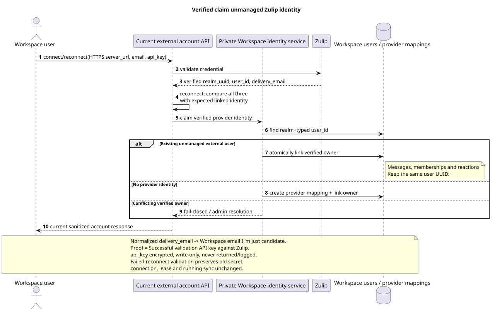

# Account lifecycle and identity Zulip

Status: **proposal; current public API saved, target semantics clarified**.

[← The main index of the documentation](../index.md) · [The index Zulip Bridge](README.md) · [Bootstrap and recovery](coordination_and_recovery.md) · [Provider mappings and content](provider_mappings_and_content.md)

Document records the lifecycle of a single user Zulip account, verified
identity claim It doesn't add routes, fields, or any other kind of data.,
actions The current public contract remains in the
[`workspace_api.md`](../workspace_api.md) and
[`zulip_bridge_v1_product_and_api.md`](../zulip_bridge_v1_product_and_api.md).

## Unchanged public account API

All the paths below are under
`/api/workspace/v1/messenger`. Maximum one account c
`settings.kind="zulip"` Allowed for one Workspace owner.

| Method | Current route | Saved by semantics |
| --- | --- | --- |
| `GET` | `/external_accounts/` | List of current sanitized accounts owner. |
| `POST` | `/external_accounts/` | Create and verify Zulip account with client-generated `uuid` and write-only credential. |
| `GET` | `/external_accounts/{account_uuid}` | Sanitized snapshot Only his own. account. |
| `PUT` | `/external_accounts/{account_uuid}` | Revision-safe The change `selection_mode`, `history_depth`, `default_project_id`; `If-Match` is preserved. |
| `POST` | `/external_accounts/{account_uuid}/actions/reconnect/invoke` | Check and replace `server_url`/email/`api_key`, then run the same bootstrap as connect. |
| `POST` | `/external_accounts/{account_uuid}/actions/disconnect/invoke` | Stop sync with account/credential and frozen visible history. |
| `DELETE` | `/external_accounts/{account_uuid}` | Return the current empty `204`; target cleanup account-scoped and does not delete shared canonical data. |

Zulip create/reconnect receives HTTPS `server_url`, email and write-only
`api_key`. Workspace Checks HTTPS, encrypts the key to durable storage and never
does not return credential or encrypted envelope, does not write it in public event,
log, trace or safe error. Reconnect validates the new credential against
expected verified `realm_uuid`, provider `user_id` and normalized
`delivery_email`. Only a perfect match allows for atomic replacement . encrypted
secret Any validation/mismatch failure leaves the old one
credential, connection, lease and sync working without change.

The public field `selection_mode` stores the exact literals `explicit` and `all`.
The user-agreed word individual means the existing
`explicit`: owner Selects individual chats. `all` remains dynamic  new
All available chats will automatically receive assignment in `default_project_id`.

`history_depth` It only accepts `new`, `7_days`, `30_days`, `90_days`, `all`;
default — `30_days`. Filter It 's a separate act for each person . connected account.
Each selected external chat at any time is assigned to exactly one Workspace
project; The action
`/external_chats/{chat_uuid}/actions/move/invoke` Keep it atomic reassignment
No intermediate state of nowhere or in two. projects».

## Connect and reconnect

Connect and reconnect use one of the algorithms from
[`coordination_and_recovery.md`](coordination_and_recovery.md#единый-bootstrap-connect-reconnect-и-recovery):

1. Workspace Validates the credential through Zulip and gets verified
   `realm_uuid`, authenticated Zulip `user_id` and `delivery_email`.
2. For reconnect, it compares them to the expected linked identity.
   matches in one Workspace transaction replaces encrypted secret and
   connects/confirms verified provider identity; mismatch fail-closed and not
   Stops the old connection.
3. Workspace sticky scheduler Allows one account healthy compatible
   Bridge With the minimum normalized load `active_accounts / declared_capacity`
   and lease/fencing generation. owner.
4. Bridge registers a new Zulip event queue only for supported event types,
   gets boundary and runs it immediately sequential realtime loop.
5. Only after successful registration, the boundary Bridge will be able to create a
   Workspace root history task I 'm with current selection/history settings.

The old Zulip queue/cursor is not prerequisite reconnect. Local Bridge
cache It could be empty.; authoritative account, mappings, tasks, outbound
operations and lease generation are in Workspace.

## Disconnect

Disconnect Atomically translates account into current `disconnected` lifecycle and
It's called the account lease generation. commit:

- new Zulip events and outbound provider calls for account are not accepted;
- credential/account remain stored for current reconnect action;
- selected-chat assignments, user bindings And the history that you can see remains.
  frozen and read by current access rules;
- canonical/provider mappings They 're not being deleted .;
- pending work can 't be run until reconnect and can 't be moved to another account.

Disconnect is not Delete and does not hide the history already available.

## Delete: accepted target semantics {#delete-accepted-target-semantics}

Public `DELETE` route and `204` are preserved, but target cleanup is different from
It's an accepted change to the internal semantics,
Not a change. browser contract.

In one account-scoped cleanup operation Workspace:

1. Stops sync, fencing revokes lease and bans new provider
   calls.
2. Untying verified Zulip identity from IAM/Workspace owner; external identity
   can remain unmanaged author/member without session/credentials.
3. Removes encrypted account credential, account assignment/mappings and queued
   history/outbound work That's all. account.
4. Removes only account-derived user bindings, access/projection rows and
   account provenance. Native access And access confirmed by others connected
   account, They 're being kept ..
5. Does not remove shared canonical `MESSAGE`, `TOPIC`, `STREAM`, user identity or
   file, while they are accessible/linked through another connected account or native
   relation.
6. Removes physical file/blob only after proven zero remaining
   references; shared/deduplicated object Never gets deleted by account flag.

Cleanup retry We're going to have to. author UUID,
message content, reactions or memberships remaining canonical union.
If the account you 're deleting owns the routing provider same-project chat,
Workspace Until account cleanup atomically transmits stream/topic/message/file
provenance The first remaining selected alias. `DELETE 204`
It 's not going to leave the common stream without outbound route.

## Verified user claim

The source that you can edit:
[`identity_claim.puml`](diagrams/identity_claim.puml).

Normalized Zulip `delivery_email` and normalized Workspace account email give
Email does not prove ownership and is not
provider identity key.

Verified claim It 's done like this::

1. Existing Workspace user explicitly calls current account create/reconnect with
   Zulip `api_key`.
2. Bridge Validates the credential at Zulip and gets authenticated
   `(realm_uuid,user_id,delivery_email)`.
3. Workspace Verifies the identity of the provider under transaction lock owner link.
4. If stable identity is unmanaged, Workspace binds it to IAM owner UUID,
   without creating a new user UUID and without overwriting messages, memberships,
   reactions, URNs or provider mappings.
5. If identity is already verified for another owner, operation fail-closed and
   requires administrative permission; email similarity does not change anything.

## Unmanaged external identities and bots

History/realtime `realm_user/add` Creates or reuses one unmanaged
external Workspace user via stable provider identity, if applicable Workspace
account No, like this. identity:

- is visible as author/member and participates only where it was imported;
- does not have credential, login/session or authority to act on behalf of the person;
- can be claimed verified connection without change UUID/references;
- receives user updates/avatar/status by accepted event coverage.

`realm_bot/add` creates a special bot user. `realm_bot/update` metadata remains
unsupported. Zulip deactivate/delete unilaterally deactivates/deletes the bot and
its account-derived access; shared message content is not deleted.

## Multi-account canonical union

For one verified Zulip realm canonical provider entities form union
All of them . connected accounts:

- provider user/channel/topic/message/file identity It 's created once and
  It 's reused for stable realm-scoped mapping;
- history depth and selection are applied separately to each account;
- per-account provenance and per-user bindings/access differ;
- You can add more history to one account canonical topics,
  messages And files that no one else has seen. account;
- Deleting one account only removes its access confirmation, not
  shared row.

If one provider chat is simultaneously selected by several accounts, target
must consider the remaining account-access sources before removal binding/file and not
use first account as a permanent owner canonical row.

The decision `2A` specifies the cross-account boundary unambiguously: one
realm-global provider chat Can only be selected in one `project_id`.
Same-project accounts reuse the single stream/topic graph, and choose alias in
The other project gets `409 provider_scope_conflict`. Public
`provider.account_uuid` Indicates the current routing owner;
deselect/delete ownership Atomically transferred to the remainder selected alias without
Changes to the canonical row or the public browser contract.
The decision is contained in
[`workspace_server_v2_decisions.md`](../workspace_server_v2_decisions.md#2a--один-realm-global-provider-chat-принадлежит-одному-project).

[← The main index of the documentation](../index.md) · [The index Zulip Bridge](README.md) · [Bootstrap and recovery](coordination_and_recovery.md) · [Provider mappings and content](provider_mappings_and_content.md)
