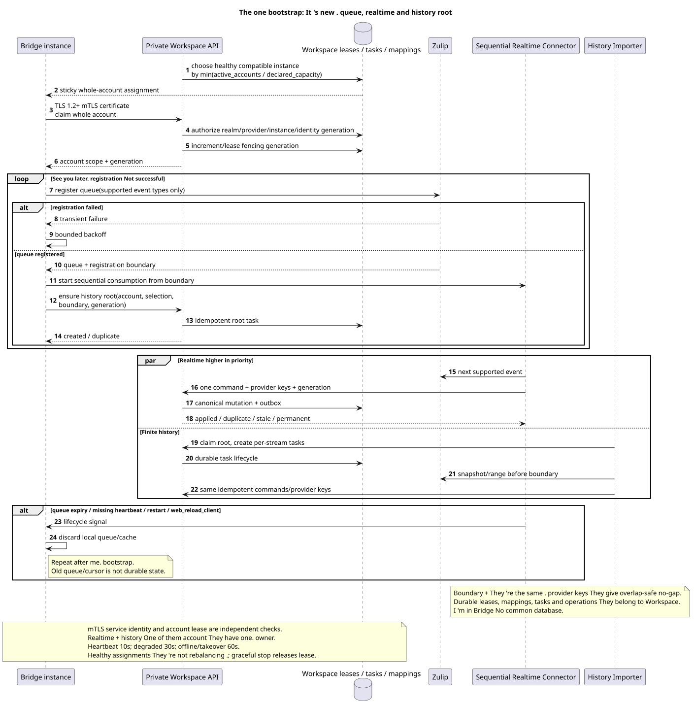

# Overview of the target architecture Zulip Bridge

Status: **proposal; docs-first, public Workspace API not changed**.

[← The main index of the documentation](../index.md) · [The index Zulip Bridge](README.md) · [Matrix of events](event_coverage.md) · [The canonical inventory](../messenger_architecture_inventory.md)

Zulip Bridge — A separate trusted circuit without direct access to Workspace DB.
It's made up of two independent processes using one private Workspace
API, One service identity policy and identical provider/idempotency keys.

## Components and limits of liability

| The component | He owns | It doesn't. |
| --- | --- | --- |
| `Zulip Realtime Connector` | Whole-account lease, new supported Zulip queue, strictly sequential inbound loop and durable Workspace-origin delivery | It doesn't import the old range, it doesn't recipient fan-out/projections |
| `Zulip History Importer` | Workspace-owned root/per-stream tasks and final import of selected history range | Does not own realtime queue, does not store message checkpoint v1 |
| Private Workspace API | Currently in force realm-bound mTLS service identity, server-owned scope, provider mappings, idempotent canonical mutation, account/task/outbound lifecycle | Doesn't trust HTTP header/body, passed Bridge `project_id`/user or account lease as replacement authentication |
| Workspace workers | Fan-out, bindings/state, snapshots/counters, ready events | Do not read Zulip and are not Bridge workers |
| WebSocket dispatcher | Replay/live delivery durable ready events | Does not create or decide business events provider sync |

All of them . durable assignments, account lease generations, mappings, history tasks,
outbound operations, failures and audit evidence are in Workspace. Bridge
There is no shared database; local cache/queue connection can be lost and restored.

Bridge is a protocol adapter, not a second domain service Workspace.
faithfully converts Zulip event to private command and Workspace outbound
operation back to Zulip, but doesn't solve historical visibility, membership
bindings, archive/delete policy or notification eligibility.

Both processes will reuse the existing S2S boundary
`workspace-external-bridge-api`: TLS 1.2+ mutual TLS, realm control CA and
generation-bound client certificate with URI SAN containing only
`realm_uuid`/`provider_kind`/`bridge_instance_uuid`/`identity_generation`.
The single enrollment and renewal/revoke lifecycle remain the same as in
current control/file/Provider API. Whole-account lease/fencing It 's being checked .
Additionally for each account command and is not authentication.

## Account and identity boundary

Current public account/chat routes and payloads are saved. Connect/reconnect
validates Zulip `api_key`, gets verified realm/user/`delivery_email` and
only then associates identity. Email  candidate, not proof. Missing
Workspace account becomes an unmanaged external user without login/session; late
verified claim It's going to reuse identity.:
[`account_lifecycle_and_identity.md`](account_lifecycle_and_identity.md).

History depth and selected chat scope belong to a specific account, but
canonical provider entities form a realm-wide union. Deleting account removes
only its credential/work/access evidence; shared canonical rows remain.

## Unified bootstrap and recovery

The source that you can edit:
[`bootstrap_to_realtime.puml`](diagrams/bootstrap_to_realtime.puml).

Connect, reconnect, queue expiry, missing heartbeat, `restart` and
`web_reload_client` They run the same algorithm.:

1. Workspace scheduler Allows all accounts to one account healthy compatible Bridge
   with minimum normalized load `active_accounts / declared_capacity` and gives
   lease/fencing generation. Assignment sticky.
2. Registers a new Zulip queue only for supported event types and returns
   registration boundary. Repeats with backoff if error occurs; history cannot start.
3. Immediately starts a strictly sequential realtime loop from boundary.
4. Idempotently creates Workspace history root task for snapshot/range to
   boundary I 'm with account selection/history settings.

The old Zulip queue/cursor is not a durable prerequisite.
provider keys allow overlap, but not gap: the first actual state mutation
creates an outbox/event, the repeat becomes duplicate/no-op.

V1 It can work with one bridge, but the circuit supports multiple instances.
The new healthy instance does not cause the healthy accounts to rebalance: it gets
new assignments; the transfer is only for dead/draining owner. Graceful
shutdown Releases leases, crash takeover authorized after `60s` offline timeout
And he always gets a new one. fencing generation. Heartbeat interval `10s`, status
`degraded` after `30s`, `offline` after `60s`.

## The common domain mutation of the message

Inbound realtime and history use the same command. Workspace
transaction She 's ...:

1. Allows realm-scoped provider mapping and canonical `MESSAGE`;
2. Allows a binding `TOPIC`, belonging to one `STREAM`/`PROJECT`;
3. creates `MESSAGE_PLACEMENT`, author `USER_MESSAGE_BINDING` and
   placement-scoped `USER_MESSAGE_STATE`;
4. Calculates public placement UUID as
   `UUIDv5(namespace=TOPIC.uuid, name=MESSAGE.uuid)`;
5. He writes immutable outbox event.

`2xx`/`201` means commit canonical state/idempotency, not completion fan-out.
Workspace workers Asynchronously create recipient state, counters/snapshots and ready
events. Bridge It doesn 't replace this subsystem ..

## Structure, content and files

- Numeric users/channels/messages/attachments have realm-scoped UUIDv5 with exact
  ASCII name `<entity_type>:<decimal_provider_id>`; allowed types and decimal
  normalization The number of cases registered in provider mapping document.
- Zulip topic has Workspace-owned durable mapping and alias history; UUID does not
  Direct/group direct is derived from private `STREAM` and
  mandatory synthetic default `TOPIC`.
- Whole-topic rename keeps topic UUID. canonical
  `MESSAGE`, Removes old placement, creates placement in target topic; old URL
  Returns `404`, public events are reflected delete+create/update.
- One file corresponds to `(realm_uuid,attachment_id)`; message links are separate,
  physical blob It 's only deleted when zero references.
- Public content — Only the one that 's in effect . canonical Markdown/URN. Latest raw Zulip
  payload/version/converter metadata hidden private; revision history raw not
  Newest-first unresolved links are listed deferred repair; reconversion
  It only performs manual versioned batch tool.

I 'll give you a little bit more .: [`provider_mappings_and_content.md`](provider_mappings_and_content.md).

## Realtime, history and outbound

Realtime per account It reads exactly one event, turns it into one. internal
command, repeats until applied/duplicate/stale or classified permanent failure,
History root creates per-stream tasks; different types of routines are created.
streams run parallel to the configured limit, one stream  one worker,
topics/messages The newest-first sequence is inside it.
stream task Repeats the entire range; provider keys do the imported
I 'm going fast . no-op.

The common history pool of one Bridge has default `4`; upper limit/optimum remain
Between accounts, fair round-robin, inside account —
newest stream first. Workers account They use the common rate limiter. Zulip
`Retry-After` Stops history account; realtime has priority and
It 's the first one ..

Workspace-origin mutation atomically stores the canonical state, outbox and durable
outbound operation. Transient delivery retry He 's worried . failover; internal
`permanent_failed` It doesn 't create a new one . public endpoint. Last confirmed mutation
wins, delete wins stale edit, echo suppresses reciprocal write. I 'll give you a little bit more .:
[`delivery_and_events.md`](delivery_and_events.md).

## Public events

Every actual client-visible transition — live, backfill, deferred repair
or reconversion  atomically creates exactly one ready public event. Duplicate/no-op
event does not create. Workspace worker commit-it projection+event together, dispatcher
only delivers/replay-it. `delivery_class` and notification metadata remain
in current shape; Bridge is not resolving desktop/push policy.

## Event coverage and restrictions

The canonical direction matrix is only in
[`event_coverage.md`](event_coverage.md). Unsupported families They don 't get it .
guessed fallback. The remaining transport/serialization/limits/policy solutions
listed only in
[The canonical OPEN-list](README.md#единый-список-open-решений-zulip-bridge).

[← The main index of the documentation](../index.md) · [The index Zulip Bridge](README.md) · [Matrix of events](event_coverage.md) · [The canonical inventory](../messenger_architecture_inventory.md)
