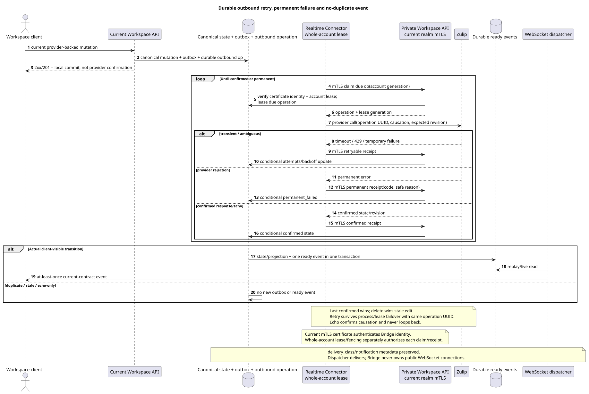

# Outbound delivery, conflicts and public events

Status: **proposal; public routes/`delivery`/event shapes are unchanged**.

[← The main index of the documentation](../index.md) · [The index Zulip Bridge](README.md) · [Realtime Connector](realtime_connector.md) · [The inside . Workspace API](internal_workspace_api.md)

The document specifies durable outbound semantics and rule public WebSocket events.
It doesn't add notification UI, conflict UI, retry route or new public
status literal.

## The Importance of Successful Workspace response

For provider-backed mutation public Workspace `2xx`/`201` means that one
Local transaction committed:

- canonical primary mutation and current author/placement/state rows;
- immutable domain outbox event;
- durable outbound provider operation I 'm with stable operation UUID,
  `causation_uuid`, provider target mapping and expected revision/state;
- The existing sanitized .`delivery`projection in the current contract shape.

Response does not mean that Zulip has already confirmed mutation. Transient provider
failure does not roll over committed Workspace state and does not lose operation: retry
survives Connector process crash, account lease expiry And transfer to another
Bridge instance.

Current public
`/external_operations/{operation_uuid}/actions/retry/invoke` And his errors are not
No new one is created for internal inbound `permanent_failed`. UI/action:
It 's not new . public retry endpoint.

## Durable operation lifecycle

The source that you can edit:
[`outbound_delivery.puml`](diagrams/outbound_delivery.puml).

Internal operation It keeps operation UUID, source outbox event UUID, account
lease generation, provider object identity, expected/confirmed provider
revision, causation, attempts/backoff and sanitized failure code/reason.

The minimum internal outcomes:

| Outcome | Semantics |
| --- | --- |
| `pending` | Durable operation committed, provider call Not confirmed yet.. |
| `retryable` | Transient network/`429`/provider failure; same operation waits until `next_retry_at`. |
| `confirmed` | Provider response/state/echo confirms requested transition. |
| `permanent_failed` | Provider has finally rejected operation; endless retry is forbidden. |
| `superseded` | A newer confirmed/delete operation makes the old mutation inapplicable. |

It's an internal model, not an extension. current public `delivery.status`. Existing
`delivery`, `safe_error`, `can_retry`, `can_discard`, duplicate/reconciliation
fields They 're keeping current values and authorization. Internal
`permanent_failed` is displayed only through the already allowable sanitized failure
semantics; raw provider response/content Not published.

Future operator requeue It could be added by a separate solution, but not now.
Permanent failure is stored/alarmed and available private
reconciliation; new browser notification/retry action is not being created.

## Retry and account failover

Bridge Authenticates private API request as valid realm-bound mTLS client
certificate and separately gets the whole-account lease/fencing generation from
Workspace. Before each provider call and receipt update Workspace checks and
certificate identity, And account generation. expiry:

1. The old owner can 't verify anymore . result.
2. Only after `60s` offline timeout scheduler assigns healthy compatible
   owner; New Bridge claims all account with new fencing generation, performs
   the usual bootstrap and through private API gets due operations.
3. Retry uses the same operation UUID/provider key/causation and first
   reconcile-- What ? ambiguous provider state.
4. Confirmation is written as conditional on lease generation and provider
   revision; stale response It 's getting no-op.

Bridge-local retry queue not authoritative. Backoff/attempts/next retry and
terminal state They 're in Workspace.

Graceful draining/shutdown Clearly releases the lease; healthy sticky account does not
It 's only re-balanced because of the less-burdened instance.

## Conflict semantics

- Last **confirmed** mutation wins; arrival time/job time is not version.
- Delete wins over concurrent Or later delivered stale edit.
- For bidirectional presence/status Bridge consistently delivers both
  The winner is the last one to go. confirmed state.
- `origin`/`causation_uuid` are used for echo suppression/idempotency, not
  as priority Workspace or Zulip.
- Echo The same causation confirms the operation and does not generate reciprocal
  outbound work.
- No text merge, hidden fork or conflict UI.
- Stale edit After delete , get internal no-op/superseded outcome; canonical
  deleted state and client events do not roll over.
- Same provider operation retry I 'm going to be able to do it .
  provider identity/revision/state, Not by timestamp guess.

## Exactly one ready event per actual event transition

Every transaction that actually creates/modifies/deletes client-visible
state, Atomically creates exactly one corresponding durable ready public event
for this transition/audience. This applies equally to `live`, history
backfill, deferred reference repair and manual reconversion.

- State/projection row and ready event commit together or rollback together.
- Idempotent duplicate/stale/no-op It doesn 't create a new one . public event.
- When history/realtime overlaps, the first committed transition creates an event, the second
  with the same provider key/version returns duplicate/no-op without event.
- Recipient fan-out creates a ready event only in a transaction that does
  specific recipient projection visible.
- Delete old placement + create/update target placement with partial move  two
  real public state transitions, each with a current-contract event, but retry
  He doesn't repeat them..

`delivery_class` (`live`/`backfill`) and existing
`notification_eligible`/notification metadata are stored in public sanitized
projection. Bridge does not solve desktop/push eligibility: client uses
current contract. Backfill event exists, but the metadata doesn't make it
desktop notification.

WebSocket dispatcher He doesn 't create business events . He reads . durable event store,
makes replay/live delivery at-least-once, and client dedupe-it at event UUID.

## Internal retention

- Successfully completed history tasks and confirmed/successful outbound delivery
  operations Removed by internal cleanup `30 days`.
- `permanent_failed` operation together with safe code/reason `90 days`,
  Then it 's deleted . internal cleanup.
- Provider mappings and latest hidden raw payload/converter metadata are missing
  task TTL: They live as long as the corresponding Workspace/provider
  entity.

Retention does not add public fields/actions. Possible future internal requeue
not implemented and does not change the existing public external-operation retry route.

## The watch

Account/operation-scoped metrics are required content/credential:

- pending/retryable age, attempts, next retry and oldest operation;
- confirmed/permanent_failed/superseded counts by safe code;
- account lease owner/generation mismatch and stale receipt rejection;
- provider rate-limit/backoff and outbound lag;
- duplicate/no-op count and unexpected duplicate-ready-event guard;
- public projection→ready event transaction failures and dispatcher lag separately.

[← The main index of the documentation](../index.md) · [The index Zulip Bridge](README.md) · [Realtime Connector](realtime_connector.md) · [The inside . Workspace API](internal_workspace_api.md)
