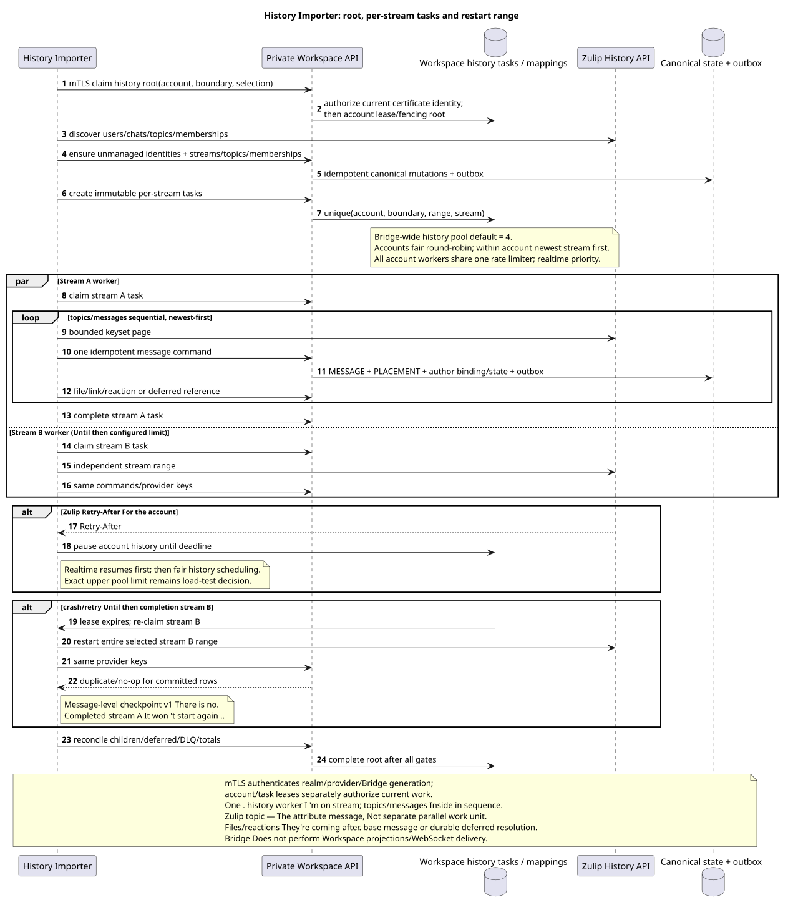

# Zulip History Importer

Status: **proposal; final Workspace-task-driven import**.

[← The main index of the documentation](../index.md) · [The index Zulip Bridge](README.md) · [Matrix of events](event_coverage.md) · [Bootstrap and recovery](coordination_and_recovery.md) · [Provider mappings/content](provider_mappings_and_content.md)

`Zulip History Importer` executes finite import of selected account history
range. It doesn't own realtime queue, doesn't write Workspace DB and doesn't store
message-level checkpoint. Durable root/child tasks and results belong to
Workspace private API.

## The preconditions

History root It 's only created after a successful registration of a new supported-events
queue and start realtime from the registration boundary. server-owned
account, verified realm, selection, `history_depth`, boundary, lease generation
and stable task identity. Without boundary history, it doesn't run..

Importer calls current private API only under the same realm-bound mTLS client
certificate, that the Realtime Connector of this Bridge instance. Certificate
checks service identity; claims every root/stream task and active whole-account
lease/fencing They 're separately proving the right to work with a specific account/range.

History depth (`new`, `7_days`, `30_days`, `90_days`, `all`) The same applies per
account; default `30_days`. Canonical entities They form a union of all connected
accounts, So deeper account can add topics/messages/files without
I 'm not copying . provider identity.

## Root and per-stream tasks

The source that you can edit:
[`history_importer.puml`](diagrams/history_importer.puml).

Root task It runs discovery and creates an immutable child task for each selected
channel/direct/group-direct stream:

1. Verifies/creates unmanaged external user identities and bot identities;
   verified connection claim — - I 'm not sure . account operation.
2. Permits realm-scoped canonical channels/streams.
3. For channel reads accessible-topic metadata and includes only topics, in
   There are messages inside. account history range.
4. Direct/group direct Creates a private stream with one mandatory synthetic
   default topic.
5. Passes memberships/subscriptions and server-owned project assignment to
   Workspace; domain service He decides the historical visibility and bindings.
6. Creates per-stream tasks in the order last activity descending.

Workspace idempotency/unique task key It ensures that retry root does not create
Second child for the same immutable stream range.

## Parallelism and Order

One bridge has a common configurable history worker pool, default `4`.
The exact safe upper limit and optimum remain until load tests. stream tasks
can be run in parallel, but one stream simultaneously claims exactly one
history worker. Topics and messages within the stream are processed sequentially,
because Zulip topic  is an attribute message; message priority — `created_at DESC`,
when stable provider message ID descending. `OFFSET` is not used.;
Each bounded request applies keyset/provider pagination.

Scheduler selects accounts fair round-robin, and within the selected account —
newest stream first All workers accounts share one
account-level rate limiter. Zulip `Retry-After` Pauses history exactly
This account; realtime lane has priority and is resumed first.

Realtime loop independent and always higher on priority/admission. History worker no
keeps account-wide lock temporarily provider request; lease generation
It 's checked at claim and every time private API commit.

## No message-level checkpoint v1

Child task does not save the last imported message. process crash, lease expiry
or retryable failure unfinished stream task starts the entire selected range with
Same realm/provider keys converted previously committed users/topics/
messages/files/reactions in duplicate/no-op, without creating a second canonical row,
outbox or ready event. Completed stream tasks will not be restarted.

Task lifecycle Workspace-owned: `pending` → `leased/running` → `completed` or
`failed`, with attempts/backoff, lease expiry/fencing, bounded retries and DLQ.
Default pool `4` Only the upper limit/optimum and measurable rate/batch
budgets They stay in canonical OPEN-list.

## Message and dependency order

Inside the stream importer first provides users, stream, mandatory topics and
memberships/bindings. Then for each message newest-first:

1. the bridge sends one idempotent `message.create`/`update` command containing
   both the message snapshot and the account owner's exact `read` flag;
2. the Workspace transaction creates or updates the canonical `MESSAGE`,
   placement, author binding, and read state without publishing a message event
   or scheduling unread counters for every imported row;
3. After base message, import files/attachment links and reactions;
4. unresolved older quote/message/file reference keeps as deferred, not
   synthetic public object;
5. actual later repair creates an ordinary outbox/ready event, no-op  nothing.

One canonical file is reused by `(realm_uuid,attachment_id)`. Topic
This is done through Workspace-owned mapping/alias history.
changes UUID; partial move creates target placement and removes old placement.

## Current state, deletes and unsupported families

History restores the provable current state of the selected snapshot/range, and
The raw message is saved only latest
payload/revision/hash/converter metadata. Persistent supported state Includes
message flags, reactions, memberships, selected user fields/status, files and
links. Presence/typing/heartbeat/restart Not back-filled. Experimental
`submessage`, unsupported UI/personal/org families They 're not imported .;
`saved_snippets` It stays. OPEN.

## Completion and reconciliation

Stream task `completed` means terminal processing of all immutable range and
durably classified deferred/permanent items. Root It 's over after all . child
tasks and reconciliation:

- selected stream/topic/message ranges, provider identity uniqueness and gaps;
- memberships/access, attachment references, reactions and deferred refs;
- no duplicate canonical rows/outbox/events when overlapping with realtime;
- Workspace task/DLQ/outbound failures and projection lag reported separately.

Stream and topic creation events remain visible so clients can discover the
projection while it is loading. After the last message in a selected chat has
been acknowledged, the bridge sends a causal `history.finalize` fence. Workspace
then schedules one exact stream counter snapshot plus one snapshot per projected
topic; those tasks publish the final unread state and refresh affected folders.
Duplicate finalizers are idempotent. Live message and read events retain their
normal realtime behavior throughout the import.

## Graceful restart and observability

Graceful stop stops new stream claims, completes/delivers current task and
Hard crash only allows takeover after
`60s` offline timeout; New fenced owner repeats bootstrap, unfinished stream
task range, But no. completed siblings.

Completed history tasks are audit/retry evidence `30 days`, after which
Internal retention cleanup removes them. Provider mappings/raw entity metadata
do not follow this task TTL and live with the corresponding entity.

The metric: root/child counts, stream ordering/age, full-range restarts,
messages/files/reactions scanned vs applied/duplicate, deferred/DLQ, provider
rate limits, history lag and reconciliation mismatch. Raw content/credential No , not really .
Logged in.

[← The main index of the documentation](../index.md) · [The index Zulip Bridge](README.md) · [Matrix of events](event_coverage.md) · [Bootstrap and recovery](coordination_and_recovery.md) · [Provider mappings/content](provider_mappings_and_content.md)
