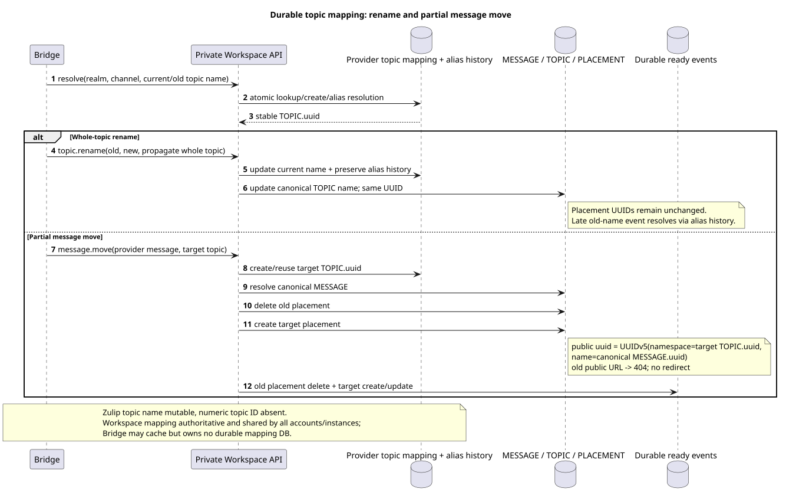
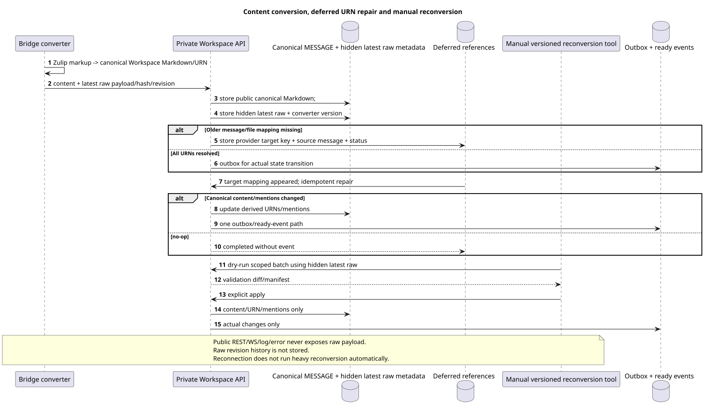

# Provider mappings, topics, files and content conversion

Status: **proposal; internal design, public Markdown/URN contract is unchanged**.

[← The main index of the documentation](../index.md) · [The index Zulip Bridge](README.md) · [Account lifecycle and identity](account_lifecycle_and_identity.md) · [The inside . Workspace API](internal_workspace_api.md)

The document is fixed realm-global provider identity, durable topic mapping,
file/attachment reuse and Zulip↔Workspace content conversion. Bridge does not store
authoritative mappings It 's not adding . Bridge-specific public markup.

## Realm-scoped provider identity

Stable numeric Zulip IDs They use a logical key
`(verified_realm_uuid, entity_kind, numeric_provider_id)`. `entity_kind`
It 's mandatory and prevents a collision of the same number between user/channel/
message/attachment domains.

| Provider kind | Stable logical key | Canonical result |
| --- | --- | --- |
| user | `(realm_uuid,"user",user_id)` | One managed or unmanaged `WorkspaceUser` identity. |
| channel | `(realm_uuid,"channel",channel_id)` | One . canonical channel `STREAM`. |
| message | `(realm_uuid,"message",message_id)` | One canonical `MESSAGE`, regardless of importing account. |
| attachment/file | `(realm_uuid,"attachment",attachment_id)` | One canonical Workspace file; links to messages are separate. |

Target UUID/provider mapping It uses a very accurate algorithm .:

1. Namespace — It's only accepted as a stable Zulip realm UUID.
   canonical lowercase hyphenated UUID text, They're going to take it apart and then they're going to put it in UUID and then they're going to put it in UUID.
   UUIDv5 Like 16 .RFC 4122/network-byte-order octets. Project/account UUIDI never did.
   Not used as namespace.
2. The allowed `entity_type`  is exactly one of lowercase ASCII literals:
   `user`, `channel`, `message`, `attachment`.
3. Numeric provider ID It's a whole without a sign.,
   The canonical value is rejected. decimal form —
   shortest base-10 ASCII: `0` For zero, or digits.`0..9`without leading zeros,
   `+`, gaps or locale formatting.
4. UUIDv5 name — the exact ASCII-line
   `<entity_type>:<decimal_provider_id>`, For example, `message:12345`.
5. Bytes name is equal to ASCII/UTF-8 bytes of this line without NUL, BOM, newline,
   braces, prefix, project/account/server URL or additional fields.

The result is  `UUIDv5(namespace=verified_realm_uuid, name_bytes)`.
numeric ID The two types of traffic are not intersected due to the mandatory prefix.
Mutable email/name/server URL and importing account are not included in identity.

Provider mapping and canonical row are created/read atomically through private
Workspace API. Multiple Bridge instances/accounts They get one result.;
local cache Can be discarded without loss identity.

## Discovery and history scope

History depth For channel stream root task reads
Zulip accessible-topic metadata And the time boundary. account
Only topics that have a message in it are projected. `history_depth` range.
Another account in the same realm with a deeper range can add new ones later
canonical topics/messages; It's a normal expansion of the union, not duplicate.

Direct, self-direct and group direct are displayed in private Workspace `STREAM` with
One mandatory synthetic default`TOPIC`. Nullable/sentineltopic for
placement Exact stable conversation key is taken from provider mapping,
Not from display name.

## Durable topic mapping without numeric Zulip topic ID

The source that you can edit:
[`topic_mapping_and_move.puml`](diagrams/topic_mapping_and_move.puml).

Zulip topic does not have a stable numeric ID, so `TOPIC.uuid` cannot be derived
only from mutable topic name. Workspace owns durable provider topic mapping,
The bridge is accessible only through private API.:

- `realm_uuid` and stable provider channel identity;
- current normalized provider topic identity/name;
- stable canonical `TOPIC.uuid`;
- rename/alias history, enough to late old-name event;
- immutable owning canonical stream/project association.

The creation of/reuse is performed under Workspace transaction lock.
Bridge instances One realm uses mapping, and the bridge cache is not
source of truth.

### Whole-topic rename

Whole-topic rename Updates the canonical topic name and alias history, but keeps
The same .`TOPIC.uuid`. Late event with old name allowed through history in the same name
topic identity. Since namespace placement UUID remains the same, public
message placement URLs They don 't change just because whole-topic rename.

### Partial message move

Partial move One/part of messages is not rename:

1. Workspace Finds the canonical source`MESSAGE`The realm/message mapping.
2. Target topic is created or reused through durable mapping.
3. Source `MESSAGE_PLACEMENT` is deleted; content `MESSAGE` is not copied.
4. The target topic creates a new placement with public UUID
   `UUIDv5(namespace=TOPIC.uuid, name=MESSAGE.uuid)`.
5. The old public message URL after commit returns current `404`; redirect and
   hidden primary placement It 's forbidden ..
6. In the same state transition transaction are created ready events: deletion
   old placement and current-contract create/update snapshot of new
   placement. Duplicate retry It doesn't make a second pair. events.

## Canonical files and attachments

One canonical Workspace file matches
`(realm_uuid,attachment_id)`. Repeated history/realtime import and references from
multiple messages/accounts reuse file row/blob. Normalized
message↔file links are separate source-of-truth rows and have their own
referential integrity.

Deleting account or one attachment relation does not delete file/blob, until
The native or provider reference remains.
zero-reference check. Provider file bytes/metadata and mapping account-independent;
access The following are the relevant message/stream/user bindings.

Workspace→Zulip upload It 's only part of the job . provider-backed
message/action with verified account/mapping. Ordinary unrelated Workspace file not
is sent to Zulip automatically.

Typed UUIDv5 serialization for users/channels/messages/attachments completely
defined above and is notOPEN. Business uniqueness file remains
`(realm_uuid,attachment_id)`.

## Canonical Markdown and URNs

Public `payload.kind="markdown"` and current URNs are stored without extension:

- `[name](urn:user:<user-uuid>)`;
- `[message](urn:message:<placement-uuid>)`;
- `[stream](urn:stream:<stream-uuid>)`;
- `[topic](urn:topic:<topic-uuid>)`;
- `[file](urn:file:<file-uuid>?name=...)`;
- `` and `urn:video`;
- `[url](urn:url:https://...)`;
- The current quote/reply Markdown rules from
    [`workspace_api.md`](../workspace_api.md#messages).

Inbound Zulip content converter It only creates canonical Workspace Markdown.
Outbound converter resolves URNs through durable provider mappings and forms
Zulip markup. Unallocated UUID not replaced by display name/URL guess.

## Latest raw provider layer

The source that you can edit:
[`content_conversion_and_repair.puml`](diagrams/content_conversion_and_repair.puml).

Only one canonical provider message is saved latest raw Zulip message
payload, latest provider revision/hash, converter version and bounded conversion
result metadata. Revision history raw payloads not conducted.

Raw layer Hide completely:

- It 's not serialized in public REST list/get/search/action response;
- not included in public WebSocket event;
- is not written in log, trace, metric label or public/safe error;
- is only available from private authenticated Provider/Bridge API and versioned manual
  reconversion tooling I 'm with server-owned realm/account scope.

Provider mapping, latest hidden raw payload, provider revision/hash, converter
version and conversion metadata live as long as the corresponding
Workspace/provider entity. It's an internal lifecycle, not a separate public field and
Not independent raw revision archive.

Public content always canonical Markdown. `provider`/`delivery` remain
with existing sanitized public projections; raw protocol fields are not added.

## Deferred references The newest-first import

The new message can quote an older message that hasn 't been imported yet . message/file.
Converter Saves internal deferred reference from provider target key,
canonical source message UUID, converter version and repair status. Public
Markdown It doesn 't . synthetic entity.

When target mapping appears, idempotent repair re-allows only
affected references. If canonical public content/mentions/derived URNs
actually changed, the transaction updates the message state, writes outbox and
No-op repair does not create a ready-current-contract event. event.

## Manual reconversion

Heavy reconversion Never run inside a schema migration or a regular
request path. Schema migration Can only register a new one converter
version/need. A separate versioned manual tool must support:

- `dry-run`/check-only and explicit apply;
- realm/account/project/range scope;
- bounded batches, restart/checkpoint and audit manifest;
- raw access Only through private authenticated boundary;
- validation counts/diffs Before applying and reconciliation after.

Reconversion can change canonical Markdown, derived URNs and mentions.
It changes. author, canonical/placement UUID, stream/topic, public timestamps,
read/star/pin state, reactions Every actual change is followed by
the usual outbox/projection/ready-event rule; no-op does not create event.

[← The main index of the documentation](../index.md) · [The index Zulip Bridge](README.md) · [Account lifecycle and identity](account_lifecycle_and_identity.md) · [The inside . Workspace API](internal_workspace_api.md)
