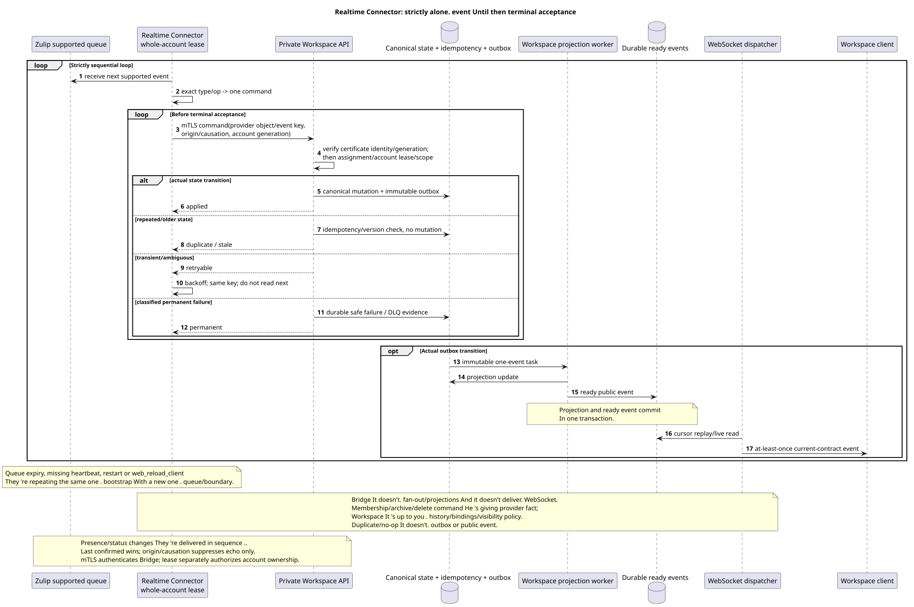

# Zulip Realtime Connector

Status: **proposal; continuous sequential process, public API unchanged**.

[← The main index of the documentation](../index.md) · [The index Zulip Bridge](README.md) · [Matrix of events](event_coverage.md) · [Bootstrap and recovery](coordination_and_recovery.md) · [Outbound delivery](delivery_and_events.md)

`Zulip Realtime Connector` Serves all external accounts under one
Workspace-issued lease. It only accepts supported events, sends
durable Workspace-origin operations And he never writes .WorkspaceDB directly.
It is a protocol translator and does not make Workspace domain-policy decisions.

## Starting

The source that you can edit:
[`realtime_connector.puml`](diagrams/realtime_connector.puml).

Connector It always starts through
[- One . bootstrap](coordination_and_recovery.md#единый-bootstrap-connect-reconnect-и-recovery):

1. Authenticate current realm-bound mTLS client certificate and then claims
   All account with separate fencing generation.
2. Registers a new queue with allowlist supported event types.
3. It does. registration boundary.
4. It starts right away. realtime consumption.
5. Once successfully launched, it creates a powerful history root task.

Registration failure Doesn 't allow history without boundary. Queue expiry, missing
heartbeat, `restart` and `web_reload_client` release the current connection and
Old queue/cursor is not durable state.

## Strictly sequential inbound loop

Per account It 's just one thing that 's being processed at the same time . inbound event:

1. Get it next supported event.
2. Send commands over current mTLS private API; Workspace independently
   Verifies certificate identity and account lease/fencing generation.
3. Classify exactly `type`/`op` by
      [`event_coverage.md`](event_coverage.md), No approximate fallback.
4. Form one private Workspace command with provider object/event key,
   origin/causation and provider revision/hash, if it exists.
5. Repeat command until terminal acceptance.
6. Only after applied/duplicate/stale/confirmed or classified permanent
   failure Go to the next one . event.

Transient timeout/`429`/temporary provider error Returns the same event in
Missing dependency is maintained as durable Workspace deferred reference
Unsupported events should not be included in the subscription;
If the provider still returned them, Connector writes bounded audit/metric and does not
It creates guessed mutation.

## Workspace transaction and async boundary

Private API Obtains service identity only from the verified mTLS certificate,
a project/source/user/account scope  from Workspace assignments/mappings and
active lease. For actual mutation he in one transaction does
idempotency check, canonical mutation, placement/binding/state If necessary
and immutable outbox append. Duplicate/no-op does not create a second outbox/event.

Recipient fan-out, counters, reactions/file snapshots and ready public events
They do .WorkspaceConnector doesn't expect them to finish and doesn't
Ready event is created atomically from the actual projection;
WebSocket dispatcher It 's still a separate component ..

## Supported message/content paths

- Create/update/delete/move messages, reactions, files/attachments, read/unread,
  starred, mentions/links/render-related changes Following bidirectional matrix.
- Inbound content is converted into canonical Workspace Markdown/URN; latest raw
  payload Deferred older references repaired through Workspace.
- Whole-topic rename keeps the durable topic UUID. old
  placement, creates new placement in target topic; old public URL returns
  `404`, redirect It 's not being created ..
- Reactions address public placement for access, but fact/snapshot remains
  canonical-message-global The Commission has semantics.
- File reuse The following paragraphs `(realm_uuid,attachment_id)`; unrelated native file
  It 's not going to Zulip.

## Structure, users and ephemeral events

- Zulip channel create It creates mapped Workspace stream; native Workspace stream
  create It doesn't. Zulip channel.
- Membership add/remove in group/private chat is transmitted by one Workspace private
  command. Bridge doesn 't create a new stream because of a change in composition and doesn 't solve,
  which history is visible or which message bindings to create/delete: this does
  Workspace domain service The stream settings.
- Channel archive/delete is passed as a provider command; Workspace decides
  archive/history/bindings/visibility. Bridge It doesn 't duplicate . policy.
- The remaining subscription/topic/user selected updates are as follows exact matrix.
- Unknown ordinary identity becomes unmanaged external user when import;
  verified existing user claim is only explicit account connection.
- Bot add It creates special user; bot metadata update unsupported;
  deactivate/delete It 's coming . Zulip→Workspace.
- Presence/status/typing Two-sided; presence/typing TTL-based and not durable
  history, `user_status` persistent. Echo suppression It doesn't. reciprocal op.

For bidirectional presence/status Connector consistently delivers changes
The last confirmed change is that the problem is not solved by the two sides.
`origin`/`causation_uuid` are used only for echo suppression and
idempotency, They don 't give one side priority ..

## Workspace-origin outbound lane

Workspace `2xx` Keep it local canonical mutation + outbox + durable outbound
operation. Connector gets due operation through private API under the same account
generation, calls Zulip and conditionally confirms receipt. Transient retries
They 're worried . process/lease failover. Last confirmed wins; delete wins stale edit;
echo Confirms causation without reverse command. Provider permanent rejection
becomes internal `permanent_failed`, not new public action/status.

Full . semantics:
[`delivery_and_events.md`](delivery_and_events.md).

## Backpressure, restart and observability

Realtime lane It takes precedence over history. inbound loop sequential,
its queue growth is regulated by the provider queue/backoff, not by parallel reorder.
All history workers account shares account-level limiter; `Retry-After`
Pauses history, whereas realtime restores the first.
On graceful stop Connector does not take next event/provider operation, completes or
Hard crash safe.:
The new owner starts bootstrap, and replay/overlap is de-duplicated provider keys.

The metric: queue registration/expiry, event processing age, terminal outcomes,
duplicate/no-op, retry/backoff, lease generation mismatch, echo match failure,
outbound pending/permanent failure and separately Workspace projection/WS lag. Raw
content, email and credential are prohibited in labels/logs/errors.

[← The main index of the documentation](../index.md) · [The index Zulip Bridge](README.md) · [Matrix of events](event_coverage.md) · [Bootstrap and recovery](coordination_and_recovery.md) · [Outbound delivery](delivery_and_events.md)
