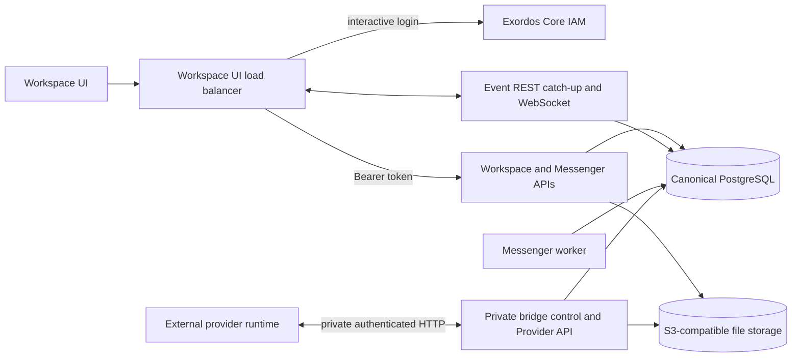

# Workspace Messenger Архитектура

Этот документ определяет границы текущих Workspace сервисов бэк-энда и
Контракт браузера остается в силе.
[`workspace_api.md`](workspace_api.md), то данные частного поставщика
определяется
[`workspace_provider_api_v1.yaml`](../workspace_provider_api_v1.yaml), и
поведение клиента в режиме реального времени документируется в
[`workspace_ui_realtime_integration.md`](workspace_ui_realtime_integration.md).

## Инварианты архитектуры

- Workspace Интерфейс пользователя взаимодействует только с IAM-аутентифицированным Workspace и
  Messenger REST API и общий Workspace событийный веб-сокет.
- PostgreSQL является каноническим для Messenger ресурсов, членства, состояния пользователя,
  события, отображение поставщика, состояние внешнего аккаунта, команды и клиент
  настройки.
- Messenger не читает и не пишет SMTP, IMAP, Maildir, Exim или Dovecot.
- IAM - источник пользователей Workspace, проектов, идентификации токенов на владельца,
  и сферы действия разрешения.
- Метаданные файла и состояние ACL представлены в PostgreSQL.
  JSON боковые вагоны используют конфигурированный S3 совместимый с ней резервный накопитель.
- Время выполнения внешних провайдеров - это независимые сервисы.
  частный, аутентифицированный через мост Провайдер HTTP API и обычный проект
  Messenger ресурсов в PostgreSQL; браузеры никогда не называют это API.
- Общественные Messenger REST и веб-сокет формы независимы от
  постоянство и внедрение провайдера.
- Заднего изображения не содержит источника пользовательского интерфейса или пучка.
  версии `workspace_ui` элемент владеет общественным балансировщиком нагрузки, служит
  неизменный веб-артефакт и прокси-функции `/api/` к экспортируемому узлу бэк-энда.

## Компоненты и границы доверия

Интерфейсы браузера HTTP и веб-сокета образуют общественное приложение
Мост управления, провайдера и файловых API-трансфера используют отдельный
частный слушатель и идентификация моста.
полезные нагрузки, внутренние курсоры, строки базы данных и файловые распределения не
пересечь границу браузера.

## Границы между общественными и частными API

Развертывание показывает эти стабильные пути браузера:

- `/api/workspace/v1/messenger/...` для контракта Messenger REST;
- `/api/workspace/v1/events/` для длительного хранения данных;
- `/api/workspace/v1/events/ws` для событий в прямом эфире;
- `/api/workspace/v1/{users,services,me,epoch}/...` для общих
  IAM - охваченные Workspace ресурсы;
- `/api/workspace/specifications/3.0.3` для публики Workspace OpenAPI
  Документ.

Нет провайдера, календаря или самостоятельной почты API, ориентированной на браузер.
Независимо развернутые провайдеры используют частные
`/api/workspace-provider/v1` план данных.
также не маршрутизируются через браузер-лицом nginx местоположения.

## Идентификация и разрешение

Публичные запросы REST используют токен IAM. `user_uuid` происходит от токен IAM
`project_id` происходит от IAM самоанализа. Messenger операции.
применять полученные проверки проекта, пользователя, членства, собственности и действий
до чтения или изменения канонического состояния.

Private provider boundary аутентифицирует зарегистрированный мостовой экземпляр и
Провайдер событий партии и операции
результаты проверяются с этой идентификацией и соответствующим счетом,
проект, задание чата, возможности и состояние аренды до их изменения
канонические ресурсы Messenger.

## Владение данными

| Данные | Источник истины |
| --- | --- |
| Пользователи, проекты, аутентификация и разрешения IAM | Exordos Core IAM |
| Сообщения, потоки, темы, объединения, папки, черновики, реакции, состояние чтения и события | PostgreSQL |
| Учетные записи поставщиков, политики, состояние моста, отображение, команды, результаты и дедупликация | PostgreSQL |
| Метаданные файла и состояние контроля доступа | PostgreSQL и канонический JSON боковой вагон |
| Байты файлов и JSON боковые вагоны | Совместимое с S3 хранилище |

Workspace UUID и типизированные URN остаются идентификаторами, видимыми через
Стабильные идентификаторы поставщиков и метаданные конверсии
хранятся за провайдером проекции и подвергаются воздействию только через обеззараженные
публичные поля `provider` и `delivery`, если это разрешено договором.

## Нативный поток Messenger

Для нативной записи, бэк-энд аутентифицирует вызывающего с помощью IAM, проверяет
текущее PostgreSQL членство и разрешения, и обязывает канонических
изменения ресурсов и их побочные эффекты в режиме реального времени в транзакции запроса.
Читает с использованием тех же канонических таблиц и правил видимости пользователя/project.

Файловые полезные нагрузки остаются в S3 совместимом хранилище.
файл или СМИ URN; Messenger API никогда не помещает бинарные вложения в
вторичный транспорт сообщений.

## Поток поставщиков

Workspace - к поставщику действия создают долгосрочные операции поставщика в
PostgreSQL. зарегистрированный провайдер время выполнения арендует совместимые операции на
частный провайдер HTTP API и сообщает о конечных результатах с идемпотентом,
Результаты по пункту. Изменения провайдера-Workspace поступают как аутентифицированное событие
Сборка проверяется и применяется атомно к обычным каноническим
Messenger ресурсов; недействительный пункт переворачивает обратно полную партию, так что
Провайдер может попробовать снова без изменений.

Прогнозы поставщиков возвращаются через те же публичные конечные точки Messenger
Их очищенные `provider` метаданные идентифицируют
внешний источник и эффективные возможности, в то время как `delivery` описывает
соответствующее состояние внешней работы.
- Приватный.

## Модель в реальном времени

REST догонка и доставка веб-сокета несут одну и ту же плоскость `schema_version: 1`
PostgreSQL поддерживает курсор генерации и монотонной эпохи.
Клиенты сохраняются `(epoch_generation, epoch_version)`, дедупликируются этим курсором,
и применять обе перевозки через одного диспетчера.

Рабочий веб-сокета объединяет PostgreSQL уведомления о взрывах и отступлении
В результате, в зависимости от подключения, каждый подключение имеет
большинство одной активной задачи, так что медленный клиент не может отложить доставку здоровым клиентам.
Временная потеря чтения хранилища поддерживает установленные сокеты готовыми и пытается снова
с ограниченным джиттер-бакофф; отправка или протокол неудачи закрыть только пострадавших
- Включаю.
Уведомление является лишь сигналом о пробуждении; долговечный курсор на пользователя остается
Источник истины, так что слияние не меняет полезные нагрузки событий, порядок, или
Семантика восстановления.

Только строки событий подпадают под действие политики конфигурируемого хранения, которая
По умолчанию до 72 часов. Сообщения и другие канонические ресурсы не удаляются
Когда старые события подрезаются. курсор за пределами сохраненного суффикса получает
ответы `epoch_pruned` и клиент перезагружает авторитетные снимки
прежде чем возобновить обновления в реальном времени.

## Устойчивость и восстановление

Совместимость PostgreSQL и S3-хранилища должна выживать при замене службы и узла.
Восстановление восстанавливает базу данных и хранилище объектов, применяет миграции баз данных,
и затем начинает API, событие, работник, и частный провайдер услуг.
индексы и кэши могут быть перестроены из канонических PostgreSQL строк без
изменение идентификации государственных ресурсов.

Развертывание всегда начинает PostgreSQL поддерживаемый Messenger время выполнения.
нет переключателя режима постоянства или вторичного журнала Messenger.
