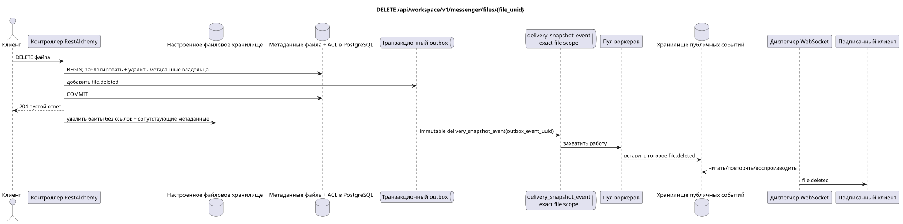

# `DELETE /api/workspace/v1/messenger/files/{file_uuid}`


Общий target-инвариант надёжности: каждое immutable outbox event выводит ровно одну immutable typed task с уникальным `outbox_event_uuid`; coalescing отсутствует. Task хранит фактический exact scope key, использует lease/fencing, retry/backoff, max attempts/DLQ, reaper и идемпотентный effect guard. Topic scope применяется только к placement/message-binding work; shared rows не получают неявный fallback на topic.

[← Главный индекс документации](../../../../index.md) · [Индекс диаграмм последовательностей](../../README.md) · [Раздел контента и пользователей Workspace](../README.md)

Статус: целевая спецификация операции, разработанная сначала в документации. Текущий публичный контракт
остаётся без изменений и является нормативным в [`workspace_api.md`](../../../../workspace_api.md).
Этот файл описывает целевые границы транзакций и проекций; это не
производственный код, миграции SQL или новая конечная точка.



[Редактируемый исходник PlantUML](diagrams/delete_file.puml)

## Назначение и публичный контракт

Удалить файл владельца и отозвать доступ к его байтам.

Аутентификация: токен Bearer IAM; `project_id` и текущий `user_uuid` берутся из контекста IAM.

## Путь и параметры запроса

| Расположение | Имя | Тип / правило |
| --- | --- | --- |
| путь | `file_uuid` | UUID |

Пагинация коллекций, где она предусмотрена, сохраняет текущий контракт `page_limit` и UUID
`page_marker` и возвращает `X-Pagination-Limit`, а также
`X-Pagination-Marker` только при наличии следующей страницы.

## Тело запроса

Тело запроса отсутствует.

## Успешный ответ

`204` с пустым телом ответа.


## Ошибки и авторизация

Удалять может только владелец. Недоступный UUID или UUID другого владельца не раскрывается. Ошибки очистки хранилища происходят после канонического удаления и не восстанавливают публичный доступ.

Общая форма ответа при ошибке валидации:

```json
{
  "type": "ValidationErrorException",
  "code": 400,
  "message": "Validation error occurred."
}
```

## Целевая граница RestAlchemy

```python
from restalchemy.api import controllers as ra_controllers
from restalchemy.api import resources as ra_resources
from restalchemy.dm import models
from restalchemy.dm import properties
from restalchemy.dm import types
from restalchemy.storage.sql import orm


class WorkspaceFile(models.ModelWithUUID, models.ModelWithProject,
                    models.ModelWithTimestamp, orm.SQLStorableMixin):
    # Contract boundary only; target storage decomposition is not selected.
    __tablename__ = "m_workspace_files"
    user_uuid = properties.property(types.UUID(), required=True, read_only=True)
    stream_uuid = properties.property(types.AllowNone(types.UUID()))
    name = properties.property(types.String(max_length=255), required=True)
    description = properties.property(types.String(max_length=255), default="")
    content_type = properties.property(types.String(max_length=255), required=True)
    size_bytes = properties.property(types.Integer(min_value=0), required=True)
    hash = properties.property(types.String(max_length=255), required=True)


class WorkspaceFileController(ra_controllers.BaseResourceControllerPaginated):
    __resource__ = ra_resources.ResourceByRAModel(
        model_class=WorkspaceFile,
        hidden_fields=["project_id"],
        convert_underscore=False,
        process_filters=True,
    )
    # Narrow multipart/storage/download overrides preserve the current contract.
```

Каждая публичная ссылка на сущность объявляется скалярным UUID-свойством RestAlchemy, а не `relationship` (которое сериализовалось бы как URI). Соответствующий физический столбец `*_uuid` — индексированный внешний ключ с явно выбранным ссылочным действием. Поэтому публичный JSON сохраняет UUID без изменений.

Текущий контракт метаданных/хранилища/ACL сохраняется; целевое физическое разбиение не выбрано. `project_id` остаётся скрытым. Скалярный `user_uuid` и допускающий `null` `stream_uuid` остаются публичными UUID-значениями, поддерживаемыми индексированными FK. Динамический доступ по членству в потоке проверяется по каноническим привязкам потока.

## Синхронный путь API

1. Найти и заблокировать метаданные файла владельца.
2. Удалить каноническую строку файла/ACL и добавить неизменяемую запись `file.deleted` в outbox.
3. Зафиксировать транзакцию и вернуть `204`.
4. После фиксации транзакции удалить бинарные данные и сопутствующие метаданные, на которые больше нет ссылок.

## Outbox, типизированные задачи, воркер и работа в реальном времени

Готовое событие удаления создаётся асинхронно. Публичный доступ исчезает при фиксации удаления метаданных, до завершения очистки по возможности объекта.

Зафиксированная доменная запись файла в outbox создаёт отдельную immutable
`delivery_snapshot_event` с exact scope файла и уникальным
`outbox_event_uuid`. Воркер идемпотентно записывает готовое `file.deleted`, а
диспетчер отправляет, повторяет или воспроизводит его.

## Идемпотентность, ключи и гонки

UUID определяет одну каноническую запись метаданных. Удаление и обновление сериализуются по этой строке; более поздняя операция видит удаление. Очистка хранилища допускает повторы и должна учитывать ссылки.

## Момент видимости для клиента

Клиент-инициатор немедленно получает зафиксированные метаданные. Другие клиенты получают готовое событие файла после задержки проекции. Очистка хранилища после зафиксированного удаления может завершиться позже, не восстанавливая доступ к метаданным.

[← Главный индекс документации](../../../../index.md) · [Индекс диаграмм последовательностей](../../README.md) · [Раздел контента и пользователей Workspace](../README.md)
