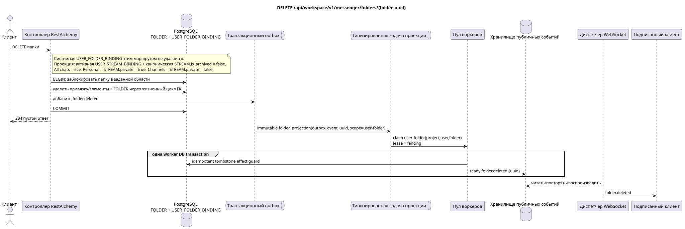

# `DELETE /api/workspace/v1/messenger/folders/{folder_uuid}`

[← Главный индекс документации](../../../../index.md) · [Индекс диаграмм последовательностей](../../README.md) · [Раздел контента и пользователей Workspace](../README.md)

Статус: целевая спецификация операции, разработанная сначала в документации. Текущий публичный контракт
остаётся без изменений и является нормативным в [`workspace_api.md`](../../../../workspace_api.md).
Этот файл описывает целевые границы транзакций и проекций; это не
производственный код, миграции SQL или новая конечная точка.



[Редактируемый исходник PlantUML](diagrams/delete_folder.puml)

## Назначение и публичный контракт

Удалить папку текущего пользователя.

Аутентификация: токен Bearer IAM; `project_id` и текущий `user_uuid` берутся из контекста IAM.

## Путь и параметры запроса

| Расположение | Имя | Тип / правило |
| --- | --- | --- |
| путь | `folder_uuid` | UUID |

Пагинация коллекций, где она предусмотрена, сохраняет текущий контракт `page_limit` и UUID
`page_marker` и возвращает `X-Pagination-Limit`, а также
`X-Pagination-Marker` только при наличии следующей страницы.

## Тело запроса

Тело запроса отсутствует.

## Успешный ответ

`204` с пустым телом ответа.


## Ошибки и авторизация

Неверные или неавторизованные входные данные обрабатываются общей границей ошибок RESTAlchemy/IAM; ресурсы в заданной области не раскрываются за границами пользователя/проекта.

Общая форма ответа при ошибке валидации:

```json
{
  "type": "ValidationErrorException",
  "code": 400,
  "message": "Validation error occurred."
}
```

## Целевая граница RestAlchemy

```python
from restalchemy.api import controllers as ra_controllers
from restalchemy.api import resources as ra_resources
from restalchemy.dm import models
from restalchemy.dm import properties
from restalchemy.dm import types
from restalchemy.storage.sql import orm


class WorkspaceFolder(models.ModelWithUUID, models.ModelWithProject,
                      models.ModelWithTimestamp, orm.SQLStorableMixin):
    __tablename__ = "messenger_folders"
    title = properties.property(types.String(min_length=1, max_length=64), required=True)
    background_color_value = properties.property(types.AllowNone(types.Integer()))


class WorkspaceUserFolderBinding(models.ModelWithUUID, models.ModelWithProject,
                                 models.ModelWithTimestamp, orm.SQLStorableMixin):
    __tablename__ = "messenger_user_folder_bindings"
    # Public UUID links are scalar UUID properties, never URI relationships.
    user_uuid = properties.property(types.UUID(), required=True, read_only=True)
    folder_uuid = properties.property(types.UUID(), required=True, read_only=True)
    unread_count = properties.property(types.Integer(min_value=0), default=0, read_only=True)
    mention_count = properties.property(types.Integer(min_value=0), default=0, read_only=True)
    folder_items_snapshot = properties.property(types.List(), default=list, read_only=True)
    folder_items_snapshot_version = properties.property(types.Integer(min_value=0), default=0, read_only=True)
    folder_items_snapshot_updated_at = properties.property(types.AllowNone(types.UTCDateTimeZ()), read_only=True)
    BUSINESS_KEY = ("project_id", "user_uuid", "folder_uuid")


class WorkspaceUserFolder(models.ModelWithTimestamp, orm.SQLStorableMixin):
    __tablename__ = "messenger_api_user_folders_v1"
    binding_uuid = properties.property(types.UUID(), id_property=True, read_only=True)
    uuid = properties.property(types.UUID(), read_only=True)
    title = properties.property(types.String(min_length=1, max_length=64))
    background_color_value = properties.property(types.AllowNone(types.Integer()))
    unread_count = properties.property(types.Integer(min_value=0), read_only=True)
    system_type = properties.property(types.AllowNone(types.Enum(["all", "created"])), read_only=True)
    folder_items = properties.property(types.List(), read_only=True)


class FolderController(ra_controllers.BaseResourceControllerPaginated):
    __resource__ = ra_resources.ResourceByRAModel(
        model_class=WorkspaceUserFolder,
        hidden_fields=["binding_uuid", "project_id", "user_uuid"],
        convert_underscore=False,
        process_filters=True,
    )
```

Каждая публичная ссылка на сущность объявляется скалярным UUID-свойством RestAlchemy, а не `relationship` (которое сериализовалось бы как URI). Соответствующий физический столбец `*_uuid` — индексированный внешний ключ с явно выбранным ссылочным действием. Поэтому публичный JSON сохраняет UUID без изменений.

При чтении публичное `folder_items` напрямую берётся из read-only JSONB `folder_items_snapshot`; нормализованные `FOLDER_ITEM` остаются source of truth. Удаление папки не собирает массив в request path; FK lifecycle удаляет корень/привязку и dependent items. Чтение не использует N+1, `json_agg`, `COUNT` и custom SQL.

Удаляется только пользовательская папка с правилом/типом `created`. Системная
`USER_FOLDER_BINDING` имеет фиксированное правило и не удаляется этим
маршрутом. Её автоматические `FOLDER_ITEM` — поддерживаемой воркером
восстанавливаемая проекция из активных `USER_STREAM_BINDING` и канонических
`STREAM` с `is_archived = false`: `All chats` включает все такие доступные
потоки, `Personal` — только потоки с `STREAM.private = true`, `Channels` —
только с `STREAM.private = false`. Жизненным циклом проекции управляет фоновая
задача, а не ручное удаление системной папки.

## Синхронный путь API

1. Найти папку и пользовательскую привязку в заданной области.
2. Удалить элементы и привязку папки через объявленное владение FK, затем удалить каноническую папку согласно её жизненному циклу.
3. Добавить в outbox неизменяемую запись `folder.deleted` с публичным UUID папки.
4. Зафиксировать транзакцию и вернуть `204`.

## Outbox, типизированные задачи, воркер и работа в реальном времени

Запрос удаления не пересчитывает непрочитанное. Очистка и событие-маркер удаления строятся по зафиксированным ключам.

Зафиксированный event выводит immutable `folder_projection` без coalescing,
с exact scope `user-folder:(project_id,user_uuid,folder_uuid)` и уникальным
`outbox_event_uuid`. Поскольку source rows уже удалены, worker идемпотентно
фиксирует ready `folder.deleted` tombstone по ключам outbox; в той же worker DB
transaction фиксируется effect guard. Диспетчер доставляет событие
только после commit. Retry/backoff, DLQ/reaper обязательны.

## Идемпотентность, ключи и гонки

Конкурирующая операция в той же области либо выполняется до удаления, либо получает ответ «не найден». Зависимую очистку выполняют действия FK; рукописная цепочка SQL-удалений не вводится.

## Момент видимости для клиента

Ответ REST отражает синхронное изменение папки. Другие клиенты увидят соответствующее готовое событие после ограниченной задержки проекции с согласованностью в конечном счёте.

[← Главный индекс документации](../../../../index.md) · [Индекс диаграмм последовательностей](../../README.md) · [Раздел контента и пользователей Workspace](../README.md)
