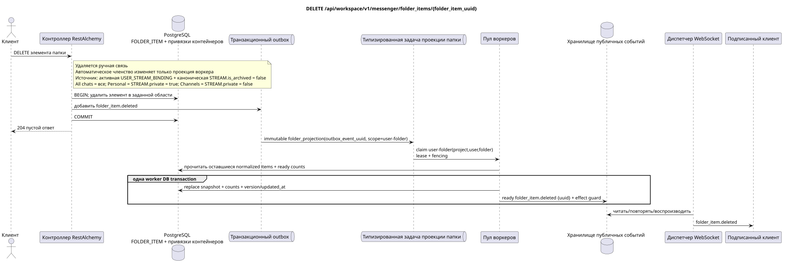

# `DELETE /api/workspace/v1/messenger/folder_items/{folder_item_uuid}`

[← Главный индекс документации](../../../../index.md) · [Индекс диаграмм последовательностей](../../README.md) · [Раздел контента и пользователей Workspace](../README.md)

Статус: целевая спецификация операции, разработанная сначала в документации. Текущий публичный контракт
остаётся без изменений и является нормативным в [`workspace_api.md`](../../../../workspace_api.md).
Этот файл описывает целевые границы транзакций и проекций; это не
производственный код, миграции SQL или новая конечная точка.



[Редактируемый исходник PlantUML](diagrams/delete_folder_item.puml)

## Назначение и публичный контракт

Удалить поток из папки текущего пользователя.

Аутентификация: токен Bearer IAM; `project_id` и текущий `user_uuid` берутся из контекста IAM.

## Путь и параметры запроса

| Расположение | Имя | Тип / правило |
| --- | --- | --- |
| путь | `folder_item_uuid` | UUID |

Пагинация коллекций, где она предусмотрена, сохраняет текущий контракт `page_limit` и UUID
`page_marker` и возвращает `X-Pagination-Limit`, а также
`X-Pagination-Marker` только при наличии следующей страницы.

## Тело запроса

Тело запроса отсутствует.

## Успешный ответ

`204` с пустым телом ответа.


## Ошибки и авторизация

Неверные или неавторизованные входные данные обрабатываются общей границей ошибок RESTAlchemy/IAM; ресурсы в заданной области не раскрываются за границами пользователя/проекта.

Общая форма ответа при ошибке валидации:

```json
{
  "type": "ValidationErrorException",
  "code": 400,
  "message": "Validation error occurred."
}
```

## Целевая граница RestAlchemy

```python
from restalchemy.api import controllers as ra_controllers
from restalchemy.api import resources as ra_resources
from restalchemy.dm import models
from restalchemy.dm import properties
from restalchemy.dm import types
from restalchemy.storage.sql import orm


class WorkspaceFolderItem(models.ModelWithUUID, models.ModelWithProject,
                          models.ModelWithTimestamp, orm.SQLStorableMixin):
    __tablename__ = "messenger_folder_items"
    user_uuid = properties.property(types.UUID(), required=True, read_only=True)
    folder_uuid = properties.property(types.UUID(), required=True)
    stream_uuid = properties.property(types.UUID(), required=True)
    chat_type = properties.property(types.Enum(["stream", "group", "private"]), required=True)
    order_index = properties.property(types.AllowNone(types.Integer()))
    pinned_at = properties.property(types.AllowNone(types.UTCDateTimeZ()), read_only=True)


class WorkspaceUserFolderItem(models.ModelWithTimestamp, orm.SQLStorableMixin):
    __tablename__ = "messenger_api_user_folder_items_v1"
    uuid = properties.property(types.UUID(), id_property=True, read_only=True)
    project_id = properties.property(types.UUID(), read_only=True)
    user_uuid = properties.property(types.UUID(), read_only=True)
    folder_uuid = properties.property(types.UUID(), read_only=True)
    stream_uuid = properties.property(types.UUID(), read_only=True)
    chat_type = properties.property(
        types.Enum(["stream", "group", "private"]), read_only=True,
    )
    order_index = properties.property(types.AllowNone(types.Integer()))
    pinned_at = properties.property(types.AllowNone(types.UTCDateTimeZ()), read_only=True)
    # Ready fields are joined from unique USER_STREAM_BINDING. They are not
    # stored on WorkspaceFolderItem and are never calculated on API reads.
    unread_count = properties.property(types.Integer(min_value=0), read_only=True)
    active_unread_count = properties.property(types.Integer(min_value=0), read_only=True)
    passive_unread_count = properties.property(types.Integer(min_value=0), read_only=True)


class FolderItemController(ra_controllers.BaseResourceControllerPaginated):
    __resource__ = ra_resources.ResourceByRAModel(
        model_class=WorkspaceUserFolderItem,
        convert_underscore=False,
        process_filters=True,
    )
    # Writes use WorkspaceFolderItem; reads use the calculation-free view.
```

Каждая публичная ссылка на сущность объявляется скалярным UUID-свойством RestAlchemy, а не `relationship` (которое сериализовалось бы как URI). Соответствующий физический столбец `*_uuid` — индексированный внешний ключ с явно выбранным ссылочным действием. Поэтому публичный JSON сохраняет UUID без изменений.

Физический элемент имеет индексированные FK `folder_uuid`, `stream_uuid` и `user_uuid` с `ON DELETE CASCADE`. Его публичные UUID-ссылки остаются скалярными. Три поля непрочитанного копируются простым индексированным соединением из уникальной `USER_STREAM_BINDING` по `(project_id,user_uuid,stream_uuid)`; они никогда не хранятся в привязке сообщения и не подсчитываются в этом запросе.

Маршрут удаляет ручную связь в пользовательской папке. Членство
автоматического `FOLDER_ITEM` в системной папке не удаляется вручную: это
восстанавливаемая материализованная проекция, которую воркер идемпотентно
поддерживает по активной `USER_STREAM_BINDING` и канонической `STREAM` с
`is_archived = false`. `All chats` включает все такие доступные потоки,
`Personal` — только потоки с `STREAM.private = true`, `Channels` — только с
`STREAM.private = false`. Изменение источника проходит через транзакционный
outbox и отдельную immutable task с уникальным `outbox_event_uuid`.

## Синхронный путь API

1. Найти и заблокировать элемент в заданной области.
2. Удалить только эту строку элемента.
3. Добавить в outbox неизменяемую запись `folder_item.deleted`.
4. Зафиксировать транзакцию и вернуть `204`.

## Outbox, типизированные задачи, воркер и работа в реальном времени

Запрос не запускает восстановление счётчиков; маркер удаления материализуется асинхронно.

Outbox event выводит immutable `folder_projection` без coalescing и с exact scope
`user-folder:(project_id,user_uuid,folder_uuid)`. Владелец fenced lease читает
оставшиеся normalized items и ready stream counts, а затем в одной worker DB
transaction заменяет deterministic `folder_items_snapshot`, счётчики,
version/updated_at и ready `folder_item.deleted`. Диспетчер читает event только
после commit; retry/backoff, DLQ/reaper и effect guard обязательны.

## Идемпотентность, ключи и гонки

UUID строки вместе с областью пользователя/проекта однозначно определяет удаление. Конкурирующие удаление/получение разрешаются порядком транзакций; никакой посторонний поток или папка не удаляется.

## Момент видимости для клиента

Ответ REST `204` сразу отражает удаление normalized item. Вложенный read-only snapshot папки, счётчики и WebSocket tombstone могут отставать до завершения `folder_projection`.

[← Главный индекс документации](../../../../index.md) · [Индекс диаграмм последовательностей](../../README.md) · [Раздел контента и пользователей Workspace](../README.md)
