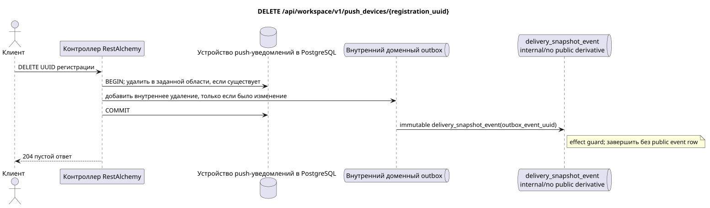

# `DELETE /api/workspace/v1/push_devices/{registration_uuid}`


Общий target-инвариант надёжности: каждое immutable outbox event выводит ровно одну immutable typed task с уникальным `outbox_event_uuid`; coalescing отсутствует. Task хранит фактический exact scope key, использует lease/fencing, retry/backoff, max attempts/DLQ, reaper и идемпотентный effect guard. Topic scope применяется только к placement/message-binding work; shared rows не получают неявный fallback на topic.

[← Главный индекс документации](../../../../index.md) · [Индекс диаграмм последовательностей](../../README.md) · [Раздел контента и пользователей Workspace](../README.md)

Статус: целевая спецификация операции, разработанная сначала в документации. Текущий публичный контракт
остаётся без изменений и является нормативным в [`workspace_api.md`](../../../../workspace_api.md).
Этот файл описывает целевые границы транзакций и проекций; это не
производственный код, миграции SQL или новая конечная точка.



[Редактируемый исходник PlantUML](diagrams/delete_push_device.puml)

## Назначение и публичный контракт

Идемпотентно удалить регистрацию установки текущего пользователя.

Аутентификация: токен Bearer IAM; `project_id` и текущий `user_uuid` берутся из контекста IAM.

## Путь и параметры запроса

| Расположение | Имя | Тип / правило |
| --- | --- | --- |
| путь | `registration_uuid` | UUID |

Пагинация коллекций, где она предусмотрена, сохраняет текущий контракт `page_limit` и UUID
`page_marker` и возвращает `X-Pagination-Limit`, а также
`X-Pagination-Marker` только при наличии следующей страницы.

## Тело запроса

Тело запроса отсутствует.

## Успешный ответ

`204` с пустым телом ответа.


## Ошибки и авторизация

Операция возвращает `204` и когда регистрация в заданной области удалена, и когда она уже отсутствует. Неверный контекст UUID/IAM обрабатывается общей границей валидации.

Общая форма ответа при ошибке валидации:

```json
{
  "type": "ValidationErrorException",
  "code": 400,
  "message": "Validation error occurred."
}
```

## Целевая граница RestAlchemy

```python
from restalchemy.api import controllers as ra_controllers
from restalchemy.api import resources as ra_resources
from restalchemy.dm import models
from restalchemy.dm import properties
from restalchemy.dm import types
from restalchemy.storage.sql import orm


class PushDevice(models.ModelWithUUID, models.ModelWithProject,
                 models.ModelWithTimestamp, orm.SQLStorableMixin):
    __tablename__ = "m_workspace_push_devices"
    user_uuid = properties.property(types.UUID(), required=True, read_only=True)
    transport = properties.property(types.Enum(["fcm"]), required=True)
    platform = properties.property(types.Enum(["android", "ios"]), required=True)
    registration_token = properties.property(types.String(max_length=4096), required=True)
    encryption = properties.property(types.Dict(), required=True)


class PushDeviceController(ra_controllers.BaseResourceController):
    __resource__ = ra_resources.ResourceByRAModel(model_class=PushDevice)
    # Narrow PUT upsert and idempotent DELETE overrides preserve owner scope.
```

Каждая публичная ссылка на сущность объявляется скалярным UUID-свойством RestAlchemy, а не `relationship` (которое сериализовалось бы как URI). Соответствующий физический столбец `*_uuid` — индексированный внешний ключ с явно выбранным ссылочным действием. Поэтому публичный JSON сохраняет UUID без изменений.

Управление регистрациями push-уведомлений находится вне переработки сущностей Messenger. UUID установки — ключ ресурса. `user_uuid` и `project_id` — серверные скалярные UUID-поля, поддерживаемые индексированными столбцами области; шифрование использует существующую модель `kind` HPKE.

## Синхронный путь API

1. Определить область владельца.
2. Удалить строку только при совпадении UUID, проекта и пользователя.
3. Если строка изменилась, добавить в outbox внутреннюю неизменяемую запись удаления без публичной производной.
4. В обоих случаях зафиксировать транзакцию и вернуть `204`.

## Outbox, типизированные задачи, воркер и работа в реальном времени

Публичная задача/событие или полезная нагрузка push-уведомления не создаются.

Текущий контракт управляет только регистрациями. Внутреннее immutable
outbox-событие выводит одну `delivery_snapshot_event`, которая идемпотентно
фиксирует отсутствие публичной производной и завершается; Workspace event row
и WebSocket-доставка не создаются. Шифрование и доставка push payload находятся
вне этой конечной точки.

## Идемпотентность, ключи и гонки

Удаление идемпотентно и не раскрывает регистрации из другой области владельца. Конкурирующие замена и удаление сериализуются по UUID регистрации.

## Момент видимости для клиента

Изменение регистрации видно к моменту возврата HTTP-ответа. Публичного WebSocket-события для него нет.

[← Главный индекс документации](../../../../index.md) · [Индекс диаграмм последовательностей](../../README.md) · [Раздел контента и пользователей Workspace](../README.md)
