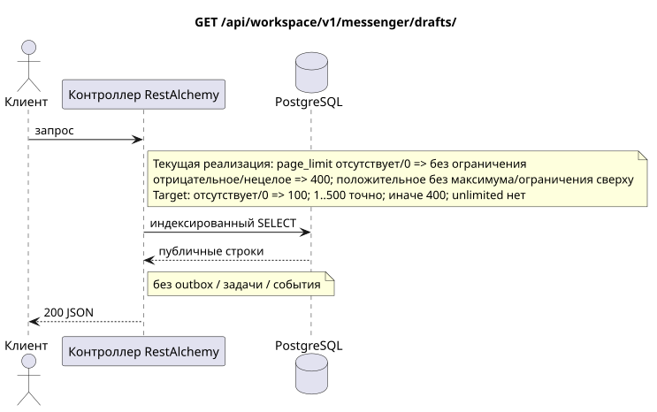

# `GET /api/workspace/v1/messenger/drafts/`

[← Главный индекс документации](../../../../index.md) · [Индекс диаграмм последовательностей](../../README.md) · [Раздел контента и пользователей Workspace](../README.md)

Статус: целевая спецификация операции, разработанная сначала в документации. Текущий публичный контракт
остаётся без изменений и является нормативным в [`workspace_api.md`](../../../../workspace_api.md).
Этот файл описывает целевые границы транзакций и проекций; это не
производственный код, миграции SQL или новая конечная точка.



[Редактируемый исходник PlantUML](diagrams/get_drafts_list.puml)

## Назначение и публичный контракт

Перечислить черновики текущего пользователя со стабильной курсорной пагинацией по `(updated_at, uuid)`.

Аутентификация: токен Bearer IAM; `project_id` и текущий `user_uuid` берутся из контекста IAM.

## Путь и параметры запроса

| Расположение | Имя | Тип / правило |
| --- | --- | --- |
| запрос | `page_limit` | current: отсутствие/`0` означает unlimited; target: отсутствие/`0` => `100`, `1..500` точно, отрицательное/нецелое/`>500` => `400` без clamp |
| запрос | `page_marker` | UUID в той же области владельца и фильтров |
| запрос | `sort_key` | только `updated_at` |
| запрос | `sort_dir` | `asc` или `desc` |
| запрос | `stream_uuid` | необязательный UUID |
| запрос | `topic_uuid` | необязательный UUID |

Пагинация коллекций, где она предусмотрена, сохраняет текущий контракт `page_limit` и UUID
`page_marker` и возвращает `X-Pagination-Limit`, а также
`X-Pagination-Marker` только при наличии следующей страницы.

Target default — `100`, hard maximum — `500`; `0` также означает `100`, unbounded mode отсутствует. Имя параметра и публичная JSON-форма не меняются; клиенты полного экспорта читают до отсутствия следующего marker.

## Тело запроса

Тело запроса отсутствует.

## Успешный ответ

`200`

```json
[
  {
    "uuid": "ca14d274-0057-4a9a-a34b-fb1174be6a17",
    "project_id": "22222222-2222-2222-2222-222222222222",
    "user_uuid": "11111111-1111-1111-1111-111111111111",
    "stream_uuid": "75309057-419c-4b12-a7c1-3932429ec4a6",
    "topic_uuid": "4ec0b996-b778-45f8-8ef4-ef863be0c047",
    "payload": {
      "kind": "markdown",
      "content": "Draft message"
    },
    "revision": 1,
    "created_at": "2026-07-17T08:00:00Z",
    "updated_at": "2026-07-17T08:00:00Z"
  }
]
```


## Ошибки и авторизация

Неверные параметры сортировки/фильтров возвращают `400`. Маркер вне точной области владельца/проекта/фильтра возвращает `404`. Ошибки IAM обрабатываются общей границей.

Общая форма ответа при ошибке валидации:

```json
{
  "type": "ValidationErrorException",
  "code": 400,
  "message": "Validation error occurred."
}
```

## Целевая граница RestAlchemy

```python
from restalchemy.api import controllers as ra_controllers
from restalchemy.api import resources as ra_resources
from restalchemy.dm import models
from restalchemy.dm import properties
from restalchemy.dm import types
from restalchemy.storage.sql import orm


class WorkspaceDraft(models.ModelWithUUID, models.ModelWithProject,
                     models.ModelWithTimestamp, orm.SQLStorableMixin):
    # Contract boundary only; target physical naming/decomposition is not selected.
    __tablename__ = "m_workspace_drafts"
    user_uuid = properties.property(types.UUID(), required=True, read_only=True)
    stream_uuid = properties.property(types.UUID(), required=True, read_only=True)
    topic_uuid = properties.property(types.UUID(), required=True, read_only=True)
    payload = properties.property(types.Dict(), required=True)
    revision = properties.property(types.Integer(min_value=1), read_only=True)


class WorkspaceDraftController(ra_controllers.BaseResourceControllerPaginated):
    __resource__ = ra_resources.ResourceByRAModel(
        model_class=WorkspaceDraft,
        convert_underscore=False,
        process_filters=True,
    )
    # Narrow overrides preserve owner scope, keyset marker, ETag and If-Match.
```

Каждая публичная ссылка на сущность объявляется скалярным UUID-свойством RestAlchemy, а не `relationship` (которое сериализовалось бы как URI). Соответствующий физический столбец `*_uuid` — индексированный внешний ключ с явно выбранным ссылочным действием. Поэтому публичный JSON сохраняет UUID без изменений.

Целевая внутренняя модель черновиков здесь намеренно не перерабатывается. Объявление фиксирует неизменную скалярную границу UUID/ETag. Физические UUID-столбцы пользователя/потока/темы остаются индексированными FK с каскадным поведением из текущего контракта; отношения RestAlchemy не должны менять публичный UUID JSON.

## Синхронный путь API

1. Проверить область IAM.
2. Выполнить индексированное чтение ресурса.
3. Сериализовать неизменённый публичный JSON.

## Outbox, типизированные задачи, воркер и работа в реальном времени

Это чтение не записывает доменное событие или запись outbox, не создаёт типизированную задачу проекции и не публикует публичное событие. Ресурсы на основе БД читаются по индексам без вычислений. Все счётчики уже материализованы; запрос не выполняет `COUNT`, `GROUP BY`, коррелированные подзапросы и не сканирует привязки сообщений.

Диспетчер WebSocket не участвует.

## Идемпотентность, ключи и гонки

Операцию безопасно повторять, поскольку она не изменяет состояние. Идентичность ресурса и область фильтров стабильны на время транзакции БД.

## Момент видимости для клиента

Клиент получает зафиксированное состояние, доступное на момент выполнения транзакции чтения; запрос не планирует новую отложенную работу.

[← Главный индекс документации](../../../../index.md) · [Индекс диаграмм последовательностей](../../README.md) · [Раздел контента и пользователей Workspace](../README.md)
