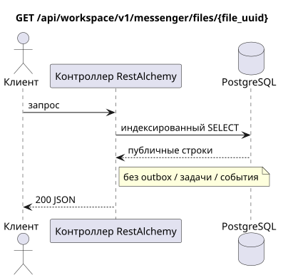

# `GET /api/workspace/v1/messenger/files/{file_uuid}`

[← Главный индекс документации](../../../../index.md) · [Индекс диаграмм последовательностей](../../README.md) · [Раздел контента и пользователей Workspace](../README.md)

Статус: целевая спецификация операции, разработанная сначала в документации. Текущий публичный контракт
остаётся без изменений и является нормативным в [`workspace_api.md`](../../../../workspace_api.md).
Этот файл описывает целевые границы транзакций и проекций; это не
производственный код, миграции SQL или новая конечная точка.



[Редактируемый исходник PlantUML](diagrams/get_file.puml)

## Назначение и публичный контракт

Получить одну видимую запись метаданных файла.

Аутентификация: токен Bearer IAM; `project_id` и текущий `user_uuid` берутся из контекста IAM.

## Путь и параметры запроса

| Расположение | Имя | Тип / правило |
| --- | --- | --- |
| путь | `file_uuid` | UUID |

Пагинация коллекций, где она предусмотрена, сохраняет текущий контракт `page_limit` и UUID
`page_marker` и возвращает `X-Pagination-Limit`, а также
`X-Pagination-Marker` только при наличии следующей страницы.

## Тело запроса

Тело запроса отсутствует.

## Успешный ответ

`200`

```json
{
  "uuid": "f11353e0-712d-4b99-a716-5cdba848cc05",
  "user_uuid": "11111111-1111-1111-1111-111111111111",
  "stream_uuid": "75309057-419c-4b12-a7c1-3932429ec4a6",
  "name": "example.txt",
  "description": "Example",
  "content_type": "text/plain",
  "size_bytes": 12,
  "hash": "abc",
  "created_at": "2026-07-17T08:00:00Z",
  "updated_at": "2026-07-17T08:00:00Z"
}
```


## Ошибки и авторизация

Неверные фильтры возвращают HTTP `400`; недоступный одиночный ресурс возвращается как не найден. Ошибки IAM проходят через общую границу ошибок аутентификации Workspace.

Общая форма ответа при ошибке валидации:

```json
{
  "type": "ValidationErrorException",
  "code": 400,
  "message": "Validation error occurred."
}
```

## Целевая граница RestAlchemy

```python
from restalchemy.api import controllers as ra_controllers
from restalchemy.api import resources as ra_resources
from restalchemy.dm import models
from restalchemy.dm import properties
from restalchemy.dm import types
from restalchemy.storage.sql import orm


class WorkspaceFile(models.ModelWithUUID, models.ModelWithProject,
                    models.ModelWithTimestamp, orm.SQLStorableMixin):
    # Contract boundary only; target storage decomposition is not selected.
    __tablename__ = "m_workspace_files"
    user_uuid = properties.property(types.UUID(), required=True, read_only=True)
    stream_uuid = properties.property(types.AllowNone(types.UUID()))
    name = properties.property(types.String(max_length=255), required=True)
    description = properties.property(types.String(max_length=255), default="")
    content_type = properties.property(types.String(max_length=255), required=True)
    size_bytes = properties.property(types.Integer(min_value=0), required=True)
    hash = properties.property(types.String(max_length=255), required=True)


class WorkspaceFileController(ra_controllers.BaseResourceControllerPaginated):
    __resource__ = ra_resources.ResourceByRAModel(
        model_class=WorkspaceFile,
        hidden_fields=["project_id"],
        convert_underscore=False,
        process_filters=True,
    )
    # Narrow multipart/storage/download overrides preserve the current contract.
```

Каждая публичная ссылка на сущность объявляется скалярным UUID-свойством RestAlchemy, а не `relationship` (которое сериализовалось бы как URI). Соответствующий физический столбец `*_uuid` — индексированный внешний ключ с явно выбранным ссылочным действием. Поэтому публичный JSON сохраняет UUID без изменений.

Текущий контракт метаданных/хранилища/ACL сохраняется; целевое физическое разбиение не выбрано. `project_id` остаётся скрытым. Скалярный `user_uuid` и допускающий `null` `stream_uuid` остаются публичными UUID-значениями, поддерживаемыми индексированными FK. Динамический доступ по членству в потоке проверяется по каноническим привязкам потока.

## Синхронный путь API

1. Выполнить аутентификацию.
2. Найти метаданные по UUID.
3. Проверить публичный ACL или текущую индексированную привязку потока.
4. Вернуть санитизированную строку метаданных.

## Outbox, типизированные задачи, воркер и работа в реальном времени

Это чтение не записывает доменное событие или запись outbox, не создаёт типизированную задачу проекции и не публикует публичное событие. Ресурсы на основе БД читаются по индексам без вычислений. Все счётчики уже материализованы; запрос не выполняет `COUNT`, `GROUP BY`, коррелированные подзапросы и не сканирует привязки сообщений.

Диспетчер WebSocket не участвует.

## Идемпотентность, ключи и гонки

Операцию безопасно повторять, поскольку она не изменяет состояние. Идентичность ресурса и область фильтров стабильны на время транзакции БД.

## Момент видимости для клиента

Клиент получает зафиксированное состояние, доступное на момент выполнения транзакции чтения; запрос не планирует новую отложенную работу.

[← Главный индекс документации](../../../../index.md) · [Индекс диаграмм последовательностей](../../README.md) · [Раздел контента и пользователей Workspace](../README.md)
