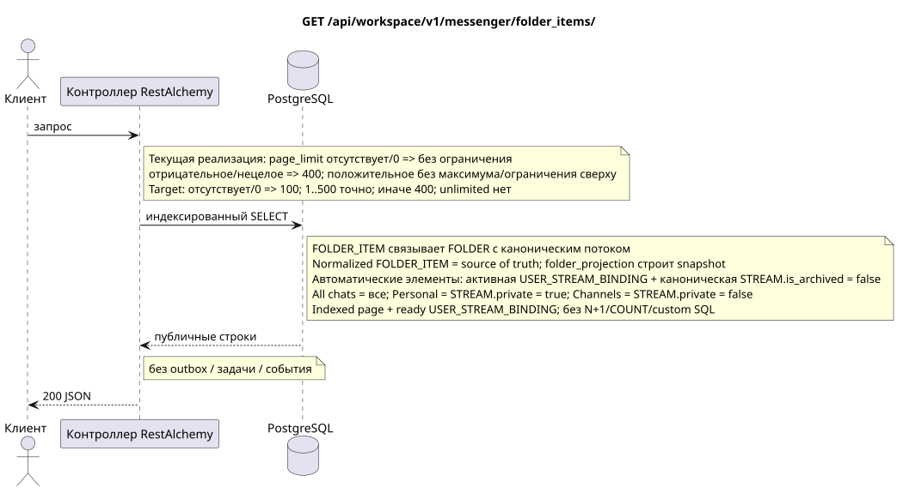

# `GET /api/workspace/v1/messenger/folder_items/`

[← Главный индекс документации](../../../../index.md) · [Индекс диаграмм последовательностей](../../README.md) · [Раздел контента и пользователей Workspace](../README.md)

Статус: целевая спецификация операции, разработанная сначала в документации. Текущий публичный контракт
остаётся без изменений и является нормативным в [`workspace_api.md`](../../../../workspace_api.md).
Этот файл описывает целевые границы транзакций и проекций; это не
производственный код, миграции SQL или новая конечная точка.



[Редактируемый исходник PlantUML](diagrams/get_folder_items_list.puml)

## Назначение и публичный контракт

Перечислить элементы папок текущего пользователя.

Аутентификация: токен Bearer IAM; `project_id` и текущий `user_uuid` берутся из контекста IAM.

## Путь и параметры запроса

| Расположение | Имя | Тип / правило |
| --- | --- | --- |
| запрос | `page_limit` | current: отсутствие/`0` означает unlimited; target: отсутствие/`0` => `100`, `1..500` точно, отрицательное/нецелое/`>500` => `400` без clamp |
| запрос | `page_marker` | UUID последнего ресурса предыдущей страницы |

Пагинация коллекций, где она предусмотрена, сохраняет текущий контракт `page_limit` и UUID
`page_marker` и возвращает `X-Pagination-Limit`, а также
`X-Pagination-Marker` только при наличии следующей страницы.

Target default — `100`, hard maximum — `500`; `0` также означает `100`, unbounded mode отсутствует. Имя параметра и публичная JSON-форма не меняются; клиенты полного экспорта читают до отсутствия следующего marker.

## Тело запроса

Тело запроса отсутствует.

## Успешный ответ

`200`

```json
[
  {
    "uuid": "9f41b1a7-77f9-4c12-bdc6-d3cebc5dbf50",
    "project_id": "22222222-2222-2222-2222-222222222222",
    "folder_uuid": "50ecadd0-9823-4d97-b54c-806cc672c210",
    "user_uuid": "11111111-1111-1111-1111-111111111111",
    "stream_uuid": "75309057-419c-4b12-a7c1-3932429ec4a6",
    "chat_type": "stream",
    "order_index": 10,
    "pinned_at": null,
    "unread_count": 3,
    "active_unread_count": 3,
    "passive_unread_count": 0,
    "created_at": "2026-06-22T09:30:00Z",
    "updated_at": "2026-06-22T09:30:00Z"
  }
]
```


## Ошибки и авторизация

Неверные фильтры возвращают HTTP `400`; недоступный одиночный ресурс возвращается как не найден. Ошибки IAM проходят через общую границу ошибок аутентификации Workspace.

Общая форма ответа при ошибке валидации:

```json
{
  "type": "ValidationErrorException",
  "code": 400,
  "message": "Validation error occurred."
}
```

## Целевая граница RestAlchemy

```python
from restalchemy.api import controllers as ra_controllers
from restalchemy.api import resources as ra_resources
from restalchemy.dm import models
from restalchemy.dm import properties
from restalchemy.dm import types
from restalchemy.storage.sql import orm


class WorkspaceFolderItem(models.ModelWithUUID, models.ModelWithProject,
                          models.ModelWithTimestamp, orm.SQLStorableMixin):
    __tablename__ = "messenger_folder_items"
    user_uuid = properties.property(types.UUID(), required=True, read_only=True)
    folder_uuid = properties.property(types.UUID(), required=True)
    stream_uuid = properties.property(types.UUID(), required=True)
    chat_type = properties.property(types.Enum(["stream", "group", "private"]), required=True)
    order_index = properties.property(types.AllowNone(types.Integer()))
    pinned_at = properties.property(types.AllowNone(types.UTCDateTimeZ()), read_only=True)


class WorkspaceUserFolderItem(models.ModelWithTimestamp, orm.SQLStorableMixin):
    __tablename__ = "messenger_api_user_folder_items_v1"
    uuid = properties.property(types.UUID(), id_property=True, read_only=True)
    project_id = properties.property(types.UUID(), read_only=True)
    user_uuid = properties.property(types.UUID(), read_only=True)
    folder_uuid = properties.property(types.UUID(), read_only=True)
    stream_uuid = properties.property(types.UUID(), read_only=True)
    chat_type = properties.property(
        types.Enum(["stream", "group", "private"]), read_only=True,
    )
    order_index = properties.property(types.AllowNone(types.Integer()))
    pinned_at = properties.property(types.AllowNone(types.UTCDateTimeZ()), read_only=True)
    # Ready fields are joined from unique USER_STREAM_BINDING. They are not
    # stored on WorkspaceFolderItem and are never calculated on API reads.
    unread_count = properties.property(types.Integer(min_value=0), read_only=True)
    active_unread_count = properties.property(types.Integer(min_value=0), read_only=True)
    passive_unread_count = properties.property(types.Integer(min_value=0), read_only=True)


class FolderItemController(ra_controllers.BaseResourceControllerPaginated):
    __resource__ = ra_resources.ResourceByRAModel(
        model_class=WorkspaceUserFolderItem,
        convert_underscore=False,
        process_filters=True,
    )
    # Writes use WorkspaceFolderItem; reads use the calculation-free view.
```

Каждая публичная ссылка на сущность объявляется скалярным UUID-свойством RestAlchemy, а не `relationship` (которое сериализовалось бы как URI). Соответствующий физический столбец `*_uuid` — индексированный внешний ключ с явно выбранным ссылочным действием. Поэтому публичный JSON сохраняет UUID без изменений.

Физический элемент имеет индексированные FK `folder_uuid`, `stream_uuid` и `user_uuid` с `ON DELETE CASCADE`. Его публичные UUID-ссылки остаются скалярными. Три поля непрочитанного копируются простым индексированным соединением из уникальной `USER_STREAM_BINDING` по `(project_id,user_uuid,stream_uuid)`; они никогда не хранятся в привязке сообщения и не подсчитываются в этом запросе.

Канонический `FOLDER_ITEM` связывает `FOLDER` с поддерживаемым каноническим
объектом (в текущем контракте — поток), не копируя его. Для системных папок
автоматические элементы — восстанавливаемая материализованная проекция:
создание/обновление/удаление `USER_STREAM_BINDING` проходит через
транзакционный outbox и отдельную immutable task с уникальным `outbox_event_uuid`, после чего воркер
идемпотентно материализует активные `USER_STREAM_BINDING`, соединённые с
канонической `STREAM` с `is_archived = false`: `All chats` включает все такие
доступные потоки, `Personal` — только потоки с `STREAM.private = true`,
`Channels` — только с `STREAM.private = false`. Воркер также обновляет готовые
агрегаты `unread_count`/`mention_count` в `USER_FOLDER_BINDING`. Этот GET
выполняет только простые индексированные соединения без `COUNT` во время
запроса.

## Синхронный путь API

1. Проверить область IAM.
2. Выполнить индексированное чтение ресурса.
3. Сериализовать неизменённый публичный JSON.

## Outbox, типизированные задачи, воркер и работа в реальном времени

Это чтение не записывает доменное событие или запись outbox, не создаёт типизированную задачу проекции и не публикует публичное событие. Ресурсы на основе БД читаются по индексам без вычислений. Все счётчики уже материализованы; запрос не выполняет `COUNT`, `GROUP BY`, коррелированные подзапросы и не сканирует привязки сообщений.
Страница items читает normalized `FOLDER_ITEM` и по одному
индексированному many-to-one join берёт готовые счётчики из
`USER_STREAM_BINDING`. Здесь нет N+1 и custom SQL. Эти же normalized rows
являются source of truth для read-only `folder_items_snapshot`; этот GET не
исправляет и не перестраивает его; это делает только `folder_projection`.

Диспетчер WebSocket не участвует.

## Идемпотентность, ключи и гонки

Операцию безопасно повторять, поскольку она не изменяет состояние. Идентичность ресурса и область фильтров стабильны на время транзакции БД.

## Момент видимости для клиента

Клиент получает зафиксированное состояние, доступное на момент выполнения транзакции чтения; запрос не планирует новую отложенную работу.

[← Главный индекс документации](../../../../index.md) · [Индекс диаграмм последовательностей](../../README.md) · [Раздел контента и пользователей Workspace](../README.md)
