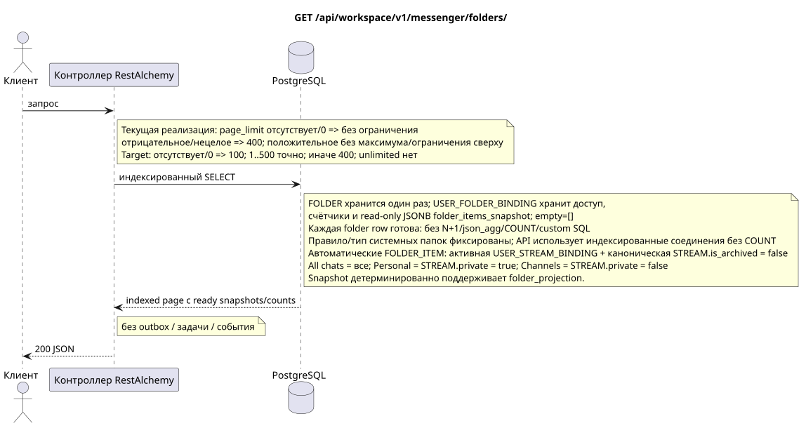

# `GET /api/workspace/v1/messenger/folders/`

[← Главный индекс документации](../../../../index.md) · [Индекс диаграмм последовательностей](../../README.md) · [Раздел контента и пользователей Workspace](../README.md)

Статус: целевая спецификация операции, разработанная сначала в документации. Текущий публичный контракт
остаётся без изменений и является нормативным в [`workspace_api.md`](../../../../workspace_api.md).
Этот файл описывает целевые границы транзакций и проекций; это не
производственный код, миграции SQL или новая конечная точка.



[Редактируемый исходник PlantUML](diagrams/get_folders_list.puml)

## Назначение и публичный контракт

Перечислить папки, видимые текущему пользователю IAM.

Аутентификация: токен Bearer IAM; `project_id` и текущий `user_uuid` берутся из контекста IAM.

## Путь и параметры запроса

| Расположение | Имя | Тип / правило |
| --- | --- | --- |
| запрос | `page_limit` | current: отсутствие/`0` означает unlimited; target: отсутствие/`0` => `100`, `1..500` точно, отрицательное/нецелое/`>500` => `400` без clamp |
| запрос | `page_marker` | UUID последнего ресурса предыдущей страницы |

Пагинация коллекций, где она предусмотрена, сохраняет текущий контракт `page_limit` и UUID
`page_marker` и возвращает `X-Pagination-Limit`, а также
`X-Pagination-Marker` только при наличии следующей страницы.

Target default — `100`, hard maximum — `500`; `0` также означает `100`, unbounded mode отсутствует. Имя параметра и публичная JSON-форма не меняются; клиенты полного экспорта читают до отсутствия следующего marker.

## Тело запроса

Тело запроса отсутствует.

## Успешный ответ

`200`

```json
[
  {
    "uuid": "50ecadd0-9823-4d97-b54c-806cc672c210",
    "title": "Inbox",
    "background_color_value": 4280391411,
    "unread_count": 3,
    "system_type": "created",
    "folder_items": [
      {
        "uuid": "9f41b1a7-77f9-4c12-bdc6-d3cebc5dbf50",
        "project_id": "22222222-2222-2222-2222-222222222222",
        "folder_uuid": "50ecadd0-9823-4d97-b54c-806cc672c210",
        "user_uuid": "11111111-1111-1111-1111-111111111111",
        "stream_uuid": "75309057-419c-4b12-a7c1-3932429ec4a6",
        "chat_type": "stream",
        "order_index": 10,
        "pinned_at": null,
        "unread_count": 3,
        "active_unread_count": 3,
        "passive_unread_count": 0,
        "created_at": "2026-06-22T09:30:00Z",
        "updated_at": "2026-06-22T09:30:00Z"
      }
    ],
    "created_at": "2026-06-22T09:30:00Z",
    "updated_at": "2026-06-22T09:30:00Z"
  }
]
```


## Ошибки и авторизация

Неверные фильтры возвращают HTTP `400`; недоступный одиночный ресурс возвращается как не найден. Ошибки IAM проходят через общую границу ошибок аутентификации Workspace.

Общая форма ответа при ошибке валидации:

```json
{
  "type": "ValidationErrorException",
  "code": 400,
  "message": "Validation error occurred."
}
```

## Целевая граница RestAlchemy

```python
from restalchemy.api import controllers as ra_controllers
from restalchemy.api import resources as ra_resources
from restalchemy.dm import models
from restalchemy.dm import properties
from restalchemy.dm import types
from restalchemy.storage.sql import orm


class WorkspaceFolder(models.ModelWithUUID, models.ModelWithProject,
                      models.ModelWithTimestamp, orm.SQLStorableMixin):
    __tablename__ = "messenger_folders"
    title = properties.property(types.String(min_length=1, max_length=64), required=True)
    background_color_value = properties.property(types.AllowNone(types.Integer()))


class WorkspaceUserFolderBinding(models.ModelWithUUID, models.ModelWithProject,
                                 models.ModelWithTimestamp, orm.SQLStorableMixin):
    __tablename__ = "messenger_user_folder_bindings"
    # Public UUID links are scalar UUID properties, never URI relationships.
    user_uuid = properties.property(types.UUID(), required=True, read_only=True)
    folder_uuid = properties.property(types.UUID(), required=True, read_only=True)
    unread_count = properties.property(types.Integer(min_value=0), default=0, read_only=True)
    mention_count = properties.property(types.Integer(min_value=0), default=0, read_only=True)
    folder_items_snapshot = properties.property(types.List(), default=list, read_only=True)
    folder_items_snapshot_version = properties.property(types.Integer(min_value=0), default=0, read_only=True)
    folder_items_snapshot_updated_at = properties.property(types.AllowNone(types.UTCDateTimeZ()), read_only=True)
    BUSINESS_KEY = ("project_id", "user_uuid", "folder_uuid")


class WorkspaceUserFolder(models.ModelWithTimestamp, orm.SQLStorableMixin):
    __tablename__ = "messenger_api_user_folders_v1"
    binding_uuid = properties.property(types.UUID(), id_property=True, read_only=True)
    uuid = properties.property(types.UUID(), read_only=True)
    title = properties.property(types.String(min_length=1, max_length=64))
    background_color_value = properties.property(types.AllowNone(types.Integer()))
    unread_count = properties.property(types.Integer(min_value=0), read_only=True)
    system_type = properties.property(types.AllowNone(types.Enum(["all", "created"])), read_only=True)
    folder_items = properties.property(types.List(), read_only=True)


class FolderController(ra_controllers.BaseResourceControllerPaginated):
    __resource__ = ra_resources.ResourceByRAModel(
        model_class=WorkspaceUserFolder,
        hidden_fields=["binding_uuid", "project_id", "user_uuid"],
        convert_underscore=False,
        process_filters=True,
    )
```

Каждая публичная ссылка на сущность объявляется скалярным UUID-свойством RestAlchemy, а не `relationship` (которое сериализовалось бы как URI). Соответствующий физический столбец `*_uuid` — индексированный внешний ключ с явно выбранным ссылочным действием. Поэтому публичный JSON сохраняет UUID без изменений.

Список читает по одной индексированной `WorkspaceUserFolderBinding` на папку и одной канонической `WorkspaceFolder`. Публичное `folder_items` напрямую берётся из read-only JSONB `folder_items_snapshot` (`[]` для пустой папки). На странице нет N+1, `json_agg`, `COUNT`, подзапросов и custom SQL. Нормализованные `FOLDER_ITEM` остаются source of truth; снимок и готовые счётчики материализует `folder_projection`.

Системная папка — это `USER_FOLDER_BINDING` с фиксированными правилом/типом: её
нельзя удалить или вручную перевести на другое правило. Автоматические
`FOLDER_ITEM` — восстанавливаемая материализованная проекция. Воркер
идемпотентно поддерживает её из активных `USER_STREAM_BINDING` и канонических
`STREAM` с `is_archived = false`: `All chats` («Все чаты») включает все такие
доступные потоки, `Personal` («Персональные») — только потоки с
`STREAM.private = true`, `Channels` («Каналы») — только с
`STREAM.private = false`. API читает их только простыми индексированными
соединениями; публичный контракт и набор действий не меняются.

## Синхронный путь API

1. Проверить область IAM.
2. Выполнить индексированное чтение ресурса.
3. Сериализовать неизменённый публичный JSON.

## Outbox, типизированные задачи, воркер и работа в реальном времени

Это чтение не записывает outbox и не создаёт task. Каждая строка страницы
уже содержит ready counts и read-only `folder_items_snapshot`; пустая папка
возвращает `[]`. Стандартный RestAlchemy resource не выполняет N+1,
`json_agg`, `COUNT`, `GROUP BY`, коррелированные подзапросы или custom SQL; GET не
исправляет snapshots.

Диспетчер WebSocket не участвует.

## Идемпотентность, ключи и гонки

Операцию безопасно повторять, поскольку она не изменяет состояние. Идентичность ресурса и область фильтров стабильны на время транзакции БД.

## Момент видимости для клиента

Клиент получает зафиксированное состояние, доступное на момент выполнения транзакции чтения; запрос не планирует новую отложенную работу.

[← Главный индекс документации](../../../../index.md) · [Индекс диаграмм последовательностей](../../README.md) · [Раздел контента и пользователей Workspace](../README.md)
