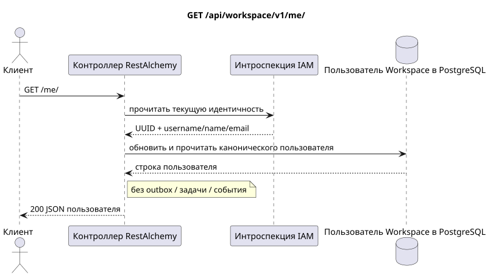

# `GET /api/workspace/v1/me/`

[← Главный индекс документации](../../../../index.md) · [Индекс диаграмм последовательностей](../../README.md) · [Раздел контента и пользователей Workspace](../README.md)

Статус: целевая спецификация операции, разработанная сначала в документации. Текущий публичный контракт
остаётся без изменений и является нормативным в [`workspace_api.md`](../../../../workspace_api.md).
Этот файл описывает целевые границы транзакций и проекций; это не
производственный код, миграции SQL или новая конечная точка.



[Редактируемый исходник PlantUML](diagrams/get_me.puml)

## Назначение и публичный контракт

Вернуть текущего аутентифицированного пользователя Workspace без UUID, переданного клиентом.

Аутентификация: токен Bearer IAM; `project_id` и текущий `user_uuid` берутся из контекста IAM.

## Путь и параметры запроса

Параметры пути и запроса не принимаются.

Пагинация коллекций, где она предусмотрена, сохраняет текущий контракт `page_limit` и UUID
`page_marker` и возвращает `X-Pagination-Limit`, а также
`X-Pagination-Marker` только при наличии следующей страницы.

## Тело запроса

Тело запроса отсутствует.

## Успешный ответ

`200`

```json
{
  "uuid": "11111111-1111-1111-1111-111111111111",
  "username": "admin",
  "source": "iam",
  "status": "active",
  "status_emoji": "coffee",
  "status_text": "Focusing",
  "first_name": "Workspace",
  "last_name": "Administrator",
  "email": "admin@example.com",
  "avatar": "urn:gravatar:0123456789abcdef0123456789abcdef",
  "last_ping_at": "2026-07-17T08:00:00Z",
  "created_at": "2026-07-01T08:00:00Z",
  "updated_at": "2026-07-17T08:00:00Z"
}
```


## Ошибки и авторизация

Отсутствующая/неверная идентичность IAM обрабатывается общей границей аутентификации/ошибок. Клиент не может выбрать другой UUID на этом маршруте.

Общая форма ответа при ошибке валидации:

```json
{
  "type": "ValidationErrorException",
  "code": 400,
  "message": "Validation error occurred."
}
```

## Целевая граница RestAlchemy

```python
from restalchemy.api import controllers as ra_controllers
from restalchemy.api import resources as ra_resources
from restalchemy.dm import models
from restalchemy.dm import properties
from restalchemy.dm import types
from restalchemy.storage.sql import orm


class WorkspaceUser(models.ModelWithUUID, models.ModelWithTimestamp,
                    orm.SQLStorableMixin):
    __tablename__ = "messenger_users"
    username = properties.property(types.String(min_length=1, max_length=128), required=True)
    source = properties.property(types.Enum(["iam", "zulip"]), default="iam")
    status = properties.property(types.Enum(["active", "idle", "offline", "do_not_disturb"]))
    status_emoji = properties.property(types.AllowNone(types.String(max_length=64)))
    status_text = properties.property(types.AllowNone(types.String(max_length=256)))
    avatar = properties.property(types.String(max_length=2048), required=True)


class WorkspaceUserController(ra_controllers.BaseResourceControllerPaginated):
    __resource__ = ra_resources.ResourceByRAModel(
        model_class=WorkspaceUser,
        convert_underscore=False,
        process_filters=True,
    )
    # Narrow own-user IAM refresh and presence/avatar actions preserve the API.
```

Каждая публичная ссылка на сущность объявляется скалярным UUID-свойством RestAlchemy, а не `relationship` (которое сериализовалось бы как URI). Соответствующий физический столбец `*_uuid` — индексированный внешний ключ с явно выбранным ссылочным действием. Поэтому публичный JSON сохраняет UUID без изменений.

`WorkspaceUser` — каноническая сущность в единственном экземпляре. Публичные UUID-подобные ссылки провайдера остаются скалярными полями в санитизированном контейнере провайдера; физические ссылки — индексированные FK. Поля идентичности, принадлежащие IAM, доступны запросам браузера только для чтения.

## Синхронный путь API

1. Получить текущие UUID и проект из контекста IAM.
2. Синхронно обновить проекцию username/name/email из IAM.
3. Прочитать канонического пользователя Workspace.
4. Вернуть ту же публичную форму, что и `GET /users/{user_uuid}`. Этот GET не создаёт публичных записей outbox, задач или событий.

## Outbox, типизированные задачи, воркер и работа в реальном времени

Это чтение не записывает доменное событие или запись outbox, не создаёт типизированную задачу проекции и не публикует публичное событие. Ресурсы на основе БД читаются по индексам без вычислений. Все счётчики уже материализованы; запрос не выполняет `COUNT`, `GROUP BY`, коррелированные подзапросы и не сканирует привязки сообщений.

Диспетчер WebSocket не участвует.

## Идемпотентность, ключи и гонки

Операцию безопасно повторять, поскольку она не изменяет состояние. Идентичность ресурса и область фильтров стабильны на время транзакции БД.

## Момент видимости для клиента

Клиент получает зафиксированное состояние, доступное на момент выполнения транзакции чтения; запрос не планирует новую отложенную работу.

[← Главный индекс документации](../../../../index.md) · [Индекс диаграмм последовательностей](../../README.md) · [Раздел контента и пользователей Workspace](../README.md)
