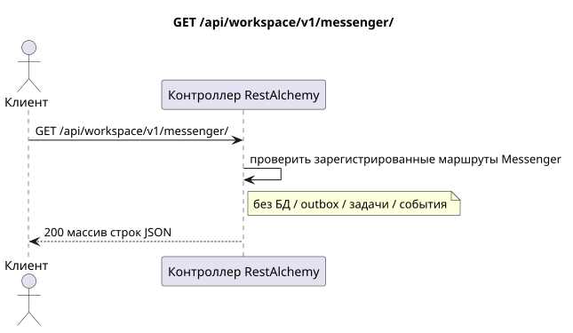

# `GET /api/workspace/v1/messenger/`

[← Главный индекс документации](../../../../index.md) · [Индекс диаграмм последовательностей](../../README.md) · [Раздел контента и пользователей Workspace](../README.md)

Статус: целевая спецификация операции, разработанная сначала в документации. Текущий публичный контракт
остаётся без изменений и является нормативным в [`workspace_api.md`](../../../../workspace_api.md).
Этот файл описывает целевые границы транзакций и проекций; это не
производственный код, миграции SQL или новая конечная точка.



[Редактируемый исходник PlantUML](diagrams/get_messenger_routes_index.puml)

## Назначение и публичный контракт

Перечислить текущие имена маршрутов коллекций непосредственно под корнем Messenger v1.

Аутентификация: токен Bearer IAM; `project_id` и текущий `user_uuid` берутся из контекста IAM.

## Путь и параметры запроса

Параметры пути и запроса не принимаются.

Пагинация коллекций, где она предусмотрена, сохраняет текущий контракт `page_limit` и UUID
`page_marker` и возвращает `X-Pagination-Limit`, а также
`X-Pagination-Marker` только при наличии следующей страницы.

## Тело запроса

Тело запроса отсутствует.

## Успешный ответ

`200`

```json
[
  "drafts",
  "external_accounts",
  "external_bridge_instances",
  "external_chats",
  "external_operations",
  "external_provider_health",
  "external_provider_policies",
  "files",
  "folder_items",
  "folders",
  "message_reactions",
  "messages",
  "stream_bindings",
  "stream_topics",
  "streams",
  "topic_summary_endpoints",
  "topic_summary_settings"
]
```


## Ошибки и авторизация

Ошибки аутентификации IAM обрабатываются общей границей ошибок Workspace. Для этого списка маршрутов времени исполнения нет случая «ресурс не найден», и он не принимает функциональные фильтры.

Общая форма ответа при ошибке валидации:

```json
{
  "type": "ValidationErrorException",
  "code": 400,
  "message": "Validation error occurred."
}
```

## Целевая граница RestAlchemy

```python
from restalchemy.api import controllers as ra_controllers


class WorkspaceApiEndpointController(ra_controllers.RoutesListController):
    __TARGET_PATH__ = "/v1/"


class MessengerApiEndpointController(ra_controllers.RoutesListController):
    __TARGET_PATH__ = "/v1/messenger/"
```

Для этого ответа маршрутизации/промежуточного ПО нет доменной модели или физического внешнего ключа.

`RoutesListController` проверяет статическое дерево маршрутов; его список строк времени исполнения — публичная граница индекса маршрутов, а не модель доменного ресурса.

## Синхронный путь API

1. Аутентифицировать запрос.
2. Проверить в памяти зарегистрированное дерево маршрутов Messenger.
3. Вернуть упорядоченные имена маршрутов коллекций. Транзакция БД не требуется.

## Outbox, типизированные задачи, воркер и работа в реальном времени

Это чтение не записывает доменное событие или запись outbox, не создаёт типизированную задачу проекции и не публикует публичное событие. Ресурсы на основе БД читаются по индексам без вычислений. Все счётчики уже материализованы; запрос не выполняет `COUNT`, `GROUP BY`, коррелированные подзапросы и не сканирует привязки сообщений.

Диспетчер WebSocket не участвует.

## Идемпотентность, ключи и гонки

Операцию безопасно повторять, поскольку она не изменяет состояние. Идентичность ресурса и область фильтров стабильны на время транзакции БД.

## Момент видимости для клиента

Клиент получает зафиксированное состояние, доступное на момент выполнения транзакции чтения; запрос не планирует новую отложенную работу.

[← Главный индекс документации](../../../../index.md) · [Индекс диаграмм последовательностей](../../README.md) · [Раздел контента и пользователей Workspace](../README.md)
