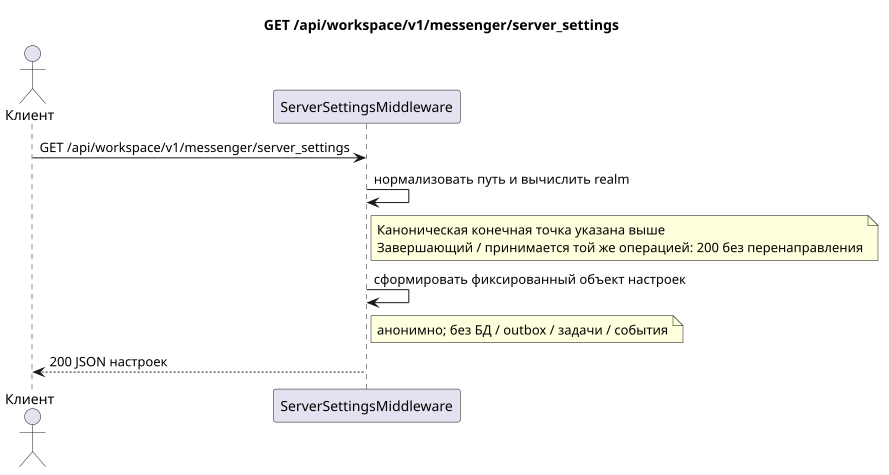

# `GET /api/workspace/v1/messenger/server_settings`

[← Главный индекс документации](../../../../index.md) · [Индекс диаграмм последовательностей](../../README.md) · [Раздел контента и пользователей Workspace](../README.md)

Статус: целевая спецификация операции, разработанная сначала в документации. Текущий публичный контракт
остаётся без изменений и является нормативным в [`workspace_api.md`](../../../../workspace_api.md).
Этот файл описывает целевые границы транзакций и проекций; это не
производственный код, миграции SQL или новая конечная точка.



[Редактируемый исходник PlantUML](diagrams/get_server_settings.puml)

## Назначение и публичный контракт

Вернуть анонимный Zulip-совместимый объект обнаружения сервера (server discovery). Единственная
каноническая операция — `GET /api/workspace/v1/messenger/server_settings`.
Запрос к тому же пути с завершающим `/` принимает то же промежуточное ПО и возвращает
тот же `200` без перенаправления; это поведение одной операции, а не второй маршрут.

Аутентификация не требуется; это единственная конечная точка Workspace без аутентификации, которую использует UI.

## Путь и параметры запроса

| Расположение | Имя | Тип / правило |
| --- | --- | --- |
| запрос | `any unsupported name` | принимаются, но игнорируются; отсортированные имена появляются в `ignored_parameters_unsupported` |

## Тело запроса

Тело запроса отсутствует.

## Успешный ответ

`200`

```json
{
  "result": "success",
  "msg": "Welcome to Exordos Workspace",
  "authentication_methods": {
    "password": true,
    "dev": false,
    "email": true,
    "ldap": false,
    "remoteuser": false,
    "github": false,
    "azuread": false,
    "gitlab": false,
    "google": false,
    "apple": false,
    "saml": false,
    "openid connect": false
  },
  "push_notifications_enabled": true,
  "email_auth_enabled": true,
  "require_email_format_usernames": true,
  "realm_url": "https://workspace.example.com",
  "realm_name": "Exordos Workspace",
  "realm_icon": "urn:url:https://workspace.example.com/logo-512x512.png",
  "realm_description": "<p>Exordos Workspace messenger.</p>",
  "realm_web_public_access_enabled": false,
  "meet_url": "https://meet.genesis-core.tech",
  "external_authentication_methods": [],
  "realm_uri": "https://workspace.example.com"
}
```


## Ошибки и авторизация

Промежуточное ПО возвращает `200` как для канонического пути, так и для того же пути с завершающим `/`, без перенаправления: оба варианта нормализуются через `rstrip("/")` и обрабатываются одной операцией. Неподдерживаемые параметры запроса не приводят к ошибке; их имена возвращаются в ответе. Нормализация заголовка `Host` и прокси следует документированной границе обратного прокси.

Общая форма ответа при ошибке валидации:

```json
{
  "type": "ValidationErrorException",
  "code": 400,
  "message": "Validation error occurred."
}
```

## Целевая граница RestAlchemy

```python
# Middleware endpoint: it deliberately has no RestAlchemy resource/model.
class ServerSettingsMiddleware:
    PATH = "/v1/server_settings"

    def process_request(self, request):
        # Returns the fixed public discovery object for both slash forms.
        ...
```

Для этого ответа маршрутизации/промежуточного ПО нет доменной модели или физического внешнего ключа.

URL realm формируются из `Host` и доверенного `X-Forwarded-Proto`; это промежуточное ПО должно оставаться вне маршрутизатора ресурсов RestAlchemy.

## Синхронный путь API

1. Нормализовать завершающий слеш.
2. Вычислить публичный URL realm из доверенных заголовков запроса.
3. Сформировать и вернуть фиксированный discovery-объект. Транзакция БД не создаётся.

## Outbox, типизированные задачи, воркер и работа в реальном времени

Это чтение не записывает доменное событие или запись outbox, не создаёт типизированную задачу проекции и не публикует публичное событие. Ресурсы на основе БД читаются по индексам без вычислений. Все счётчики уже материализованы; запрос не выполняет `COUNT`, `GROUP BY`, коррелированные подзапросы и не сканирует привязки сообщений.

Диспетчер WebSocket не участвует.

## Идемпотентность, ключи и гонки

Операцию безопасно повторять, поскольку она не изменяет состояние. Идентичность ресурса и область фильтров стабильны на время транзакции БД.

## Момент видимости для клиента

Клиент получает зафиксированное состояние, доступное на момент выполнения транзакции чтения; запрос не планирует новую отложенную работу.

[← Главный индекс документации](../../../../index.md) · [Индекс диаграмм последовательностей](../../README.md) · [Раздел контента и пользователей Workspace](../README.md)
