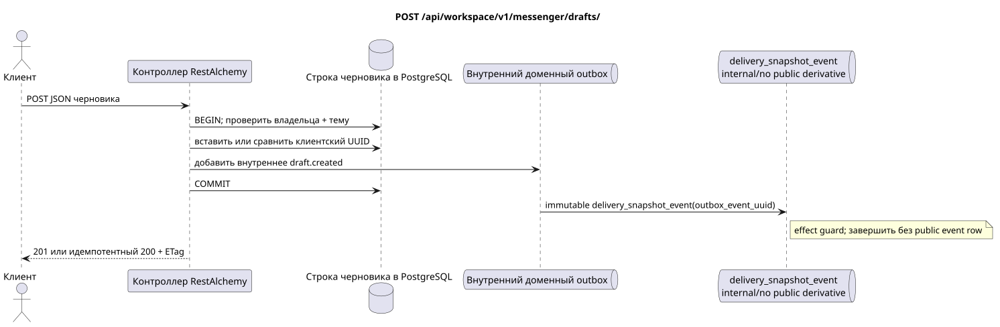

# `POST /api/workspace/v1/messenger/drafts/`


Общий target-инвариант надёжности: каждое immutable outbox event выводит ровно одну immutable typed task с уникальным `outbox_event_uuid`; coalescing отсутствует. Task хранит фактический exact scope key, использует lease/fencing, retry/backoff, max attempts/DLQ, reaper и идемпотентный effect guard. Topic scope применяется только к placement/message-binding work; shared rows не получают неявный fallback на topic.

[← Главный индекс документации](../../../../index.md) · [Индекс диаграмм последовательностей](../../README.md) · [Раздел контента и пользователей Workspace](../README.md)

Статус: целевая спецификация операции, разработанная сначала в документации. Текущий публичный контракт
остаётся без изменений и является нормативным в [`workspace_api.md`](../../../../workspace_api.md).
Этот файл описывает целевые границы транзакций и проекций; это не
производственный код, миграции SQL или новая конечная точка.



[Редактируемый исходник PlantUML](diagrams/post_drafts_create.puml)

## Назначение и публичный контракт

Создать черновик владельца, используя созданный клиентом UUID как ключ идемпотентности.

Аутентификация: токен Bearer IAM; `project_id` и текущий `user_uuid` берутся из контекста IAM.

## Путь и параметры запроса

Параметры пути и запроса не принимаются.

Пагинация коллекций, где она предусмотрена, сохраняет текущий контракт `page_limit` и UUID
`page_marker` и возвращает `X-Pagination-Limit`, а также
`X-Pagination-Marker` только при наличии следующей страницы.

## Тело запроса

```json
{
  "uuid": "ca14d274-0057-4a9a-a34b-fb1174be6a17",
  "stream_uuid": "75309057-419c-4b12-a7c1-3932429ec4a6",
  "topic_uuid": "4ec0b996-b778-45f8-8ef4-ef863be0c047",
  "payload": {
    "kind": "markdown",
    "content": "Draft message"
  }
}
```

## Успешный ответ

`201` для новой строки или `200`

```json
{
  "uuid": "ca14d274-0057-4a9a-a34b-fb1174be6a17",
  "project_id": "22222222-2222-2222-2222-222222222222",
  "user_uuid": "11111111-1111-1111-1111-111111111111",
  "stream_uuid": "75309057-419c-4b12-a7c1-3932429ec4a6",
  "topic_uuid": "4ec0b996-b778-45f8-8ef4-ef863be0c047",
  "payload": {
    "kind": "markdown",
    "content": "Draft message"
  },
  "revision": 1,
  "created_at": "2026-07-17T08:00:00Z",
  "updated_at": "2026-07-17T08:00:00Z"
}
```

Заголовок ответа: `ETag: "1"`.

## Ошибки и авторизация

Отсутствующие/лишние поля или неверный Markdown возвращают `400`. Повторное использование UUID с другими каноническими полями создания возвращает `409`; точное тело ошибки содержит строку `message`. Недоступная область потока/темы не раскрывается.

Общая форма ответа при ошибке валидации:

```json
{
  "type": "ValidationErrorException",
  "code": 400,
  "message": "Validation error occurred."
}
```

## Целевая граница RestAlchemy

```python
from restalchemy.api import controllers as ra_controllers
from restalchemy.api import resources as ra_resources
from restalchemy.dm import models
from restalchemy.dm import properties
from restalchemy.dm import types
from restalchemy.storage.sql import orm


class WorkspaceDraft(models.ModelWithUUID, models.ModelWithProject,
                     models.ModelWithTimestamp, orm.SQLStorableMixin):
    # Contract boundary only; target physical naming/decomposition is not selected.
    __tablename__ = "m_workspace_drafts"
    user_uuid = properties.property(types.UUID(), required=True, read_only=True)
    stream_uuid = properties.property(types.UUID(), required=True, read_only=True)
    topic_uuid = properties.property(types.UUID(), required=True, read_only=True)
    payload = properties.property(types.Dict(), required=True)
    revision = properties.property(types.Integer(min_value=1), read_only=True)


class WorkspaceDraftController(ra_controllers.BaseResourceControllerPaginated):
    __resource__ = ra_resources.ResourceByRAModel(
        model_class=WorkspaceDraft,
        convert_underscore=False,
        process_filters=True,
    )
    # Narrow overrides preserve owner scope, keyset marker, ETag and If-Match.
```

Каждая публичная ссылка на сущность объявляется скалярным UUID-свойством RestAlchemy, а не `relationship` (которое сериализовалось бы как URI). Соответствующий физический столбец `*_uuid` — индексированный внешний ключ с явно выбранным ссылочным действием. Поэтому публичный JSON сохраняет UUID без изменений.

Целевая внутренняя модель черновиков здесь намеренно не перерабатывается. Объявление фиксирует неизменную скалярную границу UUID/ETag. Физические UUID-столбцы пользователя/потока/темы остаются индексированными FK с каскадным поведением из текущего контракта; отношения RestAlchemy не должны менять публичный UUID JSON.

## Синхронный путь API

1. Проверить точный набор полей создания и непустой Markdown длиной до 40 000 символов.
2. Проверить членство владельца и принадлежность темы потоку.
3. Вставить по клиентскому UUID либо сравнить существующую строку владельца для точного идемпотентного повтора.
4. Добавить в outbox внутреннюю неизменяемую доменную запись черновика без публичной производной.
5. Зафиксировать транзакцию и вернуть строку со строгим ETag.

## Outbox, типизированные задачи, воркер и работа в реальном времени

Создание черновика не затрагивает сообщения, реакции, счётчики непрочитанного или ссылки на файлы.

Внутреннее immutable outbox-событие выводит одну `delivery_snapshot_event`,
которая идемпотентно фиксирует отсутствие публичной производной и завершается;
готовая Workspace event row и WebSocket-доставка не создаются.

## Идемпотентность, ключи и гонки

Клиентский UUID — ключ идемпотентности: идентичный повтор возвращает существующий черновик (`200`), отличающееся повторное использование — `409`. Уникальный UUID вместе с областью владельца/проекта предотвращает дубли строк.

## Момент видимости для клиента

Клиент-инициатор немедленно видит зафиксированный черновик. Другие клиенты увидят его только после перезагрузки или явного повторного запроса черновиков; отправляемого обновления с согласованностью в конечном счёте нет.

[← Главный индекс документации](../../../../index.md) · [Индекс диаграмм последовательностей](../../README.md) · [Раздел контента и пользователей Workspace](../README.md)
