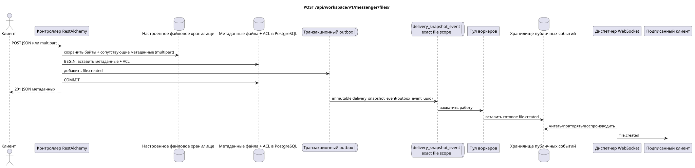

# `POST /api/workspace/v1/messenger/files/`


Общий target-инвариант надёжности: каждое immutable outbox event выводит ровно одну immutable typed task с уникальным `outbox_event_uuid`; coalescing отсутствует. Task хранит фактический exact scope key, использует lease/fencing, retry/backoff, max attempts/DLQ, reaper и идемпотентный effect guard. Topic scope применяется только к placement/message-binding work; shared rows не получают неявный fallback на topic.

[← Главный индекс документации](../../../../index.md) · [Индекс диаграмм последовательностей](../../README.md) · [Раздел контента и пользователей Workspace](../README.md)

Статус: целевая спецификация операции, разработанная сначала в документации. Текущий публичный контракт
остаётся без изменений и является нормативным в [`workspace_api.md`](../../../../workspace_api.md).
Этот файл описывает целевые границы транзакций и проекций; это не
производственный код, миграции SQL или новая конечная точка.



[Редактируемый исходник PlantUML](diagrams/post_files_create.puml)

## Назначение и публичный контракт

Создать метаданные из JSON или загрузить байты через multipart form data.

Аутентификация: токен Bearer IAM; `project_id` и текущий `user_uuid` берутся из контекста IAM.

## Путь и параметры запроса

Параметры пути и запроса не принимаются.

Пагинация коллекций, где она предусмотрена, сохраняет текущий контракт `page_limit` и UUID
`page_marker` и возвращает `X-Pagination-Limit`, а также
`X-Pagination-Marker` только при наличии следующей страницы.

## Тело запроса

Эта операция использует `multipart/form-data`, а не тело JSON.

Принимаются ровно два режима запроса. Режим JSON-метаданных:

```json
{
  "stream_uuid": "75309057-419c-4b12-a7c1-3932429ec4a6",
  "name": "example.txt",
  "description": "Example",
  "content_type": "text/plain",
  "size_bytes": 12,
  "hash": "abc"
}
```

Режим multipart требует `file` и ровно одну область: `stream_uuid` либо `acl={"mode":"public"}` без потока. Необязательный `name` по умолчанию равен имени загруженного файла; `description` — пустая строка.

## Успешный ответ

`201`

```json
{
  "uuid": "f11353e0-712d-4b99-a716-5cdba848cc05",
  "user_uuid": "11111111-1111-1111-1111-111111111111",
  "stream_uuid": "75309057-419c-4b12-a7c1-3932429ec4a6",
  "name": "example.txt",
  "description": "Example",
  "content_type": "text/plain",
  "size_bytes": 12,
  "hash": "abc",
  "created_at": "2026-07-17T08:00:00Z",
  "updated_at": "2026-07-17T08:00:00Z"
}
```


## Ошибки и авторизация

Создание через JSON требует `stream_uuid`, `name`, `content_type`, `size_bytes` и `hash`. Multipart отклоняет отсутствие `file`, одновременно обе или ни одной области, публичный ACL вместе с потоком и запросы выше лимита nginx в 50 MiB. Ошибки доступа и IAM обрабатываются общей границей.

Общая форма ответа при ошибке валидации:

```json
{
  "type": "ValidationErrorException",
  "code": 400,
  "message": "Validation error occurred."
}
```

## Целевая граница RestAlchemy

```python
from restalchemy.api import controllers as ra_controllers
from restalchemy.api import resources as ra_resources
from restalchemy.dm import models
from restalchemy.dm import properties
from restalchemy.dm import types
from restalchemy.storage.sql import orm


class WorkspaceFile(models.ModelWithUUID, models.ModelWithProject,
                    models.ModelWithTimestamp, orm.SQLStorableMixin):
    # Contract boundary only; target storage decomposition is not selected.
    __tablename__ = "m_workspace_files"
    user_uuid = properties.property(types.UUID(), required=True, read_only=True)
    stream_uuid = properties.property(types.AllowNone(types.UUID()))
    name = properties.property(types.String(max_length=255), required=True)
    description = properties.property(types.String(max_length=255), default="")
    content_type = properties.property(types.String(max_length=255), required=True)
    size_bytes = properties.property(types.Integer(min_value=0), required=True)
    hash = properties.property(types.String(max_length=255), required=True)


class WorkspaceFileController(ra_controllers.BaseResourceControllerPaginated):
    __resource__ = ra_resources.ResourceByRAModel(
        model_class=WorkspaceFile,
        hidden_fields=["project_id"],
        convert_underscore=False,
        process_filters=True,
    )
    # Narrow multipart/storage/download overrides preserve the current contract.
```

Каждая публичная ссылка на сущность объявляется скалярным UUID-свойством RestAlchemy, а не `relationship` (которое сериализовалось бы как URI). Соответствующий физический столбец `*_uuid` — индексированный внешний ключ с явно выбранным ссылочным действием. Поэтому публичный JSON сохраняет UUID без изменений.

Текущий контракт метаданных/хранилища/ACL сохраняется; целевое физическое разбиение не выбрано. `project_id` остаётся скрытым. Скалярный `user_uuid` и допускающий `null` `stream_uuid` остаются публичными UUID-значениями, поддерживаемыми индексированными FK. Динамический доступ по членству в потоке проверяется по каноническим привязкам потока.

## Синхронный путь API

1. Проверить режим и область запроса.
2. Для multipart записать бинарные данные и сопутствующие метаданные, затем вычислить SHA-256.
3. В транзакции БД вставить канонические метаданные/ACL и добавить в outbox неизменяемую запись `file.created`.
4. Зафиксировать транзакцию; компенсировать хранилище, если работа до фиксации транзакции завершилась ошибкой.
5. Вернуть санитизированные метаданные.

## Outbox, типизированные задачи, воркер и работа в реальном времени

Байты и метаданные файла не являются проекцией сообщения. Публичное событие создания формируется только после фиксации метаданных.

Зафиксированная доменная запись файла в outbox создаёт отдельную immutable
`delivery_snapshot_event` с exact scope файла и уникальным
`outbox_event_uuid`. Воркер идемпотентно записывает готовое `file.created`, а
диспетчер отправляет, повторяет или воспроизводит его.

## Идемпотентность, ключи и гонки

Сгенерированный UUID файла определяет неизменяемые байты. Хранится ровно одна область ACL. Обработка ошибок сопутствующего файла и БД должна исключать публичную строку метаданных, указывающую на отсутствующие байты; точная целевая механика транзакций хранилища остаётся вне этой переработки.

## Момент видимости для клиента

Клиент-инициатор немедленно получает зафиксированные метаданные. Другие клиенты получают готовое событие файла после задержки проекции. Очистка хранилища после зафиксированного удаления может завершиться позже, не восстанавливая доступ к метаданным.

[← Главный индекс документации](../../../../index.md) · [Индекс диаграмм последовательностей](../../README.md) · [Раздел контента и пользователей Workspace](../README.md)
