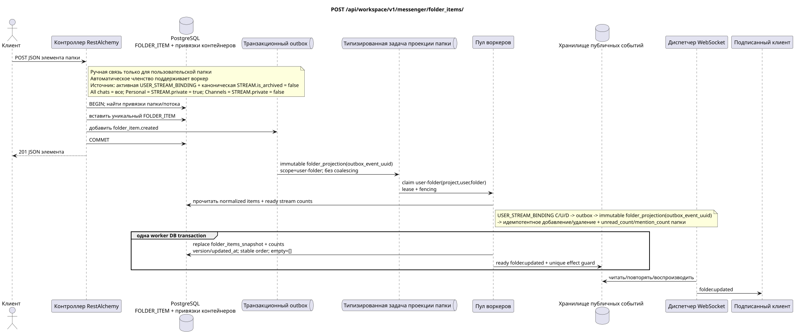

# `POST /api/workspace/v1/messenger/folder_items/`

[← Главный индекс документации](../../../../index.md) · [Индекс диаграмм последовательностей](../../README.md) · [Раздел контента и пользователей Workspace](../README.md)

Статус: целевая спецификация операции, разработанная сначала в документации. Текущий публичный контракт
остаётся без изменений и является нормативным в [`workspace_api.md`](../../../../workspace_api.md).
Этот файл описывает целевые границы транзакций и проекций; это не
производственный код, миграции SQL или новая конечная точка.



[Редактируемый исходник PlantUML](diagrams/post_folder_items_create.puml)

## Назначение и публичный контракт

Добавить поток в папку текущего пользователя.

Аутентификация: токен Bearer IAM; `project_id` и текущий `user_uuid` берутся из контекста IAM.

## Путь и параметры запроса

Параметры пути и запроса не принимаются.

Пагинация коллекций, где она предусмотрена, сохраняет текущий контракт `page_limit` и UUID
`page_marker` и возвращает `X-Pagination-Limit`, а также
`X-Pagination-Marker` только при наличии следующей страницы.

## Тело запроса

```json
{
  "folder_uuid": "50ecadd0-9823-4d97-b54c-806cc672c210",
  "stream_uuid": "75309057-419c-4b12-a7c1-3932429ec4a6",
  "chat_type": "stream",
  "order_index": 10
}
```

## Успешный ответ

`201`

```json
{
  "uuid": "9f41b1a7-77f9-4c12-bdc6-d3cebc5dbf50",
  "project_id": "22222222-2222-2222-2222-222222222222",
  "folder_uuid": "50ecadd0-9823-4d97-b54c-806cc672c210",
  "user_uuid": "11111111-1111-1111-1111-111111111111",
  "stream_uuid": "75309057-419c-4b12-a7c1-3932429ec4a6",
  "chat_type": "stream",
  "order_index": 10,
  "pinned_at": null,
  "unread_count": 0,
  "active_unread_count": 0,
  "passive_unread_count": 0,
  "created_at": "2026-06-22T09:30:00Z",
  "updated_at": "2026-06-22T09:30:00Z"
}
```


## Ошибки и авторизация

Неверные или неавторизованные входные данные обрабатываются общей границей ошибок RESTAlchemy/IAM; ресурсы в заданной области не раскрываются за границами пользователя/проекта.

Общая форма ответа при ошибке валидации:

```json
{
  "type": "ValidationErrorException",
  "code": 400,
  "message": "Validation error occurred."
}
```

## Целевая граница RestAlchemy

```python
from restalchemy.api import controllers as ra_controllers
from restalchemy.api import resources as ra_resources
from restalchemy.dm import models
from restalchemy.dm import properties
from restalchemy.dm import types
from restalchemy.storage.sql import orm


class WorkspaceFolderItem(models.ModelWithUUID, models.ModelWithProject,
                          models.ModelWithTimestamp, orm.SQLStorableMixin):
    __tablename__ = "messenger_folder_items"
    user_uuid = properties.property(types.UUID(), required=True, read_only=True)
    folder_uuid = properties.property(types.UUID(), required=True)
    stream_uuid = properties.property(types.UUID(), required=True)
    chat_type = properties.property(types.Enum(["stream", "group", "private"]), required=True)
    order_index = properties.property(types.AllowNone(types.Integer()))
    pinned_at = properties.property(types.AllowNone(types.UTCDateTimeZ()), read_only=True)


class WorkspaceUserFolderItem(models.ModelWithTimestamp, orm.SQLStorableMixin):
    __tablename__ = "messenger_api_user_folder_items_v1"
    uuid = properties.property(types.UUID(), id_property=True, read_only=True)
    project_id = properties.property(types.UUID(), read_only=True)
    user_uuid = properties.property(types.UUID(), read_only=True)
    folder_uuid = properties.property(types.UUID(), read_only=True)
    stream_uuid = properties.property(types.UUID(), read_only=True)
    chat_type = properties.property(
        types.Enum(["stream", "group", "private"]), read_only=True,
    )
    order_index = properties.property(types.AllowNone(types.Integer()))
    pinned_at = properties.property(types.AllowNone(types.UTCDateTimeZ()), read_only=True)
    # Ready fields are joined from unique USER_STREAM_BINDING. They are not
    # stored on WorkspaceFolderItem and are never calculated on API reads.
    unread_count = properties.property(types.Integer(min_value=0), read_only=True)
    active_unread_count = properties.property(types.Integer(min_value=0), read_only=True)
    passive_unread_count = properties.property(types.Integer(min_value=0), read_only=True)


class FolderItemController(ra_controllers.BaseResourceControllerPaginated):
    __resource__ = ra_resources.ResourceByRAModel(
        model_class=WorkspaceUserFolderItem,
        convert_underscore=False,
        process_filters=True,
    )
    # Writes use WorkspaceFolderItem; reads use the calculation-free view.
```

Каждая публичная ссылка на сущность объявляется скалярным UUID-свойством RestAlchemy, а не `relationship` (которое сериализовалось бы как URI). Соответствующий физический столбец `*_uuid` — индексированный внешний ключ с явно выбранным ссылочным действием. Поэтому публичный JSON сохраняет UUID без изменений.

Физический элемент имеет индексированные FK `folder_uuid`, `stream_uuid` и `user_uuid` с `ON DELETE CASCADE`. Его публичные UUID-ссылки остаются скалярными. Три поля непрочитанного копируются простым индексированным соединением из уникальной `USER_STREAM_BINDING` по `(project_id,user_uuid,stream_uuid)`; они никогда не хранятся в привязке сообщения и не подсчитываются в этом запросе.

Эта операция создаёт ручную связь пользовательской папки с поддерживаемым
каноническим объектом (по текущему контракту — поток). Автоматическое членство
в системных папках вручную не создаётся: изменения `USER_STREAM_BINDING`
пишут транзакционный outbox, отдельная immutable task с уникальным `outbox_event_uuid` запускает
воркер, а он идемпотентно добавляет/удаляет автоматические `FOLDER_ITEM` и
обновляет готовые агрегаты `unread_count`/`mention_count` в
`USER_FOLDER_BINDING`. Источник проекции — активная `USER_STREAM_BINDING` и
каноническая `STREAM` с `is_archived = false`: `All chats` включает все такие
доступные потоки, `Personal` — только потоки с `STREAM.private = true`,
`Channels` — только с `STREAM.private = false`.

## Синхронный путь API

1. Найти привязки папки и потока текущего пользователя.
2. Проверить `chat_type` и необязательный порядок.
3. Вставить уникальную строку элемента папки.
4. Добавить в outbox неизменяемую запись `folder_item.created`.
5. Зафиксировать транзакцию и вернуть элемент, соединённый с готовыми счётчиками потока.

## Outbox, типизированные задачи, воркер и работа в реальном времени

Запрос не вычисляет агрегаты папки или потока. Элемент читает готовые счётчики из `USER_STREAM_BINDING`.

Outbox event выводит immutable `folder_projection` без coalescing, с exact
scope `user-folder:(project_id,user_uuid,folder_uuid)` и уникальным
`outbox_event_uuid`. Владелец fenced lease читает normalized `FOLDER_ITEM` source of
truth и готовые счётчики `USER_STREAM_BINDING`, детерминированно сериализует
точный публичный массив и в одной worker DB transaction заменяет
`folder_items_snapshot`, счётчики, version/updated_at и ready `folder.updated`.
Диспетчер читает event только после commit; retry/backoff, DLQ/reaper и
идемпотентный effect guard обязательны.

## Идемпотентность, ключи и гонки

Бизнес-ключ `(project_id,user_uuid,folder_uuid,stream_uuid)` предотвращает дублирование членства. Конкурирующие создания разрешаются ограничением; проигравший получает стандартную границу конфликта/ошибки.

## Момент видимости для клиента

Ответ REST сразу отражает normalized item. Вложенный read-only `folder_items_snapshot` родительской папки, его готовые счётчики и WebSocket event могут отставать до завершения `folder_projection`; это плановая eventual consistency.

[← Главный индекс документации](../../../../index.md) · [Индекс диаграмм последовательностей](../../README.md) · [Раздел контента и пользователей Workspace](../README.md)
