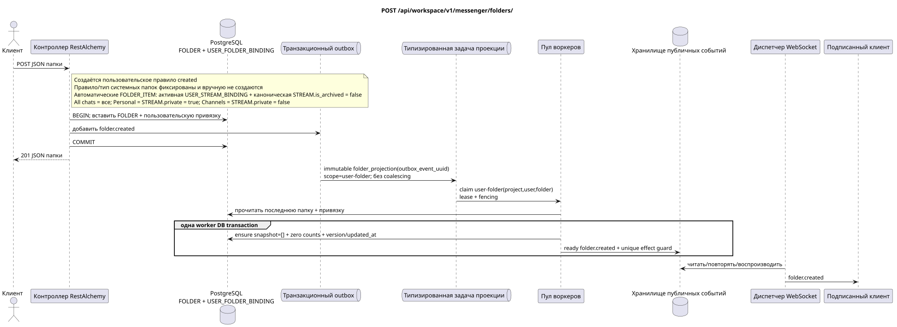

# `POST /api/workspace/v1/messenger/folders/`

[← Главный индекс документации](../../../../index.md) · [Индекс диаграмм последовательностей](../../README.md) · [Раздел контента и пользователей Workspace](../README.md)

Статус: целевая спецификация операции, разработанная сначала в документации. Текущий публичный контракт
остаётся без изменений и является нормативным в [`workspace_api.md`](../../../../workspace_api.md).
Этот файл описывает целевые границы транзакций и проекций; это не
производственный код, миграции SQL или новая конечная точка.



[Редактируемый исходник PlantUML](diagrams/post_folders_create.puml)

## Назначение и публичный контракт

Создать папку для текущего пользователя.

Аутентификация: токен Bearer IAM; `project_id` и текущий `user_uuid` берутся из контекста IAM.

## Путь и параметры запроса

Параметры пути и запроса не принимаются.

Пагинация коллекций, где она предусмотрена, сохраняет текущий контракт `page_limit` и UUID
`page_marker` и возвращает `X-Pagination-Limit`, а также
`X-Pagination-Marker` только при наличии следующей страницы.

## Тело запроса

```json
{
  "title": "Inbox",
  "background_color_value": 4280391411
}
```

## Успешный ответ

`201`

```json
{
  "uuid": "50ecadd0-9823-4d97-b54c-806cc672c210",
  "title": "Inbox",
  "background_color_value": 4280391411,
  "unread_count": 0,
  "system_type": "created",
  "folder_items": [],
  "created_at": "2026-06-22T09:30:00Z",
  "updated_at": "2026-06-22T09:30:00Z"
}
```


## Ошибки и авторизация

Неверные или неавторизованные входные данные обрабатываются общей границей ошибок RESTAlchemy/IAM; ресурсы в заданной области не раскрываются за границами пользователя/проекта.

Общая форма ответа при ошибке валидации:

```json
{
  "type": "ValidationErrorException",
  "code": 400,
  "message": "Validation error occurred."
}
```

## Целевая граница RestAlchemy

```python
from restalchemy.api import controllers as ra_controllers
from restalchemy.api import resources as ra_resources
from restalchemy.dm import models
from restalchemy.dm import properties
from restalchemy.dm import types
from restalchemy.storage.sql import orm


class WorkspaceFolder(models.ModelWithUUID, models.ModelWithProject,
                      models.ModelWithTimestamp, orm.SQLStorableMixin):
    __tablename__ = "messenger_folders"
    title = properties.property(types.String(min_length=1, max_length=64), required=True)
    background_color_value = properties.property(types.AllowNone(types.Integer()))


class WorkspaceUserFolderBinding(models.ModelWithUUID, models.ModelWithProject,
                                 models.ModelWithTimestamp, orm.SQLStorableMixin):
    __tablename__ = "messenger_user_folder_bindings"
    # Public UUID links are scalar UUID properties, never URI relationships.
    user_uuid = properties.property(types.UUID(), required=True, read_only=True)
    folder_uuid = properties.property(types.UUID(), required=True, read_only=True)
    unread_count = properties.property(types.Integer(min_value=0), default=0, read_only=True)
    mention_count = properties.property(types.Integer(min_value=0), default=0, read_only=True)
    folder_items_snapshot = properties.property(types.List(), default=list, read_only=True)
    folder_items_snapshot_version = properties.property(types.Integer(min_value=0), default=0, read_only=True)
    folder_items_snapshot_updated_at = properties.property(types.AllowNone(types.UTCDateTimeZ()), read_only=True)
    BUSINESS_KEY = ("project_id", "user_uuid", "folder_uuid")


class WorkspaceUserFolder(models.ModelWithTimestamp, orm.SQLStorableMixin):
    __tablename__ = "messenger_api_user_folders_v1"
    binding_uuid = properties.property(types.UUID(), id_property=True, read_only=True)
    uuid = properties.property(types.UUID(), read_only=True)
    title = properties.property(types.String(min_length=1, max_length=64))
    background_color_value = properties.property(types.AllowNone(types.Integer()))
    unread_count = properties.property(types.Integer(min_value=0), read_only=True)
    system_type = properties.property(types.AllowNone(types.Enum(["all", "created"])), read_only=True)
    folder_items = properties.property(types.List(), read_only=True)


class FolderController(ra_controllers.BaseResourceControllerPaginated):
    __resource__ = ra_resources.ResourceByRAModel(
        model_class=WorkspaceUserFolder,
        hidden_fields=["binding_uuid", "project_id", "user_uuid"],
        convert_underscore=False,
        process_filters=True,
    )
```

Каждая публичная ссылка на сущность объявляется скалярным UUID-свойством RestAlchemy, а не `relationship` (которое сериализовалось бы как URI). Соответствующий физический столбец `*_uuid` — индексированный внешний ключ с явно выбранным ссылочным действием. Поэтому публичный JSON сохраняет UUID без изменений.

Создаётся одна `WorkspaceUserFolderBinding` с готовыми нулевыми счётчиками и `folder_items_snapshot=[]`; публичное `folder_items` напрямую отображает этот read-only JSONB. Чтение одной строки не выполняет N+1, `json_agg`, `COUNT` или custom SQL. Будущие изменения нормализованных `FOLDER_ITEM` обновлят снимок только через `folder_projection`.

Эта операция создаёт пользовательскую папку с правилом/типом `created`; она не
создаёт системные правила. Системные `USER_FOLDER_BINDING` имеют фиксированные
правило/тип, а их автоматические `FOLDER_ITEM` идемпотентно поддерживает воркер
из активных `USER_STREAM_BINDING` и канонических `STREAM` с
`is_archived = false`. `All chats` («Все чаты») включает все такие доступные
потоки, `Personal` («Персональные») — только потоки с
`STREAM.private = true`, `Channels` («Каналы») — только с
`STREAM.private = false`. Новых публичных действий не вводится.

## Синхронный путь API

1. Проверить `title` (1..64) и необязательное значение ARGB.
2. Вставить одну каноническую `FOLDER`.
3. Вставить уникальную `USER_FOLDER_BINDING` текущего пользователя с готовыми агрегатами `unread_count` и упоминаний.
4. В той же транзакции добавить неизменяемую доменную запись `folder.created` в outbox.
5. Зафиксировать транзакцию и прочитать плоское представление папки пользователя.

## Outbox, типизированные задачи, воркер и работа в реальном времени

API не сканирует сообщения и не вычисляет счётчики папки. Каноническая папка, привязка владельца и outbox фиксируются атомарно.

Зафиксированный event выводит immutable `folder_projection` без coalescing,
с exact scope `user-folder:(project_id,user_uuid,folder_uuid)` и уникальным
`outbox_event_uuid`. Владелец fenced lease читает последний source of truth и в
одной worker DB transaction фиксирует `folder_items_snapshot=[]`, нулевые
счётчики, version/updated_at и ready `folder.created`. Диспетчер доставляет
событие только после commit; retry/backoff, DLQ/reaper обязательны.

## Идемпотентность, ключи и гонки

Уникальный `(project_id,user_uuid,folder_uuid)` предотвращает дубли строк видимости. Повтор клиента без идентификатора клиента — новый запрос создания; откат транзакции не оставляет ни папки, ни записи outbox.

## Момент видимости для клиента

Ответ REST отражает синхронное изменение папки. Другие клиенты увидят соответствующее готовое событие после ограниченной задержки проекции с согласованностью в конечном счёте.

[← Главный индекс документации](../../../../index.md) · [Индекс диаграмм последовательностей](../../README.md) · [Раздел контента и пользователей Workspace](../README.md)
