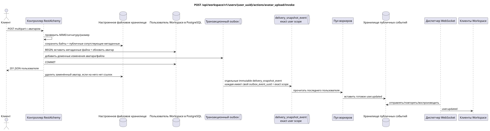

# `POST /api/workspace/v1/users/{user_uuid}/actions/avatar_upload/invoke`


Общий target-инвариант надёжности: каждое immutable outbox event выводит ровно одну immutable typed task с уникальным `outbox_event_uuid`; coalescing отсутствует. Task хранит фактический exact scope key, использует lease/fencing, retry/backoff, max attempts/DLQ, reaper и идемпотентный effect guard. Topic scope применяется только к placement/message-binding work; shared rows не получают неявный fallback на topic.

[← Главный индекс документации](../../../../index.md) · [Индекс диаграмм последовательностей](../../README.md) · [Раздел контента и пользователей Workspace](../README.md)

Статус: целевая спецификация операции, разработанная сначала в документации. Текущий публичный контракт
остаётся без изменений и является нормативным в [`workspace_api.md`](../../../../workspace_api.md).
Этот файл описывает целевые границы транзакций и проекций; это не
производственный код, миграции SQL или новая конечная точка.



[Редактируемый исходник PlantUML](diagrams/post_user_avatar_upload.puml)

## Назначение и публичный контракт

Атомарно загрузить и выбрать пользовательский аватар аутентифицированного пользователя.

Аутентификация: токен Bearer IAM; `project_id` и текущий `user_uuid` берутся из контекста IAM.

## Путь и параметры запроса

| Расположение | Имя | Тип / правило |
| --- | --- | --- |
| путь | `user_uuid` | должен совпадать с UUID аутентифицированного пользователя |

Пагинация коллекций, где она предусмотрена, сохраняет текущий контракт `page_limit` и UUID
`page_marker` и возвращает `X-Pagination-Limit`, а также
`X-Pagination-Marker` только при наличии следующей страницы.

## Тело запроса

Эта операция использует `multipart/form-data`, а не тело JSON.

Обязательное поле формы `file`: бинарные данные PNG, JPEG, GIF или WebP, максимум 25 MiB.

## Успешный ответ

`201`

```json
{
  "uuid": "11111111-1111-1111-1111-111111111111",
  "username": "admin",
  "source": "iam",
  "status": "active",
  "status_emoji": "coffee",
  "status_text": "Focusing",
  "first_name": "Workspace",
  "last_name": "Administrator",
  "email": "admin@example.com",
  "avatar": "urn:image:f11353e0-712d-4b99-a716-5cdba848cc05",
  "last_ping_at": "2026-07-17T08:00:00Z",
  "created_at": "2026-07-01T08:00:00Z",
  "updated_at": "2026-07-17T08:01:00Z"
}
```


## Ошибки и авторизация

Принимается только собственный UUID. Отсутствующий файл, неподдерживаемые объявленные MIME/сигнатура, пустое содержимое или размер свыше 25 MiB возвращают ошибку валидации.

Общая форма ответа при ошибке валидации:

```json
{
  "type": "ValidationErrorException",
  "code": 400,
  "message": "Validation error occurred."
}
```

## Целевая граница RestAlchemy

```python
from restalchemy.api import controllers as ra_controllers
from restalchemy.api import resources as ra_resources
from restalchemy.dm import models
from restalchemy.dm import properties
from restalchemy.dm import types
from restalchemy.storage.sql import orm


class WorkspaceUser(models.ModelWithUUID, models.ModelWithTimestamp,
                    orm.SQLStorableMixin):
    __tablename__ = "messenger_users"
    username = properties.property(types.String(min_length=1, max_length=128), required=True)
    source = properties.property(types.Enum(["iam", "zulip"]), default="iam")
    status = properties.property(types.Enum(["active", "idle", "offline", "do_not_disturb"]))
    status_emoji = properties.property(types.AllowNone(types.String(max_length=64)))
    status_text = properties.property(types.AllowNone(types.String(max_length=256)))
    avatar = properties.property(types.String(max_length=2048), required=True)


class WorkspaceUserController(ra_controllers.BaseResourceControllerPaginated):
    __resource__ = ra_resources.ResourceByRAModel(
        model_class=WorkspaceUser,
        convert_underscore=False,
        process_filters=True,
    )
    # Narrow own-user IAM refresh and presence/avatar actions preserve the API.
```

Каждая публичная ссылка на сущность объявляется скалярным UUID-свойством RestAlchemy, а не `relationship` (которое сериализовалось бы как URI). Соответствующий физический столбец `*_uuid` — индексированный внешний ключ с явно выбранным ссылочным действием. Поэтому публичный JSON сохраняет UUID без изменений.

`WorkspaceUser` — каноническая сущность в единственном экземпляре. Публичные UUID-подобные ссылки провайдера остаются скалярными полями в санитизированном контейнере провайдера; физические ссылки — индексированные FK. Поля идентичности, принадлежащие IAM, доступны запросам браузера только для чтения.

## Синхронный путь API

1. Проверить собственный UUID, MIME, сигнатуру и размер.
2. Сохранить байты и сопутствующие метаданные публичного ACL без UUID потока.
3. В одной транзакции БД вставить метаданные файла, обновить только `user.avatar` и добавить неизменяемые доменные записи аватара/файла в outbox.
4. Зафиксировать транзакцию и вернуть пользователя.
5. После обновления ссылок отозвать/удалить заменённый пользовательский аватар.

## Outbox, типизированные задачи, воркер и работа в реальном времени

Публичная запись `user.updated` материализуется после фиксации ссылки аватара и метаданных файла. Очистка хранилища отделена и не может восстановить старую ссылку.

Отдельная immutable `delivery_snapshot_event` с exact user scope читает
последнего канонического пользователя и атомарно создаёт готовые записи
`user.updated` с effect guard по `outbox_event_uuid`. После commit отдельный
диспетчер отправляет, повторяет или воспроизводит их; воркер WebSocket-
соединениями не владеет.

## Идемпотентность, ключи и гонки

Каноническая строка пользователя предотвращает разорванный выбор аватара. Ошибка до фиксации транзакции БД компенсирует вновь сохранённые байты. Удаление заменённых данных учитывает ссылки и допускает повторы.

## Момент видимости для клиента

Действующий клиент немедленно получает обновлённого канонического пользователя. Другие клиенты получают полный снимок `user.updated` после принятой задержки проекции/диспетчеризации.

[← Главный индекс документации](../../../../index.md) · [Индекс диаграмм последовательностей](../../README.md) · [Раздел контента и пользователей Workspace](../README.md)
