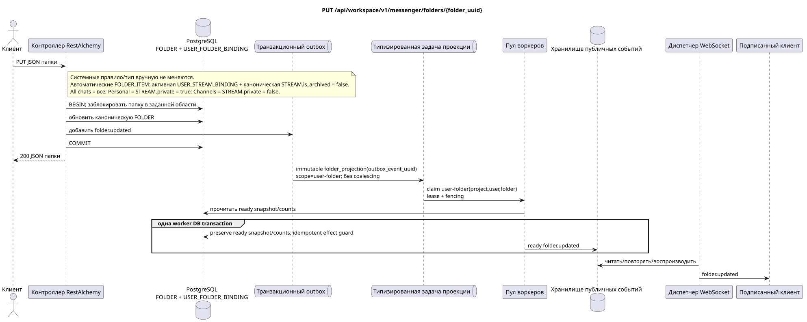

# `PUT /api/workspace/v1/messenger/folders/{folder_uuid}`

[← Главный индекс документации](../../../../index.md) · [Индекс диаграмм последовательностей](../../README.md) · [Раздел контента и пользователей Workspace](../README.md)

Статус: целевая спецификация операции, разработанная сначала в документации. Текущий публичный контракт
остаётся без изменений и является нормативным в [`workspace_api.md`](../../../../workspace_api.md).
Этот файл описывает целевые границы транзакций и проекций; это не
производственный код, миграции SQL или новая конечная точка.



[Редактируемый исходник PlantUML](diagrams/put_folder_update.puml)

## Назначение и публичный контракт

Обновить `title` и `color` папки текущего пользователя.

Аутентификация: токен Bearer IAM; `project_id` и текущий `user_uuid` берутся из контекста IAM.

## Путь и параметры запроса

| Расположение | Имя | Тип / правило |
| --- | --- | --- |
| путь | `folder_uuid` | UUID |

Пагинация коллекций, где она предусмотрена, сохраняет текущий контракт `page_limit` и UUID
`page_marker` и возвращает `X-Pagination-Limit`, а также
`X-Pagination-Marker` только при наличии следующей страницы.

## Тело запроса

```json
{
  "title": "Archive",
  "background_color_value": 4289352960
}
```

## Успешный ответ

`200`

```json
{
  "uuid": "50ecadd0-9823-4d97-b54c-806cc672c210",
  "title": "Archive",
  "background_color_value": 4289352960,
  "unread_count": 3,
  "system_type": "created",
  "folder_items": [
    {
      "uuid": "9f41b1a7-77f9-4c12-bdc6-d3cebc5dbf50",
      "project_id": "22222222-2222-2222-2222-222222222222",
      "folder_uuid": "50ecadd0-9823-4d97-b54c-806cc672c210",
      "user_uuid": "11111111-1111-1111-1111-111111111111",
      "stream_uuid": "75309057-419c-4b12-a7c1-3932429ec4a6",
      "chat_type": "stream",
      "order_index": 10,
      "pinned_at": null,
      "unread_count": 3,
      "active_unread_count": 3,
      "passive_unread_count": 0,
      "created_at": "2026-06-22T09:30:00Z",
      "updated_at": "2026-06-22T09:30:00Z"
    }
  ],
  "created_at": "2026-06-22T09:30:00Z",
  "updated_at": "2026-06-22T09:31:00Z"
}
```


## Ошибки и авторизация

Неверные или неавторизованные входные данные обрабатываются общей границей ошибок RESTAlchemy/IAM; ресурсы в заданной области не раскрываются за границами пользователя/проекта.

Общая форма ответа при ошибке валидации:

```json
{
  "type": "ValidationErrorException",
  "code": 400,
  "message": "Validation error occurred."
}
```

## Целевая граница RestAlchemy

```python
from restalchemy.api import controllers as ra_controllers
from restalchemy.api import resources as ra_resources
from restalchemy.dm import models
from restalchemy.dm import properties
from restalchemy.dm import types
from restalchemy.storage.sql import orm


class WorkspaceFolder(models.ModelWithUUID, models.ModelWithProject,
                      models.ModelWithTimestamp, orm.SQLStorableMixin):
    __tablename__ = "messenger_folders"
    title = properties.property(types.String(min_length=1, max_length=64), required=True)
    background_color_value = properties.property(types.AllowNone(types.Integer()))


class WorkspaceUserFolderBinding(models.ModelWithUUID, models.ModelWithProject,
                                 models.ModelWithTimestamp, orm.SQLStorableMixin):
    __tablename__ = "messenger_user_folder_bindings"
    # Public UUID links are scalar UUID properties, never URI relationships.
    user_uuid = properties.property(types.UUID(), required=True, read_only=True)
    folder_uuid = properties.property(types.UUID(), required=True, read_only=True)
    unread_count = properties.property(types.Integer(min_value=0), default=0, read_only=True)
    mention_count = properties.property(types.Integer(min_value=0), default=0, read_only=True)
    folder_items_snapshot = properties.property(types.List(), default=list, read_only=True)
    folder_items_snapshot_version = properties.property(types.Integer(min_value=0), default=0, read_only=True)
    folder_items_snapshot_updated_at = properties.property(types.AllowNone(types.UTCDateTimeZ()), read_only=True)
    BUSINESS_KEY = ("project_id", "user_uuid", "folder_uuid")


class WorkspaceUserFolder(models.ModelWithTimestamp, orm.SQLStorableMixin):
    __tablename__ = "messenger_api_user_folders_v1"
    binding_uuid = properties.property(types.UUID(), id_property=True, read_only=True)
    uuid = properties.property(types.UUID(), read_only=True)
    title = properties.property(types.String(min_length=1, max_length=64))
    background_color_value = properties.property(types.AllowNone(types.Integer()))
    unread_count = properties.property(types.Integer(min_value=0), read_only=True)
    system_type = properties.property(types.AllowNone(types.Enum(["all", "created"])), read_only=True)
    folder_items = properties.property(types.List(), read_only=True)


class FolderController(ra_controllers.BaseResourceControllerPaginated):
    __resource__ = ra_resources.ResourceByRAModel(
        model_class=WorkspaceUserFolder,
        hidden_fields=["binding_uuid", "project_id", "user_uuid"],
        convert_underscore=False,
        process_filters=True,
    )
```

Каждая публичная ссылка на сущность объявляется скалярным UUID-свойством RestAlchemy, а не `relationship` (которое сериализовалось бы как URI). Соответствующий физический столбец `*_uuid` — индексированный внешний ключ с явно выбранным ссылочным действием. Поэтому публичный JSON сохраняет UUID без изменений.

Публичное `folder_items` напрямую отображает read-only JSONB `WorkspaceUserFolderBinding.folder_items_snapshot`; он не меняется запросом обновления canonical `FOLDER`. Ресурс читает одну индексированную строку без N+1, `json_agg`, `COUNT` и custom SQL; нормализованные `FOLDER_ITEM` остаются source of truth.

Изменяемые `title`/`color` относятся к пользовательской канонической `FOLDER`.
Правило/тип системной `USER_FOLDER_BINDING` фиксированы и не могут быть изменены
вручную. Автоматические `FOLDER_ITEM` остаются поддерживаемой воркером
восстанавливаемой проекцией из активных `USER_STREAM_BINDING` и канонических
`STREAM` с `is_archived = false`: `All chats` («Все чаты») включает все такие
доступные потоки, `Personal` («Персональные») — только потоки с
`STREAM.private = true`, `Channels` («Каналы») — только с
`STREAM.private = false`. Эта операция не меняет эти правила и не добавляет
публичных действий.

## Синхронный путь API

1. Найти `folder_uuid` через уникальную привязку папки текущего пользователя.
2. Проверить изменяемые поля.
3. Обновить каноническую `FOLDER`.
4. Добавить в outbox неизменяемую доменную запись `folder.updated`.
5. Зафиксировать транзакцию и вернуть представление чтения в заданной области.

## Outbox, типизированные задачи, воркер и работа в реальном времени

Ни один счётчик непрочитанного не пересчитывается синхронно. Готовое значение привязки присоединяется в сохранённом виде.

Зафиксированный event выводит immutable `folder_projection` без coalescing,
с exact scope `user-folder:(project_id,user_uuid,folder_uuid)` и уникальным
`outbox_event_uuid`. Владелец fenced lease не пересобирает items, но читает готовый
снимок/счётчики и в одной worker DB transaction фиксирует только ready
`folder.updated` с effect guard. Диспетчер доставляет его только после commit;
retry/backoff, DLQ/reaper обязательны.

## Идемпотентность, ключи и гонки

Область пользователя/проекта предотвращает обновления между пользователями. Конкурирующие обновления сериализуются на канонической строке папки; возвращаются последние зафиксированные изменяемые значения.

## Момент видимости для клиента

Ответ REST отражает синхронное изменение папки. Другие клиенты увидят соответствующее готовое событие после ограниченной задержки проекции с согласованностью в конечном счёте.

[← Главный индекс документации](../../../../index.md) · [Индекс диаграмм последовательностей](../../README.md) · [Раздел контента и пользователей Workspace](../README.md)
