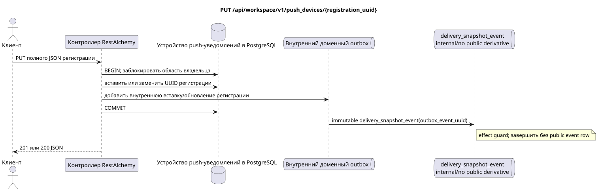

# `PUT /api/workspace/v1/push_devices/{registration_uuid}`


Общий target-инвариант надёжности: каждое immutable outbox event выводит ровно одну immutable typed task с уникальным `outbox_event_uuid`; coalescing отсутствует. Task хранит фактический exact scope key, использует lease/fencing, retry/backoff, max attempts/DLQ, reaper и идемпотентный effect guard. Topic scope применяется только к placement/message-binding work; shared rows не получают неявный fallback на topic.

[← Главный индекс документации](../../../../index.md) · [Индекс диаграмм последовательностей](../../README.md) · [Раздел контента и пользователей Workspace](../README.md)

Статус: целевая спецификация операции, разработанная сначала в документации. Текущий публичный контракт
остаётся без изменений и является нормативным в [`workspace_api.md`](../../../../workspace_api.md).
Этот файл описывает целевые границы транзакций и проекций; это не
производственный код, миграции SQL или новая конечная точка.



[Редактируемый исходник PlantUML](diagrams/put_push_device.puml)

## Назначение и публичный контракт

Идемпотентно зарегистрировать новую установку либо заменить её token/encryption key.

Аутентификация: токен Bearer IAM; `project_id` и текущий `user_uuid` берутся из контекста IAM.

## Путь и параметры запроса

| Расположение | Имя | Тип / правило |
| --- | --- | --- |
| путь | `registration_uuid` | стабильный UUID установки, созданный клиентом |

Пагинация коллекций, где она предусмотрена, сохраняет текущий контракт `page_limit` и UUID
`page_marker` и возвращает `X-Pagination-Limit`, а также
`X-Pagination-Marker` только при наличии следующей страницы.

## Тело запроса

```json
{
  "transport": "fcm",
  "platform": "ios",
  "registration_token": "<FCM registration token>",
  "encryption": {
    "kind": "HPKE",
    "algorithm": "HPKE-v1-BASE-X25519-HKDF-SHA256-AES-256-GCM",
    "key_uuid": "248305f4-ecdf-4206-8e93-95f830ea8ad6",
    "public_key": "<unpadded base64url X25519 public key>"
  }
}
```

## Успешный ответ

`201` при первой регистрации, `200` при замене`

```json
{
  "uuid": "7c1af344-95e1-487e-8b51-d1af0370cdb5",
  "transport": "fcm",
  "platform": "ios",
  "encryption": {
    "kind": "HPKE",
    "algorithm": "HPKE-v1-BASE-X25519-HKDF-SHA256-AES-256-GCM",
    "key_uuid": "248305f4-ecdf-4206-8e93-95f830ea8ad6",
    "public_key": "<unpadded base64url X25519 public key>"
  },
  "user_uuid": "11111111-1111-1111-1111-111111111111",
  "project_id": "22222222-2222-2222-2222-222222222222",
  "registration_token": "<FCM registration token>",
  "created_at": "2026-07-26T05:30:00Z",
  "updated_at": "2026-07-26T05:40:00Z"
}
```


## Ошибки и авторизация

Принимаются только `fcm`, платформы `android|ios`, фиксированный алгоритм HPKE и канонические 43-символьные открытые ключи X25519 в base64url без дополнения. UUID другого пользователя/проекта возвращается как не найден.

Общая форма ответа при ошибке валидации:

```json
{
  "type": "ValidationErrorException",
  "code": 400,
  "message": "Validation error occurred."
}
```

## Целевая граница RestAlchemy

```python
from restalchemy.api import controllers as ra_controllers
from restalchemy.api import resources as ra_resources
from restalchemy.dm import models
from restalchemy.dm import properties
from restalchemy.dm import types
from restalchemy.storage.sql import orm


class PushDevice(models.ModelWithUUID, models.ModelWithProject,
                 models.ModelWithTimestamp, orm.SQLStorableMixin):
    __tablename__ = "m_workspace_push_devices"
    user_uuid = properties.property(types.UUID(), required=True, read_only=True)
    transport = properties.property(types.Enum(["fcm"]), required=True)
    platform = properties.property(types.Enum(["android", "ios"]), required=True)
    registration_token = properties.property(types.String(max_length=4096), required=True)
    encryption = properties.property(types.Dict(), required=True)


class PushDeviceController(ra_controllers.BaseResourceController):
    __resource__ = ra_resources.ResourceByRAModel(model_class=PushDevice)
    # Narrow PUT upsert and idempotent DELETE overrides preserve owner scope.
```

Каждая публичная ссылка на сущность объявляется скалярным UUID-свойством RestAlchemy, а не `relationship` (которое сериализовалось бы как URI). Соответствующий физический столбец `*_uuid` — индексированный внешний ключ с явно выбранным ссылочным действием. Поэтому публичный JSON сохраняет UUID без изменений.

Управление регистрациями push-уведомлений находится вне переработки сущностей Messenger. UUID установки — ключ ресурса. `user_uuid` и `project_id` — серверные скалярные UUID-поля, поддерживаемые индексированными столбцами области; шифрование использует существующую модель `kind` HPKE.

## Синхронный путь API

1. Определить пользователя и проект по IAM и заблокировать пользовательскую область.
2. Проверить полное тело замены.
3. Вставить UUID, если он отсутствует; иначе потребовать совпадения области владельца и заменить `token`/`platform`/`encryption`.
4. Добавить в outbox внутреннюю неизменяемую доменную запись регистрации без публичной производной.
5. Зафиксировать транзакцию и вернуть `201` или `200`.

## Outbox, типизированные задачи, воркер и работа в реальном времени

Проекция Messenger и событие WebSocket не создаются.

Текущий контракт управляет только регистрациями. Внутреннее immutable
outbox-событие выводит одну `delivery_snapshot_event`, которая идемпотентно
фиксирует отсутствие публичной производной и завершается; Workspace event row
и WebSocket-доставка не создаются. Шифрование и доставка push payload находятся
вне этой конечной точки.

## Идемпотентность, ключи и гонки

`registration_uuid` — ключ идемпотентности. Повтор того же тела сходится к той же сохранённой регистрации; замена атомарна, перехват ресурса другим владельцем невозможен.

## Момент видимости для клиента

Изменение регистрации видно к моменту возврата HTTP-ответа. Публичного WebSocket-события для него нет.

[← Главный индекс документации](../../../../index.md) · [Индекс диаграмм последовательностей](../../README.md) · [Раздел контента и пользователей Workspace](../README.md)
