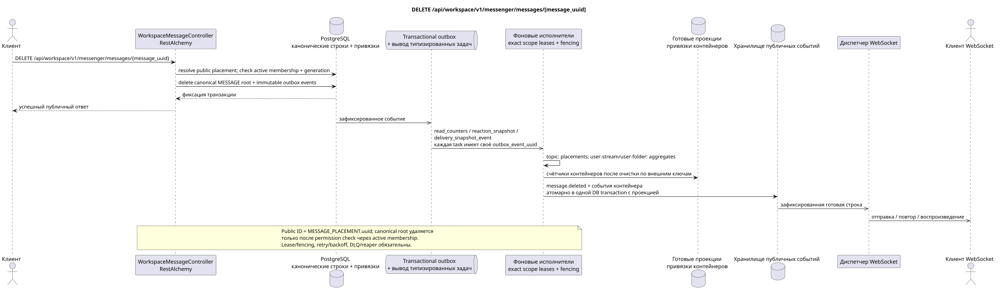

# DELETE /api/workspace/v1/messenger/messages/{message_uuid}

[← Главный индекс документации](../../../../index.md) · [Индекс диаграмм последовательности](../../README.md) · [Раздел Core Messenger](../README.md)

## Статус и граница текущего контракта

Целевая спецификация в подходе docs-first. Метод, путь, публичный JSON и авторизация следуют текущему контракту из [`workspace_api.md`](../../../../workspace_api.md); bounded pagination и asynchronous visibility следуют отдельно принятому target compatibility ADR.



Редактируемый исходник: [`delete_message.puml`](diagrams/delete_message.puml).

## Операция

**Метод и путь:** `DELETE /api/workspace/v1/messenger/messages/{message_uuid}`

**Назначение:** Безвозвратно удалить каноническое сообщение и зависимые строки.

## Публичный запрос

Без тела JSON.

## Успешный публичный ответ

HTTP `204`; пустое тело.

## Публичные ошибки

Требуются bearer-токен IAM и область проекта. Некорректный UUID или тело запроса дают HTTP `400`; отсутствующий или недоступный в этой области ресурс — `404`. Стандартное документированное тело ошибки валидации:

```json
{
  "type": "ValidationErrorException",
  "code": 400,
  "message": "Validation error occurred."
}
```

## Целевая граница RestAlchemy

```python
from restalchemy.api import controllers
from restalchemy.api import resources
from restalchemy.dm import models
from restalchemy.dm import properties
from restalchemy.dm import types
from restalchemy.storage.sql import orm


class WorkspaceUserMessage(models.ModelWithProject, orm.SQLStorableMixin):
    __tablename__ = "messenger_api_user_messages_v1"

    binding_uuid = properties.property(types.UUID(), id_property=True)
    uuid = properties.property(types.UUID(), read_only=True)
    stream_uuid = properties.property(types.UUID(), read_only=True)
    topic_uuid = properties.property(types.UUID(), read_only=True)
    author_uuid = properties.property(types.UUID(), read_only=True)
    user_uuid = properties.property(types.UUID(), read_only=True)


class WorkspaceMessageController(controllers.BaseResourceControllerPaginated):
    __resource__ = resources.ResourceByRAModel(
        WorkspaceUserMessage, convert_underscore=False, process_filters=True,
    )
```

Публичный `uuid` и идентификатор маршрута равны `MESSAGE_PLACEMENT.uuid = UUIDv5(namespace=TOPIC.uuid, name=MESSAGE.uuid)`; name — lowercase hyphenated canonical UUID. Канонический `MESSAGE.uuid` внутренний; `binding_uuid` скрыт. Контроллер разрешает placement и синхронно проверяет active membership плюс generation до canonical delete.

## Синхронная транзакция

1. Разрешить доступ и проверить права автора.
2. Удалить корневую MESSAGE; очистка зависимостей выполняется внешними ключами.
3. Добавить неизменяемую надгробную запись в transactional outbox с публичным идентификатором.

Затрагиваемое состояние: MESSAGE, размещения, пользовательские привязки/состояния, факты реакций и transactional outbox.

## Типизированные задачи и фоновый исполнитель

Задачи: `read_counters`, `reaction_snapshot` и `delivery_snapshot_event`.

Topic-scoped workers обрабатывают placements удаления, а отдельные fenced owners
`user-stream`/`user-topic`/`user-folder` обновляют shared counters. Каждое
outbox event имеет отдельную immutable task; topic worker не делает unsafe
read-modify-write shared rows. Lease/retry/DLQ/reaper и идемпотентный effect по
`outbox_event_uuid` обязательны.

## Публичные события и WebSocket

`message.deleted` и затронутые строки темы/потока, доставляемые диспетчером.

## Идемпотентность, гонки и видимые клиенту временные характеристики

Очистка по внешним ключам атомарна, повторы надгробной записи идемпотентны. Доступ исчезает при фиксации транзакции; счётчики и события вскоре сходятся.

[← Главный индекс документации](../../../../index.md) · [Индекс диаграмм последовательности](../../README.md) · [Раздел Core Messenger](../README.md)
