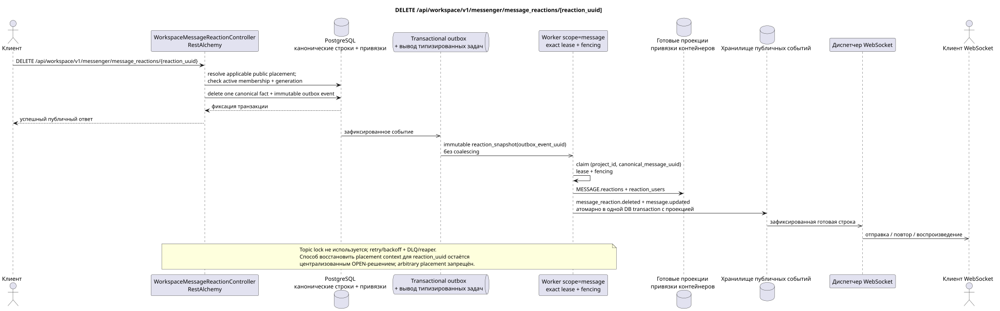

# DELETE /api/workspace/v1/messenger/message_reactions/{reaction_uuid}

[← Главный индекс документации](../../../../index.md) · [Индекс диаграмм последовательности](../../README.md) · [Раздел Core Messenger](../README.md)

## Статус и граница текущего контракта

Целевая спецификация в подходе docs-first. Метод, путь, публичный JSON и авторизация следуют текущему контракту из [`workspace_api.md`](../../../../workspace_api.md); bounded pagination и asynchronous visibility следуют отдельно принятому target compatibility ADR.



Редактируемый исходник: [`delete_message_reaction.puml`](diagrams/delete_message_reaction.puml).

## Операция

**Метод и путь:** `DELETE /api/workspace/v1/messenger/message_reactions/{reaction_uuid}`

**Назначение:** Удалить исходный факт реакции текущего пользователя.

## Публичный запрос

Без тела JSON.

## Успешный публичный ответ

HTTP `204`; пустое тело.

## Публичные ошибки

Требуются bearer-токен IAM и область проекта. Некорректный UUID или тело запроса дают HTTP `400`; отсутствующий или недоступный в этой области ресурс — `404`. Стандартное документированное тело ошибки валидации:

```json
{
  "type": "ValidationErrorException",
  "code": 400,
  "message": "Validation error occurred."
}
```

## Целевая граница RestAlchemy

```python
from restalchemy.api import controllers
from restalchemy.api import resources
from restalchemy.dm import models
from restalchemy.dm import properties
from restalchemy.dm import types
from restalchemy.storage.sql import orm


class WorkspaceMessageReactionView(
    models.ModelWithUUID,
    models.ModelWithProject,
    orm.SQLStorableMixin,
):
    __tablename__ = "messenger_api_message_reactions_v1"

    message_uuid = properties.property(types.UUID(), read_only=True)
    canonical_message_uuid = properties.property(types.UUID(), read_only=True)
    user_uuid = properties.property(types.UUID(), read_only=True)


class WorkspaceMessageReactionController(controllers.BaseResourceControllerPaginated):
    __resource__ = resources.ResourceByRAModel(
        WorkspaceMessageReactionView, convert_underscore=False, process_filters=True,
    )
```

Публичное `message_uuid` — скалярный UUID placement; внутреннее
`canonical_message_uuid` скрыто field permissions. UUID исходного факта
публичен для ресурса реакции. Физические ссылки остаются индексированными FK, а
исходные метаданные провайдера/доставки закрыты.

## Синхронная транзакция

1. Восстановить принадлежащий пользователю факт, применимый публичный placement
   и проверить active stream membership + matching generation.
2. Удалить ровно один факт.
3. Добавить immutable event удаления в transactional outbox; derived task
   уникальна по `outbox_event_uuid`.

Затрагиваемое состояние: факт реакции и transactional outbox.

## Типизированные задачи и фоновый исполнитель

Задачи: отдельная immutable `reaction_snapshot`; coalescing отсутствует.

Fenced owner scope `message` перестраивает снимки из оставшихся фактов; topic
lock не используется. Lease expiry, retry/backoff, DLQ и reaper обеспечивают
восстановление после сбоя.

## Публичные события и WebSocket

Для инициатора — `message_reaction.deleted`, для наблюдателя — `message.updated`; диспетчер доставляет зафиксированные строки.

## Идемпотентность, гонки и видимые клиенту временные характеристики

Удаление факта атомарно, требует active membership, а перестроение идемпотентно
по source event UUID. Агрегированные карты сообщений могут ненадолго отставать.
Маршрут содержит только `reaction_uuid`: способ восстановить его публичный
placement context при нескольких видимых placements остаётся централизованным
OPEN-решением, и произвольный placement запрещён. После выбранного access check
факт и снимок намеренно canonical-message-global и видимы во всех placements,
включая разные аудитории. Этот privacy trade-off принят как Critic risk #8.

[← Главный индекс документации](../../../../index.md) · [Индекс диаграмм последовательности](../../README.md) · [Раздел Core Messenger](../README.md)
