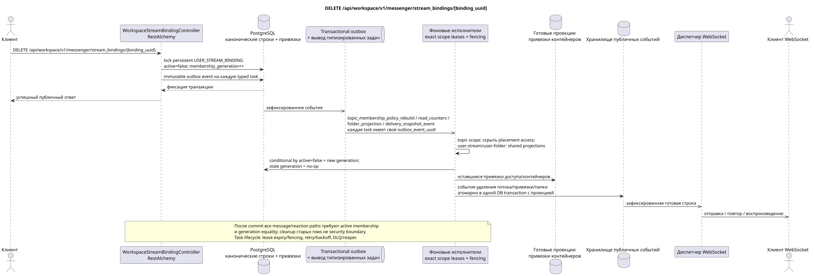

# DELETE /api/workspace/v1/messenger/stream_bindings/{binding_uuid}

[← Главный индекс документации](../../../../index.md) · [Индекс диаграмм последовательности](../../README.md) · [Раздел Core Messenger](../README.md)

## Статус и граница текущего контракта

Целевая спецификация в подходе docs-first. Метод, путь, публичный JSON и авторизация следуют текущему контракту из [`workspace_api.md`](../../../../workspace_api.md); bounded pagination и asynchronous visibility следуют отдельно принятому target compatibility ADR.



Редактируемый исходник: [`delete_stream_binding.puml`](diagrams/delete_stream_binding.puml).

## Операция

**Метод и путь:** `DELETE /api/workspace/v1/messenger/stream_bindings/{binding_uuid}`

**Назначение:** Удалить доступ обычного пользователя к потоку.

## Публичный запрос

Без тела JSON.

## Успешный публичный ответ

HTTP `204`; пустое тело.

## Публичные ошибки

Требуются bearer-токен IAM и область проекта. Некорректный UUID или тело запроса дают HTTP `400`; отсутствующий или недоступный в этой области ресурс — `404`. Стандартное документированное тело ошибки валидации:

```json
{
  "type": "ValidationErrorException",
  "code": 400,
  "message": "Validation error occurred."
}
```

Удаление привязки прямого потока или потока с самим собой даёт `400`.

## Целевая граница RestAlchemy

```python
from restalchemy.api import controllers
from restalchemy.api import resources
from restalchemy.dm import models
from restalchemy.dm import properties
from restalchemy.dm import types
from restalchemy.storage.sql import orm


class WorkspaceStreamBindingView(
    models.ModelWithUUID,
    models.ModelWithProject,
    orm.SQLStorableMixin,
):
    __tablename__ = "messenger_api_stream_bindings_v1"

    stream_uuid = properties.property(types.UUID(), read_only=True)
    user_uuid = properties.property(types.UUID(), read_only=True)
    who_uuid = properties.property(types.UUID(), read_only=True)


class WorkspaceStreamBindingController(controllers.BaseResourceControllerPaginated):
    __resource__ = resources.ResourceByRAModel(
        WorkspaceStreamBindingView, convert_underscore=False, process_filters=True,
    )
```

Публичные ссылки на сущности представлены скалярными свойствами `types.UUID()`, а не отношениями RestAlchemy, которые сериализуются в URI. Физические столбцы `*_uuid` остаются индексированными внешними ключами с явно выбранными действиями ссылочной целостности. USER_STREAM_BINDING уникальна по `(project_id, stream_uuid, user_uuid)` и физически может хранить готовые счётчики, но её текущий публичный JSON привязки не меняется.

## Синхронная транзакция

1. Восстановить и авторизовать persistent `USER_STREAM_BINDING`, заблокировав
   строку текущего membership lifecycle.
2. Не удаляя строку физически, атомарно установить `active = false` и увеличить
   монотонный `membership_generation`.
3. Добавить immutable transactional outbox events с прежней аудиторией и новым
   generation; каждому событию соответствует одна отдельная typed task.

Затрагиваемое состояние: привязки доступа к потоку, теме и сообщению, а также transactional outbox; канонические сущности сохраняются.

## Типизированные задачи и фоновый исполнитель

Задачи: отдельные immutable `topic_membership_policy_rebuild`,
`read_counters`, `folder_projection` и `delivery_snapshot_event`, каждая с
собственным source `outbox_event_uuid` и exact scope key.

После commit каждый message GET/list/action/reaction немедленно проверяет
`USER_STREAM_BINDING.active` и generation, поэтому stale message bindings/state
не дают доступ. Topic-scoped worker может асинхронно скрыть/перестроить
placement bindings; user-stream/user-folder scope workers обновляют shared
агрегаты, не используя topic lock. Cleanup старых поколений необязателен и не
является security boundary. Каждая task использует lease/fencing,
retry/backoff, DLQ/reaper и идемпотентный effect guard по `outbox_event_uuid`.

## Публичные события и WebSocket

Удаление потока для исключённого пользователя, удаление привязки для оставшегося пользователя и обновления папок.

## Идемпотентность, гонки и видимые клиенту временные характеристики

Каноническое содержимое сохраняется. `204` означает, что membership уже
неактивно и доступ запрещён после commit; проекции и события асинхронны. Stale
fan-out/history task с прежним generation делает no-op и не может воскресить
доступ. Re-add использует новое generation и fresh placement-scoped state.

[← Главный индекс документации](../../../../index.md) · [Индекс диаграмм последовательности](../../README.md) · [Раздел Core Messenger](../README.md)
