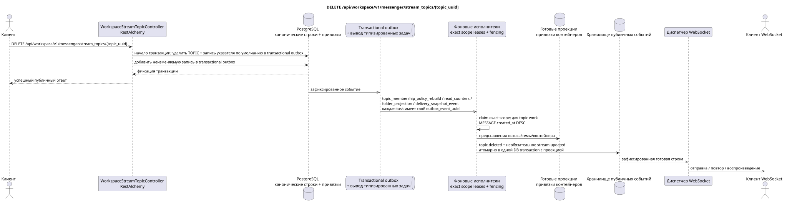

# DELETE /api/workspace/v1/messenger/stream_topics/{topic_uuid}


Общий target-инвариант надёжности: каждое immutable outbox event выводит ровно одну immutable typed task с уникальным `outbox_event_uuid`; coalescing отсутствует. Task хранит фактический exact scope key, использует lease/fencing, retry/backoff, max attempts/DLQ, reaper и идемпотентный effect guard. Topic scope применяется только к placement/message-binding work; shared rows не получают неявный fallback на topic.

[← Главный индекс документации](../../../../index.md) · [Индекс диаграмм последовательности](../../README.md) · [Раздел Core Messenger](../README.md)

## Статус и граница текущего контракта

Целевая спецификация в подходе docs-first. Метод, путь, публичный JSON и авторизация следуют текущему контракту из [`workspace_api.md`](../../../../workspace_api.md); bounded pagination и asynchronous visibility следуют отдельно принятому target compatibility ADR.



Редактируемый исходник: [`delete_stream_topic.puml`](diagrams/delete_stream_topic.puml).

## Операция

**Метод и путь:** `DELETE /api/workspace/v1/messenger/stream_topics/{topic_uuid}`

**Назначение:** Удалить каноническую тему.

## Публичный запрос

Без тела JSON.

## Успешный публичный ответ

HTTP `204`; пустое тело.

## Публичные ошибки

Требуются bearer-токен IAM и область проекта. Некорректный UUID или тело запроса дают HTTP `400`; отсутствующий или недоступный в этой области ресурс — `404`. Стандартное документированное тело ошибки валидации:

```json
{
  "type": "ValidationErrorException",
  "code": 400,
  "message": "Validation error occurred."
}
```

## Целевая граница RestAlchemy

```python
from restalchemy.api import controllers
from restalchemy.api import resources
from restalchemy.dm import models
from restalchemy.dm import properties
from restalchemy.dm import types
from restalchemy.storage.sql import orm


class WorkspaceUserTopic(
    models.ModelWithUUID,
    models.ModelWithProject,
    orm.SQLStorableMixin,
):
    __tablename__ = "messenger_api_user_topics_v1"

    stream_uuid = properties.property(types.UUID(), read_only=True)
    user_uuid = properties.property(types.UUID(), read_only=True)
    last_message_uuid = properties.property(types.UUID(), read_only=True)
    summary_last_message_uuid = properties.property(types.UUID(), read_only=True)


class WorkspaceStreamTopicController(controllers.BaseResourceControllerPaginated):
    __resource__ = resources.ResourceByRAModel(
        WorkspaceUserTopic, convert_underscore=False, process_filters=True,
    )
```

Публичные ссылки на сущности представлены скалярными свойствами `types.UUID()`, а не отношениями RestAlchemy, которые сериализуются в URI. Физические столбцы `*_uuid` остаются индексированными внешними ключами с явно выбранными действиями ссылочной целостности. TOPIC является канонической сущностью; уникальная USER_TOPIC_BINDING обеспечивает видимость, персональное состояние и готовые счётчики темы.

## Синхронная транзакция

1. Разрешить и проверить права.
2. Удалить TOPIC с очисткой по внешним ключам; при необходимости обнулить тему потока по умолчанию.
3. Добавить отдельные immutable transactional outbox events для каждой
   выводимой `topic_membership_policy_rebuild`, `read_counters`,
   `folder_projection` и `delivery_snapshot_event` task.

Затрагиваемое состояние: TOPIC, привязки/размещения темы, указатель темы потока по умолчанию и transactional outbox; сообщения с другими размещениями сохраняются.

## Типизированные задачи и фоновый исполнитель

Задачи: отдельные `topic_membership_policy_rebuild`, `read_counters`,
`folder_projection` и `delivery_snapshot_event`, каждая для собственного source
outbox event.

Topic-scoped worker обрабатывает placements удаляемой темы; shared
`user-topic`/`user-stream`/`user-folder` rows получают отдельные immutable tasks
exact scopes. Одновременно пишет один fenced owner key, coalescing отсутствует.

## Публичные события и WebSocket

`topic.deleted` и условное `stream.updated`.

## Идемпотентность, гонки и видимые клиенту временные характеристики

Повтор очистки по внешним ключам и transactional outbox безопасен. Тема меняется сразу, проекции и события — асинхронно.

[← Главный индекс документации](../../../../index.md) · [Индекс диаграмм последовательности](../../README.md) · [Раздел Core Messenger](../README.md)
