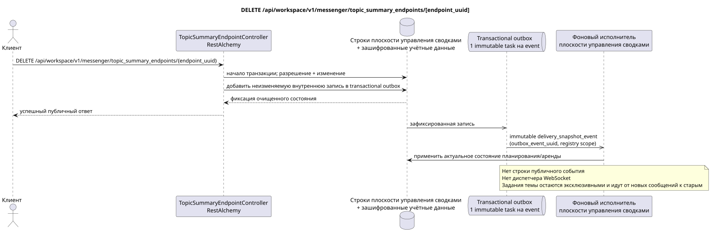

# DELETE /api/workspace/v1/messenger/topic_summary_endpoints/{endpoint_uuid}

[← Главный индекс документации](../../../../index.md) · [Индекс диаграмм последовательности](../../README.md) · [Раздел Core Messenger](../README.md)

## Статус и граница текущего контракта

Целевая спецификация в подходе docs-first. HTTP-контракт остаётся текущим контрактом из [`workspace_api.md`](../../../../workspace_api.md); целевые внутренние механизмы являются только предложением.



Редактируемый исходник: [`delete_topic_summary_endpoint.puml`](diagrams/delete_topic_summary_endpoint.puml).

## Операция

**Метод и путь:** `DELETE /api/workspace/v1/messenger/topic_summary_endpoints/{endpoint_uuid}`

**Назначение:** Удалить глобальную конечную точку сводок и зашифрованные учётные данные.

## Публичный запрос

Без тела JSON.

## Успешный публичный ответ

HTTP `204`; пустое тело.

Поля временных меток состояния и ошибок могут отсутствовать в ответе, если допускают `null` и имеют это значение. `api_key` и токен активной заявки никогда не возвращаются.

## Публичные ошибки

Требуется bearer-токен IAM. Некорректный UUID или тело запроса дают HTTP `400`; отсутствие разрешения на управление — `403`. Стандартное тело ошибки валидации:

```json
{
  "type": "ValidationErrorException",
  "code": 400,
  "message": "Validation error occurred."
}
```

Для каждой операции с реестром конечных точек требуется `workspace.topic_summary_endpoint.manage`; отсутствующая конечная точка даёт `404`.

## Целевая граница RestAlchemy

```python
from restalchemy.api import controllers
from restalchemy.api import resources
from restalchemy.dm import models
from restalchemy.dm import properties
from restalchemy.dm import types
from restalchemy.storage.sql import orm


class WorkspaceTopicSummaryEndpoint(
    models.ModelWithUUID,
    models.ModelWithTimestamp,
    orm.SQLStorableMixin,
):
    __tablename__ = "messenger_topic_summary_endpoints"

    name = properties.property(types.String(max_length=255), required=True)
    base_url = properties.property(types.String(max_length=2048), required=True)
    model = properties.property(types.String(max_length=255), required=True)
    credential_present = properties.property(types.Boolean(), read_only=True)


class TopicSummaryEndpointController(controllers.BaseResourceControllerPaginated):
    __resource__ = resources.ResourceByRAModel(
        WorkspaceTopicSummaryEndpoint,
        convert_underscore=False,
        process_filters=True,
    )
```

У этого глобального ресурса нет публичных полей отношений с сущностями. Его публичное поле `uuid` — скалярное свойство UUID. Любой внутренний внешний ключ или ссылка на учётные данные индексируется и имеет явно заданное действие ссылочной целостности; `api_key` доступен только для записи, хранится в зашифрованном виде и никогда не сериализуется.

## Синхронная транзакция

1. Потребовать разрешение на управление и восстановить конечную точку.
2. Удалить корень конечной точки; каскад внешнего ключа удаляет зашифрованные учётные данные.
3. Добавить неизменяемую внутреннюю запись удаления в transactional outbox.

## Типизированная задача и фоновый исполнитель

Отдельная immutable `delivery_snapshot_event` task с exact scope реестра
конечных точек обновляет реестр/очищает аренду для source outbox event; unique
`outbox_event_uuid`, без coalescing.

Фоновый исполнитель плоскости управления исключает конечную точку из будущего выбора; активные ограниченные заявки завершаются согласно выбранной политике аренды. Сканирование MESSAGE не выполняется.

## Публичные события, повторы и временные характеристики

Очистка по внешним ключам атомарна; повтор видит отсутствующий ресурс. Публичное событие Workspace и действие диспетчера не создаются.

Для этой административной операции нет готового публичного события Workspace, поэтому диспетчер WebSocket в ней не участвует.

[← Главный индекс документации](../../../../index.md) · [Индекс диаграмм последовательности](../../README.md) · [Раздел Core Messenger](../README.md)
