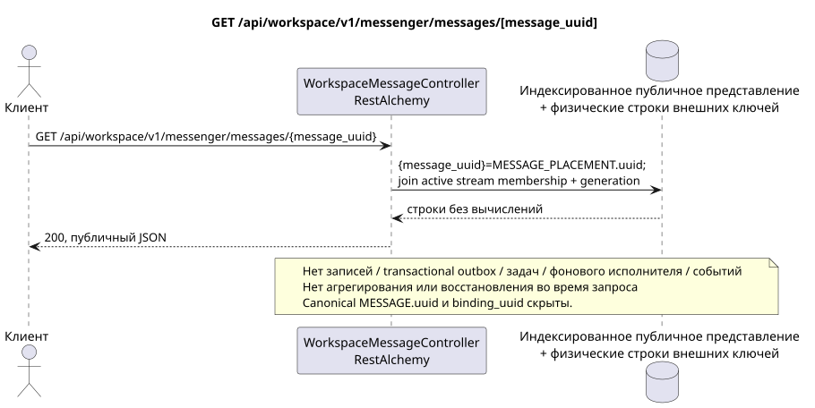

# GET /api/workspace/v1/messenger/messages/{message_uuid}

[← Главный индекс документации](../../../../index.md) · [Индекс диаграмм последовательности](../../README.md) · [Раздел Core Messenger](../README.md)

## Статус и граница текущего контракта

Целевая спецификация в подходе docs-first. Метод, путь, публичный JSON и авторизация следуют текущему контракту из [`workspace_api.md`](../../../../workspace_api.md); bounded pagination и asynchronous visibility следуют отдельно принятому target compatibility ADR.



Редактируемый исходник: [`get_message.puml`](diagrams/get_message.puml).

## Операция

**Метод и путь:** `GET /api/workspace/v1/messenger/messages/{message_uuid}`

**Назначение:** Получить видимое размещение сообщения по стабильному public placement UUID.

## Публичный запрос

Путь: `message_uuid = a93dca35-3061-4748-bda4-7f6f8c660ea5`; без тела.

## Успешный публичный ответ

HTTP `200`:

```json
{
  "uuid": "a93dca35-3061-4748-bda4-7f6f8c660ea5",
  "project_id": "22222222-2222-2222-2222-222222222222",
  "stream_uuid": "75309057-419c-4b12-a7c1-3932429ec4a6",
  "topic_uuid": "4ec0b996-b778-45f8-8ef4-ef863be0c047",
  "author_uuid": "11111111-1111-1111-1111-111111111111",
  "payload": {
    "kind": "markdown",
    "content": "Привет, Workspace"
  },
  "user_uuid": "11111111-1111-1111-1111-111111111111",
  "read": true,
  "pinned": false,
  "starred": false,
  "is_own": true,
  "mentioned": false,
  "reactions": {},
  "reaction_users": {},
  "source_name": "native",
  "source": {
    "kind": "native"
  },
  "provider": null,
  "delivery": null,
  "created_at": "2026-06-22T10:10:00Z",
  "updated_at": "2026-06-22T10:10:00Z"
}
```

## Публичные ошибки

Требуются bearer-токен IAM и область проекта; невидимый или отсутствующий ресурс либо маркер даёт `404`. Ошибок на стороне записи и побочных эффектов не возникает.

## Целевая граница RestAlchemy

```python
from restalchemy.api import controllers
from restalchemy.api import resources
from restalchemy.dm import models
from restalchemy.dm import properties
from restalchemy.dm import types
from restalchemy.storage.sql import orm


class WorkspaceUserMessage(models.ModelWithProject, orm.SQLStorableMixin):
    __tablename__ = "messenger_api_user_messages_v1"

    binding_uuid = properties.property(types.UUID(), id_property=True)
    uuid = properties.property(types.UUID(), read_only=True)
    stream_uuid = properties.property(types.UUID(), read_only=True)
    topic_uuid = properties.property(types.UUID(), read_only=True)
    author_uuid = properties.property(types.UUID(), read_only=True)
    user_uuid = properties.property(types.UUID(), read_only=True)


class WorkspaceMessageController(controllers.BaseResourceControllerPaginated):
    __resource__ = resources.ResourceByRAModel(
        WorkspaceUserMessage, convert_underscore=False, process_filters=True,
    )
```

Публичный `uuid` и идентификатор маршрута равны `MESSAGE_PLACEMENT.uuid = UUIDv5(namespace=TOPIC.uuid, name=MESSAGE.uuid)`; name — lowercase hyphenated canonical UUID. Канонический `MESSAGE.uuid` внутренний; `binding_uuid` остаётся скрытым техническим ORM-ключом. Контроллер разрешает placement и синхронно проверяет active `USER_STREAM_BINDING` плюс совпадение `membership_generation`.

## Синхронный путь чтения

1. Разрешить placement UUID, потребовать active membership и совпадение generation через индексированную цепочку USER_STREAM_BINDING -> USER_MESSAGE_BINDING -> MESSAGE_PLACEMENT, присоединить одну MESSAGE и placement-scoped USER_MESSAGE_STATE.
2. Вернуть результат непосредственно из индексированного представления без вычислений.
3. Не добавлять записи transactional outbox, задачи, работу с проекциями, публичными событиями или WebSocket.

## Идемпотентность и видимая клиенту согласованность

Этот GET не имеет побочных эффектов. Он может наблюдать допустимое отставание от более ранней записи, но не выполняет восстановление, распределение fan-out, `COUNT`, `GROUP BY`, оконные или lateral-операции, коррелированные подзапросы либо поиск отсутствующих привязок.

[← Главный индекс документации](../../../../index.md) · [Индекс диаграмм последовательности](../../README.md) · [Раздел Core Messenger](../README.md)
