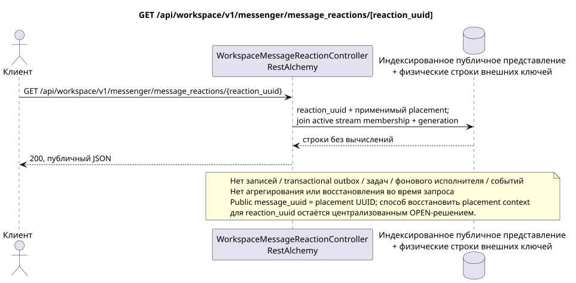

# GET /api/workspace/v1/messenger/message_reactions/{reaction_uuid}

[← Главный индекс документации](../../../../index.md) · [Индекс диаграмм последовательности](../../README.md) · [Раздел Core Messenger](../README.md)

## Статус и граница текущего контракта

Целевая спецификация в подходе docs-first. Метод, путь, публичный JSON и авторизация следуют текущему контракту из [`workspace_api.md`](../../../../workspace_api.md); bounded pagination и asynchronous visibility следуют отдельно принятому target compatibility ADR.



Редактируемый исходник: [`get_message_reaction.puml`](diagrams/get_message_reaction.puml).

## Операция

**Метод и путь:** `GET /api/workspace/v1/messenger/message_reactions/{reaction_uuid}`

**Назначение:** Получить один видимый факт реакции.

## Публичный запрос

Путь: `reaction_uuid = bd4b7632-8788-435a-93cc-6873657335c6`; без тела.

## Успешный публичный ответ

HTTP `200`:

```json
{
  "uuid": "bd4b7632-8788-435a-93cc-6873657335c6",
  "project_id": "22222222-2222-2222-2222-222222222222",
  "message_uuid": "a93dca35-3061-4748-bda4-7f6f8c660ea5",
  "user_uuid": "11111111-1111-1111-1111-111111111111",
  "emoji_name": "thumbs_up",
  "provider": null,
  "delivery": null,
  "created_at": "2026-06-22T10:12:00Z",
  "updated_at": "2026-06-22T10:12:00Z"
}
```

## Публичные ошибки

Требуются bearer-токен IAM и область проекта; невидимый или отсутствующий ресурс либо маркер даёт `404`. Ошибок на стороне записи и побочных эффектов не возникает.

## Целевая граница RestAlchemy

```python
from restalchemy.api import controllers
from restalchemy.api import resources
from restalchemy.dm import models
from restalchemy.dm import properties
from restalchemy.dm import types
from restalchemy.storage.sql import orm


class WorkspaceMessageReactionView(
    models.ModelWithUUID,
    models.ModelWithProject,
    orm.SQLStorableMixin,
):
    __tablename__ = "messenger_api_message_reactions_v1"

    message_uuid = properties.property(types.UUID(), read_only=True)
    canonical_message_uuid = properties.property(types.UUID(), read_only=True)
    user_uuid = properties.property(types.UUID(), read_only=True)


class WorkspaceMessageReactionController(controllers.BaseResourceControllerPaginated):
    __resource__ = resources.ResourceByRAModel(
        WorkspaceMessageReactionView, convert_underscore=False, process_filters=True,
    )
```

Публичное `message_uuid` — скалярный UUID placement; внутреннее
`canonical_message_uuid` скрыто field permissions. UUID исходного факта
публичен для ресурса реакции. Физические ссылки остаются индексированными FK, а
исходные метаданные провайдера/доставки закрыты.

## Синхронный путь чтения

1. Восстановить факт по UUID и применимый публичный placement, затем через его
   stream проверить active `USER_STREAM_BINDING` и равенство membership
   generation; сериализовать только `provider`/`delivery`.
2. Вернуть результат непосредственно из индексированного представления без вычислений.
3. Не добавлять записи transactional outbox, задачи, работу с проекциями, публичными событиями или WebSocket.

## Идемпотентность и видимая клиенту согласованность

Этот GET не имеет побочных эффектов. Он может наблюдать допустимое отставание от более ранней записи, но не выполняет восстановление, распределение fan-out, `COUNT`, `GROUP BY`, оконные или lateral-операции, коррелированные подзапросы либо поиск отсутствующих привязок.

Публичное поле `message_uuid` — placement UUID. Поскольку этот маршрут содержит
только `reaction_uuid`, выбор публичного placement для canonical-message-global
fact при нескольких видимых placements остаётся явным OPEN решением; скрытый
binding UUID или произвольный primary placement выбирать нельзя.

[← Главный индекс документации](../../../../index.md) · [Индекс диаграмм последовательности](../../README.md) · [Раздел Core Messenger](../README.md)
