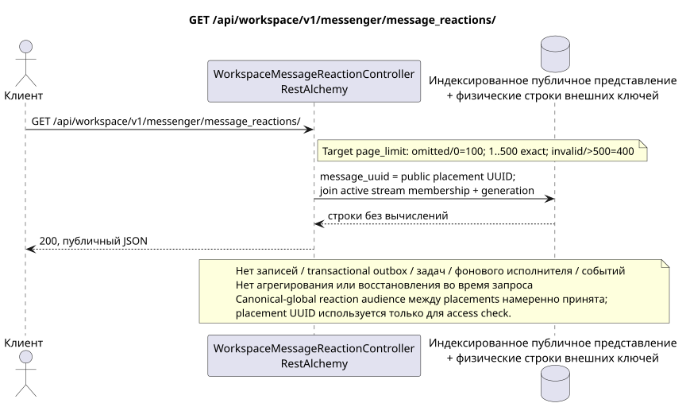

# GET /api/workspace/v1/messenger/message_reactions/

[← Главный индекс документации](../../../../index.md) · [Индекс диаграмм последовательности](../../README.md) · [Раздел Core Messenger](../README.md)

## Статус и граница текущего контракта

Целевая спецификация в подходе docs-first. Метод, путь, публичный JSON и авторизация следуют текущему контракту из [`workspace_api.md`](../../../../workspace_api.md); target pagination `100/500` является отдельно принятым observable behavior change.



Редактируемый исходник: [`get_message_reactions_list.puml`](diagrams/get_message_reactions_list.puml).

## Операция

**Метод и путь:** `GET /api/workspace/v1/messenger/message_reactions/`

**Назначение:** Получить список реакций на видимые сообщения.

## Публичный запрос

Без тела. Пример:

```http
GET /api/workspace/v1/messenger/message_reactions/?message_uuid=a93dca35-3061-4748-bda4-7f6f8c660ea5&page_limit=100
Authorization: Bearer <access_token>
```

Текущая семантика RestAlchemy: отсутствующий или равный `0` `page_limit` даёт неограниченную выборку; отрицательное или нецелое значение даёт HTTP `400`; положительное значение не имеет максимума. Это current gap. Target: отсутствие или `0` => `100`; `1..500` принимается точно; отрицательное, нецелое или `>500` => HTTP `400` без clamp; unbounded mode отсутствует. Клиент полного экспорта читает страницы до отсутствия следующего marker.

## Успешный публичный ответ

HTTP `200`:

```json
[
  {
    "uuid": "bd4b7632-8788-435a-93cc-6873657335c6",
    "project_id": "22222222-2222-2222-2222-222222222222",
    "message_uuid": "a93dca35-3061-4748-bda4-7f6f8c660ea5",
    "user_uuid": "11111111-1111-1111-1111-111111111111",
    "emoji_name": "thumbs_up",
    "provider": null,
    "delivery": null,
    "created_at": "2026-06-22T10:12:00Z",
    "updated_at": "2026-06-22T10:12:00Z"
  }
]
```

## Публичные ошибки

Требуются bearer-токен IAM и область проекта; невидимый или отсутствующий ресурс либо маркер даёт `404`. Ошибок на стороне записи и побочных эффектов не возникает.

## Целевая граница RestAlchemy

```python
from restalchemy.api import controllers
from restalchemy.api import resources
from restalchemy.dm import models
from restalchemy.dm import properties
from restalchemy.dm import types
from restalchemy.storage.sql import orm


class WorkspaceMessageReactionView(
    models.ModelWithUUID,
    models.ModelWithProject,
    orm.SQLStorableMixin,
):
    __tablename__ = "messenger_api_message_reactions_v1"

    message_uuid = properties.property(types.UUID(), read_only=True)
    canonical_message_uuid = properties.property(types.UUID(), read_only=True)
    user_uuid = properties.property(types.UUID(), read_only=True)


class WorkspaceMessageReactionController(controllers.BaseResourceControllerPaginated):
    __resource__ = resources.ResourceByRAModel(
        WorkspaceMessageReactionView, convert_underscore=False, process_filters=True,
    )
```

Публичное `message_uuid` — скалярный UUID placement; внутреннее
`canonical_message_uuid` скрыто field permissions. UUID исходного факта
публичен для ресурса реакции. Физические ссылки остаются индексированными FK, а
исходные метаданные провайдера/доставки закрыты.

## Синхронный путь чтения

1. Интерпретировать публичный фильтр `message_uuid` как
   `MESSAGE_PLACEMENT.uuid`, восстановить placement и через его stream проверить
   active `USER_STREAM_BINDING` и равенство membership generation. Затем читать
   исходные факты canonical message и присоединить сообщение только для
   очищенных `provider`/`delivery`. Никогда не агрегировать при чтении.
2. Вернуть результат непосредственно из индексированного представления без вычислений.
3. Не добавлять записи transactional outbox, задачи, работу с проекциями, публичными событиями или WebSocket.

## Идемпотентность и видимая клиенту согласованность

Этот GET не имеет побочных эффектов. Он может наблюдать допустимое отставание от более ранней записи, но не выполняет восстановление, распределение fan-out, `COUNT`, `GROUP BY`, оконные или lateral-операции, коррелированные подзапросы либо поиск отсутствующих привязок.

Публичное `message_uuid` в каждой строке остаётся placement UUID и задаёт access
check. Raw facts/snapshots намеренно canonical-message-global и видны во всех
placements сообщения, включая разные аудитории; этот privacy trade-off принят
как Critic risk #8.

[← Главный индекс документации](../../../../index.md) · [Индекс диаграмм последовательности](../../README.md) · [Раздел Core Messenger](../README.md)
