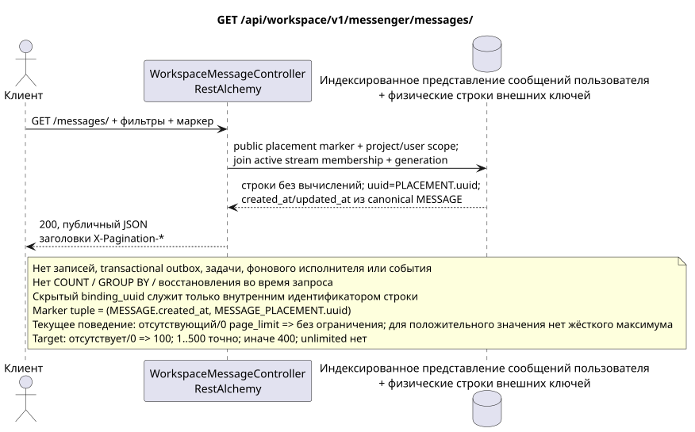

# GET /api/workspace/v1/messenger/messages/

[← Главный индекс документации](../../../../index.md) · [Индекс диаграмм последовательности](../../README.md) · [Раздел Core Messenger](../README.md)

## Статус и граница текущего контракта

Целевая спецификация реализации в подходе docs-first. Метод, путь, публичный JSON, авторизация и фильтры следуют [`workspace_api.md`](../../../../workspace_api.md); bounded pagination и asynchronous visibility являются отдельно принятым target compatibility change. Этот файл не изменяет исполняемый код.



Редактируемый исходник: [`get_messages_list.puml`](diagrams/get_messages_list.puml).

## Операция

**Метод и путь:** `GET /api/workspace/v1/messenger/messages/`

**Назначение:** Получить список сообщений, видимых текущему пользователю IAM, со стабильной составной пагинацией по ключу.

## Публичный запрос

Без тела. Пример запроса:

```http
GET /api/workspace/v1/messenger/messages/?stream_uuid=75309057-419c-4b12-a7c1-3932429ec4a6&topic_uuid=4ec0b996-b778-45f8-8ef4-ef863be0c047&sort_key=created_at&sort_dir=desc&page_limit=50&page_marker=a93dca35-3061-4748-bda4-7f6f8c660ea5
Authorization: Bearer <access_token>
```

Строки упорядочиваются по `(MESSAGE.created_at, MESSAGE_PLACEMENT.uuid)`. `page_marker` — последний публичный placement UUID. Маркер вне той же области пользователя, проекта и фильтра отклоняется. Заголовки пагинации: `X-Pagination-Limit` и, только при наличии следующей страницы, `X-Pagination-Marker`.

Текущая семантика RestAlchemy: отсутствующий или равный `0` `page_limit` даёт неограниченную выборку; отрицательное или нецелое значение даёт HTTP `400`; положительное значение не имеет максимума. Это current gap. Target: отсутствие или `0` => `100`; `1..500` принимается точно; отрицательное, нецелое или `>500` => HTTP `400` без clamp; unbounded mode отсутствует. Клиент полного экспорта читает страницы до отсутствия следующего marker.

## Успешный публичный ответ

HTTP `200`:

```json
[
  {
    "uuid": "a93dca35-3061-4748-bda4-7f6f8c660ea5",
    "project_id": "22222222-2222-2222-2222-222222222222",
    "stream_uuid": "75309057-419c-4b12-a7c1-3932429ec4a6",
    "topic_uuid": "4ec0b996-b778-45f8-8ef4-ef863be0c047",
    "author_uuid": "11111111-1111-1111-1111-111111111111",
    "payload": {
      "kind": "markdown",
      "content": "Привет, Workspace"
    },
    "user_uuid": "11111111-1111-1111-1111-111111111111",
    "read": true,
    "pinned": false,
    "starred": false,
    "is_own": true,
    "mentioned": false,
    "reactions": {},
    "reaction_users": {},
    "source_name": "native",
    "source": {
      "kind": "native"
    },
    "provider": null,
    "delivery": null,
    "created_at": "2026-06-22T10:10:00Z",
    "updated_at": "2026-06-22T10:10:00Z"
  }
]
```

## Публичные ошибки

Требуются bearer-токен IAM и область проекта. Маркер вне области аутентифицированного пользователя, проекта, представления и фильтра даёт `404`. Ошибка на стороне записи не возникает.

## Целевая граница RestAlchemy

```python
from restalchemy.api import controllers
from restalchemy.api import resources
from restalchemy.dm import models
from restalchemy.dm import properties
from restalchemy.dm import types
from restalchemy.storage.sql import orm


class WorkspaceUserMessage(models.ModelWithProject, orm.SQLStorableMixin):
    __tablename__ = "messenger_api_user_messages_v1"

    binding_uuid = properties.property(types.UUID(), id_property=True)
    uuid = properties.property(types.UUID(), read_only=True)
    stream_uuid = properties.property(types.UUID(), read_only=True)
    topic_uuid = properties.property(types.UUID(), read_only=True)
    author_uuid = properties.property(types.UUID(), read_only=True)
    user_uuid = properties.property(types.UUID(), read_only=True)


class WorkspaceMessageController(
    controllers.BaseResourceControllerPaginated,
):
    __resource__ = resources.ResourceByRAModel(
        WorkspaceUserMessage,
        convert_underscore=False,
        process_filters=True,
    )
```

Публичные ссылки на сущности представлены скалярными свойствами UUID, а не отношениями RestAlchemy, которые сериализуются в URI. Физические столбцы `*_uuid` являются индексированными внешними ключами с явно заданными действиями ссылочной целостности.

Публичный `uuid` равен `MESSAGE_PLACEMENT.uuid = UUIDv5(namespace=TOPIC.uuid, name=MESSAGE.uuid)`; name — lowercase hyphenated canonical UUID. `MESSAGE.uuid` внутренний, `binding_uuid` — скрытая ORM identity. Контроллер восстанавливает marker по public placement UUID и использует tuple `(MESSAGE.created_at,MESSAGE_PLACEMENT.uuid)`, без hidden binding key.

## Синхронный путь чтения

1. Применить область проекта IAM и текущего пользователя, а также документированные фильтры потока и темы.
2. Просканировать индексированное представление с ведущей `USER_MESSAGE_BINDING` и обязательным join к active `USER_STREAM_BINDING` того же generation.
3. Присоединить одну `MESSAGE_PLACEMENT`, одну каноническую `MESSAGE` и одну placement-scoped строку `USER_MESSAGE_STATE`.
4. Прочитать каноническое содержимое/временные метки и готовое состояние; сериализовать `uuid = MESSAGE_PLACEMENT.uuid`.
5. Вернуть публичный JSON без вычисления агрегатов реакций или непрочитанного.

## Transactional outbox, фоновый исполнитель, события и согласованность

Этот GET не добавляет запись в transactional outbox, не создаёт типизированную задачу, не занимает тему, не записывает проекцию или событие и не обращается к диспетчеру WebSocket. Он не выполняет `COUNT`, `GROUP BY`, оконные или lateral-операции, коррелированные подзапросы, распределение fan-out, восстановление либо поиск отсутствующих привязок.

Ответ отражает уже зафиксированные строки проекций и может показывать допустимое небольшое отставание согласованности в конечном счёте (eventual consistency) от более ранних записей. Само чтение не имеет побочных эффектов.

[← Главный индекс документации](../../../../index.md) · [Индекс диаграмм последовательности](../../README.md) · [Раздел Core Messenger](../README.md)
