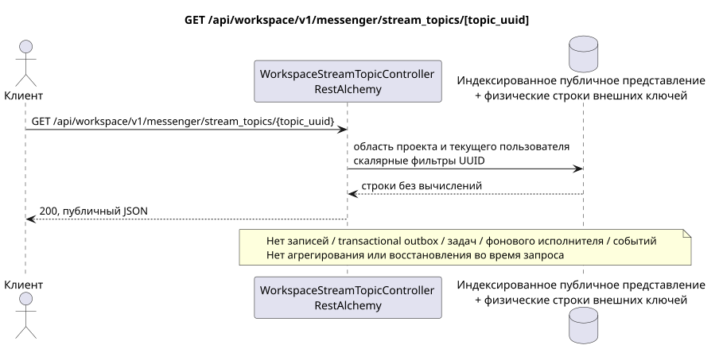

# GET /api/workspace/v1/messenger/stream_topics/{topic_uuid}

[← Главный индекс документации](../../../../index.md) · [Индекс диаграмм последовательности](../../README.md) · [Раздел Core Messenger](../README.md)

## Статус и граница текущего контракта

Целевая спецификация в подходе docs-first. Метод, путь, публичный JSON и авторизация следуют текущему контракту из [`workspace_api.md`](../../../../workspace_api.md); bounded pagination и asynchronous visibility следуют отдельно принятому target compatibility ADR.



Редактируемый исходник: [`get_stream_topic.puml`](diagrams/get_stream_topic.puml).

## Операция

**Метод и путь:** `GET /api/workspace/v1/messenger/stream_topics/{topic_uuid}`

**Назначение:** Получить одно видимое представление темы.

## Публичный запрос

Путь: `topic_uuid = 4ec0b996-b778-45f8-8ef4-ef863be0c047`; без тела.

## Успешный публичный ответ

HTTP `200`:

```json
{
  "uuid": "4ec0b996-b778-45f8-8ef4-ef863be0c047",
  "project_id": "22222222-2222-2222-2222-222222222222",
  "name": "Релизы",
  "stream_uuid": "75309057-419c-4b12-a7c1-3932429ec4a6",
  "user_uuid": "11111111-1111-1111-1111-111111111111",
  "color": 4491468,
  "last_message_uuid": "a93dca35-3061-4748-bda4-7f6f8c660ea5",
  "unread_count": 2,
  "active_unread_count": 2,
  "passive_unread_count": 0,
  "is_default": false,
  "is_done": false,
  "notification_mode": "default",
  "summary": null,
  "summary_last_message_uuid": null,
  "summary_has_new_messages": null,
  "summary_enabled": true,
  "summary_system_prompt": null,
  "summary_reasoning_effort": null,
  "source_name": "native",
  "source": {
    "kind": "native"
  },
  "provider": null,
  "delivery": null,
  "created_at": "2026-06-22T09:10:00Z",
  "updated_at": "2026-06-22T10:10:00Z"
}
```

## Публичные ошибки

Требуются bearer-токен IAM и область проекта; невидимый или отсутствующий ресурс либо маркер даёт `404`. Ошибок на стороне записи и побочных эффектов не возникает.

## Целевая граница RestAlchemy

```python
from restalchemy.api import controllers
from restalchemy.api import resources
from restalchemy.dm import models
from restalchemy.dm import properties
from restalchemy.dm import types
from restalchemy.storage.sql import orm


class WorkspaceUserTopic(
    models.ModelWithUUID,
    models.ModelWithProject,
    orm.SQLStorableMixin,
):
    __tablename__ = "messenger_api_user_topics_v1"

    stream_uuid = properties.property(types.UUID(), read_only=True)
    user_uuid = properties.property(types.UUID(), read_only=True)
    last_message_uuid = properties.property(types.UUID(), read_only=True)
    summary_last_message_uuid = properties.property(types.UUID(), read_only=True)


class WorkspaceStreamTopicController(controllers.BaseResourceControllerPaginated):
    __resource__ = resources.ResourceByRAModel(
        WorkspaceUserTopic, convert_underscore=False, process_filters=True,
    )
```

Публичные ссылки на сущности представлены скалярными свойствами `types.UUID()`, а не отношениями RestAlchemy, которые сериализуются в URI. Физические столбцы `*_uuid` остаются индексированными внешними ключами с явно выбранными действиями ссылочной целостности. TOPIC является канонической сущностью; уникальная USER_TOPIC_BINDING обеспечивает видимость, персональное состояние и готовые счётчики темы.

## Синхронный путь чтения

1. Разрешить индексированную привязку темы текущего пользователя, присоединить каноническую TOPIC и готовое состояние только связями «один к одному» и «многие к одному».
2. Вернуть результат непосредственно из индексированного представления без вычислений.
3. Не добавлять записи transactional outbox, задачи, работу с проекциями, публичными событиями или WebSocket.

## Идемпотентность и видимая клиенту согласованность

Этот GET не имеет побочных эффектов. Он может наблюдать допустимое отставание от более ранней записи, но не выполняет восстановление, распределение fan-out, `COUNT`, `GROUP BY`, оконные или lateral-операции, коррелированные подзапросы либо поиск отсутствующих привязок.

[← Главный индекс документации](../../../../index.md) · [Индекс диаграмм последовательности](../../README.md) · [Раздел Core Messenger](../README.md)
