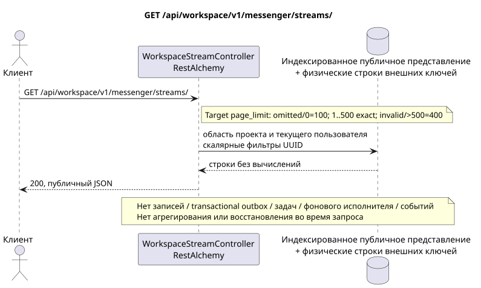

# GET /api/workspace/v1/messenger/streams/

[← Главный индекс документации](../../../../index.md) · [Индекс диаграмм последовательности](../../README.md) · [Раздел Core Messenger](../README.md)

## Статус и граница текущего контракта

Целевая спецификация в подходе docs-first. Метод, путь, публичный JSON и авторизация следуют текущему контракту из [`workspace_api.md`](../../../../workspace_api.md); target pagination `100/500` является отдельно принятым observable behavior change.



Редактируемый исходник: [`get_streams_list.puml`](diagrams/get_streams_list.puml).

## Операция

**Метод и путь:** `GET /api/workspace/v1/messenger/streams/`

**Назначение:** Получить список потоков, видимых через привязки текущего пользователя.

## Публичный запрос

Без тела. Пример:

```http
GET /api/workspace/v1/messenger/streams/?private=false&page_limit=50&page_marker=75309057-419c-4b12-a7c1-3932429ec4a6
Authorization: Bearer <access_token>
```

Текущая семантика RestAlchemy: отсутствующий или равный `0` `page_limit` даёт неограниченную выборку; отрицательное или нецелое значение даёт HTTP `400`; положительное значение не имеет максимума. Это current gap. Target: отсутствие или `0` => `100`; `1..500` принимается точно; отрицательное, нецелое или `>500` => HTTP `400` без clamp; unbounded mode отсутствует. Клиент полного экспорта читает страницы до отсутствия следующего marker.

## Успешный публичный ответ

HTTP `200`:

```json
[
  {
    "uuid": "75309057-419c-4b12-a7c1-3932429ec4a6",
    "name": "Инженерия",
    "description": "Инженерное пространство",
    "project_id": "22222222-2222-2222-2222-222222222222",
    "owner": "11111111-1111-1111-1111-111111111111",
    "user_uuid": "11111111-1111-1111-1111-111111111111",
    "role": "owner",
    "notification_mode": "all_messages",
    "unread_count": 2,
    "active_unread_count": 2,
    "passive_unread_count": 0,
    "source_name": "native",
    "source": {
      "kind": "native"
    },
    "invite_only": false,
    "announce": false,
    "private": false,
    "is_archived": false,
    "color": 3368601,
    "last_message_uuid": "a93dca35-3061-4748-bda4-7f6f8c660ea5",
    "default_topic_uuid": "4ec0b996-b778-45f8-8ef4-ef863be0c047",
    "created_at": "2026-06-22T09:00:00Z",
    "updated_at": "2026-06-22T10:10:00Z"
  }
]
```

## Публичные ошибки

Требуются bearer-токен IAM и область проекта; невидимый или отсутствующий ресурс либо маркер даёт `404`. Ошибок на стороне записи и побочных эффектов не возникает.

## Целевая граница RestAlchemy

```python
from restalchemy.api import controllers
from restalchemy.api import resources
from restalchemy.dm import models
from restalchemy.dm import properties
from restalchemy.dm import types
from restalchemy.storage.sql import orm


class WorkspaceUserStream(
    models.ModelWithUUID,
    models.ModelWithProject,
    orm.SQLStorableMixin,
):
    __tablename__ = "messenger_api_user_streams_v1"

    owner = properties.property(types.UUID(), read_only=True)
    user_uuid = properties.property(types.UUID(), read_only=True)
    direct_user_uuid = properties.property(
        types.AllowNone(types.UUID()), default=None, read_only=True,
    )
    last_message_uuid = properties.property(types.UUID(), read_only=True)
    default_topic_uuid = properties.property(types.UUID(), read_only=True)


class WorkspaceStreamController(controllers.BaseResourceControllerPaginated):
    __resource__ = resources.ResourceByRAModel(
        WorkspaceUserStream, convert_underscore=False, process_filters=True,
    )
```

Публичные ссылки на сущности представлены скалярными свойствами `types.UUID()`, а не отношениями RestAlchemy, которые сериализуются в URI. Физические столбцы `*_uuid` остаются индексированными внешними ключами с явно выбранными действиями ссылочной целостности. Публичное поле `owner` является свойством UUID; физическое поле `owner_uuid` — индексированным внешним ключом пользователя. USER_STREAM_BINDING хранит готовые счётчики уровня потока.

## Синхронный путь чтения

1. Просканировать уникальные строки USER_STREAM_BINDING и присоединить одну каноническую STREAM, а также необязательные тему по умолчанию и последнее сообщение. Готовые поля непрочитанного берутся из привязки; агрегирование во время запроса не выполняется.
2. Вернуть результат непосредственно из индексированного представления без вычислений.
3. Не добавлять записи transactional outbox, задачи, работу с проекциями, публичными событиями или WebSocket.

## Идемпотентность и видимая клиенту согласованность

Этот GET не имеет побочных эффектов. Он может наблюдать допустимое отставание от более ранней записи, но не выполняет восстановление, распределение fan-out, `COUNT`, `GROUP BY`, оконные или lateral-операции, коррелированные подзапросы либо поиск отсутствующих привязок.

[← Главный индекс документации](../../../../index.md) · [Индекс диаграмм последовательности](../../README.md) · [Раздел Core Messenger](../README.md)
