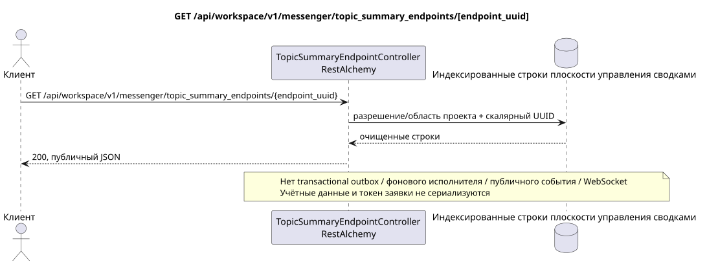

# GET /api/workspace/v1/messenger/topic_summary_endpoints/{endpoint_uuid}

[← Главный индекс документации](../../../../index.md) · [Индекс диаграмм последовательности](../../README.md) · [Раздел Core Messenger](../README.md)

## Статус и граница текущего контракта

Целевая спецификация в подходе docs-first. HTTP-контракт остаётся текущим контрактом из [`workspace_api.md`](../../../../workspace_api.md); целевые внутренние механизмы являются только предложением.



Редактируемый исходник: [`get_topic_summary_endpoint.puml`](diagrams/get_topic_summary_endpoint.puml).

## Операция

**Метод и путь:** `GET /api/workspace/v1/messenger/topic_summary_endpoints/{endpoint_uuid}`

**Назначение:** Прочитать одну очищенную глобальную конечную точку сводок.

## Публичный запрос

Путь: `endpoint_uuid = e4ad6d80-6bc7-4a91-864c-8e97319a82bd`; без тела.

## Успешный публичный ответ

HTTP `200`:

```json
{
  "uuid": "e4ad6d80-6bc7-4a91-864c-8e97319a82bd",
  "name": "primary-summary-model",
  "base_url": "https://llm.example.com/v1",
  "model": "summary-model",
  "enabled": true,
  "priority": 10,
  "supports_vision": true,
  "supports_reasoning": true,
  "temperature": 0.2,
  "max_output_tokens": 512,
  "top_p": 1,
  "presence_penalty": 0,
  "frequency_penalty": 0,
  "credential_present": true,
  "failure_count": 0,
  "created_at": "2026-06-22T08:00:00Z",
  "updated_at": "2026-06-22T08:00:00Z"
}
```

Поля временных меток состояния и ошибок могут отсутствовать в ответе, если допускают `null` и имеют это значение. `api_key` и токен активной заявки никогда не возвращаются.

## Публичные ошибки

Требуется bearer-токен IAM. Некорректный UUID или тело запроса дают HTTP `400`; отсутствие разрешения на управление — `403`. Стандартное тело ошибки валидации:

```json
{
  "type": "ValidationErrorException",
  "code": 400,
  "message": "Validation error occurred."
}
```

Для каждой операции с реестром конечных точек требуется `workspace.topic_summary_endpoint.manage`; отсутствующая конечная точка даёт `404`.

## Целевая граница RestAlchemy

```python
from restalchemy.api import controllers
from restalchemy.api import resources
from restalchemy.dm import models
from restalchemy.dm import properties
from restalchemy.dm import types
from restalchemy.storage.sql import orm


class WorkspaceTopicSummaryEndpoint(
    models.ModelWithUUID,
    models.ModelWithTimestamp,
    orm.SQLStorableMixin,
):
    __tablename__ = "messenger_topic_summary_endpoints"

    name = properties.property(types.String(max_length=255), required=True)
    base_url = properties.property(types.String(max_length=2048), required=True)
    model = properties.property(types.String(max_length=255), required=True)
    credential_present = properties.property(types.Boolean(), read_only=True)


class TopicSummaryEndpointController(controllers.BaseResourceControllerPaginated):
    __resource__ = resources.ResourceByRAModel(
        WorkspaceTopicSummaryEndpoint,
        convert_underscore=False,
        process_filters=True,
    )
```

У этого глобального ресурса нет публичных полей отношений с сущностями. Его публичное поле `uuid` — скалярное свойство UUID. Любой внутренний внешний ключ или ссылка на учётные данные индексируется и имеет явно заданное действие ссылочной целостности; `api_key` доступен только для записи, хранится в зашифрованном виде и никогда не сериализуется.

## Синхронный путь чтения

1. Потребовать документированное разрешение и область проекта.
2. Прочитать индексированные физические строки через стандартные объекты RestAlchemy.
3. Очистить поля учётных данных и заявки, затем сериализовать текущую публичную форму.
4. Не создавать записи transactional outbox, задачи, заявки фонового исполнителя, публичные события или работу WebSocket.

Это чтение не имеет побочных эффектов и не выполняет агрегирование или восстановление во время запроса.

[← Главный индекс документации](../../../../index.md) · [Индекс диаграмм последовательности](../../README.md) · [Раздел Core Messenger](../README.md)
