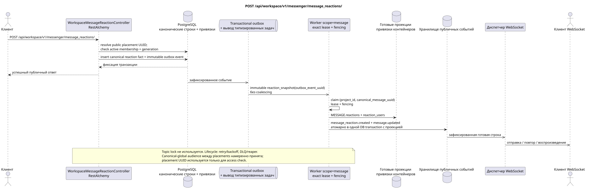

# POST /api/workspace/v1/messenger/message_reactions/

[← Главный индекс документации](../../../../index.md) · [Индекс диаграмм последовательности](../../README.md) · [Раздел Core Messenger](../README.md)

## Статус и граница текущего контракта

Целевая спецификация в подходе docs-first. Метод, путь, публичный JSON и авторизация следуют текущему контракту из [`workspace_api.md`](../../../../workspace_api.md); bounded pagination и asynchronous visibility следуют отдельно принятому target compatibility ADR.



Редактируемый исходник: [`post_message_reactions_create.puml`](diagrams/post_message_reactions_create.puml).

## Операция

**Метод и путь:** `POST /api/workspace/v1/messenger/message_reactions/`

**Назначение:** Создать один исходный факт реакции на каноническое сообщение.

## Публичный запрос

```json
{
  "message_uuid": "a93dca35-3061-4748-bda4-7f6f8c660ea5",
  "emoji_name": "thumbs_up"
}
```

## Успешный публичный ответ

HTTP `201`:

```json
{
  "uuid": "bd4b7632-8788-435a-93cc-6873657335c6",
  "project_id": "22222222-2222-2222-2222-222222222222",
  "message_uuid": "a93dca35-3061-4748-bda4-7f6f8c660ea5",
  "user_uuid": "11111111-1111-1111-1111-111111111111",
  "emoji_name": "thumbs_up",
  "provider": null,
  "delivery": null,
  "created_at": "2026-06-22T10:12:00Z",
  "updated_at": "2026-06-22T10:12:00Z"
}
```

## Публичные ошибки

Требуются bearer-токен IAM и область проекта. Некорректный UUID или тело запроса дают HTTP `400`; отсутствующий или недоступный в этой области ресурс — `404`. Стандартное документированное тело ошибки валидации:

```json
{
  "type": "ValidationErrorException",
  "code": 400,
  "message": "Validation error occurred."
}
```

Повтор той же комбинации пользователя, сообщения и emoji отклоняется; текущий контракт не определяет для этого отдельный код приложения.

## Целевая граница RestAlchemy

```python
from restalchemy.api import controllers
from restalchemy.api import resources
from restalchemy.dm import models
from restalchemy.dm import properties
from restalchemy.dm import types
from restalchemy.storage.sql import orm


class WorkspaceMessageReactionView(
    models.ModelWithUUID,
    models.ModelWithProject,
    orm.SQLStorableMixin,
):
    __tablename__ = "messenger_api_message_reactions_v1"

    message_uuid = properties.property(types.UUID(), read_only=True)
    canonical_message_uuid = properties.property(types.UUID(), read_only=True)
    user_uuid = properties.property(types.UUID(), read_only=True)


class WorkspaceMessageReactionController(controllers.BaseResourceControllerPaginated):
    __resource__ = resources.ResourceByRAModel(
        WorkspaceMessageReactionView, convert_underscore=False, process_filters=True,
    )
```

Публичное `message_uuid` — скалярный UUID placement; внутреннее
`canonical_message_uuid` скрыто field permissions. UUID исходного факта
публичен для ресурса реакции. Физические ссылки остаются индексированными FK, а
исходные метаданные провайдера/доставки закрыты.

## Синхронная транзакция

1. Интерпретировать публичный `message_uuid` как placement UUID, восстановить
   его canonical message и немедленно проверить active stream membership и
   matching generation.
2. Вставить один raw fact для текущего пользователя, canonical message и emoji;
   placement используется для authorization, а не как hidden public ID.
3. Добавить отдельное immutable event в transactional outbox; derived task
   уникальна по `outbox_event_uuid`, снимки синхронно не изменять.

Затрагиваемое состояние: факт реакции, привязки доступа и transactional outbox.

## Типизированные задачи и фоновый исполнитель

Задачи: отдельная immutable `reaction_snapshot` и при необходимости отдельная
`delivery_snapshot_event`; coalescing отсутствует.

Один fenced owner scope `message`
`(project_id, canonical_message_uuid)` читает актуальные факты и атомарно
заменяет `MESSAGE.reactions`/`reaction_users`; topic lock не используется.
Task lifecycle включает lease expiry, retry/backoff, DLQ и reaper.

## Публичные события и WebSocket

Для инициатора — `message_reaction.created`, затем для наблюдателя — `message.updated` через диспетчер.

## Идемпотентность, гонки и видимые клиенту временные характеристики

Уникальность `(project,canonical_message,user,emoji)` предотвращает дубликаты и
потерянные обновления. Revoke membership запрещает запрос сразу после commit,
независимо от stale message binding. Факт виден инициатору сразу, снимки и
события — асинхронно. Canonical-global snapshots намеренно видимы между
аудиториями разных placements: это принятое решение Critic risk #8.

[← Главный индекс документации](../../../../index.md) · [Индекс диаграмм последовательности](../../README.md) · [Раздел Core Messenger](../README.md)
