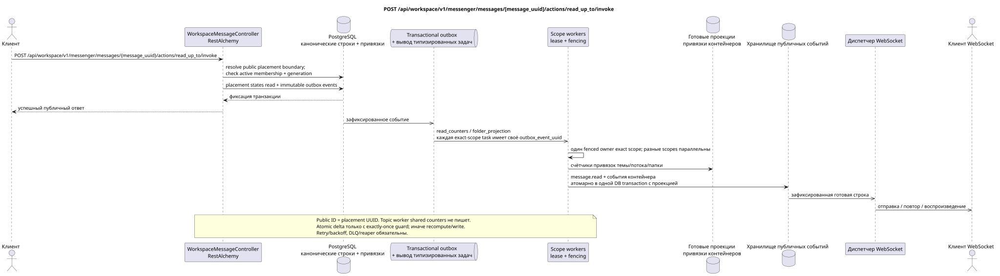

# POST /api/workspace/v1/messenger/messages/{message_uuid}/actions/read_up_to/invoke

[← Главный индекс документации](../../../../index.md) · [Индекс диаграмм последовательности](../../README.md) · [Раздел Core Messenger](../README.md)

## Статус и граница текущего контракта

Целевая спецификация в подходе docs-first. Метод, путь, публичный JSON и авторизация следуют текущему контракту из [`workspace_api.md`](../../../../workspace_api.md); bounded pagination и asynchronous visibility следуют отдельно принятому target compatibility ADR.



Редактируемый исходник: [`post_message_read_up_to_action.puml`](diagrams/post_message_read_up_to_action.puml).

## Операция

**Метод и путь:** `POST /api/workspace/v1/messenger/messages/{message_uuid}/actions/read_up_to/invoke`

**Назначение:** Отметить прочитанными сообщения темы текущего пользователя до
границы выбранного публичным placement UUID включительно.

## Публичный запрос

Без тела JSON.

## Успешный публичный ответ

HTTP `200`:

```json
{
  "uuid": "a93dca35-3061-4748-bda4-7f6f8c660ea5",
  "project_id": "22222222-2222-2222-2222-222222222222",
  "stream_uuid": "75309057-419c-4b12-a7c1-3932429ec4a6",
  "topic_uuid": "4ec0b996-b778-45f8-8ef4-ef863be0c047",
  "author_uuid": "11111111-1111-1111-1111-111111111111",
  "payload": {
    "kind": "markdown",
    "content": "Привет, Workspace"
  },
  "user_uuid": "33333333-3333-3333-3333-333333333333",
  "read": true,
  "pinned": false,
  "starred": false,
  "is_own": false,
  "mentioned": false,
  "reactions": {},
  "reaction_users": {},
  "source_name": "native",
  "source": {
    "kind": "native"
  },
  "provider": null,
  "delivery": null,
  "created_at": "2026-06-22T10:10:00Z",
  "updated_at": "2026-06-22T10:10:00Z"
}
```

## Публичные ошибки

Требуются bearer-токен IAM и область проекта. Некорректный UUID или тело запроса дают HTTP `400`; отсутствующий или недоступный в этой области ресурс — `404`. Стандартное документированное тело ошибки валидации:

```json
{
  "type": "ValidationErrorException",
  "code": 400,
  "message": "Validation error occurred."
}
```

Маршрут содержит публичный `MESSAGE_PLACEMENT.uuid`, поэтому конкретные stream и
topic выбираются однозначно даже при нескольких размещениях одного
канонического сообщения.

## Целевая граница RestAlchemy

```python
from restalchemy.api import controllers
from restalchemy.api import resources
from restalchemy.dm import models
from restalchemy.dm import properties
from restalchemy.dm import types
from restalchemy.storage.sql import orm


class WorkspaceUserMessage(models.ModelWithProject, orm.SQLStorableMixin):
    __tablename__ = "messenger_api_user_messages_v1"

    binding_uuid = properties.property(types.UUID(), id_property=True)
    uuid = properties.property(types.UUID(), read_only=True)
    stream_uuid = properties.property(types.UUID(), read_only=True)
    topic_uuid = properties.property(types.UUID(), read_only=True)
    author_uuid = properties.property(types.UUID(), read_only=True)
    user_uuid = properties.property(types.UUID(), read_only=True)


class WorkspaceMessageController(controllers.BaseResourceControllerPaginated):
    __resource__ = resources.ResourceByRAModel(
        WorkspaceUserMessage, convert_underscore=False, process_filters=True,
    )
```

Публичный `uuid` и route ID равны `MESSAGE_PLACEMENT.uuid`; canonical `MESSAGE.uuid` и `binding_uuid` скрыты. Placement однозначно задаёт stream/topic boundary, а action синхронно проверяет active membership и generation.

## Синхронная транзакция

1. Разрешить публичный placement UUID в границу
   `(MESSAGE.created_at, MESSAGE_PLACEMENT.uuid)` и явный контекст темы.
2. Установить применимые маркеры прочтения USER_MESSAGE_STATE.
3. Добавить отдельное immutable outbox event для каждой выводимой task
   фактической области чтения диапазона.

Затрагиваемое состояние: USER_MESSAGE_STATE, область доступа и transactional outbox; счётчики контейнеров никогда не хранятся в привязке сообщения.

## Типизированные задачи и фоновый исполнитель

Задачи: отдельные immutable `read_counters` для exact `user-stream` и
`user-topic`, а также `folder_projection` для exact `user-folder`; каждой task
соответствует собственное source outbox event, coalescing отсутствует.

Fenced owners scopes `user-stream`, `user-topic` и `user-folder` идемпотентно
обновляют готовые счётчики/snapshot. Topic worker эти shared rows не пишет. Atomic delta
допустима только с exactly-once guard по `outbox_event_uuid`; иначе scope worker
пересчитывает/заменяет строку. Task lifecycle включает retry/backoff, DLQ/reaper.

## Публичные события и WebSocket

`message.read`, обновления темы, потока и папки

## Идемпотентность, гонки и видимые клиенту временные характеристики

Установка состояния идемпотентна; текущее состояние меняется сразу, а агрегаты и события могут ненадолго отставать.

[← Главный индекс документации](../../../../index.md) · [Индекс диаграмм последовательности](../../README.md) · [Раздел Core Messenger](../README.md)
