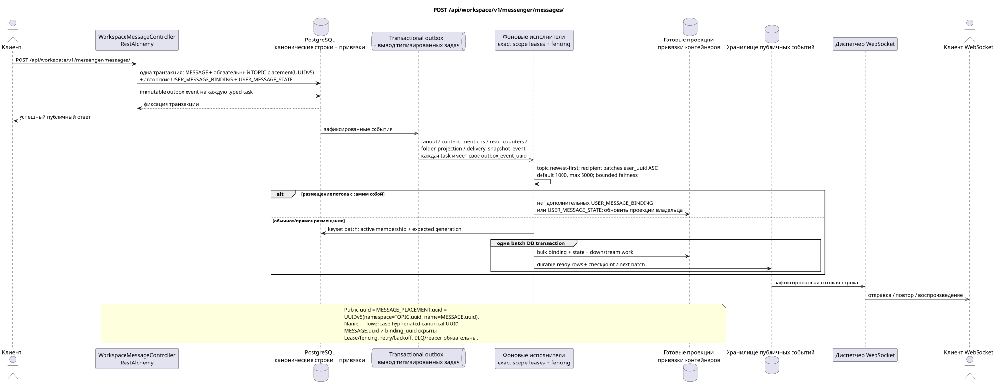

# POST /api/workspace/v1/messenger/messages/

[← Главный индекс документации](../../../../index.md) · [Индекс диаграмм последовательности](../../README.md) · [Раздел Core Messenger](../README.md)

## Статус и граница текущего контракта

Целевая спецификация в подходе docs-first. Метод, путь, публичный JSON и авторизация следуют текущему контракту из [`workspace_api.md`](../../../../workspace_api.md); bounded pagination и asynchronous visibility следуют отдельно принятому target compatibility ADR.



Редактируемый исходник: [`post_messages_create.puml`](diagrams/post_messages_create.puml).

## Операция

**Метод и путь:** `POST /api/workspace/v1/messenger/messages/`

**Назначение:** Создать одно каноническое markdown-сообщение и его начальное размещение.

## Публичный запрос

```json
{
  "stream_uuid": "75309057-419c-4b12-a7c1-3932429ec4a6",
  "topic_uuid": "4ec0b996-b778-45f8-8ef4-ef863be0c047",
  "payload": {
    "kind": "markdown",
    "content": "Привет, Workspace"
  }
}
```

## Успешный публичный ответ

HTTP `201`:

```json
{
  "uuid": "a93dca35-3061-4748-bda4-7f6f8c660ea5",
  "project_id": "22222222-2222-2222-2222-222222222222",
  "stream_uuid": "75309057-419c-4b12-a7c1-3932429ec4a6",
  "topic_uuid": "4ec0b996-b778-45f8-8ef4-ef863be0c047",
  "author_uuid": "11111111-1111-1111-1111-111111111111",
  "payload": {
    "kind": "markdown",
    "content": "Привет, Workspace"
  },
  "user_uuid": "11111111-1111-1111-1111-111111111111",
  "read": true,
  "pinned": false,
  "starred": false,
  "is_own": true,
  "mentioned": false,
  "reactions": {},
  "reaction_users": {},
  "source_name": "native",
  "source": {
    "kind": "native"
  },
  "provider": null,
  "delivery": null,
  "created_at": "2026-06-22T10:10:00Z",
  "updated_at": "2026-06-22T10:10:00Z"
}
```

## Публичные ошибки

Требуются bearer-токен IAM и область проекта. Некорректный UUID или тело запроса дают HTTP `400`; отсутствующий или недоступный в этой области ресурс — `404`. Стандартное документированное тело ошибки валидации:

```json
{
  "type": "ValidationErrorException",
  "code": 400,
  "message": "Validation error occurred."
}
```

Отсутствующая тема или отсутствие темы по умолчанию даёт `400001007` (`StreamDefaultTopicNotConfiguredError`); markdown после удаления краевых пробелов должен содержать от 1 до 40 000 символов.

## Целевая граница RestAlchemy

```python
from restalchemy.api import controllers
from restalchemy.api import resources
from restalchemy.dm import models
from restalchemy.dm import properties
from restalchemy.dm import types
from restalchemy.storage.sql import orm


class WorkspaceUserMessage(models.ModelWithProject, orm.SQLStorableMixin):
    __tablename__ = "messenger_api_user_messages_v1"

    binding_uuid = properties.property(types.UUID(), id_property=True)
    uuid = properties.property(types.UUID(), read_only=True)
    stream_uuid = properties.property(types.UUID(), read_only=True)
    topic_uuid = properties.property(types.UUID(), read_only=True)
    author_uuid = properties.property(types.UUID(), read_only=True)
    user_uuid = properties.property(types.UUID(), read_only=True)


class WorkspaceMessageController(controllers.BaseResourceControllerPaginated):
    __resource__ = resources.ResourceByRAModel(
        WorkspaceUserMessage, convert_underscore=False, process_filters=True,
    )
```

Публичный `uuid` и route ID равны `MESSAGE_PLACEMENT.uuid`, вычисленному как `UUIDv5(namespace=TOPIC.uuid, name=MESSAGE.uuid)`; name — lowercase hyphenated canonical UUID. `MESSAGE.uuid` внутренний, `binding_uuid` скрыт. `topic_uuid` физически обязателен; публичный null/omission сначала разрешается в canonical default topic.

## Синхронная транзакция

1. Проверить текущий доступ к потоку и теме.
2. Вставить одну `MESSAGE`.
3. Вычислить детерминированный placement UUID и вставить одну `MESSAGE_PLACEMENT`; retry той же пары topic/message возвращает тот же UUID.
4. Вставить авторские `USER_MESSAGE_BINDING` и
   `USER_MESSAGE_STATE (read=true)`.
5. Добавить в той же транзакции отдельное неизменяемое outbox event для каждой
   выводимой initial typed task.

Синхронная транзакция ограничена именно набором `MESSAGE` +
`MESSAGE_PLACEMENT` + авторская `USER_MESSAGE_BINDING` + авторский
`USER_MESSAGE_STATE` + transactional outbox.

## Типизированные задачи и фоновый исполнитель

Задачи: `fanout`, `content_mentions`, `read_counters`, `folder_projection` и,
когда применимо, провайдерская `delivery_snapshot_event`; каждая имеет
собственный source outbox event.

Слот эксклюзивно занимает `(project_id, topic_uuid)`, обрабатывает сообщения по
`MESSAGE.created_at DESC`, а recipients — immutable keyset batches по
`user_uuid ASC`: default `1000`, hard maximum `5000`, без `OFFSET` и unbounded
transaction. Каждый batch повторно проверяет active membership/generation,
атомарно пишет binding/state, downstream work и ready events, затем checkpoint;
retry повторяет только batch. Stale task делает no-op; self-chat не добавляет
второй комплект.

## Публичные события и WebSocket

Worker атомарно фиксирует проекцию и ready `message.created`/
`topic.updated`/`stream.updated` rows. Dispatcher доставляет уже durable events.

## Идемпотентность, гонки и видимые клиенту временные характеристики

Каноническое содержимое хранится в одном экземпляре; business key и UUIDv5
делают повтор placement idempotent. Автор видит сообщение сразу (`201` =
primary commit), получатели/проекции могут отставать; около секунды — SLO intent,
не гарантия. Bounded fairness не даёт большой аудитории вытеснить старую работу.

[← Главный индекс документации](../../../../index.md) · [Индекс диаграмм последовательности](../../README.md) · [Раздел Core Messenger](../README.md)
