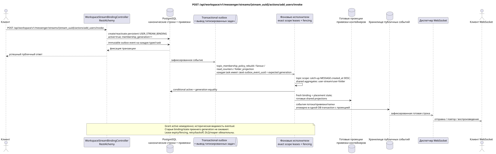

# POST /api/workspace/v1/messenger/streams/{stream_uuid}/actions/add_users/invoke

[← Главный индекс документации](../../../../index.md) · [Индекс диаграмм последовательности](../../README.md) · [Раздел Core Messenger](../README.md)

## Статус и граница текущего контракта

Целевая спецификация в подходе docs-first. Метод, путь, публичный JSON и авторизация следуют текущему контракту из [`workspace_api.md`](../../../../workspace_api.md); bounded pagination и asynchronous visibility следуют отдельно принятому target compatibility ADR.



Редактируемый исходник: [`post_stream_add_users_action.puml`](diagrams/post_stream_add_users_action.puml).

## Операция

**Метод и путь:** `POST /api/workspace/v1/messenger/streams/{stream_uuid}/actions/add_users/invoke`

**Назначение:** Добавить пользователей в обычный поток, сгруппировав их по ролям.

## Публичный запрос

```json
{
  "member": [
    "33333333-3333-3333-3333-333333333333",
    "44444444-4444-4444-4444-444444444444"
  ],
  "owner": [
    "55555555-5555-5555-5555-555555555555"
  ]
}
```

## Успешный публичный ответ

HTTP `200`:

```json
[
  {
    "uuid": "3195a887-da5d-440b-bdf8-0d3d995a9e01",
    "project_id": "22222222-2222-2222-2222-222222222222",
    "stream_uuid": "75309057-419c-4b12-a7c1-3932429ec4a6",
    "user_uuid": "33333333-3333-3333-3333-333333333333",
    "who_uuid": "11111111-1111-1111-1111-111111111111",
    "role": "member",
    "notification_mode": "all_messages",
    "notification_updated_at": "1970-01-01T00:00:00Z",
    "created_at": "2026-06-22T09:05:00Z",
    "updated_at": "2026-06-22T09:05:00Z"
  },
  {
    "uuid": "4295a887-da5d-440b-bdf8-0d3d995a9e02",
    "project_id": "22222222-2222-2222-2222-222222222222",
    "stream_uuid": "75309057-419c-4b12-a7c1-3932429ec4a6",
    "user_uuid": "44444444-4444-4444-4444-444444444444",
    "who_uuid": "11111111-1111-1111-1111-111111111111",
    "role": "member",
    "notification_mode": "all_messages",
    "notification_updated_at": "1970-01-01T00:00:00Z",
    "created_at": "2026-06-22T09:05:00Z",
    "updated_at": "2026-06-22T09:05:00Z"
  }
]
```

## Публичные ошибки

Требуются bearer-токен IAM и область проекта. Некорректный UUID или тело запроса дают HTTP `400`; отсутствующий или недоступный в этой области ресурс — `404`. Стандартное документированное тело ошибки валидации:

```json
{
  "type": "ValidationErrorException",
  "code": 400,
  "message": "Validation error occurred."
}
```

Неподдерживаемая роль даёт `400001004`; пользователи не в форме списка — `400001005`; изменение членства прямого потока или потока с самим собой — `400`.

## Целевая граница RestAlchemy

```python
from restalchemy.api import controllers
from restalchemy.api import resources
from restalchemy.dm import models
from restalchemy.dm import properties
from restalchemy.dm import types
from restalchemy.storage.sql import orm


class WorkspaceStreamBindingView(
    models.ModelWithUUID,
    models.ModelWithProject,
    orm.SQLStorableMixin,
):
    __tablename__ = "messenger_api_stream_bindings_v1"

    stream_uuid = properties.property(types.UUID(), read_only=True)
    user_uuid = properties.property(types.UUID(), read_only=True)
    who_uuid = properties.property(types.UUID(), read_only=True)


class WorkspaceStreamBindingController(controllers.BaseResourceControllerPaginated):
    __resource__ = resources.ResourceByRAModel(
        WorkspaceStreamBindingView, convert_underscore=False, process_filters=True,
    )
```

Публичные ссылки на сущности представлены скалярными свойствами `types.UUID()`, а не отношениями RestAlchemy, которые сериализуются в URI. Физические столбцы `*_uuid` остаются индексированными внешними ключами с явно выбранными действиями ссылочной целостности. USER_STREAM_BINDING уникальна по `(project_id, stream_uuid, user_uuid)` и физически может хранить готовые счётчики, но её текущий публичный JSON привязки не меняется.

## Синхронная транзакция

1. Проверить ролевой доступ к обычному потоку.
2. Для каждого пользователя создать persistent `USER_STREAM_BINDING` с
   `active = true` и начальным `membership_generation` либо реактивировать
   tombstone, предварительно увеличив generation; `who_uuid` равен текущему
   пользователю. Старое поколение не переиспользуется.
3. Добавить immutable transactional outbox event для каждой выводимой typed
   task; одно событие не схлопывается с другим.

Затрагиваемое состояние: пакет USER_STREAM_BINDING и transactional outbox.

## Типизированные задачи и фоновый исполнитель

Задачи: отдельные immutable `topic_membership_policy_rebuild`, `fanout`,
`read_counters` и `folder_projection`; каждая task имеет собственный source
`outbox_event_uuid`, exact scope key и ожидаемый `membership_generation` там,
где результат зависит от membership.

Ответ означает, что membership активно немедленно, но историческая видимость
сообщений появляется асинхронно. Topic-scoped worker создаёт fresh
`USER_MESSAGE_BINDING` + placement-scoped `USER_MESSAGE_STATE` только если
membership остаётся active и generation совпадает; stale task делает no-op.
Shared aggregates обновляют отдельные владельцы `user-stream`/`user-folder`.
Все tasks используют lease/fencing, retry/backoff, DLQ/reaper и идемпотентный
effect guard. Старые bindings/state прежнего поколения автоматически не
становятся видимыми.

## Публичные события и WebSocket

Для нового пользователя — `stream.created`, для существующего — `stream_bindings.created`, а также обновления папок.

## Идемпотентность, гонки и видимые клиенту временные характеристики

Уникальный ключ потока и пользователя и монотонный generation управляют
конкурентностью. Ответ с active membership возвращается сразу, историческая
видимость сообщений/тем достигается асинхронно после projection commit и только
тогда порождает ready WebSocket events.

[← Главный индекс документации](../../../../index.md) · [Индекс диаграмм последовательности](../../README.md) · [Раздел Core Messenger](../README.md)
