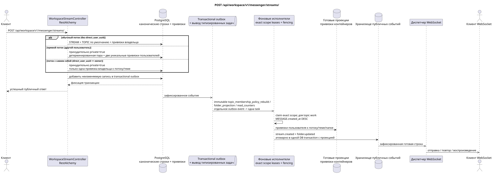

# POST /api/workspace/v1/messenger/streams/


Общий target-инвариант надёжности: каждое immutable outbox event выводит ровно одну immutable typed task с уникальным `outbox_event_uuid`; coalescing отсутствует. Task хранит фактический exact scope key, использует lease/fencing, retry/backoff, max attempts/DLQ, reaper и идемпотентный effect guard. Topic scope применяется только к placement/message-binding work; shared rows не получают неявный fallback на topic.

[← Главный индекс документации](../../../../index.md) · [Индекс диаграмм последовательности](../../README.md) · [Раздел Core Messenger](../README.md)

## Статус и граница текущего контракта

Целевая спецификация в подходе docs-first. Метод, путь, публичный JSON и авторизация следуют текущему контракту из [`workspace_api.md`](../../../../workspace_api.md); bounded pagination и asynchronous visibility следуют отдельно принятому target compatibility ADR.



Редактируемый исходник: [`post_streams_create.puml`](diagrams/post_streams_create.puml).

## Операция

**Метод и путь:** `POST /api/workspace/v1/messenger/streams/`

**Назначение:** Создать канонический поток, привязку владельца и тему по умолчанию; идентификатор прямого потока обрабатывается идемпотентно.

## Публичный запрос

Обычный поток:

```json
{
  "name": "Инженерия",
  "description": "Инженерное пространство",
  "source_name": "native",
  "source": {
    "kind": "native"
  },
  "invite_only": false,
  "announce": false
}
```

Прямой поток:

```json
{
  "name": "Прямой поток",
  "description": "Приватное пространство",
  "source_name": "native",
  "source": {
    "kind": "native"
  },
  "direct_user_uuid": "33333333-3333-3333-3333-333333333333"
}
```

Поток с самим собой:

```json
{
  "name": "Личные заметки",
  "description": "",
  "source_name": "native",
  "source": {
    "kind": "native"
  },
  "direct_user_uuid": "11111111-1111-1111-1111-111111111111"
}
```

## Успешный публичный ответ

Новый ресурс: HTTP `201`; существующая детерминированная пара прямого потока: HTTP `200`. Пример потока с самим собой:

```json
{
  "uuid": "64184b31-e43c-5b0d-95f8-b7b50bdc03c9",
  "name": "Личные заметки",
  "description": "",
  "project_id": "22222222-2222-2222-2222-222222222222",
  "owner": "11111111-1111-1111-1111-111111111111",
  "user_uuid": "11111111-1111-1111-1111-111111111111",
  "role": "owner",
  "notification_mode": "all_messages",
  "unread_count": 0,
  "active_unread_count": 0,
  "passive_unread_count": 0,
  "source_name": "native",
  "source": {
    "kind": "native"
  },
  "invite_only": false,
  "announce": false,
  "direct_user_uuid": "11111111-1111-1111-1111-111111111111",
  "private": true,
  "is_archived": false,
  "color": 3368601,
  "default_topic_uuid": "4ec0b996-b778-45f8-8ef4-ef863be0c047",
  "created_at": "2026-06-22T09:00:00Z",
  "updated_at": "2026-06-22T09:00:00Z"
}
```

## Публичные ошибки

Требуются bearer-токен IAM и область проекта. Некорректный UUID или тело запроса дают HTTP `400`; отсутствующий или недоступный в этой области ресурс — `404`. Стандартное документированное тело ошибки валидации:

```json
{
  "type": "ValidationErrorException",
  "code": 400,
  "message": "Validation error occurred."
}
```

Конфликт идентичности или источника прямого потока и изменение членства прямого потока дают `400`; удаление потока с самим собой также даёт `400`.

## Целевая граница RestAlchemy

```python
from restalchemy.api import controllers
from restalchemy.api import resources
from restalchemy.dm import models
from restalchemy.dm import properties
from restalchemy.dm import types
from restalchemy.storage.sql import orm


class WorkspaceUserStream(
    models.ModelWithUUID,
    models.ModelWithProject,
    orm.SQLStorableMixin,
):
    __tablename__ = "messenger_api_user_streams_v1"

    owner = properties.property(types.UUID(), read_only=True)
    user_uuid = properties.property(types.UUID(), read_only=True)
    direct_user_uuid = properties.property(
        types.AllowNone(types.UUID()), default=None, read_only=True,
    )
    last_message_uuid = properties.property(types.UUID(), read_only=True)
    default_topic_uuid = properties.property(types.UUID(), read_only=True)


class WorkspaceStreamController(controllers.BaseResourceControllerPaginated):
    __resource__ = resources.ResourceByRAModel(
        WorkspaceUserStream, convert_underscore=False, process_filters=True,
    )
```

Публичные ссылки на сущности представлены скалярными свойствами `types.UUID()`, а не отношениями RestAlchemy, которые сериализуются в URI. Физические столбцы `*_uuid` остаются индексированными внешними ключами с явно выбранными действиями ссылочной целостности. Публичное поле `owner` является свойством UUID; физическое поле `owner_uuid` — индексированным внешним ключом пользователя. USER_STREAM_BINDING хранит готовые счётчики уровня потока.

## Синхронная транзакция

1. Вывести детерминированную пару прямого потока; любое значение `direct_user_uuid` принудительно устанавливает `private=true`.
2. Вставить STREAM и TOPIC по умолчанию.
3. Вставить уникальные привязки владельца к потоку и теме; для потока с самим собой вставить только одного пользователя.
4. Добавить неизменяемую запись в transactional outbox.

Затрагиваемое состояние: STREAM, TOPIC, USER_STREAM_BINDING, USER_TOPIC_BINDING и transactional outbox.

## Типизированные задачи и фоновый исполнитель

Задачи: `topic_membership_policy_rebuild` и точные `folder_projection`/`read_counters` для затронутых контейнеров.

Фоновые исполнители создают оставшиеся готовые проекции контейнеров и события; у потока с самим собой нет второго участника. Последующее распределение сообщений fan-out не создаёт дополнительную привязку сообщения пользователя. Разные темы могут обрабатываться параллельно в пределах настраиваемого лимита; внутри одной занятой темы канонические сообщения получают приоритет по `MESSAGE.created_at DESC`, при этом более старая работа со временем также продвигается.

## Публичные события и WebSocket

Участнику отправляются `stream.created` и обновления папок через диспетчер.

## Идемпотентность, гонки и видимые клиенту временные характеристики

Ключ пары и уникальные привязки делают конкурентный повтор идемпотентным. Создатель видит поток сразу, проекции и события — асинхронно.

[← Главный индекс документации](../../../../index.md) · [Индекс диаграмм последовательности](../../README.md) · [Раздел Core Messenger](../README.md)
