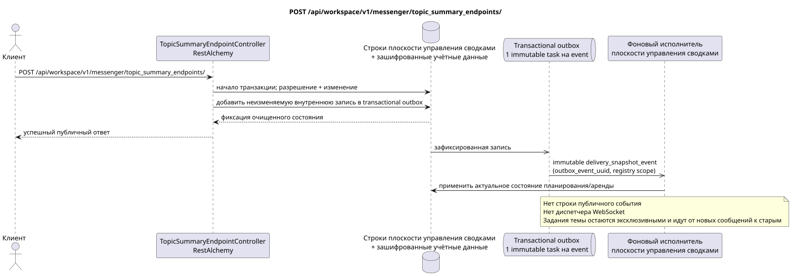

# POST /api/workspace/v1/messenger/topic_summary_endpoints/

[← Главный индекс документации](../../../../index.md) · [Индекс диаграмм последовательности](../../README.md) · [Раздел Core Messenger](../README.md)

## Статус и граница текущего контракта

Целевая спецификация в подходе docs-first. HTTP-контракт остаётся текущим контрактом из [`workspace_api.md`](../../../../workspace_api.md); целевые внутренние механизмы являются только предложением.



Редактируемый исходник: [`post_topic_summary_endpoints_create.puml`](diagrams/post_topic_summary_endpoints_create.puml).

## Операция

**Метод и путь:** `POST /api/workspace/v1/messenger/topic_summary_endpoints/`

**Назначение:** Создать глобальную конечную точку сводок с учётными данными, доступными только для записи.

## Публичный запрос

```json
{
  "uuid": "e4ad6d80-6bc7-4a91-864c-8e97319a82bd",
  "name": "primary-summary-model",
  "base_url": "https://llm.example.com/v1",
  "model": "summary-model",
  "api_key": "<учётные данные только для записи>",
  "enabled": true,
  "priority": 10,
  "supports_vision": true,
  "supports_reasoning": true,
  "temperature": 0.2,
  "max_output_tokens": 512,
  "top_p": 1,
  "presence_penalty": 0,
  "frequency_penalty": 0
}
```

## Успешный публичный ответ

HTTP `201`:

```json
{
  "uuid": "e4ad6d80-6bc7-4a91-864c-8e97319a82bd",
  "name": "primary-summary-model",
  "base_url": "https://llm.example.com/v1",
  "model": "summary-model",
  "enabled": true,
  "priority": 10,
  "supports_vision": true,
  "supports_reasoning": true,
  "temperature": 0.2,
  "max_output_tokens": 512,
  "top_p": 1,
  "presence_penalty": 0,
  "frequency_penalty": 0,
  "credential_present": true,
  "failure_count": 0,
  "created_at": "2026-06-22T08:00:00Z",
  "updated_at": "2026-06-22T08:00:00Z"
}
```

Поля временных меток состояния и ошибок могут отсутствовать в ответе, если допускают `null` и имеют это значение. `api_key` и токен активной заявки никогда не возвращаются.

## Публичные ошибки

Требуется bearer-токен IAM. Некорректный UUID или тело запроса дают HTTP `400`; отсутствие разрешения на управление — `403`. Стандартное тело ошибки валидации:

```json
{
  "type": "ValidationErrorException",
  "code": 400,
  "message": "Validation error occurred."
}
```

Для каждой операции с реестром конечных точек требуется `workspace.topic_summary_endpoint.manage`; отсутствующая конечная точка даёт `404`.

## Целевая граница RestAlchemy

```python
from restalchemy.api import controllers
from restalchemy.api import resources
from restalchemy.dm import models
from restalchemy.dm import properties
from restalchemy.dm import types
from restalchemy.storage.sql import orm


class WorkspaceTopicSummaryEndpoint(
    models.ModelWithUUID,
    models.ModelWithTimestamp,
    orm.SQLStorableMixin,
):
    __tablename__ = "messenger_topic_summary_endpoints"

    name = properties.property(types.String(max_length=255), required=True)
    base_url = properties.property(types.String(max_length=2048), required=True)
    model = properties.property(types.String(max_length=255), required=True)
    credential_present = properties.property(types.Boolean(), read_only=True)


class TopicSummaryEndpointController(controllers.BaseResourceControllerPaginated):
    __resource__ = resources.ResourceByRAModel(
        WorkspaceTopicSummaryEndpoint,
        convert_underscore=False,
        process_filters=True,
    )
```

У этого глобального ресурса нет публичных полей отношений с сущностями. Его публичное поле `uuid` — скалярное свойство UUID. Любой внутренний внешний ключ или ссылка на учётные данные индексируется и имеет явно заданное действие ссылочной целостности; `api_key` доступен только для записи, хранится в зашифрованном виде и никогда не сериализуется.

## Синхронная транзакция

1. Потребовать `workspace.topic_summary_endpoint.manage`.
2. Проверить UUID, OpenAI-совместимый базовый URL и диапазоны генерации.
3. Зашифровать и сохранить учётные данные, затем вставить конечную точку.
4. Добавить неизменяемую внутреннюю запись в transactional outbox.

## Типизированная задача и фоновый исполнитель

Отдельная immutable `delivery_snapshot_event` task с exact scope реестра
конечных точек для source outbox event; unique `outbox_event_uuid`, без
coalescing.

Задача плоскости управления обновляет порядок подходящих конечных точек и их аренды. Она сама не обрабатывает MESSAGE; последующая работа со сводкой темы остаётся эксклюзивной для темы и идёт от новых сообщений к старым.

## Публичные события, повторы и временные характеристики

Клиент сразу получает очищенную конечную точку; публичное событие Workspace или запись WebSocket не создаётся. Конфликты повторов UUID следуют текущей семантике создания; учётные данные никогда не попадают в журналы, события или ответы.

Для этой административной операции нет готового публичного события Workspace, поэтому диспетчер WebSocket в ней не участвует.

[← Главный индекс документации](../../../../index.md) · [Индекс диаграмм последовательности](../../README.md) · [Раздел Core Messenger](../README.md)
