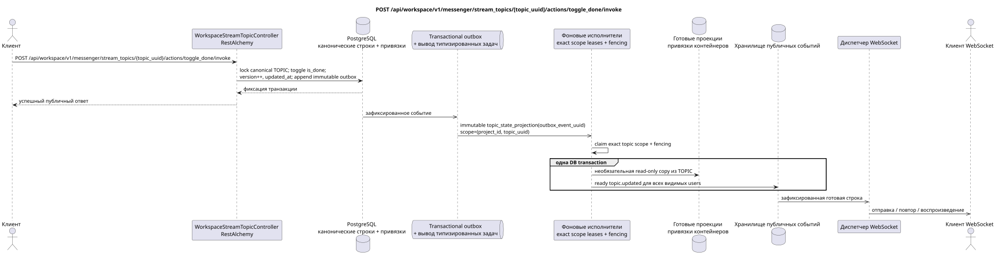

# POST /api/workspace/v1/messenger/stream_topics/{topic_uuid}/actions/toggle_done/invoke

[← Главный индекс документации](../../../../index.md) · [Индекс диаграмм последовательности](../../README.md) · [Раздел Core Messenger](../README.md)

## Статус и граница текущего контракта

Целевая спецификация в подходе docs-first. Метод, путь, публичный JSON и авторизация следуют текущему контракту из [`workspace_api.md`](../../../../workspace_api.md); bounded pagination и asynchronous visibility следуют отдельно принятому target compatibility ADR.



Редактируемый исходник: [`post_topic_toggle_done_action.puml`](diagrams/post_topic_toggle_done_action.puml).

## Операция

**Метод и путь:** `POST /api/workspace/v1/messenger/stream_topics/{topic_uuid}/actions/toggle_done/invoke`

**Назначение:** Переключить общий признак завершения.

## Публичный запрос

Без тела JSON.

## Успешный публичный ответ

HTTP `200`:

```json
{
  "uuid": "4ec0b996-b778-45f8-8ef4-ef863be0c047",
  "project_id": "22222222-2222-2222-2222-222222222222",
  "name": "Релизы",
  "stream_uuid": "75309057-419c-4b12-a7c1-3932429ec4a6",
  "user_uuid": "11111111-1111-1111-1111-111111111111",
  "color": 4491468,
  "last_message_uuid": "a93dca35-3061-4748-bda4-7f6f8c660ea5",
  "unread_count": 2,
  "active_unread_count": 2,
  "passive_unread_count": 0,
  "is_default": false,
  "is_done": true,
  "notification_mode": "default",
  "summary": null,
  "summary_last_message_uuid": null,
  "summary_has_new_messages": null,
  "summary_enabled": true,
  "summary_system_prompt": null,
  "summary_reasoning_effort": null,
  "source_name": "native",
  "source": {
    "kind": "native"
  },
  "provider": null,
  "delivery": null,
  "created_at": "2026-06-22T09:10:00Z",
  "updated_at": "2026-06-22T10:20:00Z"
}
```

## Публичные ошибки

Требуются bearer-токен IAM и область проекта. Некорректный UUID или тело запроса дают HTTP `400`; отсутствующий или недоступный в этой области ресурс — `404`. Стандартное документированное тело ошибки валидации:

```json
{
  "type": "ValidationErrorException",
  "code": 400,
  "message": "Validation error occurred."
}
```

## Целевая граница RestAlchemy

```python
from restalchemy.api import controllers
from restalchemy.api import resources
from restalchemy.dm import models
from restalchemy.dm import properties
from restalchemy.dm import types
from restalchemy.storage.sql import orm


class WorkspaceUserTopic(
    models.ModelWithUUID,
    models.ModelWithProject,
    orm.SQLStorableMixin,
):
    __tablename__ = "messenger_api_user_topics_v1"

    stream_uuid = properties.property(types.UUID(), read_only=True)
    user_uuid = properties.property(types.UUID(), read_only=True)
    last_message_uuid = properties.property(types.UUID(), read_only=True)
    summary_last_message_uuid = properties.property(types.UUID(), read_only=True)


class WorkspaceStreamTopicController(controllers.BaseResourceControllerPaginated):
    __resource__ = resources.ResourceByRAModel(
        WorkspaceUserTopic, convert_underscore=False, process_filters=True,
    )
```

Публичные ссылки на сущности представлены скалярными свойствами `types.UUID()`, а не отношениями RestAlchemy, которые сериализуются в URI. Физические столбцы `*_uuid` остаются индексированными внешними ключами с явно выбранными действиями ссылочной целостности. TOPIC является канонической сущностью; уникальная USER_TOPIC_BINDING обеспечивает видимость, персональное состояние и готовые счётчики темы.

## Синхронная транзакция

1. Разрешить project-scoped topic и active stream membership; повторно проверить
   authorization внутри транзакции.
2. Заблокировать canonical `TOPIC` row, атомарно переключить `TOPIC.is_done`,
   увеличить `TOPIC.version` и обновить `updated_at`.
3. Добавить immutable `topic_state_projection` outbox event в той же
   транзакции и вернуть view, где `is_done` читается из canonical `TOPIC`.

Затрагиваемое authoritative state: только canonical `TOPIC` и transactional
outbox. `USER_TOPIC_BINDING` хранит access/notification/counts и не является
writable source `is_done`; `USER_MESSAGE_STATE` эта команда не меняет.

## Типизированные задачи и фоновый исполнитель

Задача: одна immutable `topic_state_projection` для source event, scope
`topic (project_id,topic_uuid)`. Fenced owner создаёт готовые `topic.updated`
rows; если после измерений появится read-only copy `is_done` в view/binding, он
только перестраивает её из canonical `TOPIC`. Projection и все ready event rows
фиксируются одной DB transaction. Retry/backoff, DLQ/reaper и idempotent effect
по `outbox_event_uuid` обязательны.

## Публичные события и WebSocket

`topic.updated` для всех пользователей. Диспетчер доставляет зафиксированные готовые строки.

## Идемпотентность, гонки и видимые клиенту временные характеристики

Row lock/version сериализует toggle и исключает lost update. Если transaction
не зафиксирована, сервер возвращает существующую ошибку; при неоднозначном
transport retry клиент сначала читает canonical state и не повторяет toggle
вслепую. Вызывающий видит canonical state сразу, готовые события — асинхронно.

[← Главный индекс документации](../../../../index.md) · [Индекс диаграмм последовательности](../../README.md) · [Раздел Core Messenger](../README.md)
