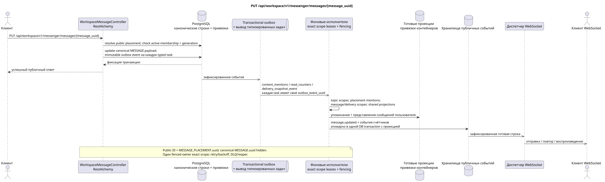

# PUT /api/workspace/v1/messenger/messages/{message_uuid}

[← Главный индекс документации](../../../../index.md) · [Индекс диаграмм последовательности](../../README.md) · [Раздел Core Messenger](../README.md)

## Статус и граница текущего контракта

Целевая спецификация в подходе docs-first. Метод, путь, публичный JSON и авторизация следуют текущему контракту из [`workspace_api.md`](../../../../workspace_api.md); bounded pagination и asynchronous visibility следуют отдельно принятому target compatibility ADR.



Редактируемый исходник: [`put_message.puml`](diagrams/put_message.puml).

## Операция

**Метод и путь:** `PUT /api/workspace/v1/messenger/messages/{message_uuid}`

**Назначение:** Заменить payload канонического сообщения после проверок автора и доступа.

## Публичный запрос

```json
{
  "payload": {
    "kind": "markdown",
    "content": "Отредактированный текст"
  }
}
```

## Успешный публичный ответ

HTTP `200`:

```json
{
  "uuid": "a93dca35-3061-4748-bda4-7f6f8c660ea5",
  "project_id": "22222222-2222-2222-2222-222222222222",
  "stream_uuid": "75309057-419c-4b12-a7c1-3932429ec4a6",
  "topic_uuid": "4ec0b996-b778-45f8-8ef4-ef863be0c047",
  "author_uuid": "11111111-1111-1111-1111-111111111111",
  "payload": {
    "kind": "markdown",
    "content": "Отредактированный текст"
  },
  "user_uuid": "11111111-1111-1111-1111-111111111111",
  "read": true,
  "pinned": false,
  "starred": false,
  "is_own": true,
  "mentioned": false,
  "reactions": {},
  "reaction_users": {},
  "source_name": "native",
  "source": {
    "kind": "native"
  },
  "provider": null,
  "delivery": null,
  "created_at": "2026-06-22T10:10:00Z",
  "updated_at": "2026-06-22T10:11:00Z"
}
```

## Публичные ошибки

Требуются bearer-токен IAM и область проекта. Некорректный UUID или тело запроса дают HTTP `400`; отсутствующий или недоступный в этой области ресурс — `404`. Стандартное документированное тело ошибки валидации:

```json
{
  "type": "ValidationErrorException",
  "code": 400,
  "message": "Validation error occurred."
}
```

## Целевая граница RestAlchemy

```python
from restalchemy.api import controllers
from restalchemy.api import resources
from restalchemy.dm import models
from restalchemy.dm import properties
from restalchemy.dm import types
from restalchemy.storage.sql import orm


class WorkspaceUserMessage(models.ModelWithProject, orm.SQLStorableMixin):
    __tablename__ = "messenger_api_user_messages_v1"

    binding_uuid = properties.property(types.UUID(), id_property=True)
    uuid = properties.property(types.UUID(), read_only=True)
    stream_uuid = properties.property(types.UUID(), read_only=True)
    topic_uuid = properties.property(types.UUID(), read_only=True)
    author_uuid = properties.property(types.UUID(), read_only=True)
    user_uuid = properties.property(types.UUID(), read_only=True)


class WorkspaceMessageController(controllers.BaseResourceControllerPaginated):
    __resource__ = resources.ResourceByRAModel(
        WorkspaceUserMessage, convert_underscore=False, process_filters=True,
    )
```

Публичный `uuid` и идентификатор маршрута равны `MESSAGE_PLACEMENT.uuid = UUIDv5(namespace=TOPIC.uuid, name=MESSAGE.uuid)`; name — lowercase hyphenated canonical UUID. Канонический `MESSAGE.uuid` внутренний; `binding_uuid` остаётся скрытым техническим ORM-ключом. Контроллер разрешает placement и синхронно проверяет active membership плюс совпадение generation.

## Синхронная транзакция

1. Разрешить public placement UUID, active membership и generation через применимую привязку.
2. Проверить автора.
3. Обновить MESSAGE.payload.
4. Добавить отдельные immutable outbox events для выводимых
   `content_mentions`, `read_counters` и `delivery_snapshot_event` tasks.

Затрагиваемое состояние: MESSAGE и transactional outbox; размещения остаются ссылками.

## Типизированные задачи и фоновый исполнитель

Задачи: `content_mentions`, условная `read_counters`, `delivery_snapshot_event`.

Topic-scoped workers читают актуальное canonical content и обновляют
placement-scoped mentions по `MESSAGE.created_at DESC`; canonical/delivery и
container shared rows получают отдельные exact scopes. Одному outbox event
соответствует одна immutable task; один fenced owner пишет exact key, а topic
worker не делает unsafe read-modify-write shared rows.

## Публичные события и WebSocket

`message.updated` и изменённые строки контейнеров через диспетчер.

## Идемпотентность, гонки и видимые клиенту временные характеристики

Одно каноническое обновление достигает каждого размещения. Каждое outbox event имеет отдельную immutable task; handler идемпотентен по `outbox_event_uuid`. Вызывающий видит содержимое сразу, проекции и события — асинхронно.

[← Главный индекс документации](../../../../index.md) · [Индекс диаграмм последовательности](../../README.md) · [Раздел Core Messenger](../README.md)
