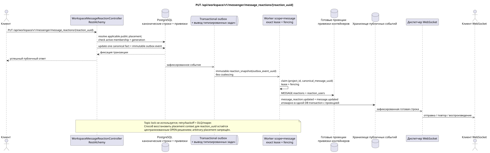

# PUT /api/workspace/v1/messenger/message_reactions/{reaction_uuid}

[← Главный индекс документации](../../../../index.md) · [Индекс диаграмм последовательности](../../README.md) · [Раздел Core Messenger](../README.md)

## Статус и граница текущего контракта

Целевая спецификация в подходе docs-first. Метод, путь, публичный JSON и авторизация следуют текущему контракту из [`workspace_api.md`](../../../../workspace_api.md); bounded pagination и asynchronous visibility следуют отдельно принятому target compatibility ADR.



Редактируемый исходник: [`put_message_reaction.puml`](diagrams/put_message_reaction.puml).

## Операция

**Метод и путь:** `PUT /api/workspace/v1/messenger/message_reactions/{reaction_uuid}`

**Назначение:** Обновить исходный факт реакции текущего пользователя.

## Публичный запрос

```json
{
  "emoji_name": "heart"
}
```

## Успешный публичный ответ

HTTP `200`:

```json
{
  "uuid": "bd4b7632-8788-435a-93cc-6873657335c6",
  "project_id": "22222222-2222-2222-2222-222222222222",
  "message_uuid": "a93dca35-3061-4748-bda4-7f6f8c660ea5",
  "user_uuid": "11111111-1111-1111-1111-111111111111",
  "emoji_name": "heart",
  "provider": null,
  "delivery": null,
  "created_at": "2026-06-22T10:12:00Z",
  "updated_at": "2026-06-22T10:13:00Z"
}
```

## Публичные ошибки

Требуются bearer-токен IAM и область проекта. Некорректный UUID или тело запроса дают HTTP `400`; отсутствующий или недоступный в этой области ресурс — `404`. Стандартное документированное тело ошибки валидации:

```json
{
  "type": "ValidationErrorException",
  "code": 400,
  "message": "Validation error occurred."
}
```

## Целевая граница RestAlchemy

```python
from restalchemy.api import controllers
from restalchemy.api import resources
from restalchemy.dm import models
from restalchemy.dm import properties
from restalchemy.dm import types
from restalchemy.storage.sql import orm


class WorkspaceMessageReactionView(
    models.ModelWithUUID,
    models.ModelWithProject,
    orm.SQLStorableMixin,
):
    __tablename__ = "messenger_api_message_reactions_v1"

    message_uuid = properties.property(types.UUID(), read_only=True)
    canonical_message_uuid = properties.property(types.UUID(), read_only=True)
    user_uuid = properties.property(types.UUID(), read_only=True)


class WorkspaceMessageReactionController(controllers.BaseResourceControllerPaginated):
    __resource__ = resources.ResourceByRAModel(
        WorkspaceMessageReactionView, convert_underscore=False, process_filters=True,
    )
```

Публичное `message_uuid` — скалярный UUID placement; внутреннее
`canonical_message_uuid` скрыто field permissions. UUID исходного факта
публичен для ресурса реакции. Физические ссылки остаются индексированными FK, а
исходные метаданные провайдера/доставки закрыты.

## Синхронная транзакция

1. Восстановить принадлежащий пользователю факт, применимый публичный placement
   и проверить active stream membership + matching generation.
2. Обновить одно значение emoji.
3. Добавить отдельное immutable event в transactional outbox; derived task
   уникальна по `outbox_event_uuid`.

Затрагиваемое состояние: факт реакции и transactional outbox; общей записи JSON из запроса нет.

## Типизированные задачи и фоновый исполнитель

Задачи: отдельная immutable `reaction_snapshot` для source event; coalescing
отсутствует.

Fenced owner scope `message` перестраивает снимки из актуальных фактов; topic
lock не используется. Lease expiry, retry/backoff, DLQ и reaper обеспечивают
восстановление после сбоя.

## Публичные события и WebSocket

`message_reaction.updated` с прежними полями, затем `message.updated` для наблюдателя.

## Идемпотентность, гонки и видимые клиенту временные характеристики

Уникальный ключ факта разрешает гонки; membership recheck создаёт немедленную
deny boundary. Владелец сразу получает факт в ответе, снимки и события —
асинхронно. Маршрут содержит только `reaction_uuid`, поэтому способ сохранить и
вернуть его публичный placement context при нескольких видимых placements
остаётся централизованным OPEN-решением; скрытый binding или произвольный
primary placement выбирать нельзя. Это не отменяет принятую global reaction
semantics.

[← Главный индекс документации](../../../../index.md) · [Индекс диаграмм последовательности](../../README.md) · [Раздел Core Messenger](../README.md)
