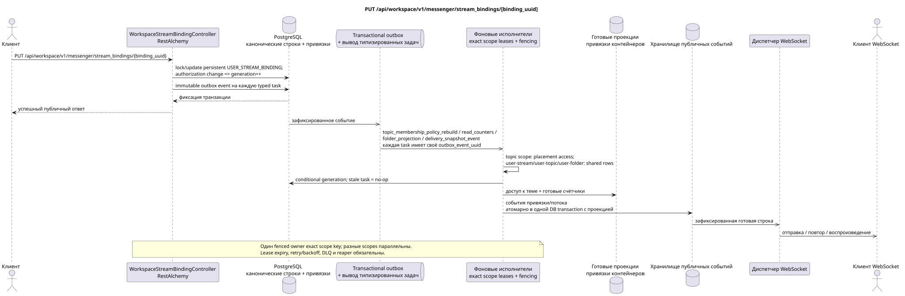

# PUT /api/workspace/v1/messenger/stream_bindings/{binding_uuid}

[← Главный индекс документации](../../../../index.md) · [Индекс диаграмм последовательности](../../README.md) · [Раздел Core Messenger](../README.md)

## Статус и граница текущего контракта

Целевая спецификация в подходе docs-first. Метод, путь, публичный JSON и авторизация следуют текущему контракту из [`workspace_api.md`](../../../../workspace_api.md); bounded pagination и asynchronous visibility следуют отдельно принятому target compatibility ADR.



Редактируемый исходник: [`put_stream_binding.puml`](diagrams/put_stream_binding.puml).

## Операция

**Метод и путь:** `PUT /api/workspace/v1/messenger/stream_bindings/{binding_uuid}`

**Назначение:** Обновить роль или состояние уведомлений обычной привязки.

## Публичный запрос

```json
{
  "role": "moderator",
  "notification_mode": "mentions_only",
  "notification_updated_at": "2026-06-22T10:17:00Z"
}
```

## Успешный публичный ответ

HTTP `200`:

```json
{
  "uuid": "3195a887-da5d-440b-bdf8-0d3d995a9e01",
  "project_id": "22222222-2222-2222-2222-222222222222",
  "stream_uuid": "75309057-419c-4b12-a7c1-3932429ec4a6",
  "user_uuid": "33333333-3333-3333-3333-333333333333",
  "who_uuid": "11111111-1111-1111-1111-111111111111",
  "role": "moderator",
  "notification_mode": "mentions_only",
  "notification_updated_at": "2026-06-22T10:17:00Z",
  "created_at": "2026-06-22T09:05:00Z",
  "updated_at": "2026-06-22T10:17:00Z"
}
```

## Публичные ошибки

Требуются bearer-токен IAM и область проекта. Некорректный UUID или тело запроса дают HTTP `400`; отсутствующий или недоступный в этой области ресурс — `404`. Стандартное документированное тело ошибки валидации:

```json
{
  "type": "ValidationErrorException",
  "code": 400,
  "message": "Validation error occurred."
}
```

Обновление привязки прямого потока или потока с самим собой даёт `400`.

## Целевая граница RestAlchemy

```python
from restalchemy.api import controllers
from restalchemy.api import resources
from restalchemy.dm import models
from restalchemy.dm import properties
from restalchemy.dm import types
from restalchemy.storage.sql import orm


class WorkspaceStreamBindingView(
    models.ModelWithUUID,
    models.ModelWithProject,
    orm.SQLStorableMixin,
):
    __tablename__ = "messenger_api_stream_bindings_v1"

    stream_uuid = properties.property(types.UUID(), read_only=True)
    user_uuid = properties.property(types.UUID(), read_only=True)
    who_uuid = properties.property(types.UUID(), read_only=True)


class WorkspaceStreamBindingController(controllers.BaseResourceControllerPaginated):
    __resource__ = resources.ResourceByRAModel(
        WorkspaceStreamBindingView, convert_underscore=False, process_filters=True,
    )
```

Публичные ссылки на сущности представлены скалярными свойствами `types.UUID()`, а не отношениями RestAlchemy, которые сериализуются в URI. Физические столбцы `*_uuid` остаются индексированными внешними ключами с явно выбранными действиями ссылочной целостности. USER_STREAM_BINDING уникальна по `(project_id, stream_uuid, user_uuid)` и физически может хранить готовые счётчики, но её текущий публичный JSON привязки не меняется.

## Синхронная транзакция

1. Восстановить и авторизовать привязку.
2. Обновить одну persistent USER_STREAM_BINDING. Если изменение влияет на
   authorization/membership, увеличить `membership_generation`; одно лишь
   изменение настройки уведомлений generation не переиспользует как surrogate
   version.
3. Добавить отдельное immutable transactional outbox event для каждой typed
   task фактической области.

Затрагиваемое состояние: USER_STREAM_BINDING и transactional outbox.

## Типизированные задачи и фоновый исполнитель

Задачи: отдельные immutable `topic_membership_policy_rebuild`,
`read_counters`, `folder_projection` и `delivery_snapshot_event`, каждая с
собственным source `outbox_event_uuid`, exact scope key и при зависимости от
membership — с ожидаемым generation.

Topic-scoped worker применяет доступ только к placements/bindings темы;
user-stream/user-topic/user-folder scope workers обновляют shared агрегаты.
Одновременно пишет один fenced owner exact key; stale generation делает no-op.
Task lifecycle включает retry/backoff, DLQ и reaper.

## Публичные события и WebSocket

События затронутых привязок и потоков.

## Идемпотентность, гонки и видимые клиенту временные характеристики

Уникальный membership key, row lock и generation предотвращают гонки. Строка
видна сразу, проекции и события — асинхронно; ready event появляется только
атомарно в одной DB transaction с соответствующей проекцией.

[← Главный индекс документации](../../../../index.md) · [Индекс диаграмм последовательности](../../README.md) · [Раздел Core Messenger](../README.md)
