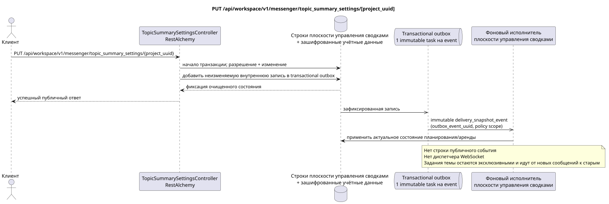

# PUT /api/workspace/v1/messenger/topic_summary_settings/{project_uuid}

[← Главный индекс документации](../../../../index.md) · [Индекс диаграмм последовательности](../../README.md) · [Раздел Core Messenger](../README.md)

## Статус и граница текущего контракта

Целевая спецификация в подходе docs-first. HTTP-контракт остаётся текущим контрактом из [`workspace_api.md`](../../../../workspace_api.md); целевые внутренние механизмы являются только предложением.



Редактируемый исходник: [`put_topic_summary_settings.puml`](diagrams/put_topic_summary_settings.puml).

## Операция

**Метод и путь:** `PUT /api/workspace/v1/messenger/topic_summary_settings/{project_uuid}`

**Назначение:** Установить оба условия включения сводки темы.

## Публичный запрос

```json
{
  "global_enabled": true,
  "project_enabled": true
}
```

## Успешный публичный ответ

HTTP `200`:

```json
{
  "project_id": "12345678-1234-4234-8234-123456789abc",
  "global_enabled": true,
  "project_enabled": true
}
```

Поля временных меток состояния и ошибок могут отсутствовать в ответе, если допускают `null` и имеют это значение. `api_key` и токен активной заявки никогда не возвращаются.

## Публичные ошибки

Требуется bearer-токен IAM. Некорректный UUID или тело запроса дают HTTP `400`; отсутствие разрешения на управление — `403`. Стандартное тело ошибки валидации:

```json
{
  "type": "ValidationErrorException",
  "code": 400,
  "message": "Validation error occurred."
}
```

Если UUID в пути не совпадает с проектом IAM, возвращается `403`; GET требует членства в проекте, а PUT — разрешения на управление.

## Целевая граница RestAlchemy

```python
from restalchemy.api import controllers
from restalchemy.api import resources
from restalchemy.dm import models
from restalchemy.dm import properties
from restalchemy.dm import types
from restalchemy.storage.sql import orm


class WorkspaceTopicSummarySettings(
    models.ModelWithProject,
    orm.SQLStorableMixin,
):
    __tablename__ = "messenger_topic_summary_settings"

    project_id = properties.property(types.UUID(), id_property=True, read_only=True)
    global_enabled = properties.property(types.Boolean(), default=False)
    project_enabled = properties.property(types.Boolean(), default=False)


class TopicSummarySettingsController(controllers.BaseResourceController):
    __resource__ = resources.ResourceByRAModel(
        WorkspaceTopicSummarySettings,
        convert_underscore=False,
        process_filters=True,
    )
```

Публичное поле `project_id` — скалярное свойство UUID, а не отношение в форме URI. Физический индексированный внешний ключ на проект Workspace имеет явно заданное действие ссылочной целостности. UUID из пути должен совпадать с контекстом проекта IAM.

## Синхронная транзакция

1. Потребовать совпадение проекта из пути с проектом IAM и разрешение `workspace.topic_summary_settings.manage`.
2. Установить оба логических условия включения в одной строке.
3. Добавить неизменяемую внутреннюю запись в transactional outbox.

## Типизированная задача и фоновый исполнитель

Отдельная immutable `delivery_snapshot_event` task с exact scope политики
сводок для source outbox event планирует затронутый проект; unique
`outbox_event_uuid`, без coalescing.

Фоновый исполнитель включает или отменяет планирование по последним значениям условий. Фактическая генерация сводки остаётся эксклюзивной для `(project_id, topic_uuid)`, ограниченной и обрабатывает канонические сообщения от новых к старым.

## Публичные события, повторы и временные характеристики

Ответ с условиями включения возвращается сразу; планирование и отмена выполняются асинхронно и идемпотентно. Публичное событие Workspace и отправка по WebSocket не определены.

Для этой административной операции нет готового публичного события Workspace, поэтому диспетчер WebSocket в ней не участвует.

[← Главный индекс документации](../../../../index.md) · [Индекс диаграмм последовательности](../../README.md) · [Раздел Core Messenger](../README.md)
