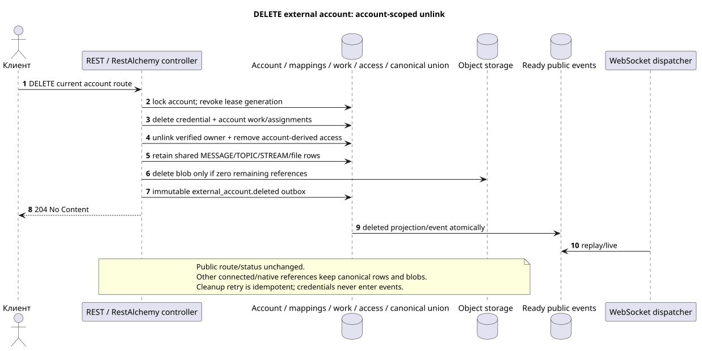

# Удаление внешней учётной записи

[← Главный индекс документации](../../../../index.md) ·
[Индекс диаграмм последовательностей](../../README.md) ·
[Раздел внешней интеграции/runtime](../README.md)

`DELETE /api/workspace/v1/messenger/external_accounts/{account_uuid}`

Удалить account credential и account-scoped связь/доступ, сохранив shared
canonical provider data, доступные другим connected accounts.



[Редактируемый исходник PlantUML](diagrams/delete_external_account.puml)

## Запрос

Дополнительных параметров запроса, кроме указанных выше переменных пути, нет.

Тело отсутствует. Не отправляйте выдуманный объект JSON.

## Успешный ответ

`204 No Content`; тело ответа JSON отсутствует.

## Ошибки

| HTTP | Публичное поведение |
| --- | --- |
| `403` | Отсутствует разрешение `workspace.external_account.delete` или ресурс находится вне авторизованной области. |
| `404` | Ресурс в заданной области не существует или не виден. |
| `400` | Для недопустимых значений пути, параметров запроса или тела используется стандартная ошибка валидации RESTAlchemy. |

Пример тела ошибки валидации:

```json
{
  "type": "ValidationErrorException",
  "code": 400,
  "message": "Validation error occurred."
}
```

## Граница RestAlchemy

Целевое объявление ресурса/контроллера (документация предложения, не производственный код):

```python
class ExternalAccount(models.ModelWithUUID, models.ModelWithTimestamp, orm.SQLStorableMixin):
    __tablename__ = "m_external_accounts_v2"

    owner_user_uuid = properties.property(types.UUID(), required=True)
    settings = properties.property(EXTERNAL_ACCOUNT_SETTINGS_TYPE, required=True)
    status = properties.property(types.Enum(ACCOUNT_STATUSES), read_only=True)
    capabilities = properties.property(types.Dict(), read_only=True)
    revision = properties.property(types.Integer(min_value=1), read_only=True)


class ExternalAccountController(controllers.BaseResourceControllerPaginated):
    __resource__ = resources.ResourceByRAModel(
        ExternalAccount, hidden_fields=["owner_user_uuid"]
    )
```

`owner_user_uuid` скрыт; публичное `settings.default_project_id` является скалярным UUID-свойством. В целевом хранилище индексированный `owner_user_uuid` ссылается на пользователя Workspace с `ON DELETE CASCADE`, а извлечённый индексированный `default_project_uuid` — на реестр проектов с `ON DELETE RESTRICT`; при сериализации последний по-прежнему вложен в `settings`. Публичные объявления RestAlchemy не используют `relationships.relationship` для JSON в форме UUID, потому что отношение (relationship) сериализуется как URI. На границе физической схемы каждая каноническая неполиморфная связь `*_uuid` является индексированным внешним ключом с явно выбранным ссылочным действием. Санитайзеры скрывают владельца, учётные данные, сырой ID провайдера, закрытый сертификат, внутренний адрес и сырые поля протокола.

## Синхронная транзакция

1. Аутентифицировать запрос, определить область, проверить разрешение/тело и найти каноническую строку по индексированному ключу.
2. Заблокировать account, отозвать lease generation, удалить credential,
   account assignments/mappings/queued work и account-derived bindings/access;
   отвязать verified identity от owner и записать immutable outbox удаления.
3. Не удалять shared canonical messages/topics/streams/files, пока существует
   другой provider/native access/reference; physical blob удалить только после
   доказанного zero-reference check.
4. Вернуть ответ только после фиксации транзакции; provider/network cleanup не
   выполняется внутри неё.

## Фоновая обработка, события и согласованность

Типизированная `delivery_snapshot_event` обслуживает exact external-account
scope и готовое `external_account.deleted`; cleanup provider lifecycle остаётся
устойчивой фоновой работой, а не вычислением request path.

Фоновый handler в одной DB transaction фиксирует материализованное состояние и готовый конверт полного снимка `external_account.deleted`; оба эффекта commit либо rollback вместе. После commit отдельный диспетчер WebSocket отправляет, повторяет и воспроизводит его; API/воркер не владеет соединениями клиентов.

Согласованность, видимая клиенту: HTTP 204 означает, что account удалён из
публичного снимка и его access больше не авторизует чтение. Shared canonical
history остаётся для других accounts; credential никогда не попадает в event.
Это accepted target semantics при неизменном public route/status и отличается
от старого destructive product text. Подробности:
[`zulip_bridge/account_lifecycle_and_identity.md`](../../../../zulip_bridge/account_lifecycle_and_identity.md#delete-accepted-target-semantics).

## Идемпотентность и параллелизм

UUID учётной записи создаётся клиентом при создании; бизнес-уникальность допускает одну учётную запись `(owner_user_uuid, provider_kind)`. Шифротекст учётных данных хранится отдельно и никогда не сериализуется.

Повторы используют устойчивые бизнес-ключи и текущее исходное состояние. Каждое immutable outbox event создаёт отдельную task с уникальным `outbox_event_uuid`; повторная доставка этой task должна быть идемпотентной, coalescing отсутствует. Монопольная обработка темы Messenger от новых записей к старым применяется только тогда, когда затронутое каноническое размещение действительно относится к `(project_id, topic_uuid)`; операции администрирования/чтения провайдера не создают искусственную тему и не входят в эту очередь.

## Источники

- [`workspace_api.md`](../../../../workspace_api.md) — авторитетные публичные маршруты, общий JSON, пагинация, события и контракт WebSocket.
- [`zulip_bridge_v1_product_and_api.md`](../../../../zulip_bridge_v1_product_and_api.md) — санитизированный жизненный цикл внешних ресурсов, разрешения и семантика провайдера.

[← Главный индекс документации](../../../../index.md) ·
[Индекс диаграмм последовательностей](../../README.md) ·
[Раздел внешней интеграции/runtime](../README.md)
